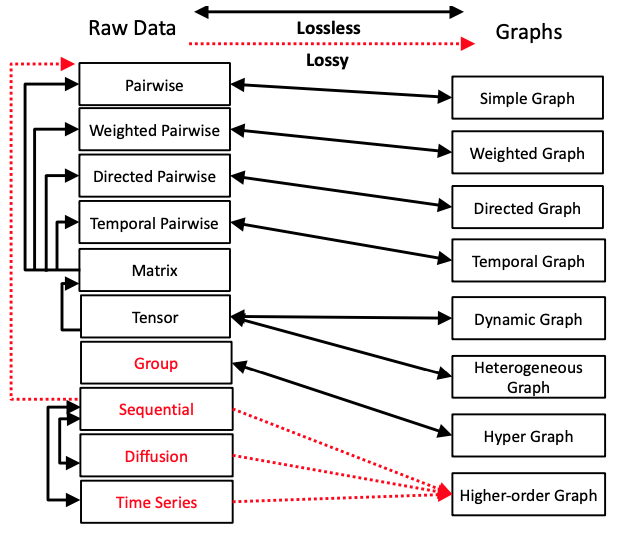
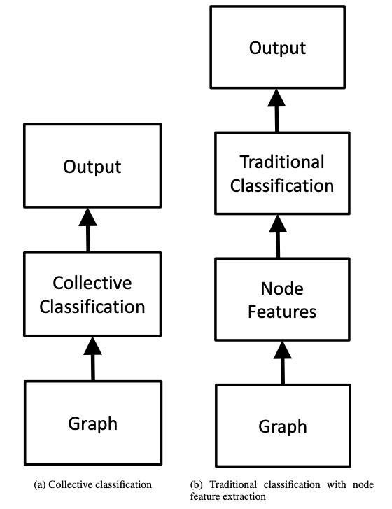

[メインページ](../../index.markdown)

[章目次](./chap1.md)
## 1.2. なぜグラフニューラルネットワークなのか？

現実世界のデータは，行列といったテンソル形式[^1]
，（文字列などの）順序を持つデータ列，および時系列データなど様々な形態をとる．そのため，なぜデータをグラフで表現しようとするのかという疑問が自然に湧いてくる．

その動機は主に2つある．

第一に，グラフはデータを汎用的に記述することができる(図1.1)．
例えば，ソーシャルネットワーク，交通ネットワーク，タンパク質間相互作用ネットワーク，知識グラフ，脳のネットワークなど，様々な分野の多くのシステムから得られるデータは，グラフとして明示的に表現することができる．
それに加えて，図1.1に示すように，その他多数な種類のデータもグラフの形式に変換することが可能である(Xu,
2017)．

<figure>

<figcaption>図1.1 現実世界データのグラフ表現. 図は(Xu, 2017)をもとに作成. 実線はグラフで表現する際に情報が失われていないことを表し, 点線は情報が失われていることを表す. なお, 引用元の図の「ネットワーク」を「グラフ」と置き換えている. </figcaption>

</figure>

第二に，膨大な数の現実世界の問題は，グラフ上の小さな計算タスクの集合として取り組むことができる．
例えば，「ノードの属性を推測する」，「(スパム送信者やテロリストといった)異常なノードを検出する」，「病気に関連する遺伝子を特定する」，「患者に投薬を提案する」などは，ノード分類問題としてまとめることができる(Bhagat
*et al*., 2011)．
一方で，「レコメンデーション」，「薬物併用時の副反応の予測」，「薬物と標的間の相互作用の同定」，「知識グラフの埋め込み」などは，基本的にはリンク予測問題として扱える(Liben-Nowell
and Kleinberg, 2007).

グラフ上のノードは本質的に他のノードと繋がっている．これは各ノードが互いに独立でないことを示唆しているが，従来の機械学習の手法は，データが独立かつ同一に分布していることを前提としていることが多い．
そのため，従来の機械学習の手法は，グラフ上の計算タスクに直接取り入れるには適していない．
この問題を解決するには，2つの方向性がある(図1.2)．
ノード分類を例にして，この2つの方向性について説明する．

<figure>

<figcaption>図1.2 グラフのノード分類問題に取り組むための2つの方向性．</figcaption>

</figure>

まず1つ目は，グラフに特化した新しい仕組みを構築する方向性である．
図1.2(a)のように，グラフ用に設計された分類問題は，集団分類問題として知られている
(Sen *et al*., 2008)．
従来の分類問題と異なり，集団分類問題では特徴量とそのラベルの対応を考慮するだけではなく，その近傍の対応関係も考慮する．

2つ目の方向性は，図1.2(b)のように，各ノードを表す特徴量を構築することでグラフを平坦化し，従来の分類技術を適用することである．
この方向性は，従来の機械学習技術を活用できるため，ますます人気が高まり，主流になってきている．

2つ目のアプローチがうまく運ぶためには，各ノードの特徴量(ノード表現)をどのように構築するかにかかっている.
コンピュータービジョン，音声認識，自然言語処理など様々な領域で大きな発展をもたらした表現学習において，深層学習がその威力を発揮することが証明されてきた．
したがって，深層学習とグラフの橋渡しにはこれまでにない可能性を秘めている．
しかしながら，グラフにおける深層学習は多くの課題に直面している．まず，従来の機械学習は，画像や系列データなど規則的な構造データに対して設計されてきた．
一方，グラフは不規則なデータであり，グラフ内のノードには定まった順序がなく，それぞれが異なる近傍ノードを持つことができる．
また，規則的なデータの構造情報は単純である一方，グラフの構造情報は複雑であり，様々な種類のグラフが存在する(図1.1)．
グラフ上のノードとエッジは豊富な補足情報を持つことがあるが，従来の深層学習はそれらを捉えるのに十分ではない．

以上のように，これまでにない可能性と多くの課題を抱えながら，グラフ深層学習という新しい研究分野が開拓されてきたのである．

[メインページ](../../index.markdown)

[章目次](./chap1.md)

[前の節へ](./subsection_01.md) [次の節へ](./subsection_03.md)

[^1]: 訳注：テンソル(Tensor)という用語には数学的に厳密な定義があるが，深層学習の文脈では「ベクトルや行列を拡張させた多次元配列」の意味で使われることが多い．
