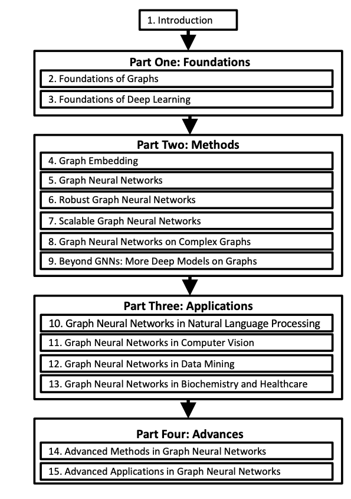

[メインページ](../../index.markdown)

[章目次](./chap1.md)
## 1.3. この本で扱うこと

図1.3に本書の構成を示した．
さまざまな背景や目的を持つ読者に読んでいただくために，本書は4つのパートで構成されている.
第Ⅰ部では基本的な概念を紹介し，第Ⅱ部では最も確立された手法について議論する．
第Ⅲ部では典型的な応用例を紹介し，第Ⅳ部では発展的な手法や，今後の研究のために重要かつ有望と思われる応用について説明する．
各章では，まず取り上げる内容の動機づけを行い，次に説得力のある例と技術詳細を紹介し，最後に参考文献としてより関連性の高い内容を提示する．

<figure>

<figcaption>図1.3 本書の構成</figcaption>

</figure>

各章の概要を簡単に以下で説明する．

第Ⅰ部：基礎．

:   \
    第Ⅰ部では，グラフ深層学習の基礎となる，グラフと深層学習それぞれの基礎に焦点を当てる．

    第2章

    :   グラフの主要な概念や性質，グラフフーリエ変換，グラフ信号処理を紹介し，さまざまな種類のグラフやグラフ上の計算タスクを形式的に定義する．

    第3章

    :   さまざまな主要なニューラルネットワークモデルや，深層モデルの学習のための手法や，過学習を抑えるための実践的な技術について説明する．

第Ⅱ部：手法．

:   \
    第Ⅱ部では，グラフ深層学習において最も確立された手法について，その基礎から発展的な内容までを扱う．

    第4章

    :   情報保存の観点から一般的なグラフ埋め込みフレームワークを紹介する．
        グラフ上の様々な情報を保存する代表的なアルゴリズムの技術的詳細を説明し，さまざまな種類のグラフに特化した埋め込み手法を紹介する．

    第5章

    :   典型的なグラフニューラルネットワーク（GNN）モデルは，次の2つの重要な操作から構成されている：
        グラフフィルタリングとグラフプーリングである．
        そこで，グラフフィルタリング操作とプーリング操作を紹介し，下流のタスクのためのGNNパラメータをどのように学習するのか議論する．

    第6章

    :   従来の深層モデルをグラフに一般化したことで，GNNはそれら深層モデルの欠点を受け継いでしまっており，敵対的な攻撃に対して脆弱である．
        そこで，グラフ敵対的攻撃の概念と定義に焦点を当て，代表的な敵対的攻撃と防御技術の詳細について説明する．

    第7章

    :   GNNでは，各層でノードの近傍情報を集約し，その情報が次の層でさらに広範囲のノードに伝搬されるプロセスを繰り返す．
        そのため，たった1つのノードの近傍に対する処理だけでもグラフの大部分や全体を急速に関与することがある．
        ゆえに，GNNにとってスケーラビリティの向上は重要な課題となっている[^2]．そこでこの章ではGNNを拡張するための代表的な技術について説明する．

    第8章

    :   より複雑なグラフに対応するために設計されたGNNモデルについて議論する．

    第9章

    :   深層学習技術を用いてより幅広い設定でグラフにおけるより多くのタスクに取り組むため，GNN以外の深層グラフモデルを紹介する．

第Ⅲ部：応用．

:   \
    グラフは現実世界のデータに対して普遍的な表現を提供するため，グラフ深層学習技術は様々な分野で応用されている．
    第Ⅲ部では，各章ごとに，GNNによる代表的な応用例を紹介していく．

    第10章

    :   自然言語処理への応用

    第11章

    :   コンピュータービジョンへの応用

    第12章

    :   データマイニングへの応用

    第13章

    :   生化学・ヘルスケア分野への応用

第Ⅳ部：発展．

:   \
    第Ⅳ部では，手法と応用の両方において，これまで紹介してきた内容よりもさらに進んだ内容に焦点を当てている．

    第14章

    :   表現力，深さ，公平性，解釈可能性，自己教師あり学習など，GNNの発展的な手法を紹介する．

    第15章

    :   組合せ最適化，物理学，プログラム表現など，GNNが適用されたより多くの分野について議論する．

[メインページ](../../index.markdown)

[章目次](./chap1.md)
