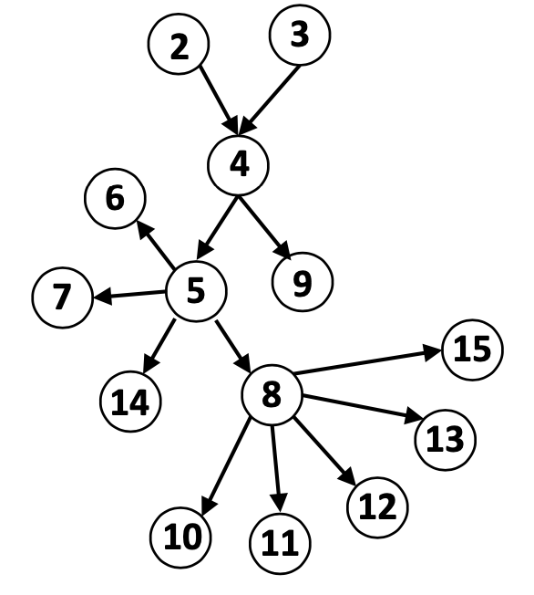

[メインページ](../../index.markdown)

[章目次](./chap1.md)
## 1.4. 想定読者

本書は，コンピューター科学のバックグラウンドを持つ読者にとって容易に理解できる内容となっている．
微積分，線形代数，確率，統計の基礎知識があれば，技術的な詳細をより深く理解することができる．
本書は幅広い読者層を対象としており，
例えば，データマイニング，機械学習，ソーシャルネットワーク分析に興味を持つ学部上級生や大学院生がターゲットの一つである．

本書は，グラフ深層学習に関する大学院向けの講義で使用できるだけでなく，内容の一部だけでも活用可能である．
例えば，第Ⅱ部と第Ⅳ部を，「データマイニング，機械学習，ソーシャルネットワーク分析のコースにおける発展トピック」として取り上げても良いし，第Ⅲ部を「コンピュータービジョン，自然言語処理，ヘルスケア分野における従来の課題を解決するための発展的な手法」として紹介しても良い．

さらには，グラフ深層学習の基礎と具体的な事例を学び，自分たちの製品やプラットフォームに活用させたい現場の実務担当者やプロジェクトの責任者も本書の対象読者である．
グラフニューラルネットワークはコンピューター科学以外の多くの分野にも応用されている．
そのため，コンピューター科学のバックグラウンドを持たないが，グラフニューラルネットワークを使って自分の分野を発展させたいと考えている研究者も，是非本書を手にとってもらいたい．

本書は，読者ごとに読む目的や持っている予備知識が異なるため，読み進め方は様々あって良い．
そこで，本書の効果的な読み進め方を図1.4にまとめた．
例えば，単純グラフ[^3]
におけるグラフニューラルネットワークを理解したい場合（つまり第5章)，グラフの基礎と深層学習とグラフ埋め込みに関する知識が必要となる(つまり，第2章，第3章，第4章)．
また，グラフニューラルネットワークをヘルスケアの応用に興味を持っている場合(つまり第13章)，グラフと深層学習の基礎，グラフ埋め込み，単純グラフや複雑グラフにおけるグラフニューラルネットワークを読む必要がある(第2章，第3章，第4章，第5章，第8章)．
第Ⅲ部は，読者が各応用分野で必要な背景知識を持っていることを前提としている．
すでにそのような背景知識を持っている場合にはいくつかの章を読み飛ばしていただいても問題ない．
例えば，グラフと深層学習の基礎を既に理解していて，単純グラフに対するグラフニューラルネットワークを理解したい読者は，第2章と第3章を飛ばして第4章と第5章を読むだけでよい．

<figure>

<figcaption>図1.4 本書の読み進め方．各数字は図1.3の章番号に対応している.</figcaption>

</figure>

[メインページ](../../index.markdown)

[章目次](./chap1.md)

[前の節へ](./subsection_03.md) [次の節へ](./subsection_05.md)

[^3]: 訳注：単純グラフ(simple graph)は，エッジやノードに条件が複雑ではないような，構造的にシンプルなグラフを指す．それに対して複雑グラフ(complex graph)は，より複雑な構造や条件を持つグラフである．これらの形式的な定義は第2章で説明される．
