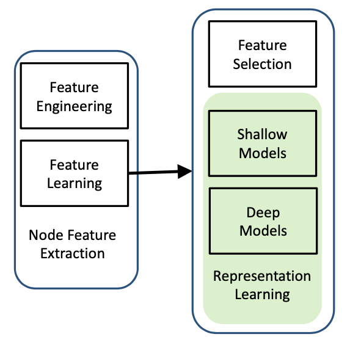

[メインページ](../../index.markdown)

[章目次](./chap1.md)
## 1.5. グラフの特徴の学習の歴史

前述の通り, グラフにおける計算タスクで従来の機械学習を活用するには,
ノードのベクトル表現を見つける必要がある. 図1.5で示したように,
この目的を達成するためには主に特徴量エンジニアリングと特徴量学習の2つの方法が存在する.
特徴量エンジニアリングはノードの次数の統計量など,
手作業で設計された特徴量に依存するが,
特徴量学習はノードの特徴量を自動的に学習させるものである.
後段のタスクにとって重要な特徴量がどのようなものか予備知識を持っていないことが多いため,
特徴量エンジニアリングによる特徴量は後段タスクに最適でない可能性がある.
特徴量エンジニアリングのプロセスは膨大な人手が必要である. 一方で,
特徴量学習は特徴量を自動的に学習するものであり,
後段タスクに沿って学習プロセスを進める. その結果,
学習された特徴量は後段タスクに適している可能性が高く,
特徴量エンジニアリングによる特徴量と比べて優れた性能が得られることが多い.
さらに, このプロセスは人間の介入を最小限に抑え,
新しいタスクへ容易に適応できる. それゆえ,
グラフにおいては特徴量学習が積極的に研究され,
さまざまな場面や要求に対応するために, さまざまな手法が提案されている.
これらの技術は,
グラフにおける特徴量選択とグラフにおける表現学習に大別できる.
前者は無関係で冗長なノード特徴量を排除することを目指し,
後者は新しいノード特徴量の集合を生成することを目指す. 本節では,
これら2つの技術群について簡潔にレビューし,
グラフ深層学習の理解を助けるための一般的で歴史的な文脈を紹介する.

<figure>

<figcaption>図1.5 ノード特徴量の抽出</figcaption>

</figure>

### グラフにおける特徴量選択

現実世界のデータは高次元であり, 特定のタスクを考慮する場合には,
ノイズや無関係なもの,
冗長な特徴量（または次元）などが含まれていることが多い.
特徴量選択の目的は, 冗長性が最小で目的変数(例えば,
教師ありデータにおけるクラスのラベル)との関連性は最大となるような,
小さな特徴量の集合を自動的に選択することである. 多くの応用例では,
知識を抜き出したりモデルを解釈するために元の特徴量が重要である. 例えば,
がん研究のための遺伝子解析では, がん組織の鑑別に加えて,
がん化を誘発する遺伝子（すなわち,
元の特徴量）を特定することがより重要である.
このような要請の厳しい応用例では特徴量選択が特に好まれる. この方法は,
元の特徴量を維持し、その意味から考えている学習課題に対する重要な洞察が得られることが多いためである.
従来の特徴量選択では,
各データが独立かつ同一に分布している（i.i.d.）と仮定している.
しかしながら,
多くの応用例におけるデータは本質的にはi.i.d.ではないようなグラフに埋め込まれている.
そのため, グラフにおける特徴量選択が研究されてきた.
 $\mathcal{V}$ をノードの集合,  $\mathcal{E}$ をエッジの集合として,
グラフ $\mathcal{G}=\{\mathcal{V}, \mathcal{E}\}$ を考える.
各ノードは $d$ この特徴量集合 $\mathcal{F}=\left\{f\_1, f\_2, \ldots, f\_d\right\}$ を持つとする.
グラフにおける特徴量選択の目的は,
 $\mathcal{F}$ から各ノードを表現するような $K$ 個（ $K$ は $d$ よりも十分小さい）の特徴量を選ぶことである.
この問題は, (Tang and Liu, 2012a; Gu and Han, 2011)で初めて,
教師あり学習の設定で研究された.
線形分類器を用いて選択された特徴量からクラスラベルへのマッピングを行い,
グラフ正則化項が導入されて特徴量選択のための構造情報を取り込んでいる.
特に, この項によって, 選択された特徴量を持つ,
つながっているノードが類似したラベルにマッピングされるようになる.
その後, この問題は教師なし学習の設定の下でさらに研究された(Wei et al.,
2016, 2015; Tang and Liu, 2012b). (Tang and Liu, 2012b)では,
構造情報から擬似ラベルが抽出され,
特徴量選択プロセスにおけるガイドとした. (Wei et al., 2016)では,
ノードのコンテンツと構造情報の両方が,
高品質の特徴量集合から生成されると仮定されており,
その特徴量集合は生成プロセスでの尤度を最大化することによって得られる.
その後, この問題は単純グラフから, 動的グラフ(Li et al., 2016),
多次元グラフ(Tang et al., 2013b), 符号付きグラフ(Cheng et al., 2017;
Huang et al., 2020)および属性グラフ(Li et al.,
2019b)などの複雑グラフに拡張されている.

### グラフにおける表現学習

グラフにおける特徴量選択とは異なり,
グラフにおける表現学習では新しいノードの特徴量を学習することを目的としている.
これは何十年にもわたって広範囲に研究されており,
深層学習によって研究は劇的に加速した. この小節では,
「浅い」モデルから深層モデルまでの簡単な歴史的概要を説明する.

初期には, グラフにおける表現学習は, スペクトラルクラスタリング（Shi and
Malik、2000; Ng et al., 2002）, グラフを用いた次元削減（Belkin and
Niyogi、2003; Tenenbaum et al., 2000; Roweis and Saul, 2000）,
および行列因子分解（Zhu et al., 2007; Tang et al., 2013a; Koren et al.,
2009）の文脈で研究されてきた. スペクトラルクラスタリング（Shi and Malik,
2000; Ng et al., 2002）では, データ点はグラフのノードと見なされ,
クラスタリングはグラフをノードからなるコミュニティに分割することに対応する.
スペクトラルクラスタリングの重要なステップの1つは,
スペクトラル埋め込みである. これは,
ノードをk-meansなど従来のクラスタリングアルゴリズムが適用できる低次元空間に埋め込むことを目的としている.
グラフを用いた次元削減技術は,
ノード表現を学習するために直接利用することができる.
これらのアプローチは通常,
データサンプルの元の特徴に基づいて事前に定義された距離（または類似性）関数を使用して、親和性グラフを構築する.
そして, この親和性グラフの構造情報を保持するノード表現を学習する.
例えば, IsoMap(Tenenbaum et al.,
2000)は測地線を通じてグローバルな幾何構造を保持することを目的としており,
LLE（Roweis and Saul、2000）とeigenmap（Belkin and Niyogi、2003）は,
親和性グラフ内のローカルな近傍を保持することを目的としている.
以上の方法は,
親和性行列（または隣接行列やラプラシアン行列）上で固有値分解を実行する必要があることが多いため,
計算コストが高くなりがちである. 隣接行列, 接続行列,
ラプラシアン行列など,
行列はグラフを表すための最も一般的なアプローチの1つである. そのため,
ノード表現の学習に行列因子分解を使うことができる.
グラフを表すために隣接行列を使用すると仮定すると,
得られた新しいノード表現用いて隣接行列を再構築できるように,
ノードを低次元空間に埋め込むことを目的とする.

文書のコーパスは二部グラフと表すことができる. 文書と単語がノードであり,
単語が文書に現れる場合, 単語と文書の間にエッジが存在する. LSIは,
文書と単語の表現を学習するためにTruncated SVDを使っている(Deerwester et
al., 1990).

推薦システムでは,
ユーザーとアイテム間の相互作用は二部グラフとして捉えることができ,
行列因子分解を用いてユーザーとアイテムの表現を学習し,
推薦に活用している（Koren et al., 2009）. 行列因子分解はまた,
ノード分類（Zhu et al., 2007; Tang et al., 2016a）やリンク予測（Menon
and Elkan, 2011; Tang et al., 2013a）, コミュニティ検出（Wang et al.,
2011）のためのノード表現の学習にも活用されている. また,
後ほど紹介する最近のグラフ埋め込みアルゴリズムも,
行列因子分解の枠組みとしてまとめることができる（Qiu et al., 2018b）.

Word2vecは, 単語の埋め込みを生成する技術である（Mikolov et al., 2013）.
大規模なテキストコーパスを入力として受け取り,
コーパス内の各単語に対してベクトル表現を生成する.
Word2vecが様々な自然言語処理タスクで大成功を収めたことから,
特にSkip-gramモデルを用いてグラフ領域でノード表現を学習するために,
Word2vecを適用する試みが増えている. DeepWalk（Perozzi et al., 2014）は,
この目標を達成するための第一歩となった. 具体的には,
与えられたグラフ内のノードは単語として扱われ,
文章はランダムウォークによって生成される. そして,
ランダムウォーク内でのノードの共起を保持するノード表現を学習するために,
Skip-gramモデルが使用されている. その後,
大量の研究が3つの主要な方向性で展開されている:

1.  ノード共起を保持するための高度な方法を開発する（Tang et al., 2015;
    Grover and Leskovec, 2016; Cao et al., 2015）

2.  ノードの構造的役割（Ribeiro et al., 2017）、コミュニティ情報（Wang
    et al., 2017c）、ノードの状態（Ma et al., 2017; Lai et al., 2017; Gu
    et al., 2018）などの他の種類の情報を保持する

3.  有向グラフ（Ou et al., 2016）, 異種グラフ（Chang et al., 2015; Dong
    et al., 2017）, 二部グラフ（Gao et al., 2018b）, 多次元グラフ（Ma et
    al., 2018d）, 符号付きグラフ（Wang et al., 2017b）,
    ハイパーグラフ（Tu et al., 2018）, 動的グラフ（Nguyen et al., 2018;
    Li et al., 2017a）などの複雑グラフのためのフレームワークを設計する

表現学習における, 深層ニューラルネットワーク（DNN）の威力と成功を受けて,
DNNをグラフに一般化する取り組みが増えてきている. これらの方法は,
グラフニューラルネットワーク（GNN）として知られており,
空間的アプローチとスペクトルアプローチに大まかに分けられる.
空間的アプローチは, 空間的に近い近傍ノードなど,
グラフ構造を明示的に利用する. 空間的アプローチは, (Scarselli et al.,
2005)によって初めて紹介された. スペクトルアプローチは,
グラフフーリエ変換と逆グラフフーリエ変換を活用することで,
グラフのスペクトル視点を利用する(Bruna et al., 2013).
深層学習の時代において, GNNは以下の側面で急速に発展している.

-   スペクトルアプローチ(Bruna et al., 2013; Defferrard et al., 2016;
    Kipf and Welling, 2016a)や空間アプローチ(Atwood and Towsley, 2016;
    Niepert et al., 2016; Gilmer et al., 2017; Monti et al., 2017;
    Velicˇkovic ́ et al., 2017; Hamilton et al., 2017a)を含め,
    数多くの新しいGNNモデルが提案されている.

-   グラフ分類のようなグラフに焦点を当てたタスクでは,
    グラフ全体の表現が求められる. そこで,
    ノード表現からグラフ表現を得るために数多くのプーリング手法が導入されている（Li
    et al., 2015; Ying et al., 2018c; Gao and Ji, 2019; Ma et al.,
    2019b）.

-   伝統的なDNNは敵対的攻撃に対して脆弱である.
    GNNもこの欠点を引き継いでいる.
    様々なグラフ敵対的攻撃が研究されており（Zug̈ner et al., 2018; Zug̈ner
    and Gun̈nemann, 2019; Dai et al., 2018; Ma et al., 2020a）,
    さまざまな防御手法が開発されている（Dai et al., 2018; Zhu et al.,
    2019a; Tang et al., 2019; Jin et al., 2020b）.

-   前述の通り, スケーラビリティはGNNにとって喫緊の課題である.
    GNNを大規模グラフにスケーリングできるようにするため,
    多くの研究がなされている（Chen et al., 2018a, b; Huang et al.,
    2018）。

-   GNNモデルは, 複雑グラフを扱えるように設計されており,
    異種グラフ（Zhang et al., 2018b; Wang et al., 2019i; Chen et al.,
    2019b）, 二部グラフ（He et al., 2019）、多次元グラフ（Ma et al.,
    2019c）, 符号付きグラフ（Derr et al., 2018）, ハイパーグラフ（Feng
    et al., 2019b; Yadati et al., 2019）, 動的グラフ（Pareja et al.,
    2019）などが対象となっている.

-   様々な深層学習アーキテクチャがグラフに一般化されており,
    オートエンコーダ（Wang et al., 2016; Cao et al., 2016）,
    変分オートエンコーダ（Kipf and Welling,
    2016b）、リカレントニューラルネットワーク（Tai et al., 2015; Liang
    et al., 2016）, 敵対的生成ネットワーク（Wang et al.,
    2018a）などがある.

-   グラフは普遍的なデータ表現であるため, GNNは自然言語処理,
    コンピュータビジョン, データマイニング,
    ヘルスケアなど多くの分野を進歩させるために応用されている.

[メインページ](../../index.markdown)

[章目次](./chap1.md)
