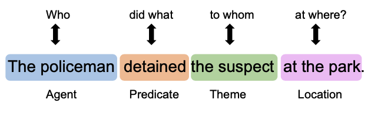
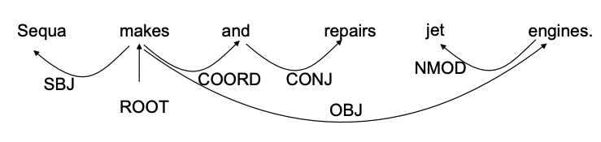

[メインページ](../../index.markdown)

[章目次](./chap10.md)
## 10.2. 意味役割のラベリング

Marcheggiani and Titov.(2017)では，グラフニューラルネットワーク(GNN)が依存構造木に利用され，構文情報を組み込むことで**意味役割のラベリング(SRL; Semantic Role Labeling)**のタスクに効果的であることを示す初期の研究の一つである． この節では，まず意味役割のラベリングについて説明し，その後，このタスクにGNNをどのように活用できるかを紹介していく．

意味役割のラベリングは，文の潜在的な述語-論理構造を探し出すことを目指している． これは形式張らずに言えば「誰が，どこで，誰に，何をしたか」を見つけ出すタスクとみなすことができる． 例えば，図10.1に示すような意味ラベル(semantic label)が付けられた文では，"detained"が述語(predicate)で，"the policeman"と"the suspect"が異なるラベルを持つ2つの項(argument)である．

<figure>

<figcaption>図10.1 意味ラベルが付与された文章</figcaption>

</figure>

より正確に言えば，SRLのタスクは次の手順に従う．

1.  "detained"のような述語の検出．

2.  項を識別し，それらに対する意味役割のラベルの付与．つまり項"the policeman"は動作主(agent)で，項"the suspect"は動作対象(theme)であるという具合に，項に意味役割を付与する．

Marcheggiani and Titov.(2017)では，CoNLL-2009ベンチマーク
[^1]に基づいたSRL問題が研究されている． ただしこの研究では，SRL問題を少し簡略化しており，述語は既知のものとして与えられるとする（つまり，図10.1の例では"detained"が述語であることがわかっている）． そのため，述語の検出は必要ない． 残ったタスクは，与えられた述語の項を識別し，それらに意味役割をラベリングすることである． これは**系列ラベリングタスク**として扱うことができる． すなわち，ここでの意味役割のラベリングモデルは，与えられた述語の全ての項に対するラベルをつけ，述語に対する項ではない要素全てに"NULL"をラベルとして付けることが求められる．

この問題に取り組むために，Marcheggiani and Titov.(2017)では**双方向型LSTM(Bi-LSTM; Bi-directional LSTM)**が採用されており，これを利用して文脈を考慮した単語表現を学習している． このようにして学習された単語表現は，系列内の各要素へのラベル付けをするために利用される．

手順としては，まず文章を $\left[w_0,\dots,w_n\right]$ と表現し，この系列内の各単語 $w_i$ を入力表現 $\symbf{x}\_i$ に関連付ける． この入力表現は以下の4つのベクトルから成る
[^2]：

1.  ランダムに初期化された埋め込み

2.  事前学習(pre-trained)された単語埋め込み

3.  ランダムに初期化された，品詞タグ(part-of-speech tag)を表現する埋め込み

4.  ランダムに初期化された，レンマ(lemma;語幹)を表現する埋め込み（単語が述語である場合のみ有効）

これら4つの埋め込みは連結され，各単語 $w_i$ の入力表現 $\symbf{x}\_i$ を形成する． 事前学習された埋め込みを除く3つの埋め込みである(1)と(3)，(4)は学習プロセスで最適化(fine-tuned)される．

次に，系列 $\left[\symbf{x}\_0,\dots,\symbf{x}\_n\right]$ は，Bi-LSTM (Goldberg, 2016)の入力として利用される． 具体的には，Bi-LSTMモデルは2つのLSTMで構成されており，そのうち一方は「順方向に」入力系列を処理し，もう一方は「順方向とは反対方向に」系列を処理する． 単一のLSTMユニット内で行われる演算の詳細については3.4.2節で紹介しているので適宜参照して欲しい． 以下では， $\operatorname{LSTM}(\cdot)$ を入力系列をLSTMで処理するプロセスを表すために利用する． 順方向(forward)と逆方向(backward)のLSTMの処理は次のように表現することができる：  

$$

\begin{aligned}
    \left[\symbf{x}^{f}_0,\,\dots\,,\symbf{x}^{f}_n\right] &= \operatorname{LSTM}^{f}([\symbf{x}_0,\dots,\symbf{x}_n])\\
    \left[\symbf{x}^{b}_0,\,\dots\,,\symbf{x}^{b}_n\right] &= \operatorname{LSTM}^{b}([\symbf{x}_n,\dots,\symbf{x}_0])
\end{aligned}
$$

  ここで， $\operatorname{LSTM}^{f}$ は順方向のLSTMを示しており，各単語について，その左側に位置している単語群が意味する文脈を取り込む役割がある． 一方， $\operatorname{LSTM}^{b}$ は逆方向のLSTMであり，各単語について，その右側に位置している単語群が意味する文脈を取り込む役割を担っている． なお， $\symbf{x}^{b}\_i$ は逆方向のLSTMから出力された表現であり，単語 $w_{n-i}$ に対応している． これら2つのLSTMの出力を連結(concatenate)するとBi-LSTMの出力となり，両方向からの文脈情報が取り込まれる． 具体的には以下のようになる：  

$$
 \left[\symbf{x}^{\text{bi}}_0,\,\dots\,,\symbf{x}^{\text{bi}}_n\right] = \operatorname{Bi-LSTM}([\symbf{x}_0,\dots,\symbf{x}_n])\\ $$

  ここで， $\symbf{x}^{\text{bi}}\_i$ は $\symbf{x}^{f}\_i$ と $\symbf{x}^{b}\_i$ を連結したものである． Bi-LSTMの出力を用いて，ラベリングタスクは，各候補単語に対して"NULL"も含んだ意味ラベルを割り当てる分類問題として扱う． 具体的には，候補単語に対応するBi-LSTMからの出力表現 $\symbf{x}^{\text{bi}}\_c$ と，述語に対応するBi-LSTMからの出力表現 $\symbf{x}^{\text{bi}}\_p$ を連結したものが，分類器への入力とする．

上述したアルゴリズムを強化するために，Marcheggiani and Titov.(2017)では，依存構造木に基づくグラフニューラルネットワークを利用することで構文構造の情報を組み込むことを行っている． 具体的には，（ラベル付きの有向エッジから成る）依存構造木を扱えるようにグラフニューラルネットワークモデルの集約処理を改良し，一般化している． 文章に対してこのような構文情報を組み込むために，Bi-LSTM層の出力をグラフニューラルネットワークモデルの入力として利用している．そして，グラフニューラルネットワークモデルの出力は，上述の（意味ラベルを割り当てる）線形分類器の入力として使用される． このモデルの詳細に立ち入る前に，まず簡単に依存構造木を紹介していく． そこから，これら依存構造木に基づくグラフニューラルネットワークモデルをどのように設計するかを説明していくことにする．

構造依存木とは，与えられた文の構文依存性をエンコードした「有向ラベル付きの木(directed labeled tree)」を指す． 具体的には，依存構造木におけるノードは文中の単語であり，有向エッジはそれらの間の構文依存性を説明している． エッジには「主語(SBJ)」「直接目的語(DOBJ)」などの様々な依存関係がラベルとして付与される． 例として，"Sequa makes and repairs jet engines."という文章の依存構造木を図10.2示す．

<figure>

<figcaption>図10.2 文章"Sequa makes and repairs jet engines"の依存構造木</figcaption>

</figure>

名詞"Sequa"は動詞"makes"の主語であり，"engines"は"makes"の目的語である． 依存構造木では，方向を持つエッジにラベルが付けられているため，グラフニューラルネットワークモデルがエッジの方向とラベル情報を取り込むことができるように，Marcheggiani and Titov.(2017)では次の一般化された( $l$ 層目)グラフフィルタリング演算子を提案している：

 $$
 
\tag{10.1}
    \symbf{F}^{(l)}_i = \sigma\left(\sum_{v_j\in\symcal{N}(v_i)}\symbf{F}^{(l-1)}_j\symbf{\Theta}^{(l-1)}_{\text{dir}(i,j)} + \symbf{b}_{\text{lab}(i,j)}\right) $$
 

ここで， $\symcal{N}(v_i)$ はノード $v_i$ の近傍であり，**入近傍(in-going neighbors)**（ $v_i$ に入ってくるエッジと接続したノード集合）および**出近傍(out-going neighbors)**（ $v_i$ から出ていくエッジと接続したノード集合）の両方を含んでいる． また， $\text{dir}(i,j)\in \left\\{\text{入},\text{出}\right\\}$ は，注目している中心ノード $v_i$ と関連するエッジ $(v_i,v_j)$ の方向(direction)を表している． さらに， $\symbf{\Theta}^{(l-1)}\_{\text{dir}(i,j)}$ は， $(v_i,v_j)$ と同じ方向を持つ全エッジが共有するパラメータであり， $\symbf{b}\_{\text{lab}(i,j)}$ は，エッジが持つラベル情報(依存関係)を取り入れるためのバイアス項で，  $\text{lab}(i,j)$ はエッジ $(v_i,v_j)$ が持つ依存関係を表している．

このようにして設計された式(10.1)のフィルタは，SRLタスクのための $L$ 層のグラフニューラルネットワークモデルを構築するために使用される．

[メインページ](../../index.markdown)

[章目次](./chap10.md)

[前の節へ](./subsection_01.md) [次の節へ](./subsection_03.md)

[^1]: 訳注：CoNLL(Conference on Computational Natural Language Learning)は，毎年開催される自然言語処理の学会を指している．そしてCoNLL-2009ベンチマークとは，2009年に提供されたベンチマークの一つで，自然言語処理の研究領域で使用される評価基準の一つである．このベンチマークを使用することで，研究者たちは自身の手法のパフォーマンスを公平に評価したり他の手法と比較したりすることができる．
[^2]: 訳注：品詞タグ(part-of-speech tag)とは，単語が文中で果たしている役割（名詞，動詞，形容詞，副詞など）を示すタグのことを指す．また，レンマ(lemma)とは，単語の基本形や語幹を指している．例えば，「走る」「走ります」「走った」などの異なる形の単語はすべて「走る」を基本形として持つので「走る」がレンマとなる．
