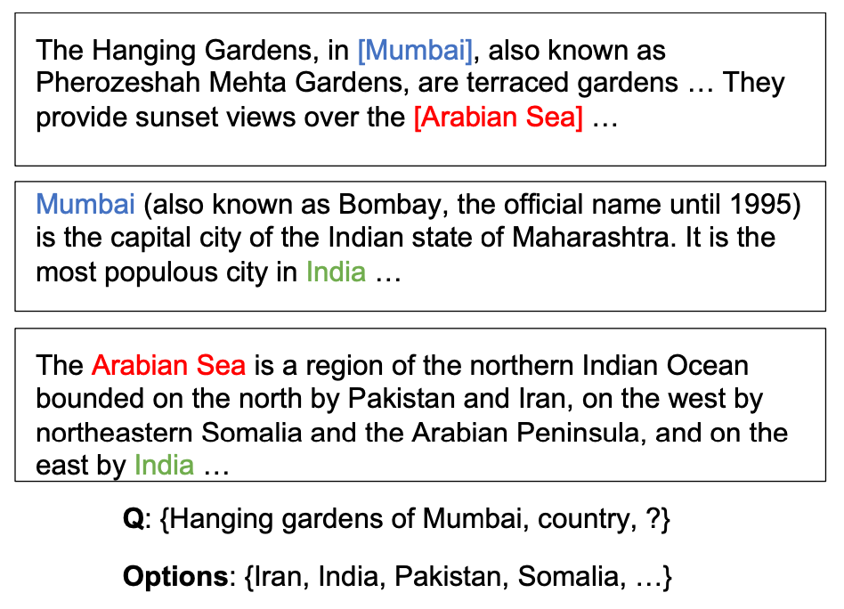

[メインページ](../../index.markdown)

[章目次](./chap10.md)
## 10.5. 質問応答(QA)

機械読解(MRC; machine reading comprehension)または質問応答(QA; question answering)は，文章の読解と理解を基に，与えられたクエリ(質問)に対して正しい答えを生成することを目指すタスクである． これは自然言語処理(NLP)の領域で重要だが難しいタスクである． これらのタスクの中で，グラフニューラルネットワークはQAタスク，特に，クエリへの応答に文書間の推論が必要な**マルチホップQAタスク**(De Cao *et al*., 2019; Cao *et al*., 2019; Song *et al*., 2018a; Tu *et al*., 2019)の性能向上のために広く採用されている．

本節では，グラフニューラルネットワークのマルチホップQAタスクへの応用についての代表的な研究を一つ取り上げる． まずは，マルチホップQAモデルの学習・評価に特化した**WIKIHOPデータセット**(Welbl *et al*., 2018)に基づいた，「マルチホップQAの問題設定」について説明する． その後，マルチホップQAタスクを解決するために提案された手法**Entity-GCN** (De Cao *et al*., 2019)について詳しくみていく．

### マルチホップQAタスク

ここでは，WIKIHOPデータセットに基づいたマルチホップQAタスクの問題設定について簡単に説明していく． WIKIHOPデータセットは，QAサンプル（質問とその回答）の集まりで構成される． 各サンプルは $(q,S_q,C_q,a^{\star})$ という組で表され， $q$ はクエリ(質問)， $S_q$ は（クエリへの回答のヒントとなる）参照文書の集合， $C_q$ は回答の候補集合（これらの候補は参照文書 $S_q$ 内のエンティティから選ばれる），そして $a^{\star}\in C_q$ はクエリ $q$ に対する正答を表している． なお，クエリ $q$ は，自然言語形式ではなく組 $(s,r,?)$ の形式で与えられる． ここで $s$ は主語エンティティ， $r$ は関係を表し，目的語エンティティは不明（"?"と表記）で，これは参照文書から推測される．

HIKIHOPデータセット内のサンプルを図10.3に示した．

<figure>

<figcaption>図10.3 WIKIHOPデータセットに含まれるサンプル例</figcaption>

</figure>

このサンプルでは，「ムンバイのハギング・ガーデンズ(Hanging Gardens of Mumbai)がある国」というクエリを，候補集合 $C_q=\left\\{\text{Iran}, \text{India}, \text{Pakistan}, \text{Somalia},\dots\right\\}$ から正しく選ぶことが目標となる． この例では，クエリへの正答を見つけるために以下のような**マルチホップ推論**が必要となる：

1.  1つ目の参照文書から，ハギング・ガーデンズがムンバイ(Munbai)に位置していることがわかる．

2.  次に，2つ目の参照文書から，ムンバイがインド(India)の都市であることがわかる．

3.  (1)と(2)の情報を組み合わせることで，クエリの正答（すなわち，India）を導き出すことができる．

以上のように，マルチホップQAタスクでは，「参照文書の集合( $S_q$ )を正しく読み取って理解し，候補集合( $C_q$ )の中からクエリ( $q$ )の答え( $a^{\star}$ )を特定するモデル」の学習を目指す．

### Entity-GCN

複数の文書をまたぐ推論プロセスを行うためには，文書内および文書間で現れるエンティティ同士の関係を捉える必要がある． そのために，マルチホップQAタスクの各サンプル $(q,S_q,C_q,a^{\star})$ に対して，参照文書内および参照文書間で候補となる答えが言及されている語句同士を接続し，グラフ構造化することを考える
[^6]
．そして，一般化されたグラフニューラルネットワークモデル（Entity-GCN）を用いてこれらのグラフ内のノード表現を学習する． これらのノード表現は，後にクエリに対する候補集合から答えを特定する際に役立てられる． なお，グラフフィルタリング層の数 $L$ は，グラフ内の各語句（つまりノード）が広範囲の近傍から豊富な情報にアクセスできるように設計されることに注意しよう．

次に，このモデルで扱うグラフ（Entityグラフ）がどのように構築されるかを説明する．その後，提案されたEntity-GCNを用いたマルチホップQAタスクの解き方を紹介していくことにしよう．

#### Entityグラフ

与えられたサンプル $(q,S_q,C_q,a^{\star})$ を用いてEntityグラフを構築するために，参照文書の集合 $S_q$ から $C_q\cup\left\\{s\right\\}$ のエンティティに言及している語句を特定し，それぞれの(エンティティを指す)語句をグラフのノードとして扱う． 具体的に，Entityグラフは以下の語句を含むことになる：

1.   $S_q$ 内で $C_q\cup \left\\{s\right\\}$ の要素と完全一致する語句

2.   $C_q\cup \left\\{s\right\\}$ の要素と**共参照関係** にある語句(共参照関係を発見するために，ここではLee *et al*.(2017)で提案された，End-to-Endな共参照解析手法を採用している)

以上の語句（またはノード）を接続するために，次のような数種類のエッジが構築される：

1.  **MATCHエッジ**：（同一文書内あるいは異なる文書間で）2つの語句が完全に一致しているとき，それらはMATCHエッジによって結ばれる．

2.  **DOC-BASEDエッジ**：2つの語句が同一の参照文書で共起するなら，それらはDOC-BASEDエッジによって結ばれる．

3.  **COREFエッジ**：2つの語句が共参照関係にあるなら，それらはCOREFエッジによって結ばれる．

上記3種類のエッジは，語句の間に成立する3つの異なる関係を表している． さらに，グラフが非連結部分を持たないように，接続されていない任意のノード組の間に4種類目のエッジが追加される． これらのエッジは**COMPLEMENTエッジ**と呼ばれ，Entityグラフを完全グラフ(complete graph)にする役割を果たす．

#### Entityグラフ上でのEntity-GCNによるマルチステップ推論

マルチステップ推論を行うために，一般化されたGNNモデルであるEntity-GCNが提案されている． これは，構築されたEntityグラフを通じてノード表現を変換し伝播する役割を果たしている． 具体的には，Entity-GCN内の( $l$ 層目)グラフフィルタは，異なる種類のエッジを扱うため，式(5.40)のMPNNフレームワークを実現する形で以下のように構築することができる：

  

$$

\begin{eqnarray}
&\symbf{m}^{(l-1)}_i = \symbf{F}^{(l-1)}_i\symbf{\Theta}^{(l-1)}_s + \dfrac{1}{\|\symscr{N}(v_i)\|}\sum_{r\in\symscr{R}}\sum_{v_j\in\symscr{N}_r(v_i)} \symbf{F}^{(l-1)}_j\symbf{\Theta}^{(l-1)}_r
\tag{10.3}\\
&\symbf{a}^{(l-1)}_i = \sigma\left(\left[\symbf{m}^{(l)}_i,\symbf{F}^{(l-1)}_i\right]\symbf{\Theta}^{(l-1)}_a\right)
\tag{10.4}\\
&\symbf{h}^{(l)}_i = \rho\left(\symbf{m}^{(l-1)}_i\right)\odot\symbf{a}^{(l-1)}_i + \symbf{F}^{(l-1)}_i\odot\left(1-\symbf{a}^{(l-1)}_i\right)
\tag{10.5}\\ \nonumber
\end{eqnarray}
$$

  

ここで， $\symscr{R}=\{\text{MATCH},\text{DOC-BASED},\text{COREF},\text{COMPLEMENT}\}$ はエッジの種類を表しており， $\symscr{N}\_r(v_i)$ は種類 $r$ のエッジを通じてノード $v_i$ と接続されたノード集合を表す． また， $\symbf{\Theta}^{(l-1)}\_r$ は種類 $r$ のエッジで共有されるパラメータであり， $\symbf{\Theta}^{(l-1)}\_s$ と $\symbf{\Theta}^{(l-1)}\_a$ は全てのノードで共有されるパラメータである． 式(10.4)の出力は，式(10.5)における更新部分で情報の流れを制御するゲートシステムとして機能する．

各ノード $v_i$ の表現は以下のように初期化される：  

$$
 \symbf{F}^{(0)}_i = f_x(\symbf{q},\symbf{x}_i) $$

  ここで， $\symbf{q}$ は事前学習モデルELMo (Peters *et al*., 2018)によるクエリ表現を表し， $\symbf{x}\_i$ はELMoによるノード $v_i$ の事前学習表現を表している． また， $f\_x(\cdot,\cdot)$ は順伝播型ニューラルネットワークによって決定される．

 $L$ 層のグラフフィルタリングから成るEntity-GCNにおいて，最終的に出力されるノード表現 $\symbf{F}^{(L)}\_i$ は，与えられたクエリに対する答えを候補集合の中から選択するために使われる． 具体的には，ある候補 $c\in C_q$ を答えとして選択する確率は次のようにモデル化される：  

$$
 P\left(c\|q,C_q,S_q\right) \propto \exp\left(\max_{v_i\in \symscr{M}_c}f_o\left(\left[\symbf{q},\symbf{F}^{(L)}_i\right]\right)\right) $$

  ここで， $f_o$ は学習可能なパラメータによって制御されるアフィン変換，  $\symscr{M}_c$ は候補 $c$ に対応する語句の集合である．  $\max$ 演算子は，候補 $c$ に対して $\symscr{M}_c$ の中で予測確率が最も大きい語句を選択するためのものである． 一方Song *et al*.(2018a)では， $\symscr{M}_c$ の中で最も確率が高い語句を選択するかわりに，候補 $c$ に関係する全ての語句が $P\left(c\|q,C_q,S_q\right)$ のモデリングにおいて利用されている．これは以下のように表される：  $$
 \displaystyle
    P \left(c\|q,C_q,S_q\right) = \dfrac{\displaystyle\sum_{v_i\in\symscr{M}_c}\alpha_i}{\displaystyle\sum_{v_i\in\symscr{M}}\alpha_i} $$
  ここで， $\symscr{M}$ は全ての語句，すなわちEntityグラフ内の全ノードを表している． また， $\alpha_i$ はソフトマックス関数で以下のようにモデル化される：  

$$
 \alpha_i = \dfrac{\exp\left(f_o\left(\left[\symbf{q},\symbf{F}^{(L)}_i\right]\right)\right)}{\displaystyle\sum_{v_i\in\symscr{M}}\exp\left(f_o\left(\left[\symbf{q},\symbf{F}^{(L)}_i\right]\right)\right)} $$

 

[メインページ](../../index.markdown)

[章目次](./chap10.md)

[前の節へ](./subsection_04.md) [次の節へ](./subsection_06.md)

[^6]: 訳注：**エンティティ**と**語句**の用語について，次のように使い分ける："Bob commutes by bicycle. He likes exercise."という文章における"Bob"と"He"は、同じ**エンティティ**（実世界の人物Bob）を指す2つの異なる**語句**である．
