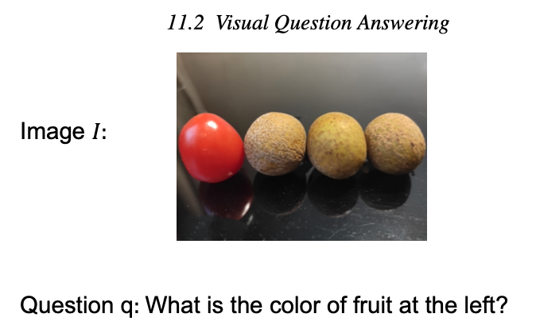

[メインページ](../../index.markdown)

[章目次](./chap11.md)
## 11.2. Visual Question Answering: 画像を使った質問応答タスク

画像を使った質問応答タスク(VQA)では，画像と自然言語で記述された質問が与えられたとき，画像から得られる情報に基づいて質問に答える．

<figure>

<figcaption>図11.1 VQAタスクの例</figcaption>

</figure>

図にVQAタスクの例を示す． この例では，画像中の左側にある果物の色を把握することが課題である． VQAタスクに適切に取り組むためには，質問と画像を理解する必要があり, そのためには自然言語処理とコンピュータビジョンの両方の技術が必要である． 一般的に，画像表現の学習にはCNN(Convolutional Neural Networks)が採用される． 次に，VQAタスクに答えるため，質問に対応する表現と合わせる． 図11.1に示すように，質問に正しく答えるためには，画像中の物体間の関係も重要である． オブジェクト間の意味的・空間的関係をより適切に把握することで，VQAタスクに取り組みやすくなる可能性がある． 例えば，図11.1の質問 $q$ に正しく答えるためには，果物間の相対的な位置関係が必要である． 物体間の相互作用を明示的に表現するために，グラフを使って物体間のつながりをモデル化する． そして，画像から生成されたこれらのグラフに対する表現を学習するために，グラフニューラルネットワークが用いられる(Teney et al., 2017; Norcliffe-Brown et al., 2018)． 具体的には，画像ごとにグラフが与えられることを前提とした研究(Teney et al., 2017)もあれば, 提案モデルの一部にグラフ生成過程を組み込んだ研究(Norcliffe-Brown et al., 2018)もある． 本節では，グラフニューラルネットワークがVQAタスクにどのように応用されるかを示す例として, (Teney et al., 2017)と(Norcliffe-Brown et al., 2018)で提案された2つのモデルを紹介する．

VQAのタスクは分類問題としてモデル化され，学習データ中で，各分類クラスは最も一般的な回答の1つに対応する． 形式的には，この分類問題の各サンプルデータは $(q, I)$ と表すことができ， $q$ は質問で， $I$  は画像である． 質問と画像の情報を利用してこの分類問題に取り組むために，質問と画像の表現が学習・統合され, 順伝搬型ネットワークに基づく予測層の入力になる． (Norcliffe-Brown et al., 2018)では，フレームワーク全体を学習しながら，画像からグラフを直接変換する． (Teney et al., 2017)では，質問 $q$ と画像 $I$ の両方をグラフとして前処理した上で，グラフニューラルネットワークで処理している．

### 画像をグラフと捉える

(Norcliffe-Brown et al., 2018)では，質問 $q$ はGRUを用いたRNNによって表現 $\mathbf{q}$ にエンコードされる． 画像 $I$ に対する表現を学習するため，質問 $q$ に依存する形で画像 $I$ からグラフを生成し，生成したグラフに対してグラフニューラルネットワークモデルを適用し，その表現を学習する． 以下ではまず，画像 $I$ と質問の表現 $\mathbf{q}$ が与えられたときにどのようにしてグラフの生成するかについて説明する． 次に，グラフ表現 $\mathbf{F}\_O$  を学習するためのグラフニューラルネットワークモデルについて説明する． 最後に，質問の表現 $\mathbf{q}$ と画像 $I$ を入力とする予測層について簡単に説明する．

画像 $I$ について，物体検出器によって生成されたボックスで囲まれた， $n$ 個の視覚的特徴量の集まりが得られる． それぞれの境界ボックスは，生成されたグラフにおいてはノードとして機能する． 各ノード $v_i$ に対して，はじめの表現 $\mathbf{x}\_i$ は，境界ボックス内の対応する畳み込み特徴量の平均をとることで得られる． これらのノードは，生成されたグラフのノード集合を構成し， $\symcal{V}\_I$ と表記される． 次に，これらのノード間の関係性を記述するため，エッジの集合 $\symcal{E}\_I$ を生成する． これらのエッジは，ペアワイズ類似度と与えられた質問 $q$ との関連性に基づいて構築される． 以上2種類の情報を組み合わせるため，各ノードについて，質問に依存した表現が次のように生成される:

 $$
 \mathbf{e}_i=h\left(\left[\mathbf{x}_i, \mathbf{q}\right]\right)
    \nonumber $$
 

ここで， $\mathbf{e}\_i$ はノード $v_i$ についての質問依存ノード表現であり， $h()$ は2種類の情報を統合する非線形関数である． 全ノードについての質問依存ノード表現は行列 $\mathbf{E}$ としてまとめることができ,  $i$ 行目が生成したグラフにおける $i$ 番目のノードに対応する． グラフの隣接行列は次のように計算される:

 $$
 \mathbf{A}=\mathbf{E} \mathbf{E}^{T}
    
\tag{11.1} $$
 

しかし，式(11.1)で得られる隣接行列は全結合で，効率性やモデルのパフォーマンスのいずれの観点でも最適ではない． したがって，疎な隣接行列を生成するため，各ノードについてより強いつながりのみを保存するようにする． 具体的には，各行について上位 $m$ 個の値のみ保持し，それ以外は0にする． ここで $m$ はハイパーパラメータである． 画像 $I$ について生成されたグラフを $\symcal{G}\_I$ と書く．

画像で検出された物体について，質問依存グラフ $\symcal{G}\_I$ が得られた後, 5.3.2節で導入したMoフィルタを用いてノード表現を生成する． ノード $v_i$ についての処理は次のように定式化される:

 $$
 \mathbf{F}_i^{(l)}=\sum_{v_j \in \symcal{N}\left(v_i\right)} w(\mathbf{u}(i, j)) \mathbf{F}_j^{(l-1)} \alpha_{i, j}
    
\tag{11.2} $$
 

ここで， $\symcal{N}\left(v_i\right)$ はノード $v_i$ の隣接ノード， $w(\cdot)$ は学習可能なガウスカーネル,  $\alpha_{i, j}=\operatorname{softmax}\left(\mathbf{A}\_i\right)[j]$ はノード $v_i$ と $v_j$ の間の結合の強さを表し， $\mathbf{u}(i, j)$ は疑似座標関数である． この疑似座標関数 $\mathbf{u}(i, j)$ は極座標ベクトル $(\rho, \theta)$ を返し，ノード $v_i$ と $v_j$ に対応する境界ボックスの重心間の相対的な位置関係を表す． 式(11.2)に記述したように， $L$ 層の連続したグラフフィルタを適用した後，ノード $v_i$ についての最終的な表現が $\mathbf{F}\_i^{(L)}$ として得られる． (Norcliffe-Brown et al., 2018)では， $K$ 個の異なるガウシアンカーなるが使われており， $K$ 個のカーネルの表現は次のように統合される:

 $$
 \mathbf{F}_i=\|_{k=1}^{K} \mathbf{F}_{i \mid k}^{(L)} \boldsymbol{\Theta}_k
    \nonumber $$
 

ここで， $\mathbf{F}\_{i \mid k}^{(L)}$ は $k$ 番目のカーネルの出力で， $\boldsymbol{\Theta}\_k$ は学習される線形変換である． グラフ中の全ノードについての最終的な表現は行列 $\mathbf{F}$ にまとめられ，各行が各ノードに対応する．

最終的なノード表現が得られると， $\symcal{G}\_I$ の表現 $\mathbf{F}\_I$ を生成するため最大プーリング層が適用される． グラフ表現 $\mathbf{F}\_I$ と質問表現 $\mathbf{q}$ は要素積で結合されることでタスクの表現となり，これが順伝搬型ネットワークを使った予測層に入力されて分類を行う．

### 画像と質問をグラフをとして捉える

(Teney et al., 2017)では，質問 $q$ と画像 $I$ がいずれもグラフとして前処理される． 質問 $q$ は依存構造木としてモデル化されている． この木においては，文中の各単語がノードであり，単語間の依存関係がエッジである． 質問 $q$ について生成されたグラフを $\symcal{G}\_q=\left\\{\symcal{V}\_q, \symcal{E}\_q, \symcal{R}\_q\right\\}$ と書く． ここで， $\symcal{R}\_q$ は可能性のある依存関係の集合を表す． 一方，画像 $I$ は全結合グラフとして前処理される． このグラフでは，画像 $I$ 中の物体がノードとして抽出され，これらは一対一で接続される． 画像 $I$ について生成されたグラフを $\symcal{G}\_I=\left\\{\symcal{V}\_I, \symcal{E}\_I\right\\}$ と書く． 各物体(つまりノード) $v_i \in \symcal{V}\_I$ について，その視覚的な特徴量 $\mathbf{x}\_i$ が割り当てられており，ノード $v_i$ と $v_j$ の間の各エッジ $\left(v_i, v_j\right) \in \symcal{E}\_I$ について， $v_i$ と $v_j$ の相対的な空間上の位置関係がエンコードされているベクトル $\mathbf{x}\_{i,j}$ が割り当てられている．

いずれのグラフもグラフニューラルネットワークで処理され，ノード表現を生成する． そしてそれらを統合して質問と画像のペア $(q, I)$ の表現を生成する． (Teney et al., 2017)では, 5.3.2節で紹介したGGNNフィルタを少し修正したものを使ってこれら2つのグラフを処理している． 修正したGGNNフィルタは次のように書くことができる:

  

$$

\begin{eqnarray}
    \mathbf{m}_i &=&\sum_{v_j \in \symcal{N}\left(v_i\right)} \mathbf{x}_{i j}^{\prime} \odot \mathbf{x}_j^{\prime} 
\tag{11.3}\\
    \mathbf{h}_i^{(t)} &=&\operatorname{GRU}\left(\left[\mathbf{m}_i, \mathbf{x}_i^{\prime}\right], \mathbf{h}_i^{(t-1)}\right) ; t=1, \ldots T
    
\tag{11.4}\\ \nonumber
\end{eqnarray}
$$

  

ここで， $\mathbf{x}\_j^{\prime}$ と $\mathbf{x}\_{i j}^{\prime}$ はノード $v_j$ とエッジ $(v_i, v_j)$ の特徴量をそれぞれ表す． 質問グラフ $\symcal{G}\_q$ については， $\mathbf{x}\_j^{\prime}$ ,  $\mathbf{x}\_{i j}^{\prime}$ はランダムに初期化される． 具体的には，ノードの特徴量は単語に固有のものであり，ある表現で初期化される． エッジの特徴量は関係性に固有のものであり，同じ関係性は同じ特徴量 $r \in \symcal{R}\_q$ を共有する． 画像グラフ $\symcal{G}\_I$ については， $\mathbf{x}\_i^{\prime}$ ,  $\mathbf{x}\_{i j}^{\prime}$ は，順伝搬型ネットワークを使って対応する特徴量 $\mathbf{x}\_i$ ,  $\mathbf{x}\_{i,j}$ からそれぞれ変換される． 式(11.4)では，GRUの更新ユニット( $\mathbf{h}\_0^{(0)}=\mathbf{0}$ )は $T$ 回走り，ノード $v_i$ の最終的な表現 $\mathbf{h}\_i^{(T)}$ を得る． なお, (Teney et al., 2017)では，式(11.3)と式(11.4)で記述される，単一のグラフフィルタ層が使われていた． つまり, 1回の集計処理と $T$ 回のGRU更新処理がある． グラフフィルタ処理で得られた最終的なノード表現を $\mathbf{h}\_i^{(T, q)}$ ,  $\mathbf{h}\_j^{(T, I)}$ と書く． それぞれ，質問グラフ $\symcal{G}\_q$ のノード $v_i \in \symcal{V}\_q$ と画像グラフ $\symcal{G}\_I$ のノード $v_j \in \symcal{V}\_I$ に対応する． 2つのグラフから得られたノード表現は次のように統合される:

  

$$

\begin{eqnarray}
    \mathbf{h}_{i, j} & =&\alpha_{i, j} \cdot\left[\mathbf{h}_i^{(T, q)}, \mathbf{h}_j^{(T, I)}\right], i=1, \ldots\left\|\symcal{V}_q\right\| ; j=1, \ldots,\left\|\symcal{V}_I\right\| 
\tag{11.5}\\ 
    \mathbf{h}_i^{\prime} & =&f_1\left(\sum_{j=1}^{\left\|\symcal{V}_I\right\|} \mathbf{h}_{i, j}\right) 
\tag{11.6}\\ 
    \mathbf{h}_{(q, I)} & =&f_2\left(\sum_{i=1}^{\left\|\symcal{V}_q\right\|} \mathbf{h}_i^{\prime}\right) 
\tag{11.7} \\ \nonumber
\end{eqnarray}
$$

  

ここで，式(11.5)中の $\alpha_{i, j}$ は元の特徴量 $\mathbf{x}\prime$ を使って学習されたものだが，質問ノードと画像ノードの関係性とみなすことができる． 具体的には，次のようにモデル化することができる:  

$$
 \alpha_{i, j}=\sigma\left(f_3\left(\frac{\mathbf{x}_i^{\prime} Q}{\left\|\mathbf{x}_i^{\prime Q}\right\|} \odot \frac{\mathbf{x}_j^{\prime}}{\left\|\mathbf{x}_j^{I}\right\|}\right)\right) $$

  ここで，上付き添字 $Q$ と $I$ を使って，それぞれ質問グラフと画像グラフのノードの特徴量を区別する．  $\odot$ はアダマール積で， $f\_3()$ は線形変換でモデル化され， $\sigma()$ はシグモイド関数， $\mathbf{h}\_{i,j}$ は質問グラフのノード表現と画像グラフのノード表現を混ぜ合わせた表現である． この表現 $\mathbf{h}\_{i,j}$ は階層的に集約され，質問と画像の組 $(q, I)$ についての表現 $\mathbf{h}\_{(q, I)}$ を生成し(式(11.6), 式(11.7)),  $f\_1()$ と $f\_2()$ は順伝搬型ネットワークである． この表現を使って分類タスクを行う．

[メインページ](../../index.markdown)

[章目次](./chap11.md)

[前の節へ](./subsection_01.md) [次の節へ](./subsection_03.md)

