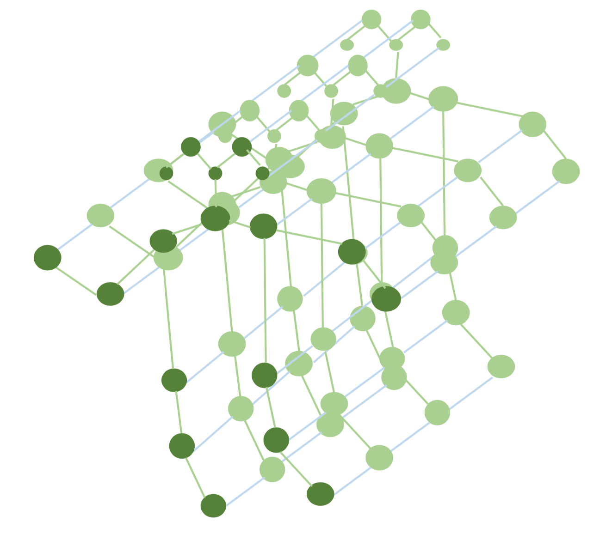

[メインページ](../../index.markdown)

[章目次](./chap11.md)
## 11.3. Skeleton-based Action Recognition: 骨格情報に基づく行動認識タスク

人間の行動認識は活発な研究分野であり, 動画を理解するうえで重要な役割を担っている. 人体の骨格の動きは人間の行動に関する重要な情報を捉えることができ, 行動認識のためにしばしば活用されてきた. 骨格の動きは, 人間の関節の位置とその間の相互作用の時間変化として自然にモデル化することができる. 特に, 関節間の空間的な位置関係は, 関節をノード, 骨をエッジとするグラフとしてモデル化することができる. そして, 骨格の動きは, 空間構造が同じで, グラフのノード属性(つまり関節の位置座標)が異なるグラフの列として表現することができる. グラフニューラルネットワークを用いることで, 骨格の動きのより良い表現を学習することができ, 骨格情報に基づく行動認識の性能の工場につながる(Yan et al., 2018; Li et al., 2018a; Shi et al., 2019a; Si et al., 2018; Wen et al., 2019; Li et al., 2019c; Si et al., 2019). 本節では, （Yan et al., 2018）で提案されたフレームワークを一例として, グラフニューラルネットワークが骨格情報に基づく行動認識タスクにどのように適用できるかを説明する. 骨格情報に基づく行動認識タスクのためのグラフニューラルネットワークの研究はこれが初めてである.

<figure>

<figcaption>図11.2 時空間骨格グラフの例</figcaption>

</figure>

図11.2では, 骨格の系列を時空間骨格グラフ $\mathcal{G}=\{\mathcal{V}, \mathcal{E}\}$ で表現している. ここで,  $\mathcal{V}$ はノードの集合,  $\mathcal{E}$ はエッジの集合をそれぞれ表す. ノード集合 $\mathcal{G}$ は骨格の系列のすべての関節から構成される. すなわち,  $\mathcal{V}=\left\\{v_{t i} \mid t=1, \ldots, T ; i=1, \ldots, N\right\\}$ である. ここで,  $N$ は1つの骨格グラフごとの関節の数,  $T$ は時系列方向の骨格数を表す.  $\mathcal{E}$ は2種類のエッジからなる. 1つは同一骨格内のエッジで, 関節の間の骨に基づいて定義される. もう1つは, 骨格間のエッジで, 時系列で連続する骨格の同じ関節をつなぐ. 図11.2の例では, 骨格内のエッジは緑でハイライトされ, 骨格間のエッジは青で示されている. 骨格に基づく行動認識タスクはグラフ分類タスクに変換することができ, 各分類クラスは「走っている」などの予測すべき行動に対応する. このグラフ分類タスクを実行するために, 時空間骨格グラフに対してグラフフィルタリング処理をしてノード表現を学習する方法が提案されている. ノード表現を学習した後には最大プーリングなどのグローバルプーリング層を適用することでグラフ表現を得る. そしてグラフ表現が順伝搬型ネットワークの入力として用いられ予測を行う. 次に, 提案されている, 時空間グラフについてのグラフフィルターの詳細を説明する.

提案されているグラフフィルターは, GCNフィルター(GCNフィルター の詳細は5.3.2節参照)を応用したもので, 時空間グラフの隣接ノードからの情報を集約する. 具体的には,  $t$ 番目の骨格中のノード $v_{ti}$  に対して, それに空間的に隣接するノード $\mathcal{N}\left(v_{t i}\right)$ は,  $t$ 番目の骨格グラフの1ホップ隣接するノードとノード $v_{ti}$  自身から構成される. そして, 時空間グラフ $\mathcal{G}$ 上における, その時空間的に隣接するノード $\mathcal{N}^{T}\left(v_{t i}\right)$  は, 以下のように定義することができる:

 $$
 \mathcal{N}^{T}\left(v_{t i}\right)=\left\{v_{\tau j} \mid v_{t j} \in \mathcal{N}\left(v_{t i}\right) \text { and }\|\tau-t\| \leq \Gamma\right\}
    
\tag{11.8} $$
 

式(11.8)の制約 $\|\tau-t\| \leq \Gamma$ は, ノード $v_{\tau j}$ と $v_{t i}$ が含まれる2つの骨格グラフの時間的な距離が $\Gamma$ よりも小さいという条件を表す. したがって, ノード $v_{ti}$ の時空間隣接ノード $\mathcal{N}^{T}\left(v_{t i}\right)$ には, 同一骨格内の空間的に隣接するノードだけではなく, 時系列で近い骨格内の「時間的隣接ノード」も含まれる. さらに, 隣接ノードを同じように扱うのではなく, 異なる部分集合にわけ, それぞれの変換には別の変換行列を用いる. 特に, 骨格グラフ内のノード $v_{ti}$ の空間的隣接ノード $\mathcal{N}\left(v_{t i}\right)$ は3つの部分集合にわけることができる: 1つ目は, 元のノード自身で(つまり, ノード $v_{ti}$ ), 2つ目は, 元のノードよりも骨格の重心に近いノード, そして3つ目はそれ以外である. 他の骨格グラフ中のノード $v_{ti}$ の隣接ノードも同様に分けることができる. したがって, 隣接ノード集合 $\mathcal{N}^{T}\left(v_{t i}\right)$ は $3(2 \Gamma+1)$ 個の集合にわけることができる. 便宜上,  $s\left(v_{\tau j}\right)$ を使って, 与えられたノード $v_{\tau j} \in \mathcal{N}^{T}\left(v_{t i}\right)$ が属する部分集合を表す. そして, ノード $v_{ti}$ についてのグラフフィルタリング処理は次のように書くことができる.

 $$
 \mathbf{F}_{t i}^{(l)}=\sum_{v_{\tau j} \in \mathcal{N}^{T}\left(v_{t i}\right)} \frac{1}{\# s\left(v_{\tau j}\right)} \cdot \mathbf{F}_{\tau j}^{(l-1)} \mathbf{\Theta}_{s\left(v_{\tau j}\right)}^{(l-1)}
    
\tag{11.9} $$
 

ここで,  $\mathbf{F}\_{t i}^{(l)}$ は $l$ 番目の層の後のノード $v_{ti}$ のノード表現を表し,  $\mathbf{F}\_{\tau j}^{(l-1)}$ は $(l-1)$ 番目の層の後のノード $v_{\tau j}$ のノード表現を表す.  $\\# s\left(v_{\tau j}\right)$ は部分集合 $v_{\tau j}$ 内の隣接ノードの数を表し, 変換パラメータ $\mathbf{\Theta}\_{s\left(v_{\tau j}\right)}^{(l-1)}$ は 部分集合 $s\left(v_{\tau j}\right)$ の属するすべての隣接ノードで共通である. ノード表現は, 式(11.9)の $L$ 層のグラフフィルター層と活性化関数で学習される. そして, グローバルプーリングを得られたノード表現に適用してグラフ表現を得る. なお, 上で説明したフレームワークでは, 骨格内の関節間の関係性は骨によって定義される. したがって, 空間的に近い関節のみが繋がれている. しかし, 特定の動きをする際には離れた関節同士が関係する場合もある. 例えば, 拍手をするときには2つの手は密に関係する. したがって, 離れた関節同士の関係性をエンコードすることも重要である. (Shi et al., 2019b,a; Li et al., 2019c)では, 関節間のグラフもまとめてモデルのパラメータとして学習される.

[メインページ](../../index.markdown)

[章目次](./chap11.md)

[前の節へ](./subsection_02.md) [次の節へ](./subsection_04.md)

