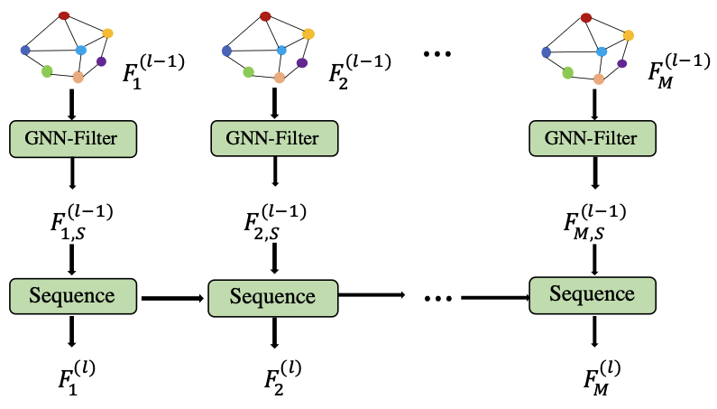

[メインページ](../../index.markdown)

[章目次](./chap12.md)
## 12.3. 都市データマイニング

都市エリアにおける（空気品質，交通量，人の移動などの）大量のデータを収集するセンシング技術や計算基盤の発展により，交通渋滞や大気汚染など，都市化によって引き起こされるさまざまな課題に取り組むためのこれまでにないチャンスが生まれている． 本節では，このような都市データマイニングのタスクに対してGNNをどのように応用されるかを説明していく．

### 交通量の予測

これからの時代において，新しい道路の計画・建設，そしてスマートシティの交通管理を考える際，動的な交通状況の分析と予測は非常に重要となってくる． 交通に関する研究において，通常，交通流量データは時系列として扱われる． この交通流量データには，さまざまな時点における交通速度．交通量，交通密度といった情報が含まれている．

一方，道路や道路の一区画はそれぞれが独立して存在するわけではなく，それらの間には空間的な関連性が存在する． これらの道路間の空間的な関連性は通常，交通ネットワークによって表現され，道路や道路の一区画がノードで，それらの間の空間的な関係がエッジとして符号化される． 交通量予測のパフォーマンスを向上させるためには，空間的な情報と時間的な情報の両方を捉えることが求められる． その中で，空間的な情報にはGNNが採用され，時間的な情報には畳み込みニューラルネットワークや再帰型ニューラルネットワーク，Transformerなどの系列モデリングの手法が採用されている(Yu *et al*., 2017; Guo *et al*., 2019; Wang *et al*., 2020a)． 次に，空間情報と時間情報に対して，GNNがどのように空間関係を捉え，系列モデリング手法と組み合わされるかを見ていく．

交通ネットワークはグラフ $\symscr{G} = \left\\{\symscr{V},\symscr{E}\right\\}$ として表すことができる． ここで， $\symscr{V} = \left\\{v_1,\dots,v_N\right\\}$ はノード（道路または道路の一区画）の集合であり， $N$ は交通ネットワーク内のノードの総数を表す． また， $\symscr{E}$ はこれらのノード間の空間関係を記述するエッジ集合である． ノード間の接続は隣接行列 $\symbf{A}$ によっても記述することができる． ある時点 $t$ における交通ネットワーク内の交通状況情報（例えば交通速度）は， $\symbf{x}\_t\in\mathbb{R}^{N\times d}$ で表される． ここで， $\symbf{x}\_t$ の $i$ 行目は交通ネットワーク内のノード $v_i$ に対応する． 交通量予測タスクの目的は，過去 $M$ 個の交通状況（観測データ）をもとに，将来 $H$ 個の交通状況を予測することである． 具体的には以下のように表現することができる：

 $$
 (\hat{\symbf{X}}_{M+1}, \dots, \hat{\symbf{X}}_{M+H}) = f(\symbf{X}_1, \dots,\symbf{X}_M)  
\tag{12.7} $$
 

 $f(\cdot)$ は学習対象のモデルであり， $\hat{\symbf{X}}\_t$ は時点 $t$ における予測された交通状況を示している． この問題に取り組むための一般的なフレームワークは，まず，空間情報と時間情報の両方を捉えることで各時点での洗練されたノード表現を学習し，その後，これらの表現を使用して将来時点の交通状況の予測を行うものである． これらの表現は層を通過するにつれて洗練され，それぞれの層において空間的・時間的関係を捉えながら更新されていく．  $l$ 層目における典型的なフレームワークを図12.1に示した．

<figure>

<figcaption>図12.1 典型的な交通量予測フレームワークにおける学習層</figcaption>

</figure>

このフレームワークは以下の $2$ つの要素から構成される．

1.  空間的関係を捉えるための空間型グラフフィルタリング操作

2.  時間的関係を捉えるための系列モデル

上記のうち，空間型グラフフィルタリングは，各時点のノード表現に以下のように適用される：

 $$
 \symbf{F}^{(l)}_{t,\symscr{S}} = \operatorname{GNN-Filter}(\symbf{F}^{(l-1)}_t,\symbf{A}) \qquad (t = 1,\dots, M)
\tag{12.8} $$
 

ここで， $\symbf{F}^{(l-1)}\_t$ は $l-1$ 層目を経た，時点 $t$ におけるノード表現を表し， $\symbf{F}^{(l)}\_{t,\symscr{S}}$ は $l$ 層目の空間型グラフフィルタリング層を経たノード表現を示している． これは $l$ 層目の系列モデルの入力となる． なお，GNNフィルタが持つパラメータは全ての時点で共有される点に注意． 加えて，グラフフィルタリング操作にはさまざまな種類の手法が使われており，状況に応じて適切なものが選択される． 例えば，Yu *et al*.(2017)では，GCNフィルタが採用されている（GCNフィルタの詳細は5.3.2節を参照）． 一方で，Guo *et al*.(2019)や Wang *et al*.(2020a)では，アテンション機構を用いたグラフフィルタリング操作が採用されている．

空間型グラフフィルタリング操作の出力は系列 $(\symbf{F}^{(l)}\_{1,\symscr{S}},\dots,\symbf{F}^{(l)}\_{\symscr{M},\symscr{S}})$ としてまとめられ，これが以下のように時間的関係を捉える系列モデルに供給される：

 $$
 \symbf{F}^{(l)}_1,\dots,\symbf{F}^{(l)}_M = \operatorname{Sequence}(\symbf{F}^{(l)}_{1,\symscr{S}},\dots,\symbf{F}^{(l)}_{\symscr{M},\symscr{S}})
\tag{12.9} $$
 

出力された $\symbf{F}^{(l)}\_1,\dots,\symbf{F}^{(l)}\_M$ は，次の空間型グラフフィルタリング層への入力として使用される．  $\operatorname{Sequence}(\cdot)$ 関数としては，さまざまな系列モデルの手法が採用することができる． 例えば，Yu *et al*.(2017)では，時間情報を処理するために $1$ 次元の畳み込みニューラルネットワークが採用されている． また，Wang *et al*.(2020a)では，時間的関係を捉えるためにGRUモデルやTransformerが使用されている． 最終的な表現 $\symbf{F}^{(L)}\_1,\dots,\symbf{F}^{(L)}\_M$ は，上記のように $L$ 個の層を適用することで得られ，将来の交通状況の予測に利用されることになる． なお， $\symbf{F}^{0}\_1,\dots,\symbf{F}^{(0)}\_M$ は，交通状況 $\symbf{X}\_1,\dots,\symbf{X}\_M$ などのノード情報で初期化することができる．

### 大気質予測

大気汚染は，自然環境や人間の健康に悪影響を及ぼすため，社会的な関心を集めている． したがって，大気質(air quality)を予測することは，この問題に影響を受ける人々に適切な指針を提供するために重要な役割を果たす．

ある一つの場所における大気質は，近隣の場所における時間的に変化する大気質が関連しているため，大気質予測問題は空間的・時間的な形式で定式化することができる． 特に，異なる場所間の空間的な関係は，グラフ $\symscr{G}=\left\\{\symscr{V},\symscr{E}\right\\}$ として表される． ここで，場所はノードであり，それらの間のエッジは地理的な関係を表すことになる． また，大気質の状態は $\text{PM}\_{2.5}$ ， $\text{PM}\_{10}$ ，，，，など様々な指標を含んでいる． そこで $\symscr{V}$ 内の全ての場所の時点 $t$ で測定された大気質の状態を $\symscr{X}\_t$ と表す． このとき， $\symbf{X}\_t$ の $i$ 行目は場所 $v_i\in \symscr{V}$ の大気質の状態に対応している．

大気質予測の課題では，過去の状態を考慮に入れながら，将来の時点でのあらゆる場所の大気質の状態を予測することを目指すことになる． 一般的に，時点 $t$ で予測対象の大気質の状態を $\symbf{Y}\_t$ と表す． ここで， $i$ 行目は $i$ 番目の場所 $v_i$ に対応している． 以上より，大気質予測問題は次のように定式化することができる：

 $$
 (\symbf{Y}_{M+1},\dots,\symbf{Y}_{M+H}) = f(\symbf{X}_1,\dots,\symbf{X}_M)
\tag{12.10} $$
 

ここで， $(\symbf{X}\_1,\dots,\symbf{X}\_M)$ は過去の $M$ 個の時点で観測された大気質の状態であり， $(\symbf{Y}\_{M+1},\dots,\symbf{Y}\_{M+H})$ は将来 $H$ 個の時点で予測対象となる大気質の状態である． ここで，12.3.1節で紹介したフレームワークは大気質の予測に利用することができる． 特に， $\text{PM}\_{2.5}$ のみを予測することを目指しているQi *et al*.(2019)では，異なる場所間の空間的な関係を捉えるためにGCNフィルタが用いられ，時間的あ関係を捉えるためにLSTMモデルが採用されている．

[メインページ](../../index.markdown)

[章目次](./chap12.md)

[前の節へ](./subsection_02.md) [次の節へ](./subsection_04.md)

