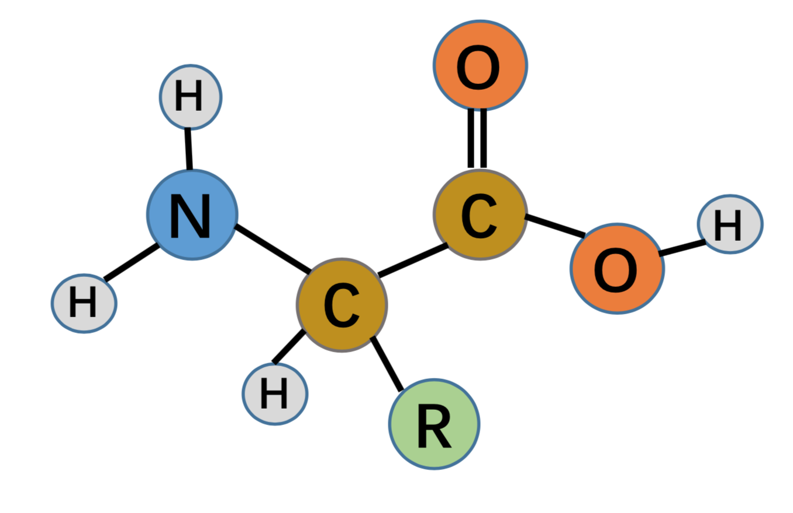
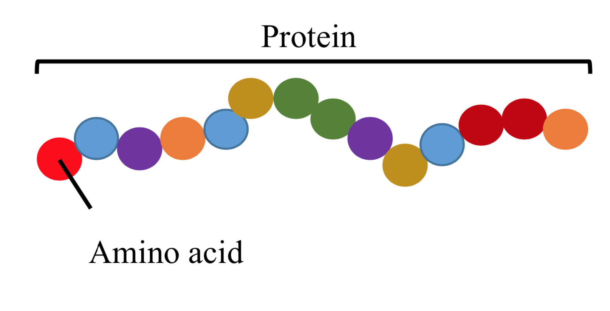
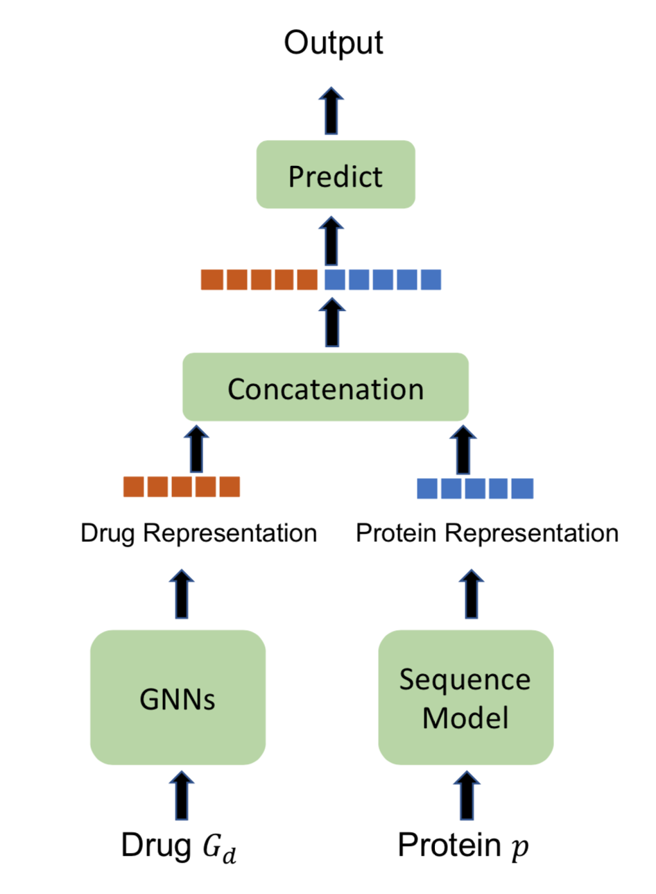

[メインページ](../../index.markdown)

[章目次](./chap13.md)
## 13.2. 創薬

グラフニューラルネットワークは, 創薬に重要なたくさんのタスクを進めるために用いられている. これらのタスクの例としては次のものがある: 1)分子表現学習. 分子の物性予測などの後段タスクを容易にすることで, 適切な物性をもつ有望は候補分子を見つけるための探索空間を絞り込む. 2)分子グラフ生成. 望ましい物性を持つ分子の生成を目指す. 3)薬物・標的間の結合の親和性予測. 薬物・標的間の相互作用の強さを予測し, 創薬や薬物の再利用に活用する. 4)タンパク質界面予測. タンパク質の結合界面を予測し, 分子のメカニズムを理解する. 次に, グラフニューラルネットワークの 分子表現学習, 薬物・標的間の結合の親和性予測, タンパク質界面予測への応用を紹介する. なお, グラフニューラルネットワークモデルを部分的に用いて分子グラフを生成する代表的な手法については, 9.4.2節と9.5.2節で紹介した.

### 分子表現学習

材料設計や創薬に応用するためには, 新しい分子の物性を予測することが重要である. 分子データについて予測を行うために深層学習が用いられてきた. 一般に, 順伝搬型ネットワークや畳み込みニューラルネットワークなどの深層学習は, 分子データに直接は適用することができない. というのも, 分子は任意の大きさや形を取りうるからだ. したがって, 予測の流れは通常, 次の2段階をとる: 1段階目は特徴量抽出である. 分子の構造情報をエンコードしたベクトル表現である, 分子フィンガープリントを抽出する. 2段階目は物性予測である. 抽出したフィンガープリントを入力として, 深層学習を用いて予測する. 従来は, 市販の専用ソフトウェアを使い, 後段の予測タスクによらずに(微分可能ではない)分子フィンガープリントを抽出してきた. したがって, このように抽出された表現は, 後段のタスクに最適ではない可能性がある. (Duvenaud et al., 2015)では, 予測をするために一気通貫のフレームワークが提案されており, その中では微分可能な方法で分子フィンガープリントを学習するためにGNNが用いられている. 具体的には, 分子はグラフ $\mathcal{G}=\{\mathcal{V}, \mathcal{E}\}$ として表現することができる. ここで, ノードは原子でエッジは原子間の結合を表す. したがって, 分子の物性予測のタスクはグラフの分類問題か回帰問題とみなすことができ, そのためにはグラフレベルでの表現を学習する必要がある. なお, このような分子に関する文脈では, 分子の表現のことを分子フィンガープリントと呼ぶ. このタスクを実行するために用いられるGNNは, グラフフィルター層とグラフプーリング層の両方で構成される(一般的なフレームワークについては5章参照). (Duvenaud et al., 2015)では, グローバルプーリングが用いられている. 次に, まずグラフフィルター層を紹介し, その上でグラフプーリング層を紹介して分子フィンガープリントを得る. ノード $v_i\in\mathcal{V}$ について, ( $l$ 層目の)グラフフィルター操作は次のように記述することができる:

 $$
 \mathbf{F}_i^{(l)}=\sigma\left(\left[\mathbf{F}_i^{(l-1)}+\sum_{v_j \in \mathcal{N}\left(v_i\right)} \mathbf{F}_j^{(l-1)}\right] \boldsymbol{\Theta}_{\left\|\mathcal{N}\left(v_i\right)\right\|}^{(l-1)}\right)
    
\tag{13.1} $$
 

ここで,  $\boldsymbol{\Theta}\_{\left\|\mathcal{N}\left(v_i\right)\right\|}^{(l-1)}$ はノード $v_i$ の近傍の大きさ $\left\|\mathcal{N}\left(v_i\right)\right\|$ に依存する変換行列である. したがって, 各層の変換行列の総数は近傍の大きさで決まる. 有機化合物では, 原子は最大5つの近傍を持つので, 各層に5つの変換行列が存在する. 分子 $\mathcal{G}$ についての分子フィンガープリント $f\_{\mathcal{G}}$ は次のようなグローバルプーリング操作によって得られる:

 $$
 \mathbf{f}_{\mathcal{G}}=\sum_{l=1}^{L} \sum_{v_i \in \mathcal{V}} \operatorname{softmax}\left(\mathbf{F}_i^{(l)} \mathbf{\Theta}_{p o o l}^{(l)}\right)
    
\tag{13.2} $$
 

ここで,  $L$ はグラフフィルター層の数を表す.  $\mathbf{\Theta}\_{p o o l}^{(l)}$ は $l$ 層目で学習されたノード表現を変換する. 式(13.2)のグローバルプーリングはすべてのグラフフィルター層で学習されたノード表現の情報を集約する. 得られた分子フィンガープリント $f\_{\mathcal{G}}$ は, 物性予測などの後段のタスクに用いられる. 式(13.1)のグラフフィルター操作も式(13.2)のプーリング操作も, 物性予測などの後段タスクに最適化するように行われる(Liu et al., 2018a). 実はここで紹介した方法以外にも, グラフレベルの表現を学習するように設計されたグラフニューラルネットワークならなんでも分子表現の学習に用いることができる. 具体的には, 5章で紹介したように, グラフフィルター層とグラフフィルタープーリング層でグラフニューラルネットワークを構成することができる. 特に, 5.3.2節で議論したMPNNフィルターは分子表現学習の文脈で導入された(Gilmer et al., 2017).

### タンパク質界面予測

図13.2のように, タンパク質は生化学的な機能を持つアミノ酸の鎖である(Fout et al., 2017). また, 図13.1のように, アミノ酸は有機化合物である. アミノ酸は, アミン(-NH $_2$ )とカルボキシル官能基(-COOH)を持ち, 各アミノ酸に固有の側鎖(R基)を持つ. タンパク質がその機能を発揮するためには, 他のタンパク質と相互作用する必要があある. タンパク質間の相互作用が起こる界面を予測することは, 創薬分野で重要な応用につながる, 難しく挑戦的な課題である(Fout et al., 2017). 相互作用するタンパク質同士において, そに界面は相互作用するアミノ酸残基と近傍のアミノ酸残基から構成される. 具体的には, (Afsar Minhas et al., 2014)では, 異なるタンパク質の2つのアミノ酸残基について, 一方のアミノ酸残基の任意の非水素原子が他方のアミノ酸残基の任意の非水素原子と6Å以内にあれば, その2つのアミノ酸残基は界面の一部とみなされている. したがって, タンパク質界面予測問題は, それぞれ異なるタンパク質内の2組のアミノ酸残基を入力とした2値分類問題としてモデル化することができる. (Fout et al., 2017)では, タンパク質はグラフとしてモデル化されている. このグラフにおいては, アミノ酸残基がノード, その間の関係性がエッジとして扱われている. そしてノード表現の学習のためにグラフニューラルネットワークが適用され, 学習した表現を用いて分類を行う. 次に, タンパク質がどのようにグラフとして扱われているかを説明し, タンパク質界面予測を行う方法について紹介する.

<figure>

<figcaption>図13.1 アミノ酸の例</figcaption>

</figure>

<figure>

<figcaption>図13.2 タンパク質はアミノ酸からできている</figcaption>

</figure>

#### タンパク質をグラフとして表す

タンパク質はグラフ $\mathcal{G}=\{\mathcal{V}, \mathcal{E}\}$ と表現することができる. 詳細には, タンパク質中の各アミノ酸残基をノードとして扱う. アミノ酸残基間の空間的な関係性をもとにエッジを生成する. 具体的には, 各アミノ酸残基は原子間の平均的な距離をもとに決められる,  $k$ 個の近傍のアミノ酸残基とつながっている. 各ノードとエッジには特徴量が割り当てられている. ノード $v_i \in \mathcal{V}$ の特徴量は $\mathbf{x}\_i$ , エッジ $(v_i, v_j)$ の特徴量は $\mathbf{e}\_{ij}$ で表される.

#### タンパク質界面予測

アミノ酸残基のペアについて, 一方がリガンドタンパク質 $\mathcal{G}\_l=\left\\{\mathcal{V}\_l, \mathcal{E}\_l\right\\}$ , 他方が受容体タンパク質 $\mathcal{G}\_r=\left\\{\mathcal{V}\_r, \mathcal{E}\_r\right\\}$ のものであるとする. タンパク質界面予測では, これら2つのアミノ酸残基がタンパク質界面にあるかどうかを区別する. このタスクは, 各サンプルがアミノ酸残基のペア $\left(v_l, v_r\right)$ であるような2値分類問題とみなすことができる. ここで,  $v_l \in \mathcal{V}\_l$ ,  $v_r \in \mathcal{V}\_r$ である.  $\mathcal{G}\_l$ と $\mathcal{G}\_r$ にグラフフィルター操作が適用されノード表現を学習する. そして,  $v_l$ と $v_r$ のノード表現を統合してこのペアについての表現を構成し, 全結合層によって分類を行う. GCNフィルター(5.3.2節参照)と似たグラフフィルターが用いられる.  $l$ 層目のノード表現は次のように学習される:

 $$
 \mathbf{F}_i^{(l)}=\sigma\left(\mathbf{F}_i^{(l-1)} \boldsymbol{\Theta}_{\mathrm{c}}^{(l-1)}+\frac{1}{\left\|\mathcal{N}\left(v_i\right)\right\|} \sum_{v_j \in \mathcal{N}\left(v_i\right)} \mathbf{F}_j^{(l-1)} \boldsymbol{\Theta}_{\mathrm{N}}^{(l-1)}+\mathbf{b}\right)
    \nonumber $$
 

ここで,  $\boldsymbol{\Theta}\_{\mathrm{c}}^{(l-1)}$ と $\boldsymbol{\Theta}\_{\mathrm{N}}^{(l-1)}$ はそれぞれ, 中心ノードと近傍ノードに固有の, 学習可能な行列で,  $\mathbf{b}$ はバイアス項である. さらに, エッジの特徴量を組み込むため, (Fout et al., 2017)では次のグラフフィルター操作が提案されている:

 $$
 \mathbf{F}_i^{(l)}=\sigma\left(\mathbf{F}_i^{(l-1)} \boldsymbol{\Theta}_{\mathrm{c}}^{(l-1)}+\frac{1}{\left\|\mathcal{N}\left(v_i\right)\right\|} \sum_{v_j \in \mathcal{N}\left(v_i\right)} \mathbf{F}_j^{(l-1)} \boldsymbol{\Theta}_{\mathrm{N}}^{(l-1)}+\frac{1}{\left\|\mathcal{N}\left(v_i\right)\right\|} \sum_{v_j \in \mathcal{N}\left(v_i\right)} \mathbf{e}_{i j} \boldsymbol{\Theta}_{\mathrm{E}}^{(l-1)}+\mathbf{b}\right)
    \nonumber $$
 

ここで,  $\mathbf{e}\_{ij}$ はエッジ $v_i, v_j$ のエッジ特徴量を表し,  $\boldsymbol{\Theta}\_E^{(l-1)}$ は学習可能なエッジの変換行列である. なお, エッジの特徴は学習過程では固定される.

### 薬物・標的間の結合の親和性予測

新薬の開発は通常, 時間とお金がかかる. 薬物・標的間の結合（DTI）を同定することは, 創薬の初期段階において候補となる薬物の探索空間を絞り込むために不可欠である. また, 既存の薬や放棄された薬の新しい適用対象を見つけることを目的とした, 薬の再利用にも使うことができる. 薬物・標的間の結合の親和性予測のタスクは, 与えられた薬物と標的間の結合の強さを推測することである. これは回帰問題と考えることができる. このタスクで関係してくるのは主にタンパク質, 疾患, 陰電子, 副作用の4つの標的である. 本節では, タンパク質を標的としてどのようにグラフニューラルネットワークをこのタスクに適用するかを説明する.

<figure>

<figcaption>図13.3 薬物・標的間の結合の親和性予測の全体像</figcaption>

</figure>

薬物とタンパク質のペアを $\left(\mathcal{G}\_d, p\right)$ と書く. ここで,  $\mathcal{G}\_d$ と $p$ はそれぞれ薬物とタンパク質を表す. 薬物 $\mathcal{G}\_d$ は原子をノード, 化学結合をエッジとする分子グラフとして表現される. タンパク質は系列データかグラフで表される. (Nguyen et al., 2019)では, タンパク質はアミノ酸の配列として表現されているが, 本節ではこの表現方法を用いて説明する. 薬物・標的間の結合の親和性予測の全体像を図13.3に示した. 薬物 $\mathcal{G}\_d$ はグラフニューラルネットワークモデルに入力され, グラフレベルでの薬物の表現を得る. タンパク質は系列モデルに入力され, タンパク質の表現を得る. これら2つの表現を結合し, 薬物とタンパク質のペアについての表現を得る. その後, 薬物・標的間の結合の親和性予測に活用される. グラフニューラルネットワークモデルはグラフフィルター層とグラフプーリング層から構成される(5章参照). 13.2.1節で紹介した, 分子表現学習のためのGNNモデルを薬物表現の学習に使うこともできる. 1次元CNNやLSTM, GRUなどの系列モデルを使ってタンパク質の表現を学習する. さらに, タンパク質をグラフとしてモデル化した場合には, 図13.3の系列モデルをGNNに置き換えて, タンパク質の表現を学習することもできる.

[メインページ](../../index.markdown)

[章目次](./chap13.md)

[前の節へ](./subsection_01.md) [次の節へ](./subsection_03.md)

