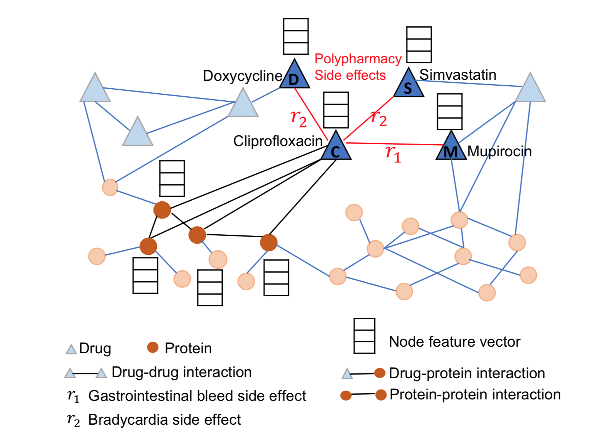

[メインページ](../../index.markdown)

[章目次](./chap13.md)
## 13.4. ポリファーマシー副作用予測

多くの複雑な疾患は一つの薬で治療することはできない. これらの疾患と闘うための有望な方法がポロファーマシー（多剤併用）である. これは複数の薬を組み合わせて患者を治療することを意味する. しかし, 薬物間の相互作用によって副作用が生じる可能性が高いことが大きな懸念となる. したがって, 疾患の治療のために新しい薬を組みわせる場合には, ポリファーマシーによる副作用を予測することが重要である. ポロファーマシー副作用予測のタスクでは, 薬物のペアの間に副作用が生じるかどうかを予測するだけではなく, その副作用がどのような種類のものかを見分ける必要もある.

(Zitnik et al., 2018)の分析では, 同時に処方される薬物ペアはランダムな薬物ペアに比べて共通の標的タンパク質を多く持つ傾向にあり, これは薬物と標的タンパク質の間の相互作用がポロファーマシーのモデル化にとって重要であることを意味する. したがって, (Zitnik et al., 2018)の副作用予測では, 「薬物・標的タンパク質間相互作用」と「標的タンパク質間相互作用」を組み込んでいる. 詳細には, 薬物間相互作用(ポロファーマシー副作用), 薬物・タンパク質間相互作用, タンパク質間相互作用についてマルチモーダルグラフを構築する. したがって, ポロファーマシー予測においては, マルチモーダルグラフ上での複数種類の関係性を持つリンク予測問題，すなわち多関係リンク予測問題としてモデル化される. 薬物間にリンクが存在するのか, そして存在するとすればどのような種類なのかを予測することが目標となる. ノード表現の学習のためにグラフニューラルネットワークが用いられ, 得られた表現を用いて予測を行う. 次にまず, どのようにしてマルチモーダルグラフを構築するのかを説明し, その後にポロファーマシー副作用予測を行うフレームワークを紹介する.

<figure>

<figcaption>図13.4 薬物間相互作用, 薬物・タンパク質間相互作用, タンパク質間相互作用についての2層のマルチモーダルグラフの例</figcaption>

</figure>

#### マルチモーダルグラフの構築

図13.4のように, 2種類のノード(薬物・タンパク質)についての2層のマルチモーダルグラフを3つの相互作用について構築する. 3つの相互作用には, 薬物間相互作用, 薬物・タンパク質間相互作用, タンパク質間相互作用が含まれる. 薬物間相互作用には, 観測されているポロファーマシー副作用がエンコードされる. 例えば, 図13.4では, 薬物であるドキシサイクリン(ノードD)と同じく薬物であるシプロフロキサシン(ノードC)が関係性 $r_2$ で接続されている. なお, 関係性 $r_2$ は徐脈(心臓の鼓動が遅くなる)副作用である. これは, これら2つの薬物の組み合わせを服用すると, 徐脈副作用が起きる可能性があるということを意味する. 薬物・タンパク質間相互作用は, 薬物が標的とするタンパク質を記述する. 例えば, 図13.4では, 薬物であるシプロフロキサシンは4つのタンパク質を標的としている. タンパク質間相互作用は, 人体中のタンパク質との物理的な結合関係をエンコードする. この2層のマルチモーダルグラフは $\mathcal{G}=\{\mathcal{V}, \mathcal{E}, \mathcal{R}\}$ と表すことができる.  $\mathcal{V}$ は薬物とタンパク質で構成されるノードの集合であり, $\mathcal{E}$ はエッジの集合を表す. 各エッジ $e \in \mathcal{E}$ は $e=\left(v_i, r, v_j\right)$ の形式をとる. ここで,  $r \in \mathcal{R}$ であり,  $\mathcal{R}$ は関係性の集合を表し, 1)タンパク質間相互作用, 2)薬物とタンパク質の標的関係, 3)薬物間の副作用の様々な種類が含まれる.

#### ポリファーマシー副作用予測

ポロファーマシー副作用予測のタスクは,  $\mathcal{G}$ についての関係性リンク予測問題としてモデル化される. 特に, 薬物のペア ${v_i, v_j}$ について, その間に関係性 $r \in \mathcal{R}$ のエッジ $e_{i j}=\left(v_i, r, v_j\right)$ がどれくらいの可能性で存在するかを予測する. (Zitnik et al., 2018)では, グラフフィルタ操作を用いてノード表現を学習し, 得られた表現を用いて関係性リンクの予測を行っている.\] 具体的には, 知識グラフのために設計されたグラフフィルタ操作(Schlichtkrull et al., 2018)を用いてノード表現を次のように更新する:

 $$
 \mathbf{F}_i^{(l)}=\sigma\left(\sum_{r \in \mathcal{R}} \sum_{v_j \in \mathcal{N}_r\left(v_i\right)} c_r^{i j} \mathbf{F}_j^{(l-1)} \mathbf{\Theta}_r^{(l-1)}+c_r^{i} \mathbf{F}_i^{(l-1)}\right)
    
\tag{13.6} $$
 

ここで,  $\mathbf{F}\_i^{(l)}$ は $l$ 層後のノード $v_i$ の隠れ表現であり,  $r \in \mathcal{R}$ は関係性の種類,  $\mathcal{N}\_r\left(v_i\right)$ はノード $v_i$ の関係性 $r$ についての近傍ノードの集合を表す. 行列 $\boldsymbol{\Theta}\_r^{(l-1)}$ はその関係性に固有の変換行列である.  $c_r^{i j}$ と $c_r^{i}$ は次で定義される規格化定数である:

  

$$

\begin{eqnarray}
    c_r^{i j} & =\frac{1}{\sqrt{\left\|\mathcal{N}_r\left(v_i\right)\right\|\left\|\mathcal{N}_r\left(v_j\right)\right\|}} \nonumber\\ c_r^{i} & =\frac{1}{\left\|\mathcal{N}_r\left(v_i\right)\right\|} \nonumber
\end{eqnarray}
$$

  

最初の層の入力はノードの特徴量 $\mathbf{F}\_i^{(0)}=\mathbf{x}\_i$ である. 最後のノード表現は  $L$ 層目の出力である( $\mathbf{z}\_i=\mathbf{F}\_i^{(L)}$ ). ここで,  $\mathbf{z}\_i$ はノード $v_i$ の最後の表現である. 学習で得られたノード表現を用いて, 与えられた薬物間 $v_i, v_j$ に関係性 $r$ のエッジが存在する確率は次のようにモデル化される:

 $$
 p\left(v_i, r, v_j\right)=\sigma\left(\mathbf{z}_i^{T} \mathbf{D}_r \mathbf{R} \mathbf{D}_r \mathbf{z}_j\right)
    
\tag{13.7} $$
 

ここで,  $\sigma ()$ はシグモイド関数で,  $\mathbf{R}$ はすべての関係性で共有される学習可能な行列で,  $\mathbf{D}\_r$ は関係性 $r$ に固有の学習可能な対角行列である.  $\mathbf{R}$ を用いるのは, 薬物間の多くの関係性(副作用)はなかなか観測されず, 固有の行列を使った場合に過学習を起こしてしまうためである. 共有行列 $\mathbf{R}$ を用いることでモデルのパラメータを大幅に削減することができる. したがって, 過学習を避けることができる. 学習過程では, 式(13.6)とのグラフフィルタと式(13.7)の他所奥モデルのパラメータは, 式(13.7)における, 薬物間の観測された副作用の確率を最大化するように最適化される. なお, (Zit- nik et al., 2018)では, タンパク質間相互作用や薬物・タンパク質間相互作用など他の種類の関係性についても, 式(13.7)と同様に定式化される確率を用いて学習過程で再構成される.

[メインページ](../../index.markdown)

[章目次](./chap13.md)

[前の節へ](./subsection_03.md) [次の節へ](./subsection_05.md)

