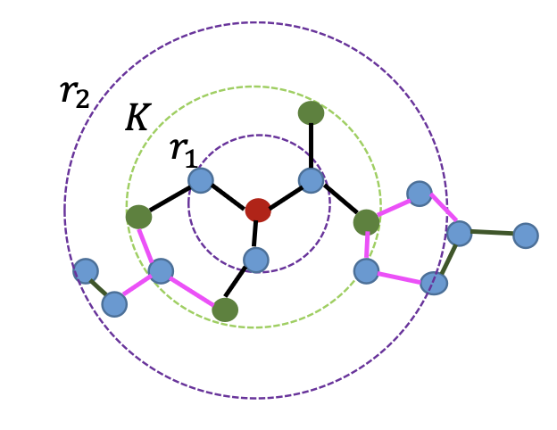

[メインページ](../../index.markdown)

[章目次](./chap14.md)
## 14.3. 教師ラベルのないデータを活用した自己教師あり学習

深層学習モデルを適切に訓練するには，通常，大量の（教師）ラベル付きデータが必要であるが，特定のタスクにおいては，大量のラベル付きデータを収集したり注釈付けすることは大変な作業で，コストもかかる． しかし，教師ラベルのないデータは通常，豊富で容易に入手できる． 例えば，感情分析モデルを構築する場合，アノテーションされたデータは限られているが，ラベルなしのテキストデータは潤沢に利用可能である． そのため，ラベルなしデータ自体を活用することは大変魅力的である． 実際，ラベルなしデータはコンピュータビジョンや自然言語処理など，多くの分野でのタスクを遂行させるために使用されている． 例えば，画像認識の分野では，ImageNet
[^1]
での事前学習を受けた深層の畳み込みニューラルネットワーク，例えばInception (Szegedy *et al*., 2016)やVGG (Simonyan and Zisserman, 2014)が広く使われている． ImageNetの画像はもともとラベルが付いているが，特定の画像認識タスクでは，これらの画像を「ラベルなし」のデータとして扱うことがある． 他方，自然言語処理においても，GPT-2 (Radford *et al*., 2019)やBERT (Devlin *et al*., 2018)のような事前学習に基づいた言語モデルが，質問応答や自然言語生成といった様々なタスクでSOTA（State-of-the-Art）
[^2]
以上のことから，グラフ深層学習の可能性を広げるために，ラベルなしデータを活用することは有効であり，大きな可能性を秘めていることがわかる． そこで本章では，GNNがノード分類やグラフ分類，グラフ回帰タスクに対してラベルなしデータをどのように利用できるかを議論していく． ノード分類では，ラベルなしデータはシンプルな情報集約プロセスによってGNNに取り込まれてきた． このプロセスはシンプルなものなので，ラベルなしデータを完全に利用するには不十分である可能性がある． そこで，ラベルなしデータをより徹底的に活用する戦略について議論する． また，グラフ分類やグラフ回帰タスクでは，「ラベル付きグラフ」は限られているが，大量の「ラベルなしグラフ」が利用可能である． 例えば，（原子から成る）分子に対する分類/回帰タスクを実行する場合，分子のラベル付けにはコストがかかるが，ラベル付けがされていない分子は容易に収集できる． そこで，グラフに焦点を当てたタスクのために，ラベルなしグラフを活用するアプローチを紹介する．

### ノードに焦点を当てたタスク

ディープラーニングの成功は，大量のラベル付きデータによって支えられている． この制約を緩和するために，自己教師あり学習（SSL; Self-Supervised Learning）が開発された． 通常，対象のドメイン固有の前処理タスクを設計し，その前処理タスクを用いてラベルなしのデータを含めてより良い表現を学習する． 前述の通り，GNNはラベルなしデータの特徴量を単純に集約するだけで，豊富な情報を十分に活用することができない． そのため，ラベルなしデータを最大限に活用するためにSSLは，GNNへの追加的な学習指示を提供する手段として利用されてきた． ノードに焦点を当てた自己教師ありタスクは，通常，グラフの構造やノードの属性から追加の教師信号を生成する． このように生成されたラベルは，GNNのノード分類タスクの性能を向上させるための補助タスクの指導として役立てられる． これらのラベルの主な利用方法は2つある(Jin *et al*., 2020c)．

1.  **二段階学習(two-stage training)**：自己教師ありタスクを利用してGNNモデルを事前学習し，その後，このGNNモデルをノード分類タスク用にファインチューニングする学習法．

2.  **共同学習(joint training)**：自己教師ありタスクと目的とするタスクを同時に最適化する．具体的に目的関数は，以下のように定式化できる．  

$$
 \symscr{L} = \symscr{L}_{\text{label}} + \eta\cdot\symscr{L}_{\text{self}} $$

  ここで， $\symscr{L}\_{\text{label}}$ は目的のタスク，すなわちノード分類タスクの損失関数を表し， $\symscr{L}\_{\text{self}}$ は自己教師タスクの損失関数を表す．

次に，いくつかの自己教師タスクを簡単に紹介する． 詳細には，これらの自己教師タスクを，作成対象となる自己教師ラベルに基づいて，以下のように分類する：

1.  グラフ構造情報に関する自己教師ラベルの作成．

2.  ノード属性情報に関する自己教師ラベルの作成．

3.  グラフ構造情報とノード属性情報に関する自己教師ラベルの作成．

#### グラフ構造情報を対象とした自己教師あり学習

ここでは，グラフ構造情報に基づいた自己教師タスクを紹介する．

・ノード指標(Jin *et al*., 2020c)

:   このタスクでは，学習されたノード表現を使ってノード指標を予測することを目指す． 指標というのは例えば，ノードの次数，中心性，ローカルクラスタリング係数などが含まれる．

・中心性のランキング(Hu *et al*., 2019)

:   このタスクでは，ノードの中心性ランキングの保存を目指す． これはノード指標としての中心性を直接予測するのではなく，任意のノード組を与えた場合ときこれらのノード間のランキングを予測することを目的としている．

・Edge Mask (Jin *et al*., 2020c; Hu *et al*., 2020, 2019)

:   このタスクでは，まずグラフからランダムにいくつかのエッジをマスク（または削除）する．その上で，そのマスクされたエッジが実際に存在するかどうかを，GNNによって学習されたノード表現を用いて予測することを目指す．

・ペアワイズ距離(Peng *et al*., 2020; Jin *et al*., 2020c)

:   このタスクでは，ノード表現を用いて，グラフ内にあるノード組間の距離を予測することを目指す． 具体的には，2つのノード間距離は，それらの間の「最短パスの長さ」によって測定される．

・Distance2Clusters (Jin *et al*., 2020c)

:   このタスクでは，ノード同士の距離を予測する代わりに，グラフ内の「ノードとクラスタ間の距離」を予測することを目的とする． これにより，ノードの大域的な位置関係を理解することができる． 具体的にはまず，METISグラフ分割アルゴリズム(Karypis and Kumar, 1998)などのグラフ構造情報に基づくクラスタリング方法を使用し，合計 $K$ 個のクラスタを生成する． 次に，各クラスタ内の最大次数のノードを「クラスタの中心」として選ぶ． Distance2Clusterのタスクは，ノードとこれら $K$ 個のクラスタの中心（ノード）との間の距離を予測することである． なお，距離はノード間の「最短パスの長さ」によって測定される．

#### ノード属性情報を対象とした自己教師あり学習

・属性マスク (Jin *et al*., 2020c; You *et al*., Hu *et al*., 2020)

:   このタスクでは，グラフ内の一部のノードの関連する属性情報をランダムにマスク（または削除）する．その上で，GNNによって学習されたノード表現を利用して，これらの（マスクされた）ノードの属性を予測することを目指す．

・PairwiseAttrSim (Jin *et al*., 2020c)

:   このタスクは，「ノード組間の情報を予測する」という意味でペアワイズ距離と似ており，ここでは，「ノードの属性同士の類似性を予測する」ことを目指している． なお，類似性は，コサイン類似度やユークリッド距離などによって測定される．

#### グラフ構造情報およびノード属性情報を対象とした自己教師あり学習

本節では，グラフ構造情報とノード属性情報の両方に基づいた自己教師タスクを紹介する．

・疑似ラベル(Sun *et al*., 2019c; You *et al*., 2020)

:   このタスクでは，GNNモデルやその他のモデルを用いて，ラベルが付いていないノードに対して擬似ラベル（仮のラベル）を生成する． そして，それらの疑似ラベルを付与したノードは，ラベル付きのノードとともにモデルを再学習するための教師信号として利用される． You *et al*.(2020)では，GNNモデルで学習されたノードの表現を使用してクラスターが生成され，それらのクラスタが擬似ラベルとして利用している． 一方，Sun *et al*.(2019c)では，生成されたこれらのクラスタを実際のラベルと整合させた上で，擬似ラベルとして採用している．

・Distance2Labeled (Jin *et al*., 2020c)

:   このタスクはDistance2Clusterと似たタスクだが，「ノードと事前に計算されたクラスタとの間の距離を予測する」のではなく，「ラベルのないノードとラベル付きのノードとの間の距離を予測する」という点で異なる．

・ContextLabel (Jin *et al*., 2020c)

:   このタスクは，グラフ内のノードの"コンテキスト"が従うラベル分布の予測を目指すものである．与えられたノードのコンテキストとはそのノードの $k$ 次近傍に位置する全ノードと定義される．ただし，ラベルのないノードのラベル情報は不明であるため，正確な分布を測定することはできない．そのため，Jin *et al*.(2020c)では，Label propagation (LP) (Zhu *et al*., 2003)やIterative Classification (ICA) (Neville and Jensen, n.d.)といった方法を採用し，疑似ラベルを予測している．

・CorrectedLabel (Jin *et al*., 2020c)

:   このタスクは，疑似ラベルをより正確または信頼性の高いものにすることでContextLabelタスクを強化するものである． このタスクは「学習段階」と「ラベル補正段階」の二段階に分かれている． 疑似ラベルが与えれると，学習段階はContextLabelタスクと同じ動作をする． その後，学習段階で予測された疑似ラベルはラベル補正段階に移行し，Han *et al*.(2019)で提案されたノイズのあるラベルを補正するアルゴリズムを用いて改善される． 以上のように補正された疑似ラベルは，学習段階におけるコンテキストが従うラベル分布を抽出するために採用される．

### グラフに焦点を当てたタスク

グラフに焦点を当てたタスクでは，「ラベル付きグラフ集合」を $\symscr{D}\_l = \left\\{(\symscr{G}\_i, y_i)\right\\}$ として表現する． ここで $y_i$ はグラフ $\symscr{G}\_i$ に紐づくラベルである． 一方で，「ラベルなしグラフ集合」は $\symscr{D}\_u = \left\\{\symscr{G}\_j\right\\}$ として表す． 通常，ラベルなしグラフの個数は，ラベル付きグラフの個数よりもはるかに多い．すなわち， $\|\symscr{D}\_u\| \symbfscr{G}g \|\symscr{D}\_l\|$ である． ラベルなしデータを探索の目的は， $\symscr{D}\_u$ から知識を取り出し， $\symscr{D}\_l$ 上のモデルの学習をサポートすることである． そして，このラベルなしデータを活用するために，これらのデータから自己教師信号を抽出する． ノードに焦点を当てた場合のときと同様に， $\symscr{D}\_u$ の知識を活用する方法は「二段階学習」と「共同学習」の2通りある． 二段階学習では，まずラベルなしデータ $\symscr{D}\_u$ を使った自己教師あり学習で事前学習し，その後，ラベル付きデータ $\symscr{D}\_l$ によってGNNを微調整される． 共同学習では，自己教師あり学習を正規化項として含み，教師あり学習の損失関数とともに最適化される． 本節では，グラフ全体を使った自己教師あり学習を紹介する．

<figure>

<figcaption>図14.1 コンテキスト予測</figcaption>

</figure>

・コンテキスト予測(Hu *et al*., 2019)

:   コンテキスト予測による事前学習タスクは，与えられた** $\symbf{K}$ 次近傍**と**コンテキストグラフ(context graph)**の組が「同じノードに由来するかどうか」を予測することを目指している．

    ここで，これら二つの用語の定義について述べる． まずグラフ $\symscr{G}$ 内の各ノード $v$ の** $\symbf{K}$ 次近傍**は， $\symscr{G}$ 内のノード $v$ から最大距離 $K$ 離れた全てのノードとエッジで構成され， $\symscr{N}\_{\symscr{G}}^{K}(v)$ と表す． 一方，ノード $v\in\symscr{G}$ の**コンテキストグラフ**は，ハイパーパラメータ $r_1$ と $r_2$ によって定義され，グラフ $\symscr{G}$ 内のノード $v$ から距離 $r_1$ と距離 $r_2$ の間にあるノードとエッジを含む部分グラフとする． つまり，グラフ $\symscr{G}$ におけるノード $v$ のコンテキストグラフは，図14.1に示すように，幅 $r_2-r_1$ の円環であり，これを $\symscr{C}\_{v,\symscr{G}}$ と表す．

    コンテキスト予測タスクは，二値分類としてモデル化され，特定の近傍 $\symscr{N}\_{\symscr{G}}^{K}(v)$ と特定のコンテキストグラフ $\symscr{C}\_{v,\symscr{G}}$ が同じノードに由来するかどうかを決定する． 同様のタスクがSun *et al*.(2019b)で提案されており，そこではノードとグラフが与えられたとき，そのノードが与えられたグラフに属するかどうかを予測することを目的としている．

・属性マスキング(Hu *et al*., 2019)

:   Attribute Maskingでは，特定のグラフ $\symscr{D}\_u$ のノードやエッジの属性（例：分子グラフにおける各原子の種類など）をランダムにマスクする方法である． 次に，これらのマスクされたノードやエッジの属性を予測するためにGNNモデルを学習する． なお，この属性マスキングの戦略は，ノードやエッジの属性を持つグラフにのみ適用可能であることに注意しよう．

・グラフの属性ラベルの予測(Hu *et al*., 2019)

:   グラフが $\symscr{D}\_u$ を含む場合， $\symscr{D}\_l$ 上で実行したい特定のタスクに関連するグラフの属性ラベルが存在しない可能性がある．しかし一方で，そういったグラフは他の種類の属性ラベルなら利用可能であるかもしれない． こうしたグラフの利用可能な属性ラベルは，GNNモデルを使った事前学習のための教師信号として活用できる．

[メインページ](../../index.markdown)

[章目次](./chap14.md)

[前の節へ](./subsection_02.md) [次の節へ](./subsection_04.md)

[^1]: 訳注：ImageNetは数百万枚の画像を含む大規模なデータベースで，各画像にはカテゴリーラベルが付けられている．このデータセットは、機械学習や画像認識技術の研究に広く使われている．
[^2]: 訳注：SOTA（State-of-the-Art）は，特定の分野やタスクにおいて，現時点での最高の性能や技術を指す用語である．研究や技術分野で，新しい方法やモデルが既存のものよりも優れているときに，それをSOTAと称している．を達成している．
