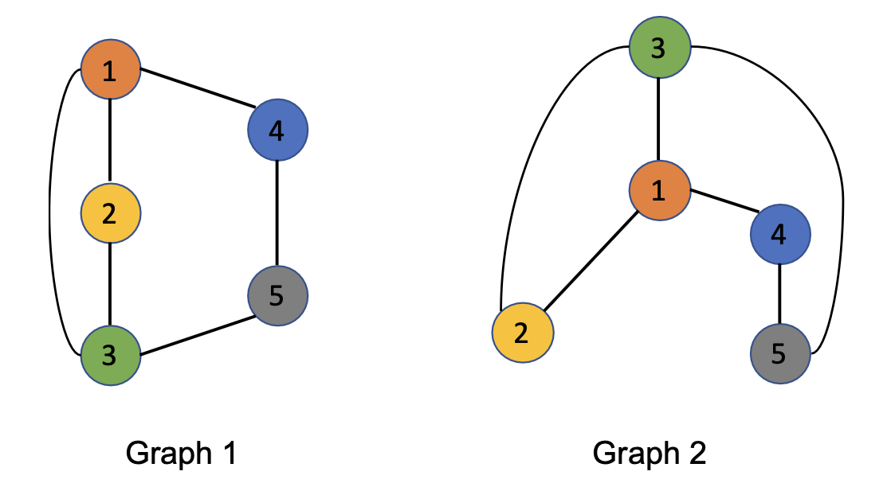
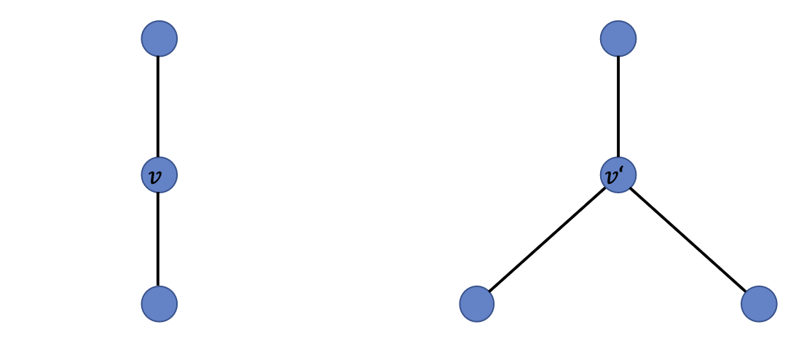

[メインページ](../../index.markdown)

[章目次](./chap14.md)
## 14.4. グラフニューラルネットワークの表現力

GNNモデルの表現力を分析するための取り組みが増えている． これらの分析では，「グラフ全体の構造をどれだけうまく識別できるか」というタスクを担ったGNNの性能を評価している． 議論を容易にするため，グラフに焦点を当てたタスクに関するGNNモデルを簡単にまとめておく． まず，GNNモデルの $l$ 番目の層における，一般的な集約に基づく空間グラフフィルタを次のように書く：  

$$

\begin{aligned}
    \symbf{a}^{(l)}_i &= \operatorname{AGG}\left(\left\{\symbf{F}^{(l-1)}_j \| v_j \in \symscr{N}(v_i)\right\}\right)\\
    \symbf{F}^{(l)}_i &= \operatorname{COM}\left(\symbf{F}^{(l-1)}_i, \symbf{a}^{(l)}_i\right)
\end{aligned}
$$

  ここで， $\symbf{a}^{(l)}\_i$ はノード $v_i$ の隣接ノードからの情報を $\operatorname{AGG}(\cdot)$ 関数を用いて集約したものを示している． また， $\symbf{F}^{(l)}\_i$ は $l$ 番目のグラフフィルタリング層を通過したノード $v_i$ の隠れ表現である．  $\operatorname{COM}(\cdot)$ 関数は， $(l-1)$ 層目のノード $v_i$ の隠れ表現と集約された情報を組み合わせて， $l$ 層目の隠れ表現を生成する． グラフに焦点を当てたタスクでは，表現集合 $\left\\{\symbf{F}^{(L)}\_i\|v_i\in\symscr{V}\right\\}$ に対して一般にプーリング操作が行われ，グラフの表現を生成する． ここで， $L$ はグラフフィルタリング層の総数である．

本章では便宜上，最大プーリングや平均プーリングなどの集約プーリング操作のみを考慮すると，プーリングプロセスは以下のように記述できる：  

$$
 \symbf{F}_{\symscr{G}} = \operatorname{POOL}\left(\left\{\symbf{F}^{(L)}_i\|v_i\in\symscr{V}\right\}\right) $$

  ここで， $\symbf{F}\_{\symscr{G}}$ はグラフ全体の表現を示している．  $\operatorname{AGG}(\cdot)$ や $\operatorname{COM}(\cdot)$ ， $\operatorname{POOL}(\cdot)$ といった関数には，異なる選択肢と設計があり，これがGNNモデルの表現力の違いをもたらす．

Xu *et al*.(2019d)によれば，どのような関数を採用しても，「GNNモデル」の性能は，「グラフの構造を識別する際の**Weisfeiler-Lehmanグラフ同型判定法（WLテスト）**」とたかだか同等であることが示されている(Weisfeiler and Leman, n.d.)． WLテストは，幅広い種類のグラフ構造を識別できる強力なテストである． さらに，グラフの構造を識別できる性能について，GNNとWLテストとが同等になる条件も確立されている． 次節では，WLテストとGNNモデルの関係を簡単に紹介し，GNNモデルの表現力に関する主な結果を示す．

### Weisfeiler-Lehmanテスト

2つのグラフは，それらのグラフのノード集合の間に，隣接関係が同じになるような写像が存在する場合，トポロジー的に同一（同型）であるとみなされる． 例えば，2つの同型グラフを図14.2に示す．

<figure>

<figcaption>図14.2 同型となる2つのグラフ</figcaption>

</figure>

グラフ上の色と数字は，2つのノード集合間の写像関係を示す． グラフ同型判定タスクの目的は，与えられた2つのグラフ $\symscr{G}\_1$ と $\symscr{G}\_2$ がトポロジー的に同一であるかどうかを判断することである． グラフの同型性を判定することは計算量がとてもかかり，未だ多項式時間のアルゴリズムは見つかっていない(Garey and Johnson, n.d.; Babai, 2016)． Weisfeiler-Lehmanテストは，グラフ同型判定タスクのための効率的かつ効果的なアプローチである． このアルゴリズムは一部の特殊ケースにおける識別に失敗することもあるが(Cai *et al*., 1992)，広範な種類のグラフを識別することができる．

便宜上2つのグラフの各ノードにはラベル（属性）が関連付けられていると仮定する． 例えば，図14.2では，番号をラベルとして扱うことができる． 実際には，同じラベルがグラフ内の異なるノードに関連付けられることがある． WLテストは以下のステップを繰り返し行う：

-   各ノード $v_i$ について，その（自身を含む）近傍ノードのラベルを重複した要素を持ち得る多重集合(multiset) $\symscr{N}\symscr{L}(v_i)$ としてまとめる ．

-   各ノード $v_i$ について，その多重集合 $\symscr{N}\symscr{L}(v_i)$ を一意の新しいラベル（値）にハッシュ化する ことで，その新しいラベル（ハッシュ値）をノード $v_i$ に関連付ける． なお，ハッシュ化の性質から，同じラベルの多重集合を持つノードは，同じ新ラベルにハッシュ化されることになる．

上記のステップを繰り返しは，2つのグラフのラベル集合が互いに異なるまで適用される． もしラベル集合が異なることがあれば，2つのグラフは非同型であるとみなし，アルゴリズムは終了する．  $N$ 回（またはグラフ内のノードの数）の繰り返し後，2つのグラフのラベル集合がまだ同じであれば，2つのグラフは同型とみなされるか，WLテストがそれらを区別できないとみなされる（WLテストが失敗する特殊なケースについては，Cai *et al*.(1992)を参照）． GNNモデルは，一般化されたWLテストとみなすことができる． 具体的には，GNN内の $\operatorname{AGG}(\cdot)$ 関数はWLテストの集約ステップに， $\operatorname{COM}(\cdot)$ 関数はWLテストのハッシュ関数に対応している．

### 表現力

GNNモデルの表現力は，グラフ同型判別タスクと関連している． 理想的には，十分な表現力を持つGNNモデルは，異なる構造を持つグラフを異なる埋め込みにマッピングすることでそれらを区別することができる． 

 
<strong>補題 14.2 Xu *et al*., 2019d</strong>
 2つの非同型のグラフ $\symscr{G}_1$ と $\symscr{G}_2$ が与えられたとき，GNNモデルがこれら2つのグラフを異なる埋め込みにマッピングできるなら，WLテストもこれら2つのグラフが非同型であると判断できる． 

<figure>

<figcaption>図14.3 mean関数およびmax関数が区別できないグラフ構造</figcaption>

</figure>

WLテストの能力は，その単射性(injective)のある集約操作，すなわち異なる近傍ノードを異なるラベルにマッピングするハッシュ関数に大きく起因している． しかし，GNNモデルの多くの人気のある集約関数は単射ではない． そこで次に，いくつかの $\operatorname{AGG}(\cdot)$ 関数について簡単に議論し，これらの $\operatorname{AGG}(\cdot)$ 関数が区別できないグラフの構造の例を提供する．

Hamilton *et al*.(2017a)で紹介されたmean関数とmax関数は，いずれも単射ではない． 図14.3で示されているように，全てのノードが同じラベル（または同じ特徴量）を持つと仮定すると，ノード $v$ と $v^{\prime}$ の局所構造は，異なる数の近傍ノードを持つため異なる． しかしながら，mean関数やmax関数が $\operatorname{AGG}(\cdot)$ 関数として採用されると，ノード $v$ と $v^{\prime}$ の集約結果として同じ表現を得てしまう． したがって，図14.3に示されているこれらの2つの部分構造は，mean関数またはmax関数を $\operatorname{AGG}(\cdot)$ 関数として採用する場合，区別することができない． GNNモデルの表現力を向上させるためには， $\operatorname{AGG}(\cdot)$ ， $\operatorname{COM}(\cdot)$ ， $\operatorname{POOL}(\cdot)$ を含む関数を慎重に設計することが重要となってくる． 具体的には，GNNモデルは以下の定理にあるように，これらの関数がすべて単射であれば，WLテストと同等の力を発揮することが言える： 

 
<strong>定理 14.3 Xu *et al*., 2019d</strong>
 GNNモデルが十分なグラフフィルタリング層を持っていて，そのモデル内のすべての $\operatorname{AGG}(\cdot)$ や $\operatorname{COM}(\cdot)$ ， $\operatorname{POOL}(\cdot)$ 関数が単射である場合，WLテストで非同型と判定された2つのグラフを異なる埋め込みにマッピングすることができる． 

定理14.3は，高い表現力を持つGNNモデルの設計の指針を提供している． GNNモデルがグラフの構造を区別する能力においてWLテストと同じくらいの最大性能を持つ一方，WLテストそのものよりも利点を享受できる． GNNモデルは，グラフ間の類似性を捉える低次元の埋め込みにグラフをマッピングすることができる一方で，WLテストは，グラフが同型かどうかを判断する以外に，グラフ間の類似性を比較する能力は持ち合わせていない． したがって，GNNはグラフ分類のような，グラフの大きさが異なり，類似構造を持つ非同型グラフが同じクラスに属する可能性を予測するタスクに適している．

[メインページ](../../index.markdown)

[章目次](./chap14.md)

[前の節へ](./subsection_03.md) [次の節へ](./subsection_05.md)

