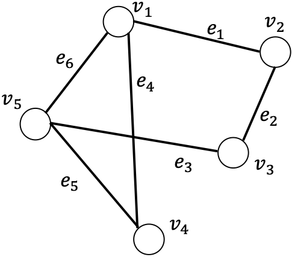

[メインページ](../../index.markdown)

[章目次](./chap2.md)
## 2.2. グラフの表現

本節では，グラフの定義を紹介していく．ここでは"単純グラフ"(simple graph)に焦点を当てるが，エッジの重みは考えないこととする．より複雑な"複雑グラフ"(complex graph)については本章の後半で見ていく． 

 
<strong>定義 2.1 グラフ</strong>
 グラフは $\mathcal{G} = \left\{\mathcal{V},\,\mathcal{E}\right\}$ と表記される．ここで， $\mathcal{V}=\left\{v_1,\dots,v_N\right\}$ は $N=\|\mathcal{V}\|$ 個のノードで構成される集合で， $\mathcal{E}=\left\{e_1,\dots,e_M\right\}$ は $M$ 個のエッジで構成される集合である． 

 ノードはグラフには欠かせない要素である．実際，ソーシャルグラフではユーザをノードとみなし，化合物グラフでは原子をノードとして扱っている．グラフ $\mathcal{G}$ の大きさは，そのグラフが持つノードの個数，つまり $N=\|\mathcal{V}\|$ と定義される．エッジ集合 $\mathcal{E}$ は，ノード間の接続を記述している．あるエッジ $e_i\in\mathcal{E}$ は， $2$ つのノード $v^{1}\_e,\,v^{2}\_e$ をつなぐので，  $(v^{1}\_e,\,v^{2}\_e)$ と表現することも可能である．ただし有向グラフでは，この表現は「エッジはノード $v^{1}\_e$ からノード $v^{2}\_e$ を向いている」ことを意味することになる．無向グラフでは， $e=(v^{1}\_e,v^{2}\_e)=(v^{2}\_e,v^{1}\_e)$ となるから $2$ つのノードの順序に違いはなくなる．本章では，特に言及しない限りは無向グラフに限定して話を進めるので，ノード $v^{1}\_e$ と $v^{2}\_e$ は単に「エッジ $e$ で接続される」と考えて良い．あるノード $v_i$ と他のノード $v_j$ の間にエッジが存在している場合，「 $v_i$ と $v_j$ は隣接している」という． ソーシャルグラフにおける"友人関係"はノードをつなぐエッジとしてみることができ，化合物グラフでは"化学結合"をエッジとみなすことが可能である（ここでは，化学結合の種類の違いは無視して，あらゆる化学結合を一つのエッジとしている）．

グラフ $\mathcal{G}=\left\\{\mathcal{V}, \mathcal{E}\right\\}$ は，ノード間の接続状況を表す隣接行列を使うことによっても同等に表現できる． 

 
<strong>定義 2.2 隣接行列</strong>
 あるグラフ $\mathcal{G} = \left\{\mathcal{V},\mathcal{E}\right\}$ に対応する隣接行列を $\symbf{A}\in \left\{0,1\right\}^{N\times N}$ と表す． $\symbf{A}$ の $i$ 行 $j$ 列要素である $\symbf{A}_{i,j}$ は， $2$ つのノード $v_i$ と $v_j$ の接続状況を表している．具体的には， $v_i$ が $v_j$ に隣接している場合には $\symbf{A}_{i,j}=1$ ，隣接していない場合には $\symbf{A}_{i,j}=0$ とする． 

 無向グラフにおいては，ノード $v_i$ が $v_j$ と隣接していることと，ノード $v_j$ が $v_j$ と隣接していることは区別しないから，グラフ内の任意の $v_i$ と $v_j$ に対して， $\symbf{A}\_{i,j} = \symbf{A}\_{j,i}$ が成り立つ．したがって，無向グラフに対応する隣接行列は対称行列である．

<figure>

<figcaption>図2.1 ノード数5，エッジ数6のグラフ</figcaption>

</figure>

 
<strong>例 2.3</strong>
 ノード数 $5$ ，エッジ数 $6$ のグラフの例をに示した．このグラフのノード集合は $\mathcal{V}=\left\{v_1,v_2,v_3,v_4,v_5\right\}$ ，エッジ集合は $\mathcal{E} = \left\{e_1,e_2,e_3,e_4,e_5,e_6\right\}$ である．

このグラフの隣接行列は次のように表せる．

 $$
 \symbf{A} = 
\begin{pmatrix}
    0 & 1 & 0 & 1 & 1\\
    1 & 0 & 1 & 0 & 0\\
    0 & 1 & 0 & 0 & 1\\
    1 & 0 & 0 & 0 & 1\\
    1 & 0 & 1 & 1 & 0
\end{pmatrix}\nonumber $$
 

[メインページ](../../index.markdown)

[章目次](./chap2.md)

[前の節へ](./subsection_01.md) [次の節へ](./subsection_03.md)

