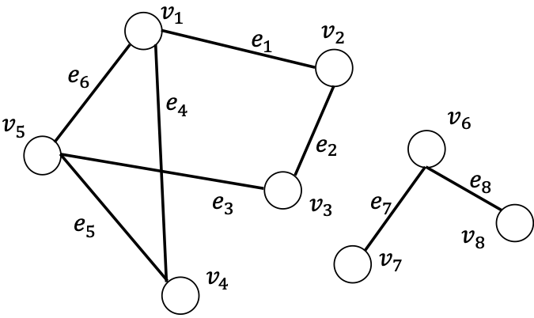

[メインページ](../../index.markdown)

[章目次](./chap2.md)
## 2.3. グラフの性質と様々な指標

グラフは様々な構造や性質を持つ．本節ではグラフが有する基本的な性質と指標について説明する．

### 次数

グラフ $\mathcal{G}$ におけるノード $v$ の"次数"とは，そのノードが隣接する他ノードの個数である．形式的な定義は以下となる． 

 
<strong>定義 2.4 次数</strong>
  $\mathcal{G} = \left\{\mathcal{V},\mathcal{E}\right\}$ において， $v_i\in \mathcal{V}$ の次数とは， $v_i$ と隣接しているノードの数

 $$
 \nonumber
    d(v_i) = \sum_{v_j\in \mathcal{V}} \symbb{1}_{\mathcal{E}}(\left\{v_i,v_j\right\}), $$
 

である．ここで， $\symbb{1}_{\mathcal{E}}(\cdot)$ は次のような指示関数である．

 $$
 \nonumber
    \symbb{1}_{\mathcal{E}}(\left\{v_i,v_j\right\}) = 
    \begin{cases}
        1 & (v_i,v_j)\in \mathcal{E},\\
        0 & (v_i,v_j)\notin \mathcal{E}.
    \end{cases} $$
  

  $\mathcal{G}$ におけるノード $v_i$ の次数は，隣接行列を使うことによっても算出できる．例えば，あるノード $v_i$ の次数は以下のように計算できる．

 $$
 
\tag{2.1}
    d(v_i) = \sum^{N}_{j=1}\symbf{A}_{i,j} $$
 

 
<strong>例 2.5</strong>
 図2.1に示したグラフにおいて，ノード $v_5$ は他の $3$ つのノード $(v_1,v_3,v_4)$ と隣接しているので，ノード $v_5$ の次数は $3$ である．また，隣接行列の $5$ 行目に $0$ でない要素が $3$ つあることからも， $v_5$ の次数は $3$ であることがわかる． 

 

 
<strong>定義 2.6 近傍</strong>
  $\mathcal{G} = \left\{\mathcal{V},\mathcal{E}\right\}$ のノード $v_i$ について，その近傍 $\symscr{N}(v_i)$ とは， $v_i$ と隣接している全ノードで構成される集合である． 

 なお， $\symscr{N}(v_i)$ に含まれるノードの数はノード $v_i$ の次数に等しいこと，すなわち， $d(v_i)=\|\symscr{N}(v_i)\|$ となることに注意しよう． 

 
<strong>定理 2.7</strong>
  $\mathcal{G} = \left\{\mathcal{V},\mathcal{E}\right\}$ に対して，"総次数"（全ノードの次数の和）は，グラフに含まれる全エッジ数の $2$ 倍になる：

 $$
 \nonumber
    \sum_{v_i\in\symscr{V}}d(v_i) = 2\cdot\|\symscr{E}\|. $$
 

<strong>証明: </strong>

 

$$

\begin{aligned}
    \sum_{v_i\in\mathcal{V}}d(v_i) &= \sum_{v_i\in \mathcal{V}}\sum_{v_j\in\mathcal{V}}\symbb{1}_{\mathcal{E}}(\left\{v_i,v_j\right\})\nonumber\\
    &=\sum_{\left\{v_i,v_j\right\}\in\mathcal{E}}2\cdot\symbb{1}_{\mathcal{E}}(\left\{v_i,v_j\right\})\nonumber\\
    &=2\cdot\sum_{\left\{v_i,v_j\right\}\in\mathcal{E}}\symbb{1}_{\mathcal{E}}(\left\{v_i,v_j\right\})\nonumber\\
    &=2\cdot\|\mathcal{E}\|\nonumber
    Q.E.D.
\end{aligned}
$$

 

 

 
<strong>系 2.8</strong>
 隣接行列の非ゼロ要素の数は，全エッジ数の $2$ 倍である． 

<strong>証明: </strong>
 定理2.7に式(2.1)を代入することで成り立つことがわかる．Q.E.D. 

 

 
<strong>例 2.9</strong>
 図2.1のグラフの場合，エッジの数は $6$ で，全次数は $12$ ，隣接行列非ゼロ要素の数も $12$ であることがわかる． 

### 連結性

"連結性"はグラフが持つ重要な性質である．具体的な説明に入る前に，まずは"ウォーク"や"パス"などの基本的な概念を導入していく． 

 
<strong>定義 2.10 ウォーク, </strong>
 グラフ上のウォークとは，ノードとエッジが交互で現れる列(sequence)であり，ノードで始まり，ノードで終わるような列である．また，列にある各エッジはその前後にあるノード間に存在するエッジである． 

 ノード $u$ で始まりノード $v$ で終わるウォークは" $u$ - $v$ ウォーク"という．ウォークの長さはそのウォークに含まれるエッジの数である．なお，長さが異なる様々な $u$ - $v$ ウォークが存在するので， $u$ - $v$ ウォークは一意ではないことに注意しよう． 

 
<strong>定義 2.11 トレイル, </strong>
 トレイルとは，同じエッジを通らないウォークである． 

 

 
<strong>定義 2.12 パス，</strong>
 パスとは，同じノードを通らないウォークである． 

 

 
<strong>例 2.13</strong>
 図2.1のグラフにおいて， $(v_1,e_4,v_4,e_5,v_5,e_6,v_1,e_1,v_2)$ は長さ $4$ の $v_1$ - $v_2$ ウォークである．このウォークは，ノード $v_1$ を二回通っているので，トレイルではあるがパスではない．一方， $(v_1,e_1,v_2,e_2,v_3)$ は $v_1$ - $v_3$ ウォークである．このウォークはトレイルであると同時にパスでもある． 

 

 
<strong>定理 2.14</strong>
 隣接行列 $\symbf{A}$ を持つグラフ $\mathcal{G} = \left\{\mathcal{V},\mathcal{E}\right\}$ に対して，隣接行列の $n$ 乗を $\symbf{A}^{n}$ と表す．このとき，行列 $\symbf{A}^{n}$ の $i,j$ 成分は，長さ $n$ の $v_i$ - $v_j$ ウォークの数に等しい． 

<strong>証明: </strong>
 帰納法によってこの定理を証明できる． まず $n=1$ に対して定義が成り立つことを示す．  $\symbf{A}_{i,j}=1$ の場合，隣接行列の定義より，ノード $v_i$ と $v_j$ の間にエッジが存在することがわかる．これは長さ $1$ の $v_i$ - $v_j$ ウォークとみなせる． $\symbf{A}_{i,j}=0$ の場合，ノード $v_i$ と $v_j$ の間にエッジはないので，長さ $1$ の $v_i$ - $v_j$ ウォークは存在しない．以上から $n=1$ に対して定理が成り立つことがわかった．次に， $n=k$ のときに定理が成り立つと仮定する．つまり， $\symbf{A}^{k}$ の $i,h$ 成分は，長さ $k$ の $v_i$ - $v_h$ ウォークの数に等しいとする．ここから， $n=k+1$ の場合の証明に進む． $\symbf{A}^{k+1}$ の $i,j$ 成分は， $\symbf{A}^{k}$ と $\symbf{A}$ を用いて以下のように表すことができる．

 $$
 
\tag{2.2}
    \symbf{A}^{k+1}_{i,j} = \sum^{N}_{h=1}\symbf{A}^{k}_{i,h}\cdot\symbf{A}_{h,j}. $$
 

式(2.2)の各 $h$ について $\symbf{A}^{k}_{i,h}$ と $\symbf{A}_{h,j}$ の両方がゼロでなければ $\symbf{A}^{k}_{i,h}\cdot\symbf{A}_{h,j}$ はゼロでない値を持つことになる．すると $\symbf{A}^{k}_{i,h}$ は長さ $k$ の $v_i$ - $v_h$ ウォークの数を表し， $\symbf{A}_{h,j}$ は長さ $1$ の $v_h$ - $v_j$ ウォークの数を示すことはすでにわかっているから， $\symbf{A}^{k}_{i,h}\cdot\symbf{A}_{h,j}$ は，ウォークの最後から $2$ 番目のノードを $v_h$ とした，長さ $k+1$ の $v_i$ - $v_j$ ウォークの数と等しいことになる．したがって，すべての可能なノード $v_h$ について合計すると， $\symbf{A}^{k+1}$ の $i,j$ 成分は，長さ $k+1$ の $v_i$ - $v_j$ ウォークの数と等しいことが証明できた．Q.E.D. 

 

 
<strong>定義 2.15 部分グラフ</strong>
 与えられたグラフ $\mathcal{G} = \left\{\mathcal{V},\mathcal{E}\right\}$ の部分グラフ $\mathcal{G}' = \left\{\mathcal{V}',\mathcal{E}'\right\}$ は，ノードの部分集合 $\mathcal{V}'\subset\mathcal{V}$ およびエッジの部分集合 $\mathcal{E}'\subset\mathcal{E}$ で構成されるグラフである．このとき，部分集合 $\mathcal{E}'$ 中のエッジに関係する全ノードが，部分集合 $\mathcal{V}'$ に含まれていなければならない． 

 

 
<strong>例 2.16</strong>
 図2.1のグラフ $\mathcal{G}$ に対して，ノードの部分集合を $\mathcal{V}'=\left\{v_1,v_2,v_3,v_5\right\}$ ，エッジの部分集合を $\mathcal{E}' = \left\{e_1,e_2,e_3,e_6\right\}$ とおくことで，部分グラフ $\mathcal{G}'$ が構成できる． 

 

 
<strong>定義 2.17 連結成分</strong>
 グラフ $\mathcal{G} = \left\{\mathcal{V},\mathcal{E}\right\}$ とその部分グラフ $\mathcal{G}' = \left\{\mathcal{V}',\mathcal{E}'\right\}$ を考える．部分グラフの任意のノード間に少なくとも $1$ つのパスが存在し， $\mathcal{V}'$ のノードが $\mathcal{V}/\mathcal{V}'$  に含まれるどのノードとも隣接しないとき，部分グラフ $\mathcal{G}'$ はグラフ $\mathcal{G}$ の連結成分であるという． 

 

 
<strong>例 2.18</strong>
  $2$ つの連結成分を持ったグラフを図2.2に示した．これらの連結成分は互いに繋がっていないことがわかる． 

<figure>

<figcaption>図2.2  $2$ つの連結成分を持つグラフ</figcaption>

</figure>

 
<strong>定義 2.19 連結グラフ</strong>
 連結成分が $1$ つだけのグラフ $\mathcal{G} = \left\{\mathcal{V},\mathcal{E}\right\}$ を，連結グラフという ． 

 

 
<strong>例 2.20</strong>
 図2.1のグラフは連結グラフであるが，図2.2のグラフは連結グラフではない． 

 グラフ内のノードの組の間には，長さが異なる複数のパスが存在することがある．例えば，図2.1のグラフにおいて， $v_5$ と $v_2$ の間には $3$ つパスがある．そのパスとは $(v_5,e_6,v_1,e_1,v_2)$ ， $(v_5,e_5,v_4,e_4,v_1,e_1,v_2)$ ， $(v_5,e_3,v_3,e_2,v_2)$ である．このうち，長さ $3$ となる $(v_5,e_6,v_1,e_1,v_2)$ および $(v_5,e_3,v_3,e_2,v_2)$ が $v_5$ から $v_2$ への最短パスである． 

 
<strong>定義 2.21 最短パス</strong>
 グラフ $\mathcal{G}$ において $2$ つのノード $v_s,v_t\in \mathcal{V}$ が与えられたとき， $v_s$ から $v_t$ へのパスの集合を $\mathcal{P}_{st}$ と表す．ノード $v_s$ とノード $v_t$ の間の最短パスは以下のように定義される．

 $$
 \nonumber
p^{sp}_{st} = \arg \min_{p\in\mathcal{P}_{st}} \|p\|. $$
 

ここで， $p$ は $\mathcal{P}_{st}$ に含まれるパスで $\|p\|$ はその長さ， $p^{sp}_{st}$ は最短パスを表す．なお，任意のノードの間には複数の最短パスが存在する場合がある． 

 一組のノード間の最短パスは，それらの間の重要な情報を記述している．つまり，グラフ内の任意のノード間の最短パスを集めたものは，そのグラフの重要な特性を示すことになる．その具体例として，グラフの"直径"がある．これは「グラフ内の最短パスの中で，最も大きい長さ」として定義される． 

 
<strong>定義 2.22 直径</strong>
 連結グラフ $\mathcal{G} = \left\{\mathcal{V},\mathcal{E}\right\}$ の直径は以下のように定義される．

 $$
 \nonumber
    \textrm{diameter}(\mathcal{G}) = \max_{v_s,v_t\in \mathcal{V}}\min_{p\in \mathcal{P}_{st}} \|p\|. $$
  

 

 
<strong>例 2.23</strong>
 図2.1で示した連結グラフの直径は $2$ である． 最も長い最短パスの $1$ つは， $(v_2,e_1,v_1,e_4,v_4)$ と表されるノード $v_2$ とノード $v_4$ の間のパスである． 

### 中心性

ノードの中心性とは，グラフの各ノードの重要度を表す指標である．重要度の測り方にはいくつかの方法がある．本節では様々な中心性の定義を導入していく．

#### 次数中心性

直感的には，たくさんのノードにつながっているようなノードは重要であると考えられる．そこで，各ノードの中心性を「次数に基づいて」測ることができる．具体的に述べると， $v_i$ の"次数中心性"は次のように定義される．

 $$
 \nonumber
    c_d(v_i) = d(v_i) = \sum^{N}_{j=1}\symbf{A}_{i,j}. $$
 

 
<strong>例 2.24</strong>
 図2.1のグラフについて，ノード $v_1$ ， $v_5$ の次数中心性は $3$ ，ノード $v_2$ ， $v_3$ ， $v_4$ の次数中心性は $2$ である． 

#### 固有ベクトル中心性

次数中心性は「多くの近傍を持つノードがより重要である」という考え方に基づく指標であり，すべての近傍を平等に扱うという特徴を持つ．しかし，隣接ノード自体の重要度は各々異なり得るだろうから，中心性を求めたいノードの重要度に異なる影響を与えている可能性がある．"固有ベクトル中心性"(Bonacich, 1972, 2007)は，あるノード $v_i$ の中心性スコアを，その隣接ノードの中心性スコアを考慮して計算する指標であり，以下のように定義される．

 $$
 \nonumber
    c_e(v_i) = \dfrac{1}{\lambda}\sum^{N}_{j=1}\symbf{A}_{i,j}\cdot c_e(v_j). $$
 

この式は行列形式として以下のようにかける．

 $$
 
\tag{2.3}
    \symbf{c}_e = \dfrac{1}{\lambda}\symbf{A}\cdot \symbf{c}_e. $$
 

ここで， $\symbf{c}\_e\in \mathbb{R}^N$ ，はグラフ内の全ノードの中心性スコアを成分に持ったベクトルである．式(2.3)を

 $$
 \nonumber
    \lambda\cdot \symbf{c}_e = \symbf{A}\cdot\symbf{c}_e, $$
 

と書き直すと， $\symbf{c}\_e$ は，行列 $\symbf{A}$ の固有値 $\lambda$ に対応する固有ベクトルであることが明らかとなる．ただし，隣接行列 $\symbf{A}$ には，複数の固有ベクトルと固有値の組が存在する場合がある．通常，中心性スコアは正で表されるため，全要素が正となる固有ベクトルを選択することが望ましい． "ペロン・フロベニウスの定理"(Perron, 1907; Frobenius *et al*., 1912; Pillai *et al*., 2005)によれば，「正成分を持つ実正方行列は，一意の最大固有値を持ち，対応する固有ベクトルの成分はすべて正となる」ことがわかっている． そこで行列の最大固有値を $\lambda$ とすることで，定理より，それに対応する固有ベクトルを中心性スコアベクトルとして選択することができる． 

 
<strong>例 2.25</strong>
 図2.1に示したグラフの最大固有値は $2.481$ で，その対応する固有ベクトルは $[1,0.675,0.675,0.806,1]$ である．よって各ノード $v_1,v_2,v_3,v_4,v_5$ の固有値ベクトル中心性のスコアは $[1,0.675,0.675,0.806,1]$ となる．この結果から，ノード $v_2$ ， $v_3$ ， $v_4$ は次数でいえば $2$ であるが，ノード $v_4$ の固有ベクトル中心性は，固有ベクトル中心性の高いノード $v_1$ と $v_5$ に直接つながっているため， $v_2$ ， $v_3$ よりスコアが高くなっていることがわかる． 

#### Katz中心性

"Katz中心性"は固有ベクトル中心性の変種であり，近傍の中心性スコアを考慮するだけでなく，すべてのノードに一定量の中心性を小さな定数として与えている
[^1]
．具体的にノード $v_i$ のKatz中心性は， $\beta$ を定数として，以下のように定義できる．

 $$
 
\tag{2.4}
c_k(v_i) = \alpha\sum^{N}_{j=1}\symbf{A}_{i,j}c_k (v_j) + \beta. $$
 

すべてのノードのKatz中心性スコアは行列形式として

 

$$

\begin{aligned}
    \symbf{c}_k = \alpha \symbf{A}\symbf{c}_k + \symbf{\beta}\nonumber\\
    (\symbf{I} - \alpha\cdot \symbf{A})\symbf{c}_k = \symbf{\beta},
\end{aligned}
\tag{2.5}
$$

 

と表せる．ここで， $\symbf{c}\_k\in \mathbb{R}^{N}$ は，すべてのノードに関するKatz中心性のスコアを表すベクトルで， $\symbf{\beta}$ は各ノードの定数項 $\beta$ を要素に持ったベクトルである． なお，隣接行列 $\symbf{A}$ の最大固有値を $\lambda_{\max}$ とし， $\alpha=\tfrac{1}{\lambda_{\max}}$ かつ $\beta=0$ とおくと，Katz中心性は固有ベクトル中心性と等価になる． $\alpha$ の選択は重要で， $\alpha$ の値が大きいと行列 $\symbf{I}-\alpha\cdot\symbf{A}$ は悪条件(ill-conditioned)になる
[^2]
． 逆に $\alpha$ を小さくしすぎても得られる結果は $\beta$ に近いものとなり，非常に似たスコアを全ノードに割り当てることになるため，中心性スコアとして役に立たない．そこで実際には，可逆であることを保証するような， $\alpha < \tfrac{1}{\lambda_{\max}}$ とおいた行列 $\symbf{I}-\alpha\cdot\symbf{A}$ を選択することが多く，このとき $\symbf{c}\_k$ は以下のように計算できる．

 $$
 \nonumber
    \symbf{c}_k = (\symbf{I} - \alpha\cdot \symbf{A})^{-1}\symbf{\beta}. $$
 

 
<strong>例 2.26</strong>
 図2.1のグラフに対して， $\beta=1$ かつ $\alpha = \tfrac{1}{5}$ とおいたときのKatz中心性は，ノード $v_1,\,v_5$ は $2.16$ ，ノード $v_2,\,v_3$ は $1.79$ ，ノード $v_4$ は $1.87$ である． 

#### 媒介中心性

これまでに述べてきた中心性スコアは，隣接するノードとのつながりに基づいて計算されていた．一方でノードの重要度を測るもう一つの方法がある．その方法とは，ノードが「グラフ内の重要な位置にいるか」を確認するものである．実際多くのパスが通るノードはグラフの中で重要な位置にあるといえる．この方法で測った中心性を"媒介中心性"といい， $v_i$ の中心性スコアは以下のように形式的に定義される．

 $$
 
\tag{2.6}
    c_b(v_i) = \sum_{v_s\neq v_i\neq v_t}\dfrac{\sigma_{st}(v_i)}{\sigma_{st}} $$
 

ここで，（分母の） $\sigma_{st}$ はノード $v_s$ からノード $v_t$ までの全最短パスの数，（分子の） $\sigma_{st}(v_i)$ は全最短パスのうち $v_i$ を通るパスの個数を表す． 式(2.16)から，可能なすべてのノードの組に対する総和を計算していることがわかる．したがって，グラフの大きさが大きくなるほど，媒介中心性スコアの値も大きくなる．このことから，中心性スコアを正規化することで，異なるグラフ間で比較できるようにする必要がある．有効な手段の一つとしては，「各ノードの中心性スコアを，グラフが与えうる最大の中心性スコアで割る」ことである．式(2.6)の $\sigma_{st}(v_i)/\sigma_{st}$ が最大になるのは，任意のノード間の最短パスがすべてノード $v_i$ を通るとき，すなわち $\sigma_{st}(v_i)/\sigma_{st}=1,\,(\forall v_s\neq v_i\neq v_t)$ のときである．このとき，無向グラフであればノードの組は全部で $\tfrac{(N-1)(N-2)}{2}$ 個存在するから，媒介中心性スコアの最大値は $\tfrac{(N-1)(N-2)}{2}$ となる． したがって，ノード $v_i$ の正規化した媒介中心性スコア $c_{nb}(v_i)$ は以下のように定義される．

 $$
 \nonumber
    c_{nb}(v_i) = \dfrac{\displaystyle 2\sum_{v_s\neq v_i\neq v_t} \dfrac{\sigma_{st}(v_i)}{\sigma_{st}}}{(N-1)(N-2)}. $$
 

 
<strong>例 2.27</strong>
 図2.1のグラフにおいて，ノード $v_1,\,v_5$ の媒介中心性スコアは $\tfrac{3}{2}$ ，正規化した媒介中心性スコアは $\tfrac{1}{4}$ となる．また，ノード $v_2,\,v_3$ の媒介中心性スコアは $\tfrac{1}{2}$ ，正規化した媒介中心性スコアは $\tfrac{1}{12}$ となる．一方で，ノード $v_4$ の媒介中心性スコアは $0$ だが，正規化した媒介中心性スコアも $0$ となる． 

[メインページ](../../index.markdown)

[章目次](./chap2.md)

[前の節へ](./subsection_02.md) [次の節へ](./subsection_04.md)

[^1]: 訳注：辺の向きがある有向グラフでは，どのノードからもエッジの入射がないノードの中心性は $0$ となる．さらに，そのようなノードに隣接するノードも，中心性が $0$ となってしまう可能性がある．Katz中心性は，中心性が $0$ となるノードから入射するエッジにも一定のスコアを与えることで，より妥当な中心性の算出を可能にする指標である．
[^2]: 訳注：式(2.5)の"条件数"(condition number)が大きくなると，数値解析上の問題が生じる．一般に，方程式 $\symbf{C}\symbf{x}=\symbf{b}$ の条件数 $\kappa(\symbf{C})$ とは， $\kappa(\symbf{C})=\|\symbf{C}\|\,\|\symbf{C}^{-1}\|$ で定義される値であり( $\|\cdot\|$ は適当な行列ノルム)，この値が大きいほど，数値的な不安定性や誤差が生じることがある．そのため，Katz中心性を計算する際には，条件数 $\kappa(\symbf{I}-\alpha\cdot\symbf{A})$ を小さくするため， $\alpha$ の値の決め方が重要となってくる．
