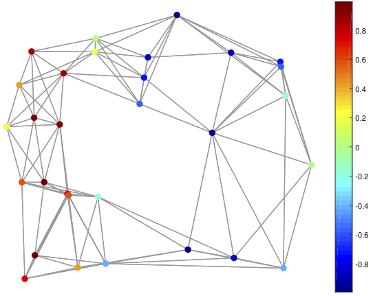
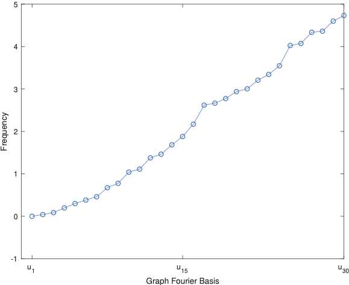
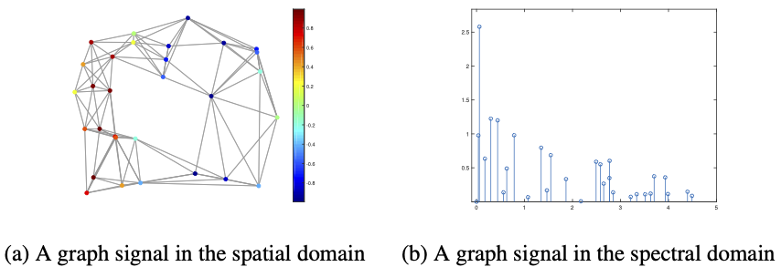

[メインページ](../../index.markdown)

[章目次](./chap2.md)
## 2.5. グラフ信号処理

現実世界で現れる多くのグラフでは，各ノードに特徴や属性が与えられている場合が多い．このようなグラフは，構造情報（ノード間の接続性）とデータ（ノードの属性）の両方を捉えた，「信号(シグナル)を持つグラフ」として見ることができる．信号付きのグラフは「グラフ $\mathcal{G} = \left\\{\mathcal{V},\mathcal{E}\right\\}$ 」と，「ノードを実数値に写像する，グラフ領域で定義された写像 $f$ 」から構成される． 数学的には，この写像は以下のように表される．

 $$
 \nonumber
f\colon \mathcal{V} \rightarrow \mathbb{R}^{N\times d}. $$
 

ここで， $d$ は各ノードに与える値（ベクトル）の次元である． 一般性を損なうことなく，本節では $d=1$ とおいて議論を進め，全ノードを写像して得た値を $\symbf{f}\in\mathbb{R}^{N}$ とする．また，ノード $v_i$ に対応する値を $\symbf{f}[i]$ で表すことにする． 

 
<strong>例 2.32</strong>
 信号付きのグラフを図2.3に示した．ノードの色は，関連する値を表しており，その値が小さいほど青く，大きいほど赤になるようにしている． 

<figure>

<figcaption>図2.3 1次元の信号付きのグラフ</figcaption>

</figure>

隣接するノードが与える値が互いに似ている場合，グラフは「滑らか」であるといわれる．滑らかなグラフの信号は，エッジを介してグラフ全体で値がゆっくりと変化するため，「低周波である」という． 式(2.10)で示したラプラシアン行列の二次形式は，接続されたノードのすべての組の差の二乗和であるため，グラフ信号 $\symbf{f}$ の滑らかさ（周波数）を測定するために用いることができる．具体的には，グラフ信号 $\symbf{f}$ が滑らかであるならば， $\symbf{f}^T\symbf{L}\symbf{f}$ の値は小さくなる．この値 $\symbf{f}^T\symbf{L}\symbf{f}$ を信号 $\symbf{f}$ の"滑らかさ"（周波数）という．

古典的な信号処理において，信号は $2$ つの領域，時間領域と周波数領域で表現される． 同様にグラフ信号も，先ほど導入した空間(グラフ)領域と，スペクトル領域（または周波数領域）の $2$ つで表現できる．グラフ信号のスペクトル領域はグラフフーリエ変換をベースにしており，これは前節のスペクトルグラフ理論に沿って構築される．

### グラフフーリエ変換

古典的なフーリエ変換(Bracewell, n.d.)は，

 $$
 \nonumber
    \hat{f}(\xi) = \langle f(t),\exp(-2\pi it \xi)\rangle = \int^{\infty}_{-\infty}f(t)\exp (-2\pi i t \xi) dt $$
 

と定義される． この変換は，信号 $f(t)$ を，任意の実数 $\xi$ に対する複素指数関数 $\exp (-2\pi it \xi)$ の級数で分解するもので， $\xi$ は周波数と考えることができる． 以下の計算からわかるように，これらの複素指数関数は「一次元ラプラス作用素（二階微分作用素）の固有関数」であることがわかる．

 

$$

\begin{aligned}
    \nabla^2 (\exp(-2\pi i t \xi)) &= \dfrac{\partial^2}{\partial t^2} \exp (-2\pi it \xi)\nonumber\\
    &= \dfrac{\partial}{\partial t}(-2\pi i\xi)\exp (-2\pi it \xi)\nonumber\\
    &= (2\pi i \xi)^2 \exp (-2\pi it \xi).\nonumber
\end{aligned}
$$

 

同様に，グラフ $\mathcal{G}$ 上のグラフ信号 $\symbf{f}$ の"グラフフーリエ変換"は，以下のように表すことができる．

 $$
 
\tag{2.11}
    \hat{\symbf{f}}[l] = \langle\symbf{f},\symbf{u}_l \rangle = \sum^{N}_{i=1}\symbf{f}[i]\symbf{u}_l[i]. $$
 

ここで， $\symbf{u}\_l$ は，ラプラシアン行列 $\symbf{L}$ の $l$ 番目の固有ベクトルであり，対応する固有値 $\lambda_l$ は固有ベクトル $\symbf{u}\_l$ の周波数(滑らかさ)を表している．  $\symbf{f}$ のグラフフーリエ変換は，（ $\hat{\symbf{f}}[l]$ をその $l$ 番目の要素とする）ベクトル $\hat{\symbf{f}}$ として定義され，このときの固有ベクトルは，グラフ $\mathcal{G}$ のグラフフーリエ基底である．つまり， $\hat{\symbf{f}}$ は，信号 $\symbf{f}$ をこれらの基底で分解して得られる"グラフフーリエ係数"で構成される． 一方で， $\symbf{f}$ のグラフフーリエ変換は，

 $$
 
\tag{2.12}
    \hat{\symbf{f}} = \symbf{U}^{T}\symbf{f}, $$
 

と行列形式で表すこともできる．ここで，行列 $\symbf{U}$ の $l$ 番目の列は $\symbf{u}\_l$ である．

以下の式で示されるように，固有値 $\lambda_l$ は，対応する固有ベクトル $\symbf{u}\_l$ の滑らかさを測定している
[^3]
．

 $$
 \nonumber
    \symbf{u}^T_l \symbf{L}\symbf{u}_l = \lambda_l \cdot\symbf{u}^T_l\symbf{u}_l = \lambda_l. $$
 

例えば，小さな固有値に対応する（隣接ノード間の）固有ベクトルの要素は，グラフ上でゆっくりと変化することになる． つまり，この固有ベクトルの下では接続したノードがとる要素は似たものとなる．したがって，これらの固有ベクトルの要素は滑らかで，グラフ上を低周波数で変化する． 一方，大きな固有値に対応する固有ベクトルの要素は，接続した $2$ つのノードであっても非常に異なる値をとることがある．極端に小さい固有値の例として，固有値 $0$ に対応する第 $1$ 固有ベクトル $\symbf{u}\_1$ がある．このベクトルはすべてのノードで同じ値を持つため，グラフ上で変化しない．そのため，このベクトルは極めて滑らかで周波数も $0$ であることが示される．

以上の議論より，すべての固有ベクトルは，グラフ $\mathcal{G}$ のグラフフーリエ基底であり，対応する固有値はその周波数となることがわかる．グラフフーリエ変換は，式(2.12)に示すように，入力信号 $\symbf{f}$ を周波数の異なるグラフフーリエ基底に分解する処理とみなすことができ，得られた係数 $\hat{\symbf{f}}$ は，対応するグラフフーリエ基底が入力信号に対してどれだけ寄与しているかを表している． 

 
<strong>例 2.33</strong>
 図2.4に，図2.3のグラフに対応するグラフフーリエ基底の周波数を示した． $u_1$ が $0$ となることに注目しよう． 

<figure>

<figcaption>図2.4 グラフフーリエ基底の周波数</figcaption>

</figure>

グラフフーリエ係数 $\hat{\symbf{f}}$ は，信号 $\symbf{f}$ をスペクトル(spectral)領域で表現したものである．また，スペクトル表現 $\hat{\symbf{f}}$ を空間(spatial)表現 $\symbf{f}$ に変換する逆グラフフーリエ変換も存在しており，以下のように定義される．

 $$
 \nonumber
    \symbf{f}[i] = \sum^{N}_{l=1}\hat{\symbf{f}}[l]\symbf{u}_l[i]. $$
 

この変換は，次のように行列形式で表すこともできる．

 $$
 \nonumber
    \symbf{f} = \symbf{U}\hat{\symbf{f}}. $$
 

以上の内容をまとめると，グラフ信号は $2$ つの領域，すなわち空間領域およびスペクトル領域で表すことができる． そして，これら $2$ つの領域での表現は，それぞれグラフフーリエ変換と逆グラフフーリエ変換によって相互に変換することができる．

<figure>

<figcaption>図2.5 グラフ信号は空間・スペクトルの領域で表現できる．</figcaption>

</figure>

 
<strong>例 2.34</strong>
 図2.5に，空間領域およびスペクトル領域におけるグラフ信号をそれぞれ示した． 図2.5(a)は空間領域のグラフ信号，図2.5(b)は同じグラフ信号をスペクトル領域で示したものである．図2.5(b)において， $x$ 軸はグラフフーリエ基底， $y$ 軸はそれらの基底に対応するグラフフーリエ係数(周波数)を表している． 

[メインページ](../../index.markdown)

[章目次](./chap2.md)

[前の節へ](./subsection_04.md) [次の節へ](./subsection_06.md)

[^3]: 訳注： $\symbf{u}^T_l \symbf{L}\symbf{u}\_l$ は式(2.10)右辺の形に変形できるから，固有値（周波数）が大きければ，エッジで接続されたノードの固有ベクトルの要素は互いに大きく異なることになる．
