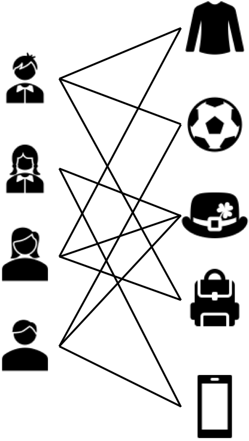
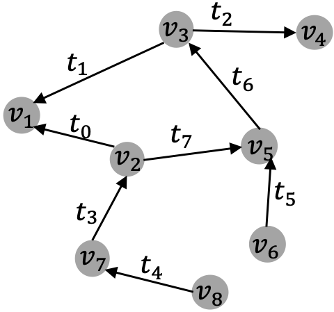

[メインページ](../../index.markdown)

[章目次](./chap2.md)
## 2.6. 複雑グラフ

ここまでは，単純グラフ(simple graph)とその主な性質について説明してきた． しかし，実際に扱われるグラフはより複雑である．本節では簡潔に，一般的な複雑グラフ(complex graph)に関する形式的定義を紹介していく．

### ヘテログラフ

ここまで説明してきた単純グラフは， $1$ 種類のノードと $1$ 種類のエッジしか含まないようなグラフであった．しかし，現実世界の多くの実用面では，「多種ノード間の多種な関係」をモデル化することが望まれる．図2.6に示すように，文献・引用を記述する学術ネットワークには，著者・論文・学会という $3$ 種類のノードが存在している．さらにこの図のノード間には異なる関係を表す様々なエッジも存在している．例えば，論文間の引用関係を表すエッジや，著者と論文間の執筆関係を表すエッジなどがある．以下に，異なる種類のノードを含むグラフの定義を形式的に示す． 

 
<strong>定義 2.35 ヘテログラフ</strong>
 ヘテログラフ $\symcal{G}$ は，ノード集合 $\symcal{V} = \left\{v_1,\dots,v_N\right\}$ とエッジ集合 $\symcal{E}=\left\{e_1,\dots,e_M\right\}$ で構成され，各ノードと各エッジには"タイプ"が関連付けられている．ノードタイプの集合を $\symcal{T}_n$ ，エッジタイプの集合を $\symcal{T}_e$ とする．そして各ノードと各エッジをそれぞれのタイプに対応付ける $2$ つの写像 $\phi_n\colon \symcal{V}\rightarrow\symcal{T}_n$ と $\phi_e\colon \symcal{E}\rightarrow\symcal{T}_e$ が存在している． 

<figure>

<figcaption>図2.6 ヘテログラフの例：学術情報ネットワーク</figcaption>

</figure>

### 二部グラフ

二部グラフ $\symcal{G} = \left\\{\symcal{V},\symcal{E}\right\\}$ におけるノード集合 $\symcal{V}$ は，互いに素な $2$ つの部分集合 $\symcal{V}\_1$ と $\symcal{V}\_2$ に分割することができ， $\symcal{E}$ のすべてのエッジは， $\symcal{V}\_1$ のノードと $\symcal{V}\_2$ のノードを接続する．このように二部グラフは，異なるオブジェクト間の相互作用を把握するために広く用いられている．例えばAmazonのようなECサイトにおいては，図2.7に示すように，ユーザのクリック履歴を二部グラフとしてのモデル化が可能である．このとき，ユーザとアイテムは互いに素な $2$ つのノード集合とし，ユーザのクリックはそれらの間のエッジとみなすことになる．以下に二部グラフの形式的な定義を示す． 

 
<strong>定義 2.36 二部グラフ</strong>
 グラフ $\symcal{G} = \left\{\symcal{V},\symcal{E}\right\}$ を考える． $\symcal{V} = \symcal{V}_1\cup \symcal{V}_2$ かつ $\symcal{V}_1\cap \symcal{V}_2 = \emptyset$ が成り立ち，さらにすべての $e = (v^1_e,v^2_e)\in \symcal{E}$ に対して， $v^1_e\in \symcal{V}_1$ ,   $v^2_e\in \symcal{V}_2$ が満たされるとき，このグラフ $\symcal{G} = \left\{\symcal{V},\symcal{E}\right\}$ は二部グラフであるという． 

<figure>

<figcaption>図2.7 二部グラフの例：オンラインショッピング</figcaption>

</figure>

### 多次元グラフ

実世界における多くの場面では，一組のノード間に複数の関係が同時に存在することがある． このようなグラフの一例として，動画共有サイトYouTubeが挙げられる．YouTubeのユーザはお互いにチャンネル登録を行うことができ，それは一つの関係として見ることができる．また，他のユーザの動画を"共有"したり，"コメント"したりすることで，ユーザ同士は異なる種類の関係でつながることができる．他の例としてはAmazonなどのECサイトがある．Amazonのユーザは，"クリック"や"購入"，"レビュー"などの様々なアクションを介して，商品と相互に影響を与え合うことができる． これらの複数の関係を持つグラフは，関係の種類を1つの次元として考慮することで，自然に多次元グラフとしてモデル化することができる． 

 
<strong>定義 2.37 多次元グラフ</strong>
 多次元グラフは， $N$ 個のノードから成る集合 $\symcal{V} = \left\{v_1,\dots,v_N\right\}$ および $D$ 個のエッジ集合 $\left\{\symcal{E}_1,\dots,\symcal{E}_D\right\}$ で構成される．各エッジ集合 $\symcal{E}_d$ は，それぞれの $d$ 次元における，ノード間の $d$ 番目の関係タイプを表している． また，これら $D$ 種類の関係は $D$ 個の隣接行列 $\symbf{A}^{(1)},\dots,\symbf{A}^{(D)}$ としても表現でき， $d$ 次元に対応する隣接行列 $\symbf{A}_d\in \mathbb{R}^{N\times N}$ は， $\symcal{V}$ 中のノード間にあるエッジ集合 $\symcal{E}_d$ を記述している．例えば， $\symbf{A}_d$ の $i,j$ 要素 $\symbf{A}_d[i,j]$ は，ノード $v_i$ と $v_j$ の間に次元 $d$ のエッジが存在するとき（ $(v_i,v_j)\in\symcal{E}_d$ ）にのみ $1$ ，次元 $d$ のエッジが存在しない場合は $0$ となる． 

### 符号付きグラフ

SNSの普及に伴い，正負のエッジを含む符号付きグラフはますます身近になってきている．符号付きグラフの例としてはFacebookやTwitterなどのSNSがあり，そこではユーザは他のユーザをブロックしたりフォロー解除したりできる．"ブロック"や"友達リスクからの削除"というアクションは，どちらもユーザ間の負のエッジと捉えることができる．図2.8は，ユーザをノード，friend関係（友だちリストへの追加）を正のエッジ，unfriend関係（友だちリストからの削除）を負のエッジとした符号付きグラフの一例である． 以下に，符号付きグラフの形式的な定義を示す．

<figure>

<figcaption>図2.8 符号付きグラフの例：友人関係</figcaption>

</figure>

 
<strong>定義 2.38 符号付きグラフ</strong>
  $\symcal{V} = \left\{v_1,\dots,v_N\right\}$ を $N$ 個のノードから成る集合， $\symcal{E}^{+}\subset\symcal{V}\times\symcal{V}$ と $\symcal{E}^{-}\subset\symcal{V}\times\symcal{V}$ をそれぞれ正と負のエッジ集合を表す．ただし，エッジは正または負のどちらか一方に属すこととし， $\symcal{E}^{+}\cap\symcal{E}^{-}=\emptyset$ を満たす．このとき， $\symcal{G} = \left\{\symcal{V},\symcal{E}^{+},\symcal{E}^{-}\right\}$ は符号付きグラフである．これらのノード間の正・負エッジは符号付き隣接行列 $\symbf{A}$ で記述することができ，ノード $v_i$ とノード $v_j$ の間に正のエッジがあるとき $\symbf{A}_{i,j}=1$ ，負のエッジがあるとき $\symbf{A}_{i,j}=-1$ ，それ以外の場合 $\symbf{A}_{i,j}=0$ となる． 

### ハイパーグラフ

これまで紹介したグラフは、エッジを介して $2$ つのノード間の情報のみを符号化していた． しかし現実世界の多くの状況では，一対の関係を超える関係性を持つことがある． 図2.9では，論文間の関係を記述するハイパーグラフが示されている． この例では特定の著者が $2$ つ以上の論文を発表することができるから，著者を，複数の論文(ノード)を結ぶ"ハイパーエッジ"とみなすことができる． 単純グラフに現れるエッジと比較して，ハイパーエッジは高次の関係を符号化できる．ハイパーエッジを持つグラフはハイパーグラフとよばれ，以下に，その形式的な定義を与えた． 

 
<strong>定義 2.39 ハイパーグラフ</strong>
  $\symcal{V}$ を $N$ 個のノード集合， $\symcal{E}$ をハイパーエッジ集合，そしてハイパーエッジ $e_j$ の重みを $\symbf{W}[j,j]$ においた対角行列を $\symbf{W}\in \mathbb{R}^{\|\symcal{E}\|\times\|\symcal{E}\|}$ とする．このとき， $\symcal{G}=\left\{\symcal{V}, \symcal{E}, \symbf{W}\right\}$ をハイパーグラフと定義する．ハイパーグラフ $\symcal{G}$ は，ノード $v_i$ がエッジ $e_j$ に現れる場合にのみ $\symbf{H}_{i,j}=1$ となる，接続行列 $\symbf{H}\in \mathbb{R}^{\|\symcal{V}\|\times\|\symcal{E}\|}$ を用いて記述することができる．また，ノード $v_i$ について，その次数を $\displaystyle d(v_i)=\sum^{\|\symcal{E}\|}_{j=1}\symbf{H}_{i,j}$ と定義し，ハイパーエッジの次数を $\displaystyle d(e_j) = \sum^{\|\symcal{V}\|}_{i=1}\symbf{H}_{i,j}$ と定義する．さらに， $\symbf{D}_e$ と $\symbf{D}_v$ を，それぞれハイパーエッジとノードの(対角)次数行列を表すとする． 

<figure>

<figcaption>図2.9 ハイパーグラフの例：学術論文ネットワーク</figcaption>

</figure>

### ダイナミックグラフ

前述したグラフは，観測時にノード間の接続が固定されている静的(static)なグラフである． しかし，現実世界の多くの場面ではグラフは常に進化しており，グラフに新しいノードが追加されたり，新しいエッジが継続的に出現している．例えば，友だち関係を築けるようなFacebook等のSNSでは，ユーザは常に他のユーザと友好関係を築くことができ，また新規ユーザもいつでもFacebookに参加することができる．このような徐々に発展していくようなグラフは，各ノードや各エッジに時点(timestamp)が関連付けられた動的なグラフとしてモデル化できる． 図2.10にダイナミックグラフの模式図を示す．各エッジに時点が関連付けられていて，ノードの時点は，そのノードを含むエッジが出現した時点が与えられる． 以下に，ダイナミックグラフの形式的な定義を与えた．

 
<strong>定義 2.40 ダイナミックグラフ</strong>
 ダイナミックグラフ $\symcal{G} = \left\{\symcal{V},\symcal{E}\right\}$ はノード集合 $\symcal{V}=\left\{v_1,\dots,v_N\right\}$ とエッジ集合 $\symcal{E}=\left\{e_1,\dots,e_M\right\}$ で構成され，各ノードと各エッジの両方（またはどちらか一方）にはそれが出現した時刻を示す時点(timestamp)が関連付けられている．具体的には，各ノードおよび各エッジからそれぞれの出現時点への対応を与える $2$ つの写像 $\phi_v$ および $\phi_e$ が存在する． 

<figure>

<figcaption>図2.10 ダイナミックグラフの模式図</figcaption>

</figure>

実際には，各ノード・各エッジの時点を記録することは困難である．その代わりの方法として，グラフがどのように変化していくかを「時点を区切って」観測すればよい． そのような場合，各時点 $t$ で観測されるグラフ $\symcal{G}\_t$ の"スナップショット"を記録値として取得することができる．このようなダイナミックグラフは，複数のグラフのスナップショットで構成される"離散型ダイナミックグラフ"とよばれる．以下に，離散型ダイナミックグラフの形式的な定義を与えた． 

 
<strong>定義 2.41 離散型ダイナミックグラフ</strong>
 離散型ダイナミックグラフは，ダイナミックグラフの変化に沿って観測された $T$ 個のグラフのスナップショットで構成される．具体的には， $T$ 個のグラフスナップショットは，時点 $0$ に観測されたグラフを $\symcal{G}_0$ とし， $\left\{\symcal{G}_0,\dots,\symcal{G}_T\right\}$ と表すことができる． 

[メインページ](../../index.markdown)

[章目次](./chap2.md)

[前の節へ](./subsection_05.md) [次の節へ](./subsection_07.md)

