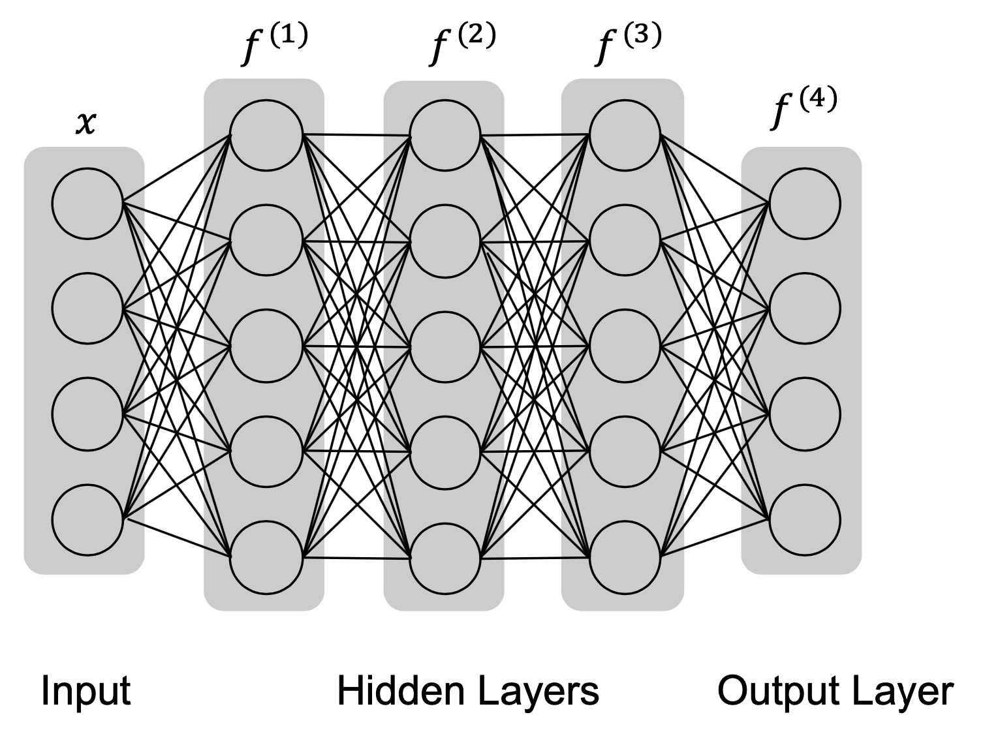
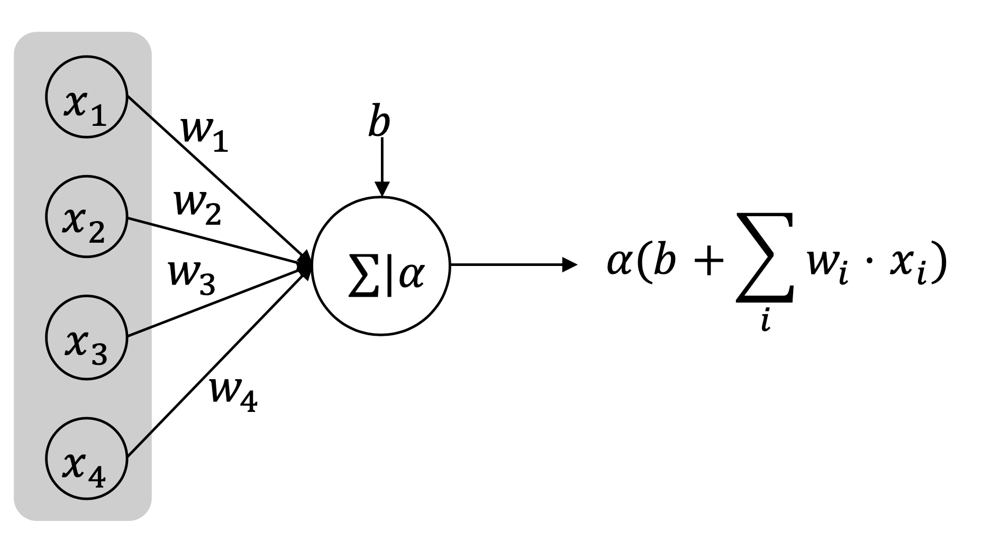
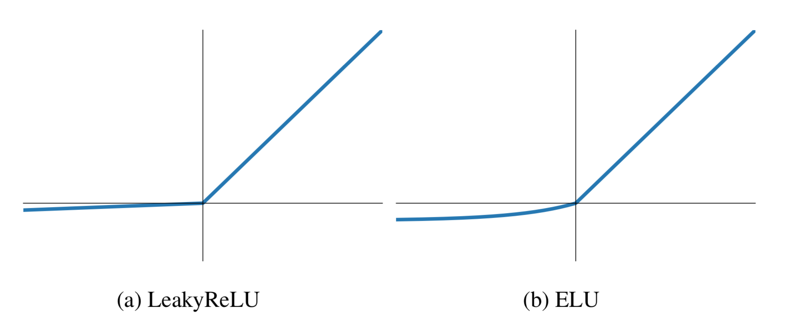
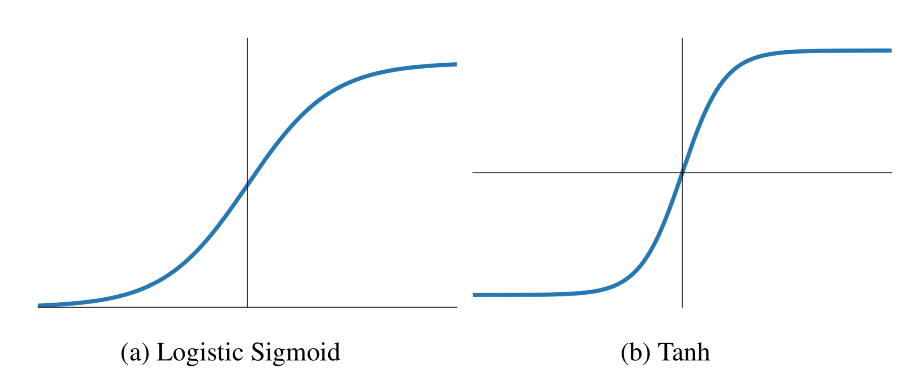

[メインページ](../../index.markdown)

[章目次](./chap3.md)
## 3.2. 深層順伝播型ネットワーク

順伝播型ネットワークは，多くの重要な深層学習技術の基礎となっている． このネットワークの目的は，与えられたデータを用いて，ある関数 $f^{\ast}(x)$ を近似することである． 例えば分類タスクにおいて，理想的な分類器である $f^{\ast}(x)$ は与えられた入力 $\symbf{x}$ を正解の分類 $\symbf{y}$ に対応づける． この場合，順伝播型ネットワークの目的は，理想的な分類器 $f^{\ast}(x)$ をうまく近似できるような写像 $f(\symbf{x} \mid \Theta)$ を見つけることである． つまり， $f^{\ast}(x)$ の最良の近似値を得ることができるパラメータ $\Theta$ の値を学習することが目的となる．

順伝播型ネットワークでは，入力情報 $\symbf{x}$ は，途中の計算段階を経て，最終的に出力 $\symbf{y}$ となる． これらの途中過程は"ネットワーク"の形をしており，通常いくつかの関数の組み合わせとして表現される． 例えば，図3.1の順伝播型ネットワークは，4つの関数 $f^{(1)}，f^{(2)}，f^{(3)}，f^{(4)}$ が鎖状に接続されており， これらの関数を用いて $f(\symbf{x})$ は $f(\symbf{x})=f^{(4)}\left(f^{(3)}\left(f^{(2)}\left(f^{(1)}(\symbf{x})\right)\right)\right)$ と表される． 図3.1の順伝播型ネットワークでは， $f^{(1)}$ が第1層， $f^{(2)}$ が第2層， $f^{(3)}$ が第3層，そして最後の層 $f^{(4)}$ が出力層となっている． このようなネットワークの"計算層の数"によってネットワークの"深さ"が決まる．

<figure>

<figcaption>図3.1 順伝播型ネットワークの例</figcaption>

</figure>

ニューラルネットワークは，出力 $f(x)$ を理想的な出力，すなわち $f^{\ast}(x)$ または正解の分類 $y$ に近づけようと学習する． 学習過程において，出力層からの結果は直接学習データと比較される一方で，全ての中間層はそうではない． したがって，理想的な関数 $f^{\ast}(x)$ をうまく近似するためには，出力層から伝搬してくる間接的な情報を用いて中間層のパラメータを決定する． これらの中間層は，学習時には学習データから望ましい出力が直接見えないことから，"隠れ層"と呼ばれている． ニューラルネットワークの各層は入力と出力の両方をベクトルとしたベクトル値関数とみなすことができ， 層の各要素はノード(ユニット)として扱うことができる． そのため，各ノードがベクトルをスカラーに対応する関数とすると，各層は，そのような関数の集まりとして考えることができる．

このようなネットワークがニューラルネットワークと呼ばれているのは，神経科学の言葉を借りているからである． ノードの動作は，脳のニューロンで起きていることを真似ており，十分な刺激を受けたときに活性化する． そしてこれらのノードは，前の層のすべてのノードから情報を集めて変換し，活性化関数に送り，次の層に情報をどの程度まで通過させるかを決める． 情報の収集と変換の操作は一般的に線形だが，活性化関数はニューラルネットワークに非線形性を付加しており，これによって近似能力が大きく向上する．

### ネットワークの構成

全結合の順伝播型ニューラルネットワークでは，隣り合った層は完全二部グラフを形成している．つまり，ある層のノードはもう一方の層のすべてのノードと接続している． 前に示した図3.1はこのようなネットワーク構成の全体像を表している．

ここから，ニューラルネットワークで行われる計算の詳細を説明していこう． 手始めに，（隠れ層である）第1層の1つのノードに注目する． ニューラルネットワークへの入力は， $x_i$ を $i$ 番目の要素としたベクトル $\symbf{x}$ であり，各要素は入力層の各ノードに対応しているとみなせる． （入力層の次の層に当たる）第1層の各ノードは，入力層の全ノードと接続している． 図3.2に，入力層の全ノードが第1層の(任意の1つの)ノードに接続している様子を示した．

<figure>

<figcaption>図3.2 ノードでの操作</figcaption>

</figure>

1つのノードで行う演算は，2つの部分から成る：

1.  入力を重み ( $\symbf{w}\_i$ )を用いて線形的に結合する．

2.  線形結合して得た値を，活性化関数を用いて変換する．

これらを数学的にまとめると次のようになる：

 

$$
 h=\alpha\left(b+\sum_{i=1}^{4} \symbf{w}_i \cdot \symbf{x}_i\right)\nonumber $$

 

ここで， $b$ はバイアス項， $\alpha(\cdot)$ は活性化関数を表す（詳細は後述）．

以上の演算を任意の隠れ層に一般化してみよう． ニューラルネットワークの $k$ 番目の層では， $N^{(k)}$ 個のノードがあり，その層の出力は $\symbf{h}^{(k)}$ と表すことができるとする（ $\symbf{h}^{(k)}\_i$ は第 $k$ 層における $i$ 番目の要素(ノード)の出力を表す）． ニューラルネットワークの $k+1$ 番目の層で $\symbf{h}^{(k+1)}$ を計算するために，以下の演算を行う：

 $$
 \symbf{h}_j^{(k+1)}=\alpha\left(b_j^{(k)}+\sum_{i=1}^{N^{(k)}} \symbf{W}_{j i}^{(k)} \symbf{h}_i^{(k)}\right)
\tag{3.1} $$
 

ここで， $\symbf{W}\_{j i}^{(k)}$ は $\symbf{h}\_i^{(k)}$ と $\symbf{h}\_i^{(k+1)}$ をつなげる重みに対応し， $b_j^{(k)}$ はバイアス項を表す．  $k+1$ 層の全要素を計算する演算を行列形式で書くと次のようになる：

 

$$
 \symbf{h}^{(k+1)}=\boldsymbol{\alpha}\left(\symbf{b}^{(k)}+\symbf{W}^{(k)} \symbf{h}^{(k)}\right)\nonumber $$

 

ここで， $\symbf{W}^{(k)} \in \mathbb{R}^{N^{(k+1)} \times N^{(k)}}$ は全ての重みを含み， その $(j，i)$ 要素は式(3.1)の $\symbf{W}\_{j i}^{(k)}$ である．  $\symbf{b}^{(k)}$ は全てのバイアス項から成る． なお，入力層に関しては $\symbf{h}^{(0)}=\symbf{x}$ とする． ニューラルネットワークの $k+1$ 層目の演算を表すのに $f^{(k+1)}$ を使っていたことを思い出すと，上記の計算は

 

$$
 \symbf{h}^{(k+1)}=f^{(k+1)}\left(\symbf{h}^{(k)}\right)=\alpha\left(\symbf{b}^{(k)}+\symbf{W}^{(k)} \symbf{h}^{(k)}\right)\nonumber $$

 

と書くことができる．

ここで紹介した演算は隠れ層に特有なものであることに注意しよう． 出力層に対しても同様の構造を採用するが，得られた情報を変換するために異なる活性化関数が使われることが多い． 次に，活性化関数と出力層の設計について説明する．

### 活性化関数

活性化関数は，入力信号を通過させるかどうか，あるいはどの程度通過させるかを決定する． 各ノード(ニューロン)は，通過する情報があれば"活性化"される． 前節で紹介したように，活性化関数がない場合には，ニューラルネットワークの演算は線形的 (linear)になる． 活性化関数は，ニューラルネットワークに非線形性を導入し，近似能力を向上させることができる． 以下では，主に使われている活性化関数を紹介する．

#### ReLU関数

ReLU関数は最もよく使われる活性化関数の一つである． 図3.3に示すように，ReLU関数は線形関数と似ているが，唯一異なる点は入力が負のときに0を出力することである． ニューラルネットワークでは，この活性化関数を採用したユニットを単にRectifier Linear Unit (ReLU)と呼ぶ．

<figure>

<figcaption>図3.3 ReLU関数</figcaption>

</figure>

ReLU関数は正の入力に対しては線形であり（そのままの値を出力する），負の入力に対しては0となる． 数学的には次のように定義される：

 

$$
 \operatorname{ReLU}(z)=\max \{0，z\}\nonumber $$

 

各層では，いくつかのユニットのみが活性化されるため，効率的な計算が可能になる． しかし，ReLU関数の欠点として，入力が負の領域で勾配(微分値)が0になるという点がある． そのため，ユニットが活性化されないと，そのユニットを訓練するための情報が伝搬しなくなってしまう． この欠点を克服するために，ReLU関数を一般化する方法がいくつか提案されている．

例えばLeakyReLU関数 (Maas *et al*., 2013)は，負の入力を0にする代わりに小さな傾きを持つような線形変換を行う（図3.4(a)）． LeakyReLU関数は数学的に次のように表すことができる：

 $$
 \operatorname{LeakyReLU}(z)=
    \begin{cases}
    0.01 z & (z<0) \\ 
    z & (z \geq 0)
    \end{cases}
    \nonumber $$
 

ReLU関数をさらに一般化したものが，ELU関数 (Exponential Linear Unit)である． ELU関数は，正の値に対しては恒等変換を行うが，負の値に対しては指数関数的な変換を行う（図3.4(b)）． 数学的には，ELUの活性化関数は次のように表される：

 $$
 \operatorname{ELU}(z)=
    \begin{cases}
    c \cdot \exp (z-1) & (z<0) \\ 
    z & (z \geq 0)
    \end{cases}
    \nonumber $$
 

ここで， $c$ は負の入力に対して指数関数の傾きを制御する正の定数である．

<figure>

<figcaption>図3.4 ReLU関数の一般化</figcaption>

</figure>

#### ロジスティックシグモイド関数とtanh関数

実際，活性化関数としては，ReLU関数よりも先にロジスティックシグモイド関数やtanh関数が主に使われていた． ロジスティックシグモイド関数は数学的には次のように表される：

 

$$
 \sigma(z)=\frac{1}{1+\exp (-z)}\nonumber $$

 

シグモイド関数は入力を $0$ から $1$ の範囲に変換する（図3.5(a)）． 具体的には，入力が負方向に進むほど出力は $0$ に近づき，入力が正方向に進むほど出力は $1$ に近づく．

tanh関数はシグモイド関数と次のような関係がある：

 

$$
 \tanh (z)=\frac{2}{1+\exp (-2 z)}-1=2 \cdot \sigma(2 z)-1\nonumber $$

 

一方で，tanh関数は入力を $-1$ から $1$ の範囲に変換する（図3.5(b)）． 具体的には，入力が負方向に進むほど出力は $-1$ に近くなり，入力が正方向に進むほど出力は $1$ に近づく．

<figure>

<figcaption>図3.5 ロジスティックシグモイド関数とtanh関数</figcaption>

</figure>

この2つの活性化関数は，"飽和問題 (saturation issue)"に直面している(Nwankpa *et al*. 2018)． これは，入力 $z$ が非常に大きな正または負の値を取る場合，活性化関数の出力が一定値に近づいてしまう(飽和してしまう)ため，0に近い入力値にしか感度を持たなくなる問題である． この飽和現象は， $z$ が非常に大きな正または負の値である場合に勾配が0付近に近づくため， 勾配を用いたネットワークの学習を非常に難しくする． そのため，この2つの活性化関数は順伝搬型ネットワークではあまり使われなくなりつつある．

### 出力層と損失関数

出力層と損失関数の設計は，どのようなタスクを行うかに応じて異なってくる． そこで本節では，一般的に使用される（最後の層における）出力ユニットと損失関数を紹介していく．

回帰タスクでは，ニューラルネットワークは連続値を出力する必要がある． これを実現する簡単な方法は，非線形変換を行わずに，アフィン変換 [^3]
入力(または前の層からの情報)を $\symbf{h} \in \mathbb{R}^{d_{\text{in}}}$ としたとき，線形ユニットの層は，ベクトル $\hat{\symbf{y}} \in \mathbb{R}^{d_{\text{ou}}}$ を次のように出力する：

 

$$
 \hat{\symbf{y}}=\symbf{W h}+\symbf{b}\nonumber $$

 

ここで， $\symbf{W} \in \mathbb{R}^{d_{\text{ou}} \times d_{\text{in}}}$ と $\symbf{b} \in \mathbb{R}^{d_{\text{ou}}}$ は学習対象のパラメータである． 単一のサンプルに対して，予測値 $\hat{\symbf{y}}$ と正解値 $\symbf{y}$ との差を測定するために，次のような単純な二乗損失関数(squared loss function)を用いることができる：

 

$$
 \ell(\symbf{y},\;\hat{\symbf{y}}) = (\symbf{y}-\hat{\symbf{y}})^{2}\nonumber $$

 

一方，分類タスクでは，ニューラルネットワークは与えられたサンプルのクラスを判別する必要がある． 与えられたサンプルの予測ラベルを示す離散値を直接出力する代わりに， 通常は，ラベルに対する離散確率分布を生成することになる． 予測対象が二値か多値かによって，異なる出力層と損失関数が使われることになるから， この2つの場合の詳細について次に述べていく．

#### 二値分類

二値分類のタスクでは，サンプルは0か1のどちらかのラベルを持つと仮定する． そして予測を行うために，まず，入力（前の層からの結果）を1つの値に変換する線形層が必要である． 続いて，シグモイド関数を適用して，この値を0から1の範囲に対応させる． これはサンプルがラベル1として予測される確率に対応する． 以上をまとめると，この処理は次のようにモデル化できる：

 

$$
 \hat{y}=\sigma(\symbf{W h}+b)\nonumber $$

 

ここで， $\symbf{h} \in \mathbb{R}^{d_{\text{in}}}$ および $\symbf{W} \in \mathbb{R}^{1 \times d_{\text{in}}}$ である． 特に， $\hat{y}$ は入力サンプルがラベル1と予測される確率を示し，  $1-\hat{y}$ はラベル0と予測される確率を表す． 出力 $\hat{y}$ を用いると，交差エントロピー損失関数(cross-entropy loss function)を用いることで， 正解値と予測値の差を次のように計算できる：

 

$$
 \ell(y,\;\hat{y})=-y \cdot \log (\hat{y})-(1-y) \cdot \log (1-\hat{y})\nonumber $$

 

モデルを用いて推論する際には， $\hat{y}>0.5$ のとき入力サンプルはラベル1と予測され，それ以外のとき入力サンプルはラベル0と予測される．

#### 多値分類

多クラス（ $n$ クラス）の分類タスクでは，正解ラベルは0から $n-1$ までの整数で表されると仮定する． そこで，この整数値の分類ラベルを表現するためにone-hotベクトル $\symbf{y} \in\{0，1\}^{n}$ を用いる． ここで $\symbf{y}\_i=1$ は，サンプルが $i-1$ のラベルを持つことを示している．

予測を行うためには，まず，入力 $\symbf{h}$ を $n$ 次元ベクトル $\symbf{z} \in \mathbb{R}^{n}$ に変換する線形層が必要である．これは次のように表される：

 

$$
 \symbf{z}=\symbf{W}\symbf{h}+\symbf{b}\nonumber $$

 

ここで， $\symbf{W} \in \mathbb{R}^{n \times d_{\text{in}}}$ および $\symbf{b} \in \mathbb{R}^{n}$ である． 次に，ソフトマックス関数を適用して， $\symbf{z}$ をすべてのクラスの合計が1になるような離散型確率分布に規格化する：

 

$$
 \hat{\symbf{y}}_i=\operatorname{softmax}(\symbf{z})_i=\frac{\exp \left(\symbf{z}_i\right)}{\sum_j \exp \left(\symbf{z}_j\right)},\quad (i=1,\ldots,\,n)\nonumber $$

 

ここで， $\symbf{z}\_i$ はベクトル $\symbf{z}$ の $i$ 番目の要素を表し， $\hat{\symbf{y}}\_i$ はソフトマックス関数の $i$ 番目の出力を表す． 特に $\hat{\symbf{y}}\_i$ は，入力サンプルがラベル $i-1$ に予測される確率を表す． 予測値  $\hat{\symbf{y}}$ に対して，交差エントロピー損失関数を用いることで， 正解値と予測値の差は以下のように計算できる：

 

$$
 \ell(\symbf{y}，\hat{\symbf{y}})=-\sum_{i=0}^{n-1} \symbf{y}_i \log \left(\hat{\symbf{y}}_i\right)\nonumber $$

 

モデルを用いて推論する際には， $\hat{\symbf{y}}$ の $n$ 個の要素の中で $\hat{\symbf{y}}\_i$ が最も大きいとき，入力サンプルはラベル $i-1$ と予測される．

[メインページ](../../index.markdown)

[章目次](./chap3.md)

[前の節へ](./subsection_01.md) [次の節へ](./subsection_03.md)

[^3]: 訳注：アフィン変換とは，ベクトル空間において線形変換（拡大縮小，回転，せん断など）と平行移動の組み合わせた変換である．を行うことである．
