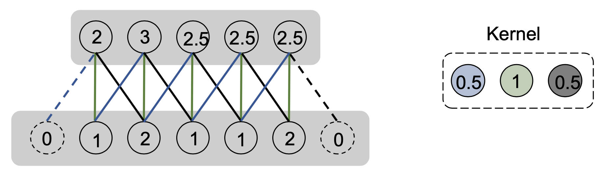
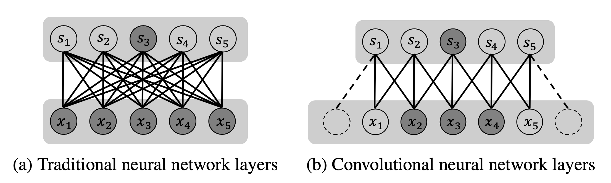
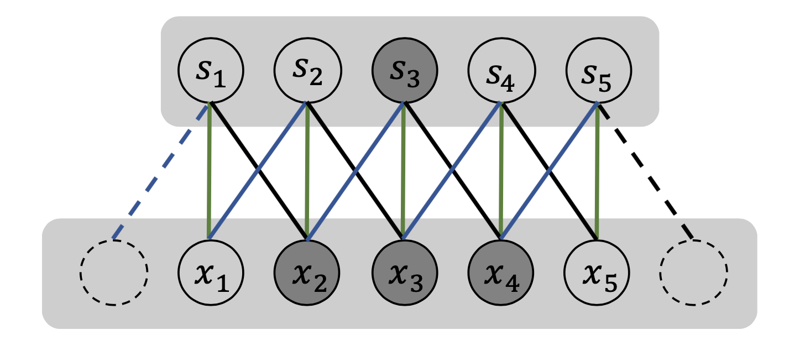
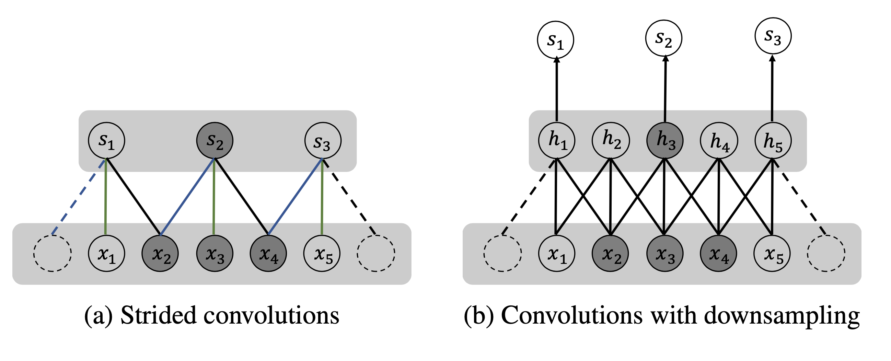
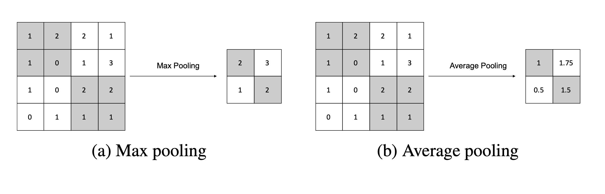
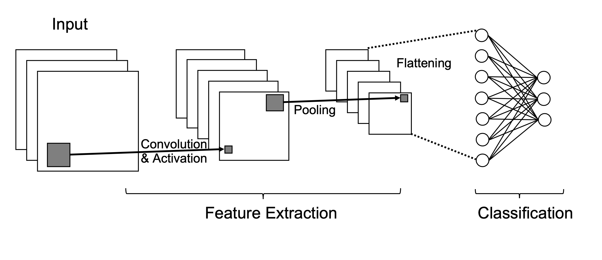

[メインページ](../../index.markdown)

[章目次](./chap3.md)
## 3.3. 畳み込みニューラルネットワーク

CNN (Convolutional Neural Network)は，広く使われているニューラルネットワークの一種で，画像などの規則的な格子状のデータを処理するのに適している． CNNは順伝播型ニューラルネットワークと似ている点が多くあり， 例えば，両者は学習可能な重みとバイアスを持つニューロンで構成されており，各ニューロンは前の層からいくつかの情報を受け取って変換する．

CNNが順伝播型ニューラルネットワークと異なる点は，そのニューロンの構造である． より具体的には，ニューロンを構成する際に"畳み込み演算"が導入されている点が異なる． このような畳み込み演算を行う層を"畳み込み層"と呼ぶ． 畳み込み演算では，前の層の全てのニューロンの情報を使わないため，層間の接続を疎(スパース)にすることができる． CNNにおけるもう一つの重要な演算は"プーリング操作"で，これは近くのニューロンの出力をまとめて新しい出力とする． プーリング演算を行う層を"プーリング層"と呼ぶ．

この節では，まず畳み込み演算と畳み込み層について紹介し，次にプーリング層について議論し，最後にCNNの全体的な枠組みについて説明する．

### 畳み込み演算と畳み込み層

一般に，畳み込み演算は，2つの実関数に対して第3の関数を生成する数学的演算である（Widder and Hirschman, 2015）． 2つの関数 $f(\cdot)$  と  $g(\cdot)$  の間の畳み込み演算は，以下のように定義される：

 

$$
 (f * g)(t)=\int_{-\infty}^{\infty} f(\tau) g(t-\tau) d \tau\nonumber $$

 

この畳み込み演算を具体的に理解するために，連続信号 $f(t)$ を考える． ここで， $t$ は時間であり， $f(t)$ は時間 $t$ における対応する値である． この信号がいくらかノイズを含んでいるとしよう． ノイズの少ない信号を得るために，時間 $t$ での値をその近傍の値を使って平均化したいと考える． さらに， $t$ に近い時間帯の値は， $t$ での値と類似している可能性があり，求める平均値により大きく寄与するはずである． そこで，時間 $t$ に近いいくつかの値の加重平均を新しい値にすることとしよう． これは「信号 $f(t)$ と重み関数 $w(c)$ の畳み込み演算」としてモデル化することができる． こうして畳み込み演算後の信号は，以下のように表すことができる：

 

$$
 s(t)=(f * w)(t)=\int_{-\infty}^{\infty} f(\tau) w(t-\tau) d \tau\nonumber $$

 

ここで，この演算が加重平均を行っているということを保証するため，  $w(c)$ は積分して1になるように制約されていることに注意しよう． そのため $w(c)$ は確率密度関数となる． なお，ここまでの議論では畳み込み演算を加重平均であるとして話を進めてきたが，一般には，畳み込み演算は加重平均である必要はなく，関数 $w(t)$ も上記の要件を満たす必要はない．

実際には，データは一定の間隔を持った離散的なものであることが多い． 例えば，信号  $f (t)$  は時間  $t$  の整数値でしかサンプリングされないことがある． 先ほど例にあげた関数 $f(\cdot)$ と $w(\cdot)$ がともに時間 $t$ の整数値で定義されているとすると，畳み込みは次のように書くことができる：

 

$$
 s(t)=(f * w)(t)=\sum_{\tau=-\infty}^{\infty} f(\tau) w(t-\tau)\nonumber $$

 

さらに，ほとんどの場合，関数 $w(\cdot)$ は小さなウィンドウサイズでしか非ゼロにならない． 言い換えれば，局所的な情報のみが畳み込む場所の新しい値に寄与する． ウィンドウサイズが $2n＋1$ ，すなわち， $w(c)=0\;(c<n,\;c>n)$ であるとすると， 畳み込みはさらに次のように書き換えることができる．

 

$$
 (f * w)(t)=\sum_{\tau=t-n}^{t+n} f(\tau) w(t-\tau)\nonumber $$

 

ニューラルネットワークの場合， $t$ は入力層におけるユニットのインデックス(要素番号)と考えることが可能であり， 関数 $w(\cdot)$ は"カーネル"または"フィルタ"と呼ばれる． この畳み込み演算は結合がスパースなグラフとして表現でき， 畳み込み層は，「カーネルを入力層上でスライドさせ，それに対応する出力を計算する層」であると解釈できる． 図3.6に，畳み込み演算で構成される層の例を示した．

<figure>

<figcaption>図3.6 畳み込み層の例</figcaption>

</figure>

 
<strong>例 3.1</strong>
 図3.6では，入力層と出力層のユニット数が同じサイズとなる畳み込み層が示されている． ただし，出力層のサイズを維持するために，入力層に値0のユニット（破線の円）が2つ追加されている（ゼロパディング）． 畳み込み演算のカーネルは図の右側に示した． 簡単のため，非線形活性化関数は図に示していない． この例では， $n = 1$ としているので，カーネル関数は近傍の3箇所でのみ定義されている． 

 実際の機械学習では，画像といった2次元以上のデータを扱うことが多い． 畳み込み演算はこのような高次元のデータにも拡張可能である． 例えば，2次元の画像 $I$ に対して，2次元のカーネル $K$ を用いて畳み込み演算を以下のように行うことができる：

 

$$
 S(i,\,j)=(I * K)(i,\,j)=\sum_{\tau=i-n}^{i+n} \sum_{j=\gamma-n}^{\gamma+n} I(\tau，\gamma) K(i-\tau,\,j-\gamma)\nonumber $$

 

ここからは，畳み込み層のいくつかの重要な特性について述べる． 一般性を損なわずに，1次元データに対する畳み込み層を例に説明していくことになるが， これらの特性は高次元データにも適用可能である． 畳み込み層が持つ重要な特性というのは，「スパース結合」，「パラメータ共有」，「平行移動に対する同変性」の3つである．これらを順に見ていこう．

#### スパース結合

従来のニューラルネットワークでは，入力ユニットと出力ユニットの間の相互作用は行列で記述することができる． この行列の各要素は，各入力ユニットと各出力ユニット間の相互作用を記述する独立したパラメータである． 一方，畳み込み層においては，層間の接続は疎になる（スパースである）ことが多い． 図3.7に，従来のニューラルネットワーク層と畳み込みニューラルネットワーク層の比較を示した．

<figure>

<figcaption>図3.7 密な結合とスパースな結合</figcaption>

</figure>

この図では，1つの出力ユニット $S_3$ と， $S_3$ に影響を与える対応する入力ユニットを強調して表示している． 左の"密な結合"の場合には，1つの出力ユニットがすべての入力ユニットの影響を受けていることがわかる． 一方，右の畳み込みニューラルネットワーク層では，出力ユニット $S_3$ は（ $S_3$ の「受容野」と呼ばれる）3つの入力ユニット $x_2$ ， $x_3$ ， $x_4$ のみの影響を受けている． スパース結合の大きな利点は，計算効率を大きく向上できる点にある． 従来のニューラルネットワークの層では， $N$ 個の入力ユニットと $M$ 個の出力ユニットがあるとき，  $N\times M$ 個のパラメータが存在し，この層の1回の計算量は $O(N\times M)$ であった． 一方で，同じ数の入力と出力ユニットを持つ畳み込み層は，カーネルサイズが $K$ であるとき， $K\times M$ 個のパラメータしか持たず，計算量は $O(K\times M)$ にまで減少する（ここでは「パラメータの共有」は考慮していない．この話題はこのあと議論する）． つまり，畳み込みニューラルネットワークの計算は，従来のニューラルネットワークの計算よりはるかに効率的になる．

#### パラメータ共有

前述したように，畳み込み層には  $K \times M$  個のパラメータが存在する． しかし，畳み込み層の「パラメータ共有」により，この数をさらに減少させることができる． パラメータ共有とは，異なる出力ユニットに対して計算を行う際に，同じパラメータセットを共有することをいう． 畳み込み層では，すべての出力ユニットの値を計算するために「同じカーネルが使用される」ため， 当然ながらパラメータは共有されることになる． 図3.8はその例であり，同じ色の接続は同じパラメータを共有する．

<figure>

<figcaption>図3.8 パラメータ共有</figcaption>

</figure>

この例では，カーネルサイズを3としているため，3つのパラメータが存在することになる． 一般に，カーネルサイズが $K$ の畳み込み層では，パラメータは $K$ 個になる． 従来のニューラルネットワーク層の $N \times M$ 個のパラメータと比較すると， $K$ 個というパラメータ数はかなり小さく，結果として必要なメモリもはるかに抑えられる．

#### 平行移動に対する同変性 (equivariant representation)

パラメータ共有によって，CNNのもう一つの重要な特性である「平行移動に対する同変性」が導かれる． ある関数の入力をある変換に従って変化させたとき，出力も同じ変換に従って変化する場合， その関数は「同変(equivariant)である」といわれる． より具体的に言えば， $f(g(x))=g(f(x))$  を満たすとき，「関数 $f(\cdot)$ は，関数 $g(\cdot)$  に対して同変である」という．

畳み込み演算の場合，平行移動に対して同変であることは容易に確かめられる． 例えば，図3.8の入力ユニットを1ユニット右にシフトしたとしても， 出力は同じように1ユニット右にシフトした結果となる． この性質は，ある特徴がどこに現れるかよりも，それが現れるかどうかを重視するようなタスクにおいて重要となる． 例えば，ある画像に猫が写っているかどうかを認識する場合，画像中のどこに特徴があるかではなく，猫が写っていることを示す重要な特徴があるかどうかが問題となる． CNNが持つこの平行移動に対する同変性は，画像分類の分野で特に重要になってくる [^4]
### 実際の畳み込み層

実際にCNNにおける畳み込みについて議論するとき，数学的に定義された畳み込み演算とは若干異なる畳み込み層が使用される． 通常，入力は「格子状に並んだ実数値」だけでなく，「格子状に並んだベクトル値」である場合が多い． 例えば， $N \times N$ 画素から成るカラー画像では，各画素に赤，緑，青の強さを表す3つの値が割り当てられている． 各色は入力画像の「チャンネル」を表す． 一般に，入力画像の $i$ 番目のチャンネルは，全ての入力ベクトルの $i$ 番目の要素で構成される． 各位置（例えば画像の場合は画素）におけるベクトルの長さが"チャンネル数"となる． 上記の場合，畳み込みは通常3次元で行われるが，そのうち2次元では「スライドする」ことによって実行される．つまり，チャンネル方向の次元では畳み込みが実行されず，「スライドしない」ことになる． さらに，典型的な畳み込み層では，入力層から特徴を抽出するために，複数の異なるカーネルが並列に適用される． その結果，出力層も複数チャンネルを持つことになり， 各カーネルの結果は各出力チャンネルに対応することになる．

ここで， $L$ 個のチャンネルを持つ入力画像 $I$ を考えてみよう．  $P$ 個のカーネルを用いた畳み込み演算は次のように定式化することができる：

 

$$

\begin{aligned}
    S(i,\,j,\,p)&=\left(I * K_p\right)(i,\,j)\nonumber\\
    &=\sum_{l=1}^{L} \sum_{\tau=i-n}^{i+n} \sum_{j=\gamma-n}^{\gamma+n} I(\tau,\,\gamma,\,l)\; K_p(i-\tau,j-\gamma,l)\qquad(p=1,\,\ldots,\, P)
   
\end{aligned}
\tag{3.2}
$$

 

ここで $K_p$ は $p$ 番目のカーネルで， $(2n+1)^2\cdot L$ 個のパラメータを持つ． 出力は $P$ チャンネルから成る．

計算量をさらに減らすため，入力層上でカーネルをスライドさせるときに，一定間隔でいくつかの位置をスキップすることもできる． このスキップ幅 $s$ は通常「ストライド」と呼び，畳み込みは $s$ 番目ごとに実行される．このようなストライドを持つ畳み込みを"ストライド畳み込み"と呼ぶ． 例として，ストライド $s$ が2の場合のストライド畳み込みを図3.9(a)に図示した． ストライド畳み込みは， 通常の畳み込みの結果をダウンサンプリングしたものと見なせる（図3.9(b)）． ストライドを $s$ としたストライド畳み込みは，次のように表現できる：

 

$$

\begin{aligned}
    S&(i,\,j,\,p)= \nonumber\\ 
    & \sum_{l=1}^{L} \sum_{\tau=i-n}^{i+n} \sum_{j=\gamma-n}^{\gamma+n} I(\tau,\,\gamma,\,l)\; K_p((i-1) \cdot s+1-\tau,\,(j-1) \cdot s+1-\gamma,\,l)\nonumber
\end{aligned}
$$

 

<figure>

<figcaption>図3.9 ストライド畳み込みの概念図</figcaption>

</figure>

ストライドを  $s = 1$  とすると，式(3.2)のようにストライドのない通常の畳み込みと等価になる． 前述したように，通常は出力の大きさを維持するために，入力にゼロパディングが施される． パディングの大きさ，受容野の大きさ（またはカーネルの大きさ），そしてストライドによって，（入力サイズが固定である場合の）出力サイズが決定される． 具体的には，サイズ $N$ の1次元入力を考え，パディングのサイズを $Q$ ，受容野のサイズを $F$ ，ストライドのサイズを $s$ とすると，出力サイズ $O$ は以下の式で計算できる：

 $$
 O=\frac{N-F+2 Q}{s}+1
    
\tag{3.3} $$
 

 
<strong>例 3.2</strong>
 図3.9のストライド付き畳み込みの入力サイズは $N=5$ ， カーネルサイズは $F=3$ で，ゼロパディングは $Q=1$ である． ストライドが $s=2$ であることから，式(3.3)を用いると，出力サイズは次のように計算できる：

 

$$
 O=\frac{N-F+2 Q}{s}+1=\frac{5-3+2 \times 1}{2}+1=3\nonumber $$

 

### 検出層（非線形活性化層）

順伝搬型ネットワークと同様に，畳み込み演算の後に非線形活性化関数が適用される． CNNで広く用いられている活性化関数はReLU関数である． 非線形活性化を適用するプロセスは，「入力された特徴を検出する」役割を果たすことから，検出層と呼ばれる．

### プーリング層

畳み込み層と検出層の後に，通常はプーリング層が続く． プーリング層では，局所的な近傍領域の統計情報をまとめる役割を担う． そのため，プーリング層を通過するデータは，その幅と高さが小さくなる． ただし，データの深さ（チャンネル数）は変化しない． 一般的に使用されるプーリング演算は．図3.10で示すような，"最大値プーリング"や"平均値プーリング"がある． これらのプーリング演算は $2\times2$ の局所近傍を入力とし，それらに基づいて1つの値を出力する． 名前が示すように，最大値プーリングは局所近傍の最大値を出力とし，平均値プーリングは局所近傍の平均値を出力とする．

<figure>

<figcaption>図3.10 CNNにおけるプーリング</figcaption>

</figure>

### CNNフレームワークの全体像

<figure>

<figcaption>図3.11 CNNにおけるプーリング</figcaption>

</figure>

畳み込み演算とプーリング演算を説明したので，次に分類タスクに対する畳み込みニューラルネットワークの全体的な枠組みについて説明する． 図3.11に示すように，分類のための全体的な枠組みは，特徴抽出パートと分類パートの2つに大別される． 特徴抽出パートは，畳み込み層とプーリング層からなり，入力情報から特徴量を抽出する． 一方で，分類パートは全結合の順伝播型ニューラルネットワークで構成されている． これら2つの要素をつなぐのが平坦化処理(flattening)である． この処理では，特徴抽出パートで抽出された複数チャネルの特徴量行列を1つの特徴量ベクトルに平坦化し，分類パートへの入力とする． 図3.11では1つの畳み込み層と1つのプーリング層しか描かれていないが，実際には複数の畳み込み層とプーリング層を重ねるのが一般的である． 同様に分類パート中の順伝播型ニューラルネットワークにおいても，複数に重ねた全結合層で構成することができる．

[メインページ](../../index.markdown)

[章目次](./chap3.md)

[前の節へ](./subsection_02.md) [次の節へ](./subsection_04.md)

[^4]: 訳注：画像認識タスクでは一般に，画像が多少平行移動しても予測結果は変わらないべきである．ニューラルネットワークは必ずしもこうした平行移動に対する対称性を考慮できるとは限らないが，CNNでは平行移動に対する同変性があるため，画像をうまく扱うことに成功している．（Krizhevsky *et al*. 2012; He *et al*. 2016)．
