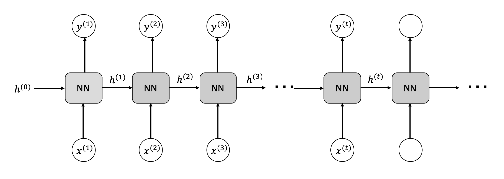
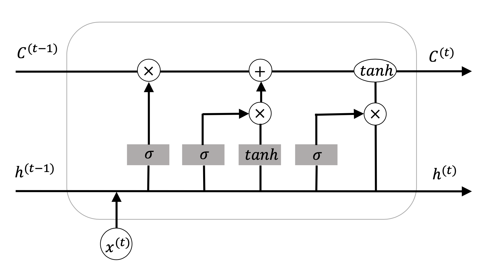
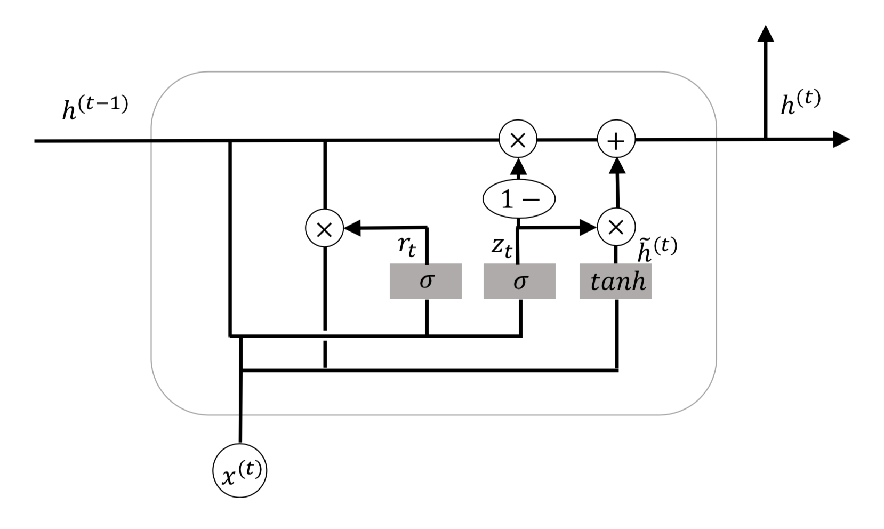

[メインページ](../../index.markdown)

[章目次](./chap3.md)
## 3.4. RNN：リカレントニューラルネットワーク

音声認識，機械翻訳，センチメント(感情)分類といった多くのタスクでは，系列データ(sequence data)を扱う必要がある． 機械翻訳では，ある言語の文（単語の列）が与えられたときに，それを別の言語に翻訳することを目的とする． したがって，入力と出力の両方が系列データである． センチメント分類では，与えられた文や文書のセンチメント(感情)を予測するもので，入力は系列データで，出力はセンチメントクラスを示す値である．

これらのタスクに対応するために，系列データの各要素を入力層の入力ユニットと見なし， それらに標準的なニューラルネットワークモデルを使えばよいと考えるかもしれない． しかしながら，この戦略は主に2つの理由により，系列データに対してはうまくいかない． 第一に，標準的なネットワークモデルでは，入力と出力のサイズが固定されていることが多いが，系列データの入力や出力はサンプルによって異なる長さを持つことがある． 第二に，これがより重要なことであるが，標準的なネットワークモデルでは，系列の異なる位置からの入力を扱うためのパラメータ共有が行われていない． 例を用いて説明しよう． 例えば，言語関連のタスクでは，「I went to the Yellow Stone National park last summer」と「Last summer, I went to the Yellow Stone National park」という2つの文が与えられたとする． 学習モデルは，両方の文において時期は"last summer"であると解釈してほしいが，"last summer"という情報はそれぞれの文で異なる位置に現れる．この課題に対処する自然な方法としては，例えば，CNNと同様にパラメータを共有するという考え方があるだろう [^5]．

こうして，上記の2つの課題を解決するために登場したのが，RNN（Recurrent Neural Network）である． RNNは，系列の各要素に同じ関数を再帰的(Recurrently)に適用する． 系列のすべての位置が同じ関数で処理されるため，異なる位置間でのパラメータ共有が自然に実現される． 一方で，系列の長さに関係なく同じ関数を繰り返し適用できるため，長さの異なる系列を扱うことができる．

### 従来のRNNの構成

長さ $n$ の系列は，（ $\symbf{x}^{(1)},\,\symbf{x}^{(2)},\dots,\,\symbf{x}^{(n)}$ ）と表すことができる． 図3.12に示すように，従来のRNNモデルは，系列の要素を1つずつ取り込み，それぞれをニューラルネットワークで構成されるブロックで処理していた．

<figure>

<figcaption>図3.12 従来のRNNの構成</figcaption>

</figure>

このニューラルネットワークのブロックは，系列の要素だけでなく前のブロックから流れてきた情報も入力として受け取っている． その結果，系列中の前の位置の情報を系列全体に渡って使うことができる． このニューラルネットワークのブロックは全て同一である． なお，図3.12のRNNモデルは，各位置 $i$ で出力 $\symbf{y}^{(i)}$ を持つが，これはRNNモデルには必須ではない [^6]．

ニューラルネットワークのブロックは，2つの入力と2つの出力をもつ． 出力を $\symbf{y}^{(i)}$ ，次の位置に流れる情報を $\symbf{h}^{(i)}$ とする． 最初の要素 $\symbf{h}^{(0)}$ は0で初期化されることが多い．  $i$ 番目の要素を処理する手順は，次のように定式化できる：

 

$$
 \begin{array}{l}\symbf{h}^{(i)}=\alpha_h\left(\symbf{W}_{hh} \cdot \symbf{h}^{(i-1)}+\symbf{W}_{hx} \symbf{x}^{(i-1)}+\symbf{b}_h\right) \nonumber \\ \symbf{y}^{(i)}=\alpha_y\left(\symbf{W}_{yh} \symbf{h}^{(i)}+\symbf{b}_y\right)\end{array}\nonumber $$

 

ここで， $\symbf{W}\_{hh},\,\symbf{W}\_{hx},\,\symbf{W}\_{yh}$ は線形変換をする行列で， $\symbf{b}\_h,\,\symbf{b}\_y$ はバイアス項， $\alpha_h,\,\alpha_y$ は活性化関数を表す．

系列データを扱う場合，系列の長期的な依存関係を捉えることが非常に重要となる． 例えば，言語モデルでは文中で遠くに現れる2つの単語が密接に関連していることがある． しかし，従来のRNNモデルは長期的な依存関係を捉えるのが苦手であることが分かっている． 最も大きな問題は，多くのネットワークのブロックを通過する際，勾配消失または勾配爆発が生じることである． この2つの現象は，学習のプロセスで問題を引き起こす． 「勾配爆発」によってうまく最適化が働かなくなってしまい，「勾配消失」によって後の位置の情報が前の位置の計算に伝わりづらくなってしまう． これらの問題を解決するため，"ゲート付きRNNモデル"が提案されている． 代表的なゲート付きRNNモデルとして，LSTM (Hochreiter and Schmidhuber, 1997)やGRU (Cho *et al*., 2014a) がある．

### LSTM (Long Short-Term Memory)

LSTMの全体的な構造は従来のRNNモデルと同じであり， 系列の要素に適用される同一のニューラルネットワークブロックを有するチェイン構造を持っている． 重要な違いは，LSTMの情報の流れを制御するために"ゲート・ユニット"が導入されている点である． 図3.13に示すように，系列内の連続した位置の間を流れる情報には，セル状態 $\symbf{C}^{(t-1)}$ と隠れ状態 $\symbf{h}^{(t-1)}$ という情報が含まれている． セル状態は前の状態から次の状態へ情報を伝達し，隠れ状態はどのようにして情報を伝達するのかを決める． 隠れ状態 $\symbf{h}^{(t)}$ は，必要に応じて（例えば入力も出力も系列であるようなタスクなどで）この位置の出力としても機能する．

<figure>

<figcaption>図3.13 LSTMの構成ブロック</figcaption>

</figure>

LSTMではまず最初のステップで，前のセル状態が持つ情報のうちどのような情報を捨てるかを決める． この判断は「忘却ゲート」で行われる． 忘却ゲートでは前の隠れ状態 $\symbf{h}^{(t-1)}$ と新しい入力 $\symbf{x}^{(t)}$ をもとにして，0から1の値を出力し，セル状態 $\symbf{C}^{(t-1)}$ に渡される． 各要素の0から1の値は，どの程度の情報を捨てるかを表す． 出力は，セル状態 $\symbf{C}^{(t-1)}$ と同じ次元をもつベクトル $\symbf{f}\_t$ に集約される． 具体的には，忘却ゲートは以下のように定式化される：

 

$$
 \symbf{f}_t=\sigma\left(\symbf{W}_f \cdot \symbf{x}^{(t)}+\symbf{U}_f \cdot \symbf{h}^{(t-1)}+\symbf{b}_f\right)\nonumber $$

 

ここで， $\symbf{W}\_f$ と $\symbf{U}\_f$ はパラメータで， $\symbf{b}\_f$ はバイアス項， $\sigma()$ はシグモイド関数で入力を0から1に変換する．

次のステップでは，新しい入力 $\symbf{x}^{(t)}$ のうちどのような情報を新しいセル状態に保存すべきかを決める． この判断は「入力ゲート」で行われる． 入力ゲートは以下のように定式化される：  

$$
 \symbf{i}_t=\sigma\left(\symbf{W}_i \cdot \symbf{x}^{(t)}+\symbf{U}_i \cdot \symbf{h}^{(t-1)}+\symbf{b}_i\right)\nonumber $$

 

さらに入力情報 $\symbf{x}^{(t)}$ は，独自のニューラルネットワークで処理することによって，セル状態を更新するために使用される候補値 $\tilde{\symbf{C}}^{(t)}$ を生成する． $\tilde{\symbf{C}}^{(t)}$ の生成プロセスは以下のようになる：

 

$$
 \tilde{\symbf{C}}^{(t)}=\tanh \left(\symbf{W}_c \cdot \symbf{x}^{(t)}+\symbf{U}_c \cdot \symbf{h}^{(t-1)}+\symbf{b}_c\right)\nonumber $$

 

その後，古いセル状態 $\symbf{C}^{(t-1)}$ と候補値 $\tilde{\symbf{C}}^{(t)}$ を用いて， 新しいセル状態 $\symbf{C}^{(t)}$ を次のように生成する：

 

$$
 \symbf{C}^{(t)}=\symbf{f}_t \odot \symbf{C}^{(t-1)}+\symbf{i}_t \odot \tilde{\symbf{C}}^{(t)}\nonumber $$

 

ここで，記号 $\odot$ は「成分ごとに積をとる演算」であるアダマール積を表す．

最後のステップでは，新しい隠れ状態 $\symbf{h}^{(t)}$ を生成し，これが次のブロックに流れていく． また，場合によってはこれがこのブロックでの出力となる． この隠れ状態は更新されたセル状態 $\symbf{C}^{(t)}$ に基づいており，「出力ゲート」がセル状態のどの部分を保存するかを判断する． 出力ゲートは忘却ゲートと入力ゲートと同じように次のように定式化される：

 

$$
 \symbf{o}_t=\sigma\left(\symbf{W}_o \cdot \symbf{x}^{(t)}+\symbf{U}_o \cdot \symbf{h}^{(t-1)}+\symbf{b}_o\right)\nonumber $$

 

この結果を用いて新しい隠れ状態 $\symbf{h}^{(t)}$ は次のように生成される：

 

$$
 \symbf{h}^{(t)}=\symbf{o}_t \odot \tanh \left(\symbf{C}^{(t)}\right)\nonumber $$

 

以上から，LSTMの全体のプロセスは次のようにまとめることができる：

 $$
 \begin{array}
    {l}\symbf{f}_t=\sigma\left(\symbf{W}_f \cdot \symbf{x}^{(t)}+\symbf{U}_f \cdot \symbf{h}^{(t-1)}+\symbf{b}_f\right) \\ \symbf{i}_t=\sigma\left(\symbf{W}_i \cdot \symbf{x}^{(t)}+\symbf{U}_i \cdot \symbf{h}^{(t-1)}+\symbf{b}_i\right) \\ \symbf{o}_t=\sigma\left(\symbf{W}_o \cdot \symbf{x}^{(t)}+\symbf{U}_o \cdot \symbf{h}^{(t-1)}+\symbf{b}_o\right) \\ \tilde{\symbf{C}}^{(t)}=\tanh \left(\symbf{W}_c \cdot \symbf{x}^{(t)}+\symbf{U}_c \cdot \symbf{h}^{(t-1)}+\symbf{b}_c\right) \\ \symbf{C}^{(t)}=\symbf{f}_t \odot \symbf{C}^{(t-1)}+\symbf{i}_t \odot \tilde{\symbf{C}}^{(t)} \\ \symbf{h}^{(t)}=\symbf{o}_t \odot \tanh \left(\symbf{C}^{(t)}\right)
    \end{array}
    
\tag{3.4} $$
 

便宜上，式(3.4)で記述された， $i$ 番目の位置のLSTMのニューラルネットワークのブロックを次のようにまとめることとする：

 $$
 \symbf{C}^{(t)},\,\symbf{h}^{(t)}=\operatorname{LSTM}\left(\symbf{x}^{(t)},\,\symbf{C}^{(t-1)},\,\symbf{h}^{(t-1)}\right)
    
\tag{3.5} $$
 

### GRU (Gated Recurrent Unit)

GRUは，LSTMの変種とみなすことができる（図3.14）．

<figure>

<figcaption>図3.14 GRUの構成ブロック</figcaption>

</figure>

GRUでは，LSTMの忘却ゲートと入力ゲートを「更新ゲート」としてまとめ， セル状態と隠れ状態を同じものとして統合している． これらの変更により，よりシンプルなゲート付きRNNモデルを構成することができる． GRUは以下のように定式化される：

 $$
 \begin{array}{l}\symbf{z}_t=\sigma\left(\symbf{W}_z \cdot \symbf{x}^{(t)}+\symbf{U}_z \cdot \symbf{h}^{(t-1)}+\symbf{b}_z\right) \\ \symbf{r}_t=\sigma\left(\symbf{W}_r \cdot \symbf{x}^{(t)}+\symbf{U}_r \cdot \symbf{h}^{(t-1)}+\symbf{b}_r\right) \\ \tilde{\symbf{h}}^{(t)}=\tanh \left(\symbf{W} \cdot \symbf{x}^{(t)}+\symbf{U} \cdot\left(\symbf{r}_t \odot \symbf{h}^{(t-1)}\right)+\symbf{b}\right) \\ \symbf{h}^{(t)}=\left(\symbf{1}-\symbf{z}_t\right) \odot \tilde{\symbf{h}}^{(t)}+\symbf{z}_t \odot \symbf{h}^{(t-1)}\end{array}
        
\tag{3.6} $$
 

ここで， $\symbf{z}\_t$ は更新ゲートであり， $\symbf{r}\_t$ はリセットゲートである． 便宜上，この式(3.6)のプロセスを次のようにまとめることとする：

 $$
 \symbf{h}^{(t)}=\operatorname{GRU}\left(\symbf{x}^{(t)}，\symbf{h}^{(t-1)}\right)
    
\tag{3.7} $$
 

[メインページ](../../index.markdown)

[章目次](./chap3.md)

[前の節へ](./subsection_03.md) [次の節へ](./subsection_05.md)

[^5]: 訳注：ただし，CNNは主に空間的な特徴を扱うため，系列データの時間的依存性や順序情報を適切に捉えることが難しいので，そのまま使うことは適切ではない．
[^6]: 訳注：系列データの文書分類タスクを考える．入力データは単語の系列（文章）で，出力は文書全体に対するカテゴリラベルである．この場合，RNNモデルは必ずしも各位置で出力を持つ必要はない．代わりに，最後の位置（つまり，文書の最後の単語）でのみ出力を生成し，この出力が最終的な分類ラベルとすることが可能である．
