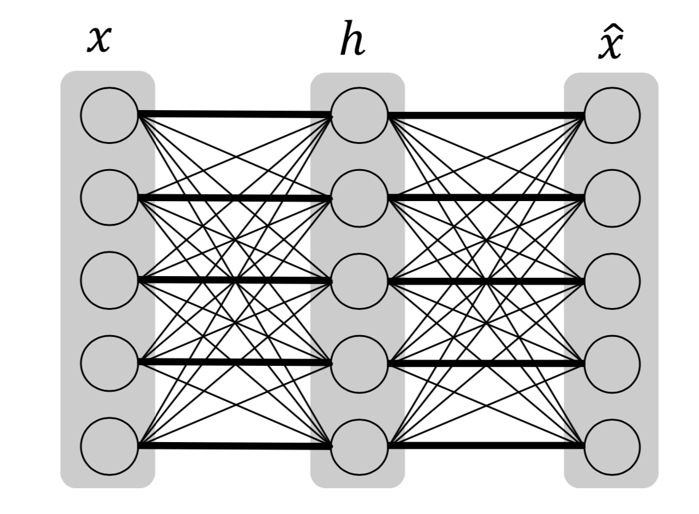
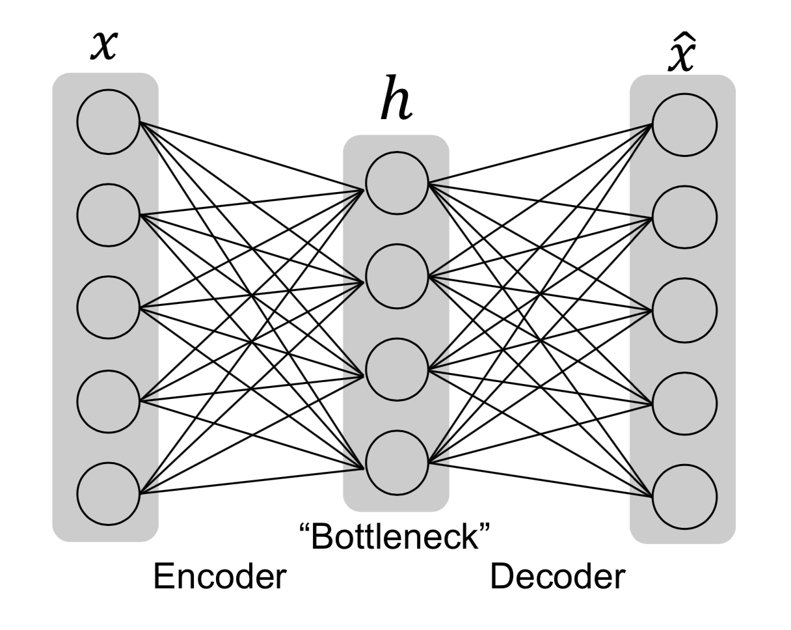

[メインページ](../../index.markdown)

[章目次](./chap3.md)
## 3.5. オートエンコーダー（自己符号化器）

オートエンコーダーは，入力されたデータを再現して出力しようとするニューラルネットワークと見なすことができる． 具体的には，オートエンコーダーは入力情報をエンコード(符号化)した中間隠れ表現 $\symbf{h}$ を持つ． オートエンコーダーは次の2つの要素から構成される．

1\. エンコーダー $\symbf{h} = f(\symbf{x})$ ：

:   入力 $\symbf{x}$ をエンコードし符号化表現 $\symbf{h}$ を生成．

2\. デコーダー $\hat{\symbf{x}} = g (h)$ ：

:   符号化表現  $\symbf{h}$ から入力 $\symbf{x}$  を復元．

入力データを再現するといっても，もしオートエンコーダーが入力を完全に再現することができるなら，それは使い物にならないものになる（図3.15）．

<figure>

<figcaption>図3.15 この図におけるオートエンコーダーは，入力データを完全に再現するように設計されており，太線の接続が入力から出力への情報の記憶を示している．一方で，太線以外の接続は使用されず(重みが0となる)，入力データの再現に寄与しない．</figcaption>

</figure>

むしろ，オートエンコーダーはいくつかの制約を含めた上で，入力をおおよそ再現するように機能させることが望ましい． そこで，オートエンコーダーは入力の必要な情報を符号化表現  $\symbf{h}$  に"圧縮"することで，満足のいく出力を再現する． オートエンコーダーの一般的な構成を図3.16に示す．

<figure>

<figcaption>図3.16 オートエンコーダーの一般的な構成</figcaption>

</figure>

入力 $\symbf{x}$ は「ボトルネック」を通して押し込まれることにより，符号化表現 $\symbf{h}$ に保存される情報量が制御される． そして，デコーダー部分は $\symbf{h}$ を利用して入力 $\symbf{x}$ を再構成した $\hat{\symbf{x}}$ を出力する． オートエンコーダーのネットワークは以下の再構成誤差を最小化することで学習される：

 $$ \ell(\symbf{x}，\hat{\symbf{x}})=\ell(\symbf{x}，g(f(\symbf{x})))
    
\tag{3.8} $$ 

ここで， $\ell(\symbf{x},\,\hat{\symbf{x}})$ は $\symbf{x}$ と $\hat{\symbf{x}}$ の差を測定する関数で， 例えば，平均二乗誤差を $l$ とすることができる．

オートエンコーダーでは，「ボトルネック」の設計が重要である． 図3.15でみたように，「ボトルネック」がないと，オートエンコーダーは単に入力を記憶してデコーダーにそのまま渡して入力を再現することを学習してしまい，オートエンコーダーが使い物にならなくなる可能性がある． 「ボトルネック」を設計する（すなわち，オートエンコーダーに制約を加える）方法は様々ある． 自然な方法は，符号化表現 $\symbf{h}$ の次元数を制限することであり， これは不完全オートエンコーダーの考え方につながる． また，正則化項を追加して入力と出力間の記憶を抑止することもでき，これは正則化オートエンコーダーの考え方につながる．これらを順に以下で見ていこう．

### 不完全オートエンコーダー

符号化表現 $\symbf{h}$ の次元数が入力 $\symbf{x}$ より小さくなるように制限することは，「ボトルネック」を設計する上で，簡単で自然な方法である． 入力次元より小さい符号化部分の次元を持つオートエンコーダーは， 「不完全」オートエンコーダーと呼ばれる． 不完全オートエンコーダーの例は上で示した図3.16である． エンコーダーとデコーダーはともに1層のネットワークしか持たず，隠れ層は入力層より少ないユニットしか持っていない． このモデルの再構成誤差を最小にすることで，入力の最も重要な特徴を隠れ符号化表現に保存することができる．

### 正則化オートエンコーダー

また，エンコーダーとデコーダーの層を重ねることで，オートエンコーダーをより深くすることができる． 深いオートエンコーダーの場合，その表現力の大きさに注意する必要がある． オートエンコーダーは，エンコーダーとデコーダーの表現力が大きすぎると，意味があることを何も学べなくなってしまう可能性がある． オートエンコーダーが単に「恒等関数」を学習してしまうことを防ぐため，以下のように，オートエンコーダーの損失関数に正則化項を入れることができる：

 $$ \ell(\symbf{x}，g(f(\symbf{x})))+\eta \cdot \Omega(\symbf{h})
    
\tag{3.9} $$ 

ここで， $\Omega(\symbf{h})$ は正則化項で， $\eta$ は正則化項の大きさを制御するハイパーパラメータである．

Olshausen and Field (1997)の研究では，正則化項として，符号化表現 $\symbf{h}$ の $L_1$ ノルムが導入されていた：

 $$ \Omega(\symbf{h})=\|\symbf{h}\|_1
    
\tag{3.10} $$ 

 $L_1$ ノルム正則化項によって $\symbf{h}$ は疎(スパース)になるように促される． こうしたオートエンコーダーは「スパースオートエンコーダー」とも呼ばれる．

符号化表現をスパースにする別の方法は， $\symbf{h}$ のニューロンがほとんどのデータサンプルにおいて不活性であるように制約することである． ここでいう「不活性」とは， $\symbf{h}$ のニューロンの値が低い状態であることを意味する． これまでは隠れ符号化状態を $\symbf{h}$ と表現してきたが，これではどの入力がどのエンコードにつながるのかわからず明示的になっていない． そこで，関係を明示的に表現するため，与えられた入力 $\symbf{x}$ に対して，オートエンコーダーで学習した符号化表現を $\symbf{h}(\symbf{x})$ と表記することとする． こうすることで，サンプル集合 $\left\\{\symbf{x}_{(i)}\right\\}_{i=1}^{m}$ の符号化表現の平均を次のように書くことができる：

 $$ \overline{\symbf{h}}=\frac{1}{m} \sum_{i=1}^{m} \symbf{h}\left(\symbf{x}_{(i)}\right)
    
\tag{3.11} $$ 

次に，隠れ符号化表現の各要素が小さな値 $\rho$ に近づくようにしたい． 例えば， $\rho$ を0.05に設定する． Ng *et al*.(n.d.)の研究では，隠れ表現の各要素は「平均 $\overline{\symbf{h}}$ のベルヌーイ確率変数」として扱われる． これらの確率変数は，KLダイバージェンスを用いることによって，「平均 $\rho$ のベルヌーイ確率変数」に近づくように制約することができる：

 $$ \Omega(\symbf{h})=\sum_j\left(\rho \log \frac{\rho}{\overline{\symbf{h}}[j]}+(1-\rho) \log \frac{1-\rho}{1-\overline{\symbf{h}}[j]}\right)
    
\tag{3.12} $$ 

式(3.12)の正則化項を持つオートエンコーダーも「スパースオートエンコーダー」と呼ばれる． この正則化項は，「不完全オートエンコーダー」に適用することもできるが，正則化項単体で「ボトルネック」の役割を果たすこともできる． そのため，この正則化項を用いれば，隠れ符号化表現 $\symbf{h}$ は必ずしも入力より小さい次元である必要はなくなる．

[メインページ](../../index.markdown)

[章目次](./chap3.md)

[前の節へ](./subsection_04.md) [次の節へ](./subsection_06.md)

