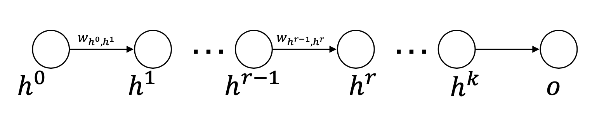
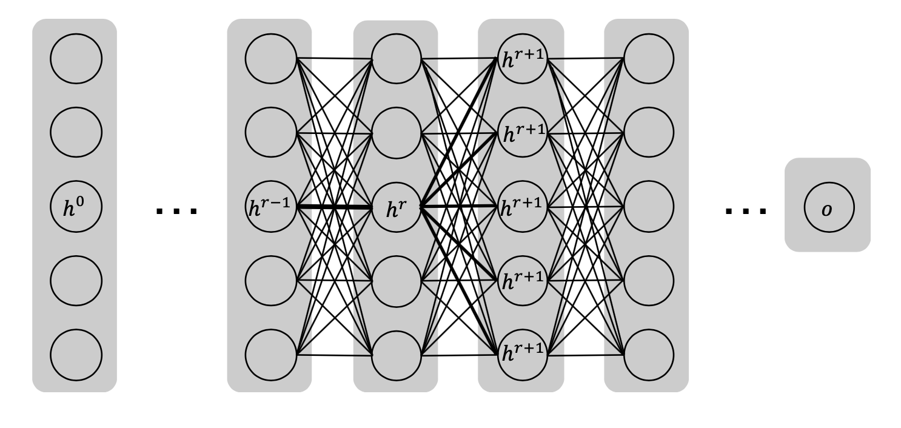

[メインページ](../../index.markdown)

[章目次](./chap3.md)
## 3.6. 深層ニューラルネットワークの学習

この節では，深層ニューラルネットワークの学習手順について説明する． まず，ニューラルネットワークを学習するための一般的なアプローチである，勾配降下法とその変形版について簡単に紹介する． 次に，ニューラルネットワークのパラメータの勾配を計算するための効率的な動的アルゴリズムである，誤差逆伝播法について説明する．

### 勾配降下法

深層モデルを学習させるためには，学習させたいパラメータに関する損失関数 $\symcal{L}$ を最小化する必要がある．  $\symbf{W}$ を最適化するすべてのパラメータとすると，損失関数は一般に $\symcal{L}(\symbf{W})$ と表す． 深層学習における損失関数の最小化には，勾配降下法とその変形版がよく用いられる． 勾配降下法（Cauchy，n.d.）は，一次の繰り返し最適化アルゴリズムである． 各繰り返しにおいて，以下のように負の勾配の方向へ一歩ずつ，パラメータ $\symbf{W}$ を更新する：

 $$
 \symbf{W}^{\prime}=\symbf{W}-\eta \cdot \nabla_{\symbf{W}} \symcal{L}(\symbf{W})
    
\tag{3.13} $$
 

ここで， $\nabla\_{\symbf{W}} \symcal{L}(\symbf{W})$ は勾配を表し， $\eta$ は学習率を表す． 学習率は正の値で，どの程度 $\symbf{W}$ を更新するかを表す． 深層学習では，学習率 $\eta$ は小さい定数に固定されることが多い．

損失関数は通常，学習サンプルのペナルティの総和である． したがって，損失関数を以下のように書くことができる：

 $$
 \symcal{L}(\symbf{W})=\sum_{i=1}^{N_s} \symcal{L}_i(\symbf{W})
    
\tag{3.14} $$
 

ここで， $\symcal{L}\_i(\symbf{W})$ は $i$ 番目のサンプルの損失を表し，  $N_s$ はサンプル数を表す． 多くの場合，全サンプルに対して直接 $\nabla\_{\symbf{W}}\symcal{L}(\symbf{W})$ を計算するのは非常に手間がかかる． そこで，深層ニューラルネットワークの学習で非常によく使われている，ミニバッチ勾配降下法が登場する． ミニバッチ勾配降下法では，すべての学習サンプルに対して勾配を評価するのではなく，学習データから少量のサンプルを抽出し，それを使って勾配を推定する． この推定された勾配を利用してパラメータを更新する． 具体的には，勾配は $\sum_{j\in\symcal{M}}\nabla\_{\symbf{W}}\symcal{L}\_j(\symbf{W})$ として推定される． ここで， $\symcal{M}$ はミニバッチのサンプル集合を表す． AdaGrad (Duchi *et al*., 2011)，AdaDelta (Zeiler, 2012)，および Adam (Kingma and Ba, 2014) など，深層ニューラルネットワークの学習のために様々な勾配降下法（の変形版）が開発されている． これらは一般的に，標準的な勾配降下法よりも収束性が高い．

### 誤差逆伝播法

勾配に基づく最適化を行うための重要なステップの1つは，すべてのパラメータに関する勾配を計算することである． 誤差逆伝播法は動的計画法を用いて勾配を計算する効率的な方法を提供し，2つの段階からなる．

1\. 順伝搬：

:   この段階では，入力はモデルの深い層まで通過する．出力は現在のパラメータセットを用いて計算され，損失関数の値が評価される．

2\. 逆伝播：

:   この段階の目的は，パラメータに対する損失関数の勾配を計算することである．すべてのパラメータに対する勾配は，チェイン・ルールに従って，出力層から入力層に向かって動的に計算される．

次に，逆伝播の詳細を説明する．

<figure>

<figcaption>図3.17 隣り合う層のニューロン</figcaption>

</figure>

図3.17は，異なる層からの連続したつながりを持つニューラルネットワークのユニット $h^{0},\,h^{1},\ldots,\,h^{k},\,o$ を示している． ここで， $h^i$ は $i$ 番目の層内のユニットを表し， $h^0$ は入力層内のユニット， $o$ は出力層内のユニットを表す．  $\left(h^{r-1},\,h^{r}\right)$ の間に1本しかエッジがない場合，損失関数のパラメータに関する微分はチェイン・ルール [^7]を使って次のように書くことができる：

 $$
 \frac{\partial \symcal{L}}{\partial w_{\left(h^{r-1}，h^{r}\right)}}=\frac{\partial \symcal{L}}{\partial o} \cdot\left[\frac{\partial o}{\partial h^{k}} \prod_{i=r}^{k-1} \frac{\partial h^{i+1}}{\partial h^{i}}\right] \cdot \frac{\partial h^{r}}{\partial w_{\left(h^{r-1}，h_r\right)}} \quad(\forall r \in 1 \ldots k)
    
\tag{3.15} $$
 

ここで， $w_{\left(h^{r-1},\,h^{r}\right)}$ はユニット $h^{r-1}$ と $h^r$ の間のパラメータを表す．

多層ニューラルネットワークでは，エッジ $\left(h^{r-1},\,h^{r}\right)$ から出力層までを通る複数のパスが存在していることが多い． したがって，異なるパスを通して計算された勾配を計算し，以下のように合計する必要がある：

 $$
 \frac{\partial \symcal{L}}{\partial w_{\left(h^{r-1}，h^{r}\right)}}=\underbrace{\frac{\partial \symcal{L}}{\partial o} \cdot\left[\sum_{\left[h^{r}，h^{r+1}，\ldots，h^{k}，o\right] \in \symcal{P}} \frac{\partial o}{\partial h^{k}} \prod_{i=r}^{k-1} \frac{\partial h^{i+1}}{\partial h^{i}}\right]}_{\text {逆伝搬過程で} \Delta\left(h^{r}，o\right)=\frac{\partial \symcal{L}}{\partial h^{r}}\text {が計算される}} \frac{\partial h^{r}}{\partial w_{\left(h^{r-1}，h^{r}\right)}}
    
\tag{3.16}%NOTE:「逆伝搬の前のプロセスで」→「逆伝播過程で」と変更したが，本文の意図が完全に掴みきれていないかも． $$
 

ここで， $\symcal{P}$ は $h^r$ から $o$ に至るパスの集合を表し，これは $\left(h^{r-1}，h^{r}\right)$ を通るパスを含むように選択される． 式(3.16)の右辺は2つの因子で成り立っており，第二因子 $\frac{\partial h^{r}}{\partial w_{\left(h^{r-1}，h^{r}\right)}}$ は計算が面倒なのに対し（後述する），第一因子 $\Delta\left(h^{r}，o\right)=\frac{\partial \symcal{L}}{\partial h^{r}}$ は再帰的な計算が可能である．

そこでまず，第一因子を再帰的に評価する方法について説明する． 第一因子は以下のように計算できる：

 

$$

\begin{aligned} 
    \Delta\left(h^{r}，o\right) &=\frac{\partial \symcal{L}}{\partial o} \cdot\left[\sum_{\left[h^{r}，h^{r+1}，\ldots，h^{k}，o\right] \in \symcal{P}} \frac{\partial o}{\partial h^{k}} \prod_{i=r}^{k-1} \frac{\partial h^{i+1}}{\partial h^{i}}\right] \\ &=\frac{\partial \symcal{L}}{\partial o} \cdot\left[\sum_{\left[h^{r}，h^{r+1}，\ldots，h^{k}，o\right] \in \symcal{P}} \frac{\partial o}{\partial h^{k}} \prod_{i=r+1}^{k-1} \frac{\partial h^{i+1}}{\partial h^{i}} \cdot \frac{\partial h^{r+1}}{\partial h^{r}}\right] 
    \end{aligned}

    
\tag{3.17} $$
 

 $\symcal{P}$ に属する任意のパスは2つの部分にわけることができる： 「 $\left(h^{r},\,h^{r+1}\right)$ 間のエッジ」と，「 $h^{r+1}$ から $o$ までの残りのパス」である（図3.18） ．

<figure>

<figcaption>図3.18 パスの分解</figcaption>

</figure>

次に，エッジ $\left(h^{r},\,h^{r+1}\right)$ を用いて $\symcal{P}$ のパスを分類することにする． 具体的には， $\symcal{P}$ 内で同じエッジ $\left(h^{r},\,h^{r+1}\right)$ を共有するパス集合を $\symcal{P}\_{r+1}$ と表記する．  $\symcal{P}\_{r+1}$ 内の任意のパスは，共通の最初のエッジ $\left(h^{r}，h^{r+1}\right)$ を持っているので， 残りのパス(つまり， $h^{r+1}$ から $o$ までのパス)を用いて特徴づけることができる． この残りのパスを $\symcal{P}'\_{r+1}$ と書くことにすると，式(3.17)を次のように簡略化できる：

 

$$

\begin{aligned}
\Delta\left(h^{r},\,o\right) &=\frac{\partial \symcal{L}}{\partial o} \cdot\left[\sum_{\left(h^{r},\, h^{r+1}\right) \in \symcal{E}} \frac{\partial h^{r+1}}{\partial h^{r}} \cdot\left[\sum_{\left[h^{r+1},\ldots,\,h_k,\, o\right] \in \symcal{P}_{r+1}^{\prime}} \frac{\partial o}{\partial h_k} \prod_{i=r+1}^{k-1} \frac{\partial h^{i+1}}{\partial h^{i}}\right]\right] \nonumber\\
 &=\sum_{\left(h^{r},\, h^{r+1}\right) \in \symcal{E}} \frac{\partial h^{r+1}}{\partial h^{r}} \cdot \frac{\partial \symcal{L}}{\partial o} \cdot\left[\sum_{\left[h^{r+1},\, \ldots, h_k,\, o\right] \in \symcal{P}_{r+1}^{\prime}} \frac{\partial o}{\partial h_k} \prod_{i=r+1}^{k-1} \frac{\partial h^{i+1}}{\partial h^{i}}\right] \nonumber\\
 &=\sum_{\left(h^{r},\, h^{r+1}\right) \in \symcal{E}} \frac{\partial h^{r+1}}{\partial h^{r}} \cdot \Delta\left(h^{r+1},\, o\right)
    
\end{aligned}
\tag{3.18}
$$

 

ここで， $\symcal{E}$ はユニット $h^r$ から $(r+1)$ 番目の層のユニット $h^{r+1}$ に向かうすべてのエッジから成る集合を表す． 図3.18に図示したように， $(r+1)$ 番目の層の任意のユニットは $h^r$ とつながっているため，  $(r+1)$ 層のすべてのユニットが式(3.18)の最初の和に含まれていることになる．  $h^{r+1}$ は $h^{r}$ よりも後の層であり， $\Delta\left(h^{r+1}，o\right)$ は逆伝搬の前のプロセスですでに評価されているので，そのまま使うことができる． 式(3.18)の評価のために残っているのは $\frac{\partial h^{r+1}}{\partial h^{r}}$ を評価するだけである． そのためには活性化関数を考慮にいれる必要がある．  $\alpha^{r+1}$ をユニット $h^{r+1}$ の活性化関数にいれる直前の値とする． すなわち， $h^{r+1}=\alpha\left(a^{r+1}\right)$ とする．  $\frac{\partial h^{r+1}}{\partial h^{r}}$ はチェイン・ルールを用いて次のように評価される：

 $$
 \frac{\partial h^{r+1}}{\partial h^{r}}=\frac{\partial \alpha\left(a^{r+1}\right)}{\partial h^{r}}=\frac{\partial \alpha\left(a^{r+1}\right)}{\partial a^{r+1}} \cdot \frac{\partial a^{r+1}}{\partial h^{r}}=\alpha^{\prime}\left(a^{r+1}\right) \cdot w_{\left(h^{r},\,h^{r+1}\right)}
    
\tag{3.19} $$
 

ここで， $w_{\left(h^{r}，h^{r+1}\right)}$ はユニット $h^r$ と $h^{r+1}$ の間のパラメータである． これを用いると， $\Delta\left(h^{r}，o\right)$ を次のように書き換えることができる：

 $$
 \Delta\left(h^{r},\,o\right)=\sum_{\left(h^{r}，h^{r+1}\right) \in \symcal{E}} \alpha^{\prime}\left(a^{r+1}\right) \cdot w_{\left(h^{r},\,h^{r+1}\right)} \cdot \Delta\left(h^{r+1},\,o\right)
    
\tag{3.20} $$
 

ここまでが，式(3.16)の第一因子の評価であり，第二因子については以下のように評価することができる：

 $$
 \frac{\partial h^{r}}{\partial w_{\left(h^{r-1}，h^{r}\right)}}=\alpha^{\prime}\left(a^{r}\right) \cdot h^{r-1}
    
\tag{3.21} $$
 

以上から，式(3.20)と式(3.21)を用いることで，式(3.16)を再帰的かつ効率的に評価することができる．

### 過学習の抑制

深層ニューラルネットワークは，モデルの表現力が非常に大きいため，学習データに対して容易に過学習してしまう． この節では，ニューラルネットワークの過学習を防ぐための実用的なテクニックを紹介する．

#### 重み正則化

機械学習において，モデルの過学習を防ぐためには，モデルのパラメータに対する正則化項を損失関数に含めるという手法が一般的である． 正則化項はモデルパラメータを比較的小さくなるように制限することで，モデルの汎化性能を向上させる． よく用いられている正則化項は，モデルパラメータの $L_1$ ノルムと $L_2$ ノルムの2つである．

#### ドロップアウト

ドロップアウトは，過学習を防ぐために有効な手法の一つである（Srivastava *et al*. 2014）． ドロップアウトのアイデアは，学習過程の各バッチにおいて，ネットワーク内の一部のユニットをランダムに無視することである． そのため，各ユニットを無視する確率である「ドロップアウト率 $p$ 」というハイパーパラメータを用いている． そして，（パラメータを更新する）各反復計算において，確率 $p$ に従って，ネットワーク中のどのニューロンを「ドロップ(無視)」するかをランダムに決定する． こうすることで，ネットワーク全体を使うのではなく，「ドロップ」後に残ったニューロンとネットワークを用いて，各反復計算における計算と予測を行う． なお，ドロップアウトは通常，学習過程でのみ利用される． すなわち，推論手順では（ドロップを行わず）常にネットワーク全体が予測の際に使用される．

#### バッチ正規化

バッチ正規化（Ioffe and Szegedy, 2015）は当初，内部共変量シフト [^8]の問題を解決するために導入されたが，過学習を緩和させることにも役立つ．

バッチ正規化は，前の層からの活性化された情報を，次の層に送る前に正規化する． 具体的にこの正規化は，ミニバッチ学習のとき，入力値をバッチサンプルの平均で引き，バッチサンプルの標準偏差で割ることによって行われる． 推論段階では，（学習で用いた全サンプルデータから成る）母集団の統計量を用いて正規化を行う．

[メインページ](../../index.markdown)

[章目次](./chap3.md)

[前の節へ](./subsection_05.md) [次の節へ](./subsection_07.md)

[^7]: 訳注：合成関数の導関数は，構成している関数の導関数の積によって表される
[^8]: 訳注：内部共変量シフトは，ディープニューラルネットワークの訓練中に，各層の入力分布が変化する現象を指す．この変化は学習速度の低下や不安定さを引き起こし，ネットワークの性能に悪影響を与える．
