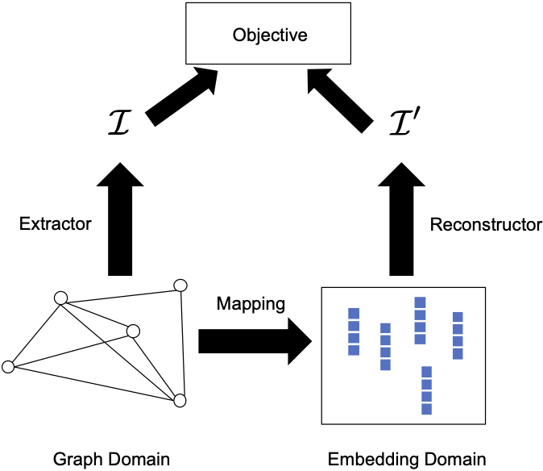

[メインページ](../../index.markdown)

[章目次](./chap4.md)
## 4.1. はじめに

グラフ埋め込み(Graph Embedding)の目的は，与えられたグラフの各ノードを，「元のグラフで各ノードが持つ重要な情報を保持するような」低次元ベクトル表現に写像することである(これは一般にノード埋め込みとして知られている)． グラフ内のノードは，次の2つのドメイン(領域)で捉えることができる．

1.  グラフドメイン：エッジの繋がり（グラフ構造）によってノードを表現する

2.  埋め込みドメイン：連続値を要素に持つベクトルによってノードを表現する

これら $2$ つのドメインを考慮に入れて，グラフ埋め込みは，グラフドメインの情報が埋め込みドメインでも保持されるように，各ノードをグラフドメインから埋め込みドメインへ写像することを目指している． ここで，2つの重要な疑問がふと浮かんでくる．

1.  どんな情報を保持する必要があるのか？

2.  どのようにその情報を保持するのか？

ほとんどの場合，グラフ埋め込みのアルゴリズムが異なれば，この2つの問いに対する答えは変わってくるだろう． 最初の問いにある「保持する情報」については，ノードの近傍情報(Perozzi *et al*., 2014; Tang *et al*., 2015; Grover and Leskovec, 2016)や，ノードの構造的な役割(Ribeiro *et al*., 2017)，ノードの状態(Ma *et al*., 2017; Lai *et al*., 2017; Gu *et al*., 2018)，コミュニティ情報(Wang *et al*., 2017c)など，多くの種類の情報が保持の対象として研究されている． 2つ目の問いに対しても，様々な手法が提案されている． 技術的な詳細は手法によって異なるが，ほとんどの手法は「埋め込みドメインのノード表現を用いて，保存すべきグラフドメインの情報を再構成する」という点で共通している．直感的に優れたノード表現というのは，保存したい情報を再構成できるはずである．このことから，再構成誤差(reconstruction error)を最小にすることで，グラフドメインから埋め込みドメインへの写像を学習することができる．グラフ埋め込みの一般的なプロセスをまとめるために，図4.1に全体的なフレームワークを示した．

<figure>

<figcaption>図4.1 グラフ埋め込みの一般的なフレームワーク</figcaption>

</figure>

図4.1に示されているように，この一般的なフレームワークは4つの重要な要素で構成される．

-   マッピング関数(Mapping)：グラフドメインから埋め込みドメインへ，ノードを写像する関数

-   情報抽出器(Extractor)：グラフドメインから保存したい重要な情報 $\symcal{I}$ を抽出する

-   再構成器(Reconstructor)：抽出されたグラフ情報 $\symcal{I}$ を，埋め込みドメインの埋め込み情報を使って再構成する．なお，図4.1に示すように，再構成された情報は $\symcal{I}^{\prime}$ と表記される．

-   目的関数(Objective)：目的関数は抽出された情報 $\symcal{I}$ と再構成された情報 $\symcal{I}^{\prime}$ に基づいて作成される．一般的に，マッピング関数や再構成に関係する全パラメータを学習するために，この目的関数が最適化される．

本章では，図4.1の一般的なフレームワークに沿って，グラフドメインが持つ様々な種類の情報を保持する代表的なグラフ埋め込み手法を紹介する． その後，ヘテログラフや二部グラフ，多次元グラフ，符号付きグラフ，ハイパーグラフ，ダイナミックグラフに特化したグラフ埋め込みアルゴリズムを紹介する．

[メインページ](../../index.markdown)

[章目次](./chap4.md)

[次の節へ](./subsection_02.md)

