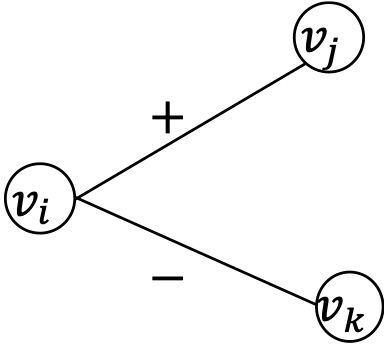
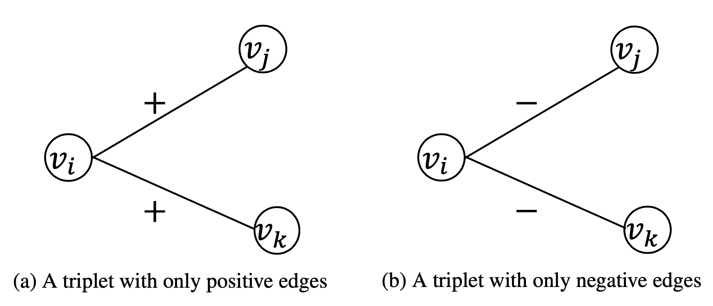
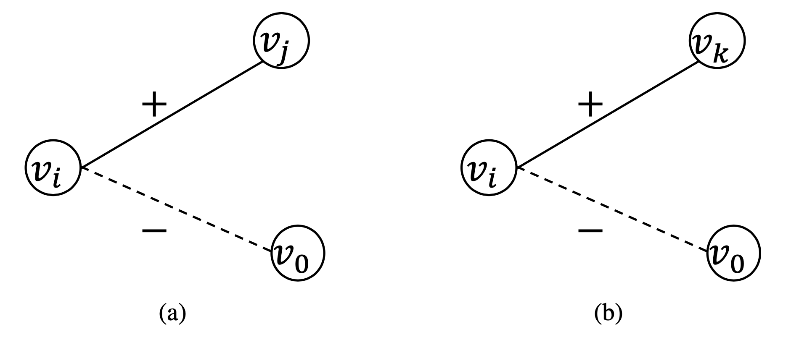

[メインページ](../../index.markdown)

[章目次](./chap4.md)
## 4.3. 複雑グラフ上のグラフ埋め込み

これまでの節では，単純グラフ(simple graph)に対するグラフ埋め込みアルゴリズムについて述べてきた．しかし，2.6節で示したように，現実世界のグラフはより複雑なパターンを持っているため，多様な複雑グラフが存在している． そこで本節では，このような複雑グラフに対する埋め込み手法を紹介する．

### ヘテログラフの埋め込み

ヘテログラフは異なる種類のノードを持つという特徴があるから，Chang *et al*.(2015)では，ヘテログラフ上の異なる種類のノードを共通の埋め込み空間に投影することを目指したHeterogeneous Network Embedding (HNE)が提唱されている． この目的を達成するために，（ノードの）種類ごとに異なるマッピング関数を取り入れている．ここでノードは，（画像やテキストなどの）異なる形式や次元を持つノード特徴に関連づけられると仮定する． そのため，ノードの種類ごとに異なる深層学習モデルを採用し，対応する特徴を共通の埋め込み空間にマッピングすることになる．例えば，関連する特徴が画像形式である場合，CNNがマッピング関数として採用され，HNEはそれらノード間の接続関係の保存を目指すことになる．

したがって，HNEにおける情報抽出器は（ノード間の接続関係を保存・再構成することになるため）エッジが張られたノードの組を抽出する．これは隣接行列 $\symbf{A}$ によって自然に表すことができる． 一方，HNEにおける再構成器は，ノードの埋め込みから隣接行列 $\symbf{A}$ を復元することを目的とする．具体的には，ノード組 $v_i,v_j$ と，マッピング関数で学習したそれらの埋め込み $\symbf{u}\_i,\symbf{u}\_j$ が与えられた場合，再構成された隣接行列の要素 $\tilde{\symbf{A}}\_{i,j}=1$ の確率は次のように計算される．

 $$
 \nonumber
    p(\tilde{\symbf{A}}_{i,j} =1) = \sigma(\symbf{u}_i^{\top}\symbf{u}_j). $$
 

ここで， $\sigma$ はシグモイド関数である．この式に対応する形で以下も計算できる．

 $$
 \nonumber
    p(\tilde{\symbf{A}}_{i,j} =0) = 1-\sigma(\symbf{u}_i^{\top}\symbf{u}_j). $$
 

再構成された隣接行列 $\tilde{\symbf{A}}$ が元の隣接行列 $\symbf{A}$ に近くなるように，確率を最大化することが目標であることから，目的関数は交差エントロピーによって以下のようにモデル化される．

 $$
 
\tag{4.10}
    -\sum^{N}_{i,j=1}\left(\symbf{A}_{i,j}\log p(\tilde{\symbf{A}}_{i,j}=1) + (1-\symbf{A}_{i,j})\log p(\tilde{\symbf{A}}_{i,j} = 0)\right). $$
 

この式(4.10)の目的関数を最小化することでマッピング関数を学習することができ，その結果としてノードの埋め込みが得られる．

ヘテログラフでは，異なる種類のノードやエッジが異なる意味を持つ．したがって，Heterogeneousネットワークの埋め込みでは，ノード間の"構造的な相互関係"だけでなく，"意味的な相互関係"にも注意を払う必要がある [^11]．

metapath2vec (Dong *et al*., 2017)は，そのようなノード間の両方の相互関係を捉えるために提案されたものである． そこで次に，metapath2vecのアルゴリズムについて，その情報抽出や再構成，目的関数を絡めて詳しく説明していく． なお，metapath2vecのマッピング関数はDeepWalkのマッピング関数と同じである．

#### メタパスに基づく情報抽出

構造的相互関係と意味的相互関係の両方を捉えるために，"メタパス(meta-path)に基づくランダムウォーク"を導入することによって共起情報の抽出を行う．具体的には，ランダムウォークにおける移動先の決定に制約を加えるために"メタパス"が採用されている．そこでまずはメタパスの概念を紹介してから，メタパスに基づくランダムウォークの設計方法についての説明に移ることにする． 

 
<strong>定義 4.5 メタパス・スキーマ(meta-path schema)</strong>
 定義2.35で定めたヘテログラフ $\symcal{G}$ を考える．メタパス・スキーマ $\psi$ とは， $A_1\xrightarrow{R_1}A_2\xrightarrow{R_2}\cdots\xrightarrow{R_l}A_{l+1}$ で表記されるような， $\symcal{G}$ 内の"ノード間の関係パターン"を表している．ここで， $A_i\in \symcal{T}_n$ や $R_i\in\symcal{T}_e$ は，それぞれ特定の種類のノードやエッジを表す．メタパス・スキーマは，ノードの種類 $A_1$ からノード種類 $A_{l+1}$ までのノード間の"合成関係"(composite relation)を定義しており，その関係を $R = R_1\circ R_2\circ \cdots \circ R_{l-1}\circ R_l$ と表すことができる．メタパス・スキーマ $\psi$ に具体的なパターンを当てはめたものをメタパス(metapath)といい，メタパス中の各ノードとエッジはメタパス・スキーマで定義した種類に従うことになる． 

メタパス・スキーマは，ランダムウォークの手引き用に使うことができる． 与えられたメタパス・スキーマ $\psi$ に沿って生成されるランダムウォークは"メタパスに基づくランダムウォーク"とよばれ，その形式的な定義は以下の通りである． 

 
<strong>定義 4.6</strong>
 メタパス・スキーマ $\psi\colon A_1\xrightarrow{R_1}A_2\xrightarrow{R_2}\cdots\xrightarrow{R_l}A_{l+1}$ が与えられているとする． $\psi$ によって手引きされるランダムウォークの遷移確率は以下のように計算される．

 $$
 \nonumber
    p(v^{(t+1)}\|v^{(t)},\psi) = 
    \begin{cases}
     \dfrac{1}{\|\symcal{N}^{R_t}_{t+1}(v^{(t)})\|},& v^{(t+1)}\in\symcal{N}^{R_t}_{t+1}(v^{(t)})\\
     \qquad\; 0,& \quad\;\text{otherwise}.
    \end{cases} $$
 

ここで， $v^{(t)}$ は種類 $A_t$ に属するノードであり，メタパス・スキーマにおける $A_t$ の位置に対応している． $\symcal{N}^{R_t}_{t+1}(v^{(t)})$ は，「エッジの種類 $R_t$ を通して $v^{(t)}$ とつながっている，ノードの種類が $A_{t+1}$ である $v^{(t)}$ 近傍の集合」を示している． 形式的には，この近傍は以下のように定義することができる．

 $$
 \nonumber
\symcal{N}^{R_t}_{t+1}(v^{(t)}) = \left\{v_j \| v_j \in \symcal{N}(v^{(t)})\;\text{かつ}\;\phi_n(v_j) = A_{t+1}\;\text{かつ}\;\phi_e(v^{(t)},v_j) = R_t\right\}. $$
 

ここで， $\phi_n(v_j)$ はノード $v_j$ の種類を取り出す関数で， $\phi_e(v^{(t)},v_j)$ はエッジ $(v^{(t)}, v_j)$ の種類を取り出す関数である（いずれの関数も定義2.35で導入している）． 

この定義の下で様々なメタパス・スキーマを参考にランダムウォークを生成し，そこから4.2.1節と同じ方法で共起するノード組を抽出することができる． またこれまでと同様に，ランダムウォークから抽出したノード組 $(v_{\text{con}}, v_{\text{cen}})$ から成る集合を $\symcal{I}$ と表記する．

#### 再構成

Dong *et al*.(2017)では二種類の再構成器が提案されている． 一つ目は，4.2.1節のDeepWalkの場合と同じである（式(4.2)）． もう一方の再構成器は，式(4.2)のような全ノードに対する単項分布(single distribution)ではなく，ノードの各種類ごとに多項分布(multinomial distribution)を定義する方法である． この場合，種類が $nt$ となるノード $v_j$ について， $v_i$ が与えられたときに $v_j$ を観測する確率は次のように計算できる．

 $$
 \nonumber
p(v_j\|v_i) = \dfrac{\displaystyle\exp (f_{\text{con}}(v_j)^{\top}f_{\text{cen}}(v_i))}{\displaystyle\sum_{v\in \symcal{V}_{nt}}\exp(f_{\text{con}}(v)^{\top}f_{\text{cen}}(v_i))} $$
 

ここで， $\symcal{V}\_{nt}$ は，種類 $nt\in\symcal{T}\_n$ を持つ全ノードから成る集合である． 以上の二つの再構成のどちらかを採用すれば，4.2.1節のDeepWalkと同じ方法で目的関数を構成できる．

### 二部グラフの埋め込み

定義2.36で導入したように，二部グラフでは，二つの互いに素となるノード集合である $\symcal{V}\_1$ と $\symcal{V}\_2$ が存在しており，これら二つの集合内にエッジは存在しない．便宜上，これら2つの互いに素な集合を $\symcal{U}$ および $\symcal{V}$ と表すことにする． Gao *et al*.(2018b)では，二つの集合間の関係および各集合内の関係を捉えるために，二部グラフの埋め込みフレームワークであるBiNE（Bipartite Network Embedding）が提案されている． この手法では，以下の2種類の情報を二部グラフから抽出している．

1.  二つの集合の間に存在する，ノード同士を結ぶエッジ集合 $\symcal{E}$ ．

2.  各集合内におけるノードの共起情報．

二つの集合に含まれるノードをノード埋め込みに対応させるために，DeepWalkと同じマッピング関数が採用されている． ここでは，ノード $u_i\in\symcal{U}$ と $v_i\in\symcal{V}$ に対する埋め込みをそれぞれ $\symbf{u}\_i$ と $\symbf{v}\_i$ と表記することにする．次に，BiNEの情報抽出器，再構成器，目的関数について説明していく．

#### 情報抽出

二部グラフからは2種類の情報が抽出される．1つ目は， $\symcal{E}$ と表記される，二つのノード集合の間に存在するノード同士を結ぶエッジである．各エッジ $e\in\symcal{E}$ は， $u_{(e)}\in\symcal{U}$ および $v_{(e)}\in\symcal{V}$ を用いて $(u_{(e)},v_{(e)})$ と表される．2つ目は，各ノード集合内での共起情報である．各ノード集合における共起情報を抽出するためには，二部グラフから $\symcal{U}$ と $\symcal{V}$ をノード集合とする二つのHomogeneousグラフをそれぞれ生成することになる． 具体的には，二つのノードが，元の二部グラフにおいて二次近傍で隣接していれば，生成したHomogeneousグラフで接続されることになる．ノード集合 $\symcal{V}$ および $\symcal{U}$ に対して生成されるグラフをそれぞれ $\symcal{G}\_{\symcal{U}}$ および $\symcal{G}\_{\symcal{V}}$ と表記する． こうすることで，DeepWalkと同じように，この二つのグラフから共起情報を抽出することができる．抽出された共起情報をそれぞれ $\symcal{I}\_{\symcal{U}}$ および $\symcal{I}\_{\symcal{V}}$ と表す．したがって，再構成の対象となる(2つ目の)情報は，エッジの集合 $\symcal{E}$ ， $\symcal{U}$ と $\symcal{V}$ の共起情報である．

#### 再構成および目的関数

（上記(2)の情報である） $\symcal{U}$ と $\symcal{V}$ の共起情報を埋め込みから復元する再構成器は，DeepWalkのものと同じである． $\symcal{U}$ と $\symcal{V}$ を再構成する二つの目的関数をそれぞれ $\symcal{L}\_{\symcal{U}}$ と $\symcal{L}\_{\symcal{V}}$ と表記する．一方で，（上記(1)の情報である）エッジ集合 $\symcal{E}$ を復元するためには，埋め込み情報に基づいてエッジを観測する確率をモデル化する． 具体的には， $u_i\in\symcal{U}$ や $v_j\in\symcal{V}$ としたノード組 $(u_i,v_j)$ が与えられたとき，元の二部グラフにおいて二つのノード間にエッジが存在する確率を

 $$
 \nonumber
    p(u_i, u_j) = \sigma(\symbf{u}_i^{\top}\symbf{v}_j), $$
 

と定義する（ $\sigma$ はシグモイド関数）． このとき， $\symcal{E}$ におけるエッジのノード組に対する確率が最大となるような埋め込みを学習することが目標である． したがって，目的関数は

 $$
 \nonumber
    \symcal{L}_{\symcal{E}} = -\sum_{(u_i, v_j)\in\;\symcal{E}} \log p(u_i, v_j), $$
 

と定義される．

以上より，BiNEにおける最終的な目的関数は以下のようになる．

 $$
 \nonumber
    \symcal{L} = \symcal{L}_{\symcal{E}} + \eta_1\symcal{L}_{\symcal{U}} + \eta_2\symcal{L}_{\symcal{V}}. $$
 

ここで， $\eta_1$ と $\eta_2$ は異なる種類の情報の貢献度を調整するためのハイパーパラメータである．

### 多次元グラフの埋め込み

多次元グラフでは，全ての次元が同じノード集合を共有しているが，それぞれ独自のグラフ構造を持っている．そこで，各ノードごとに，以下の表現の学習を目指す(Ma *et al*., 2018d)．

1.  全次元からの情報を捉えた，全体的ノード表現．

2.  対応する次元により一層焦点を当てた，次元別ノード表現．

全体的ノード表現は，全次元のノード情報を必要とするノード分類などのような，全体的なタスクを実行するために利用することができる．一方で次元別ノード表現は，ある特定の次元におけるリンク予測など，次元に特化したタスクを実行するために利用できる． 直感的には，各ノードについて，全体的表現と次元別表現は互いに独立ではない． したがって，その依存性をモデル化することが重要である．この目的を達成するためには，各次元 $d$ について，与えられたノード $v_i$ の次元別表現 $\symbf{u}\_{d,i}$ を

 $$
 
\tag{4.11}
    \symbf{u}_{d,i} = \symbf{u}_i + \symbf{r}_{d,i}\;, $$
 

としてモデル化する． $\symbf{u}\_i$ は全体的な表現で， $\symbf{r}\_{d,i}$ は依存性を考えない次元 $d$ の情報のみを取り込んだ次元別の表現である． これらの表現を学習するために，異なる次元における共起関係の再構成を目指す． 具体的には，異なる次元から抽出された共起関係を再構成することで， $\symbf{u}\_i$ と $\symbf{r}\_{d,i}$ のマッピング関数を最適化する．

次に，多次元グラフの埋め込みに関するマッピング関数や，情報抽出器，再構成器，目的関数を紹介する．

#### マッピング関数

全体的表現に関するマッピング関数を $f(\cdot)$ で表し，特定の次元 $d$ に関するマッピング関数を $f\_d(\cdot)$ と表すことにする．なお，マッピング関数は全てDeepWalkのものと同様である．これらは，以下のようにルックアップテーブルとして実装される．

 

$$

\begin{aligned}
    \symbf{u}_i &= f(v_i) = e^{\top}_i\symbf{W},\nonumber\\
    \symbf{r}_{d,i} &=f_d(v_i) = e^{\top}_i\symbf{W}_d,\;\; (d=1,\dots,D).\nonumber
\end{aligned}
$$

 

ここで， $D$ は多次元グラフにおける次元の個数である．

#### 情報抽出

4.2.1節で導入した共起関係の情報抽出を使って，各次元 $d$ の共起関係を $\symcal{I}\_d$ として抽出する． そして全次元の共起情報は，以下のように各次元の共起情報の和集合となる．

 $$
 \nonumber
    \symcal{I} = \bigcup^{D}_{d=1}\symcal{I}_d. $$
 

#### 再構成および目的関数

共起関係 $\symcal{I}$ の確率をうまく再構成できるようなマッピング関数の学習を目指す．再構成器はDeepWalkのものと類似したものを利用するが，異なる次元から抽出された関係に対して再構成を適用する点が異なる． これに対応した目的関数は以下のように記述できる．

 $$
 
\tag{4.12}
    \min_{\symbf{W},\symbf{W}_1,\dots,\symbf{W}_D} - \sum^{D}_{d=1}\sum_{(v_{\text{con}}, v_{\text{cen}})\in\;\symcal{I}_d}\;\#(v_{\text{con}}, v_{\text{cen}})\cdot\log p(v_{\text{con}}\|v_{\text{cen}}). $$
 

ここで， $\symbf{W},\symbf{W}\_1,\dots,\symbf{W}\_D$ は学習すべきマッピング関数のパラメータである．なお，Ma *et al*.(2018d)では，あるノードに対して，中心表現と文脈表現の両方に同じ表現が使用される．

### 符号付きグラフの埋め込み

符号付きグラフでは，定義2.38で導入したように，ノード間には正または負のエッジが存在している． ところで，"構造バランス理論(Structural balance theory)" [^12]は，符号付きグラフにとって最も重要な社会理論の一つである． そこで，構造バランス理論に基づく符号付きグラフの埋め込みアルゴリズムSiNE(Signed Network Embedding)が提案されている (Wang *et al*., 2017b)． バランス理論が示唆するように(Cygan *et al*., 2012)，ノードは「敵」（負エッジを持つノード）よりも「友」（正エッジを持つノード）に近いはずである． 例えば図4.4での $v_j$ と $v_k$ は， $v_i$ の友と敵とそれぞれみなせる． SiNEは，埋め込みドメインにおいて敵よりも友に近い位置にマッピングすること，すなわち $v_k$ よりも $v_j$ を $v_i$ に近くマッピングすることを目的としている． したがって，SiNEが保存すべき情報は，敵と友の間の相対的な関係である．

SiNEにおけるマッピング関数は，DeepWalkと同じものを用いる． 次に，情報抽出器について説明し，その後に再構成器を導入する．

<figure>

<figcaption>図4.4 1つの正エッジと1つの負エッジから成る三つ組(triplet)</figcaption>

</figure>

#### 情報抽出

保存すべき情報は，図4.4に示すように，ノード $v_i$ と $v_j$ を正のエッジで，ノード $v_i$ と $v_k$ を負のエッジで接続した三つ組 $(v_i,v_j,v_k)$ で表現できる． この三つ組を符号付きグラフの集合として $\symcal{I}\_1$ と表すと，以下のように形式的に定義できる．

 $$
 \nonumber
    \symcal{I}_1 = \left\{\left(v_i,v_j,v_k\right) \| \symbf{A}_{i,j}=1,\;\;\symbf{A}_{i,k}=-1,\;\;v_i,v_j,v_k\in \symcal{V}\right\}. $$
 

ここで， $\symbf{A}$ は定義2.38で導入した符号付きグラフの隣接行列である． バランス理論によれば，三つ組 $(v_i,v_j,v_k)$ において，ノード $v_j$ はノード $v_k$ よりも $v_i$ に類似していると想定される． あるノード $v$ に対して，その" $2$ 次部分グラフ"を，「ノード $v$ ， $v$ から $2$ 次近傍以内にあるノード，およびこれらのノード間のすべてのエッジで構成される部分グラフ」と定義する． 実際，抽出された情報 $\symcal{I}\_1$ には， $2$ 次部分グラフが正または負のエッジしか持たないノード $v$ の情報は含まれていない．こういったノード $v$ を含むすべての三つ組は，同じ符号のエッジを持つことになる(図4.5)．ゆえに，これらのノード表現を学習するためには，そのノードに関して保存する情報を指定する必要が生じる．

<figure>

<figcaption>図4.5 同符号のエッジを持った三つ組．(a)正のエッジ (b)負のエッジ</figcaption>

</figure>

負のエッジを形成するコストは，正のエッジを形成するコストより高いことは明らかである(Tang *et al*., 2014b)． 例えばSNSでは，多くのノードがその $2$ 次部分グラフで正のエッジ（友達関係）しか持たず，それに対して $2$ 次部分グラフで負のエッジ（ブロック関係）だけを持つようなノードは非常に少ないことがわかる． したがって，ここでは $2$ 次部分グラフが正エッジのみを持つノードの処理だけを考えよう．なお，もう一方の，負のエッジのみを持つノードの処理に対しても同様の戦略が適用できる．  $2$ 次部分グラフが正エッジのみを持つノード情報を効果的に取り込むためには，仮想ノード $v_0$ を導入し，仮想ノード $v_0$ とこれらの各ノードとの間に負のエッジを作成する． このようにすると，図4.5(a)に示すような三つ組 $(v_i,v_j,v_k)$ は， $(v_i,v_j,v_0)$ と $(v_i,v_k,v_0)$ に分割することができる（図4.6）．ここで，仮想ノード $v_0$ が関与する全てのエッジを $\symcal{I}\_0$ とすると，抽出対象の情報は $\symcal{I} = \symcal{I}\_1\cup\symcal{I}\_0$ と表せる．

<figure>

<figcaption>図4.6 仮想ノードを使って展開された，図4.5(a)の三つ組</figcaption>

</figure>

#### 再構成

与えられた三つ組ノードの情報を再構成するために，三つ組の相対的な関係をノード埋め込みに基づいて推論することを目指す． ある三つ組ノード $(v_i,v_j,v_k)$ に対して， $v_i,\,v_j,\,v_k$ 間の相対関係は，それらの埋め込みを使って，以下のように数学的に再構成できる．

 $$
 
\tag{4.13}
    s(f(v_i), f(v_j)) - \Big(s(f(v_i), f(v_k)) + \delta \Big) $$
 

ここで， $f(\cdot)$ は式(4.1)と同じマッピング関数である．また，関数 $s(\cdot,\cdot)$ は与えられた $2$ つのノード表現の類似性を測定するもので，順伝播型ニューラルネットワークを用いてモデル化される [^13]．式(4.13)が正の値であれば， $v_i$ は $v_k$ よりも $v_j$ に類似していること，すなわち $s(f(v_i),f(v_j)) > s(f(v_i), f(v_k))$ となることが示唆される．より具体的には，式(4.13)の値が $0$ より大きいとき， $s(f(v_i), f(v_j)) > s(f(v_i), f(v_k)) + \delta$ となる． パラメータ $\delta$ は， $2$ つの類似度の差を制御するための閾値である．式(4.13)の値を $0$ より大きくするためには， $s(f(v_i), f(v_j)) - s(f(v_i), f(v_k))$ は少なくとも $\delta$ より大きくなければならない．ゆえに， $\delta$ が大きくなると，式(4.13)の値を正に維持するためには， $v_i$ と $v_j$ の類似度が $v_i$ と $v_k$ の類似度よりもはるかに大きくなることが求められる． そして， $\symcal{I}$ が含む任意の三つ組ノード $(v_i, v_j, v_k)$ について，式(4.13)の値は相対的な情報を保存できるように $0$ より大きくすることが期待される．これはつまり，正のエッジで接続された $v_i$ と $v_j$ は，負のエッジで接続された $v_i$ と $v_k$ よりも類似度が高いことになる．

#### 目的関数

 $\symcal{I}$ の情報をノード表現によって確実に保存するためには， $\symcal{I}$ が含む全ての三つ組ノードに対して，式(4.13)の値が $0$ より大きくなるようにマッピング関数を最適化する必要がある． このことから，目的関数は以下のように定義できる．

 

$$

\begin{aligned}
\min_{\symbf{W},\symbf{\Theta}}\dfrac{1}{\|\symcal{I}_0\| + \|\symcal{I}_1\|}[&
\sum_{(v_i,v_j,v_k)\in\;\symcal{I}_1}\max\Big(0, s(f(v_i), f(v_k)) + \delta - s(f(v_i), f(v_j))\Big)\nonumber\\
    +&\sum_{(v_i,v_j,v_0)\in\;\symcal{I}_0}\max\Big(0, s(f(v_i), f(v_0)) + \delta_0 - s(f(v_i), f(v_j))\Big)\nonumber\\
    +&\;\alpha(R(\symbf{\Theta}) + \|\symbf{W}\|^2_F)].\nonumber
\end{aligned}
$$

 

ここで， $\symbf{W}$ はマッピング関数のパラメータ， $\symbf{\Theta}$ は $s(\cdot,\cdot)$ のパラメータを表している．また， $R(\symbf{\Theta})$ はパラメータ $\symbf{\Theta}$ に対する正則化項である． なお， $\symcal{I}\_1$ と $\symcal{I}\_0$ に異なるパラメータ $\delta$ と $\delta_0$ を用いることで， $2$ つの情報元からの三つ組を柔軟に区別できるようにしている．

### ハイパーグラフの埋め込み

2.6.5節で説明したように，ハイパーグラフにおけるハイパーエッジは，ノード集合間の関係を表している． Tu *et al*.(2018)では，ハイパーエッジに符号化された関係を利用して，ハイパーグラフ上のノード表現を学習する手法であるDeep Hyper Network Embedding (DHNE)が提案されている． この手法では，埋め込みによって再構成されたハイパーエッジから2種類の情報を抽出することになる． 一つはハイパーエッジによって直接記述される近傍性で，もう一方はハイパーエッジ内のノードの共起性である．

次にDHNEについて，情報抽出器や，マッピング関数，再構成器，目的関数について説明していく．

#### 情報抽出

ハイパーグラフからは $2$ 種類の情報が抽出される．一つはハイパーエッジである． $\symcal{E}$ と表記されるハイパーエッジの集合は，ノード間の関係を直接的に記述している．もう一つは，ハイパーエッジの共起情報である．ノード $v_i$ と $v_j$ のノード組に対して，それらがハイパーエッジで共起する頻度は，それらの関係がどの程度強いかを示している． 任意のノード組に対するハイパーエッジでの共起は，以下のように接続行列 $\symbf{H}$ から抽出することができる．

 $$
 \nonumber
    \symbf{A} = \symbf{H}\symbf{H}^{\top} - \symbf{D}_v. $$
 

ここで， $\symbf{H}$ は接続行列で， $\symbf{D}\_v$ は定義2.39で導入した対角ノード次数行列である． $i,\,j$ 要素 $\symbf{A}\_{i,j}$ は，ノード $v_i$ と $v_j$ がハイパーエッジで共起する回数を示す．するとノード $v_i$ について， $\symbf{A}$ の $i$ 行目にはグラフ内の全ノードとの共起情報（またはノード $v_i$ の大域的な情報）が記述されていることになる． 以上をまとめると，抽出情報はハイパーエッジの集合 $\symcal{E}$ と大域的な共起情報 $\symbf{A}$ である．

#### マッピング関数

マッピング関数は，大域的な共起情報を入力とするような多層順伝播型ネットワークでモデル化される． 具体的には，ノード $v_i$ に対して，以下のように処理を記述することができる．

 $$
 \nonumber
\symbf{u}_i = f(\symbf{A}_i;\,\symbf{\Theta}) $$
 

ここで $f$ は， $\symbf{\Theta}$ をパラメータとして持った順伝播型ネットワークを表している．

#### 再構成および目的関数

抽出された $2$ 種類の情報を復元するために， $2$ つの再構成器が用意される． まず，ハイパーエッジ集合 $\symcal{E}$ を復元する再構成を説明し，そのあと共起情報 $\symbf{A}$ を復元する再構成を説明していく．

埋め込みからハイパーエッジの情報を復元するためには，任意のノード集合 $\left\\{v_{(1)},\dots,v_{(k)}\right\\}$ 内にハイパーエッジが存在する確率をモデル化し， $\symcal{E}$ 内のハイパーエッジの確率を最大化することを目指す． 便宜上，Tu *et al*.(2018)では，全てのハイパーエッジは $k$ 個のノード集合を持つと仮定している． （この仮定の下で）与えられたノード集合 $\symcal{V}^i = \left\\{v^i_{(1)},\dots,v^i_{(k)}\right\\}$ 内にハイパーエッジが存在する確率は，次のように定義される．

 $$
 \nonumber
    p(1\|\symcal{V}^i) = \sigma\left(g([\symbf{u}^{i}_{(1)},\dots,\symbf{u}^{i}_{(k)}])\right). $$
 

 $g(\cdot)$ は，ノード埋め込みの連結(concatenation)を一つスカラーに写像する順伝播型ネットワークで， $\sigma(\cdot)$ はそのスカラーを確率に変換するシグモイド関数である． ハイパーグラフ上の $\symcal{V}^i$ のノード間にハイパーエッジがあるかどうかを示す変数を $R^{i}$ とすると， $R^{i}=1$ はハイパーエッジがあることを示し， $R^{i}=0$ はハイパーエッジがないことを意味する．以上より，目的関数は交差エントロピーに基づいて以下のようにモデル化される．

 $$
 \nonumber
\symcal{L}_1 = -\sum_{\symcal{V}^i\in\;\symcal{E}\cup\symcal{E}^{\prime}}R^i\log p(1\|\symcal{V}^i) + (1-R^i)\log (1-p(1\|\symcal{V}^i)). $$
 

ここで， $\symcal{E}^{\prime}$ はネガティブなサンプルとしてランダムに生成される"ネガティブハイパーエッジ"集合である．ネガティブなハイパーエッジ $\symcal{V}$ の各々は，ランダムにサンプリングされた $k$ 個のノードの集合から構成される．

一方，ノード $v_i$ に対する大域的な共起情報 $\symbf{A}\_i$ を復元するためには，埋め込み $\symbf{u}\_i$ を入力とする以下の順伝播型ネットワークが採用される．

 $$
 \nonumber
    \tilde{\symbf{A}}_i = f_{\text{re}}(\symbf{u}_i;\,\symbf{\Theta}_{\text{re}}). $$
 

 $f\_{\text{re}}(\cdot)$ は共起情報を再構成する順伝播型ネットワークで， $\symbf{\Theta}\_{\text{re}}$ をそのネットワークが持つパラメータとする．そして，目的関数は最小二乗法で

 $$
 \nonumber
\symcal{L}_2 = \sum_{v_i\in\;\symcal{V}}\|\symbf{A}_i - \tilde{\symbf{A}}_i\|^2_2 $$
 

と定義される．

以上より，2つの目的関数を組み合わせ，

 $$
 \nonumber
\symcal{L} = \symcal{L}_1 + \eta\symcal{L}_2. $$
 

とすることで，ハイパーグラフに対する埋め込み全体の目的関数を構成できる．ここで， $\eta$ は $2$ つの目的関数のバランスを調整するためのハイパーパラメータである．

### ダイナミックグラフの埋め込み

2.6.6節で説明したように，ダイナミックグラフでは，各エッジに出現時刻を示す時点(timestamp)が付与されている． よってノード表現を学習する際には，時間的な情報を捉えることが重要である． Nguyen *et al*.(2018)では，グラフの時間情報を捉えたランダムウォークを生成する"時間的ランダムウォーク"が提案されている． 生成された時間的ランダムウォークは，再構成の対象となる共起情報を抽出するために利用される．

マッピング関数，情報再構成，目的関数はDeepWalkと同じであるため，ここでは時間的ランダムウォークとそれに対応する情報抽出について主に説明していく．

#### 情報抽出

時間的ランダムウォークはNguyen *et al*.(2018)で導入され，時間的情報とグラフの構造的情報の両方を捉えることができる．有効となる時間的ランダムウォークは，「時点が遡らないエッジで接続されたノード列」で構成される． この時間的ランダムウォークを正式に導入するために，まず，与えられた時点 $t$ におけるノード $v_i$ の"時間的近傍"を以下のように定義する． 

 
<strong>定義 4.7 時間的近傍</strong>
 ダイナミックグラフ $\symcal{G}$ のノード $v_i\in\symcal{V}$ について，時点 $t$ におけるその時間的近傍は，時点 $t$ 以降に $v_i$ と接続しているノードの集まりである．形式的には以下のように表すことができる．

 $$
 \nonumber
    \symcal{N}_{(t)}(v_i) = \left\{v_j\|(v_i, v_j)\in\symcal{E}\quad\text{かつ}\quad \phi_e((v_i, v_j))\geq t\right\}. $$
 

ここで， $\phi_e((v_i, v_j))$ は，定義2.40で導入した，与えられたエッジをその関連する時点に対応付ける関数である． 

この定義を踏まえると，"時間的ランダムウォーク"は以下のように記述できる． 

 
<strong>定義 4.8 時間的ランダムウォーク</strong>
  $\symcal{G}=\left\{\symcal{V},\symcal{E},\phi_e\right\}$ をダイナミックグラフとし， $\phi_e$ は，エッジを入力しそれに紐づく時点を返す関数とする．ここでは，ノード $v^{(0)}$ を出発点とし， $(v^{(0)},v^{(1)})$ を最初のエッジとする時間的ランダムウォークを考える． 今，ノード $v^{(k-1)}$ からノード $v^{(k)}$ までランダムウォークが進み， $k$ 番目のステップにいると仮定する．次に進むノードは，ノード $v^{(k)}$ の時間的近傍 $\symcal{N}_{(\phi_e((v^{(k-1)},v^{(k)})))}(v^{(k)})$ の中から以下の確率に従って選ばれる．

 $$
 \nonumber
    p(v^{(k+1)}\|v^{(k)}) =     
    \begin{cases}
        \mathrm{pre}(v^{(k+1)}) & v^{(k+1)}\in \symcal{N}_{(\phi_e((v^{(k-1)},v^{(k)})))}(v^{(k)})\\
        0, & \text{otherwise}.
    \end{cases} $$
 

ここで， $\mathrm{pre}(v^{(k+1)})$ は以下のように定義され，現在時点との時間差が小さいノードが高確率で選択されることになる．

 $$
 \nonumber
    \mathrm{pre}(v^{(k+1)}) = \dfrac{\exp\left[\phi_e((v^{(k-1)},v^{(k)}))-\phi_e((v^{(k)},v^{(k+1)}))\right]}{\displaystyle\sum_{v^{(j)}\in\;\symcal{N}_{(\phi_e((v^{(k-1)},v^{(k)})))}(v^{(k)})}\exp\left[\phi_e((v^{(k-1)}, v^{(k)}))-\phi_e((v^{(k)}, v^{(j)}))\right]}. $$
 

時間的ランダムウォークは，進める先の時間的隣接ノードがなくなると自然に終了する．そのため，DeepWalkのような固定長のランダムウォークを生成するのではなく，共起抽出のために必要な最低限のウィンドウサイズ $w$ と，予め定義しておいた長さ $T$ の間の長さを持つ時間的ランダムウォークを生成することになる． そして，これらのランダムウォークを利用して共起するノード組を生成し，DeepWalkと同じ再構成器を用いて抽出情報の再構成を行う．

[メインページ](../../index.markdown)

[章目次](./chap4.md)

[前の節へ](./subsection_02.md) [次の節へ](./subsection_04.md)

[^11]: 訳注：複数種類のノード「A:著者，P:論文，V:学会」を含んだグラフを考える．このとき，「共著関係」の意味を持つ関係は"APA"，「同じ学会に論文を提出した著者関係」の意味を持つ関係は"APVPA"と表すことができる．このような特定の経路に生じる関係を"意味的な相互関係"と呼び，"構造的な相互関係"と区別している．
[^12]: 訳注：バランス理論は，対人関係の相互作用は友好関係と敵対関係の2種類があり，人々の態度や行動は3者間の関係性で決まるという理論．構造バランス理論はそれを社会ネットワークに拡張したもの．
[^13]: 訳注：マッピング関数とは別の学習パラメータを持つことになる．
