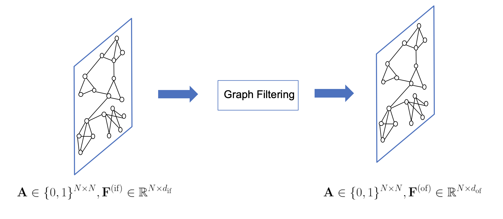
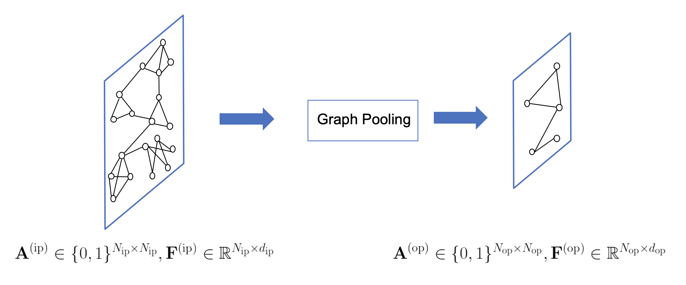

[メインページ](../../index.markdown)

[章目次](./chap5.md)
## 5.1. はじめに

グラフニューラルネットワーク（GNN）は，グラフ構造を持つデータに深層ニューラルネットワークを適用することを目的としている． グラフは一定パターンを持つ構造ではないため，従来の深層ニューラルネットワークをグラフ構造データに一般化することは容易ではない． グラフニューラルネットワークの研究は，21世紀初頭に最初のGNNモデル(Scarselli *et al*., 2005, 2008)がノードおよびグラフに焦点を当てたタスクの両方に対して提案されたことにさかのぼる． 深層学習技術がコンピュータビジョンや自然言語処理などの幅広い分野で大きな人気を博すようになると，多くの研究者はこの研究分野に力を注ぐようになった．

グラフニューラルネットワークは，グラフの表現学習の一過程として捉えることができる． ノードに焦点を当てたタスクでは，GNNは各ノードに対する優れた特徴を学習し，タスクの実行を容易にすることを目標にしている． グラフに焦点を当てたタスクでは，GNNはグラフ全体を代表する特徴を学習することを目標としており，このタスクにおいてはノード特徴の学習は通常，そのための中間的なステップとなる． ノードの特徴を学習する過程では，入力ノードの特徴とグラフ構造の両方を活用することが多い． 具体的にこのプロセスは，以下のようにまとめることができる：

 

$$
 \symbf{F}^{(\mathrm{of})}=h\left(\symbf{A}, \symbf{F}^{(\mathrm{if})}\right) $$

 

ここで， $\symbf{A} \in \mathbb{R}^{N \times N}$ は（グラフの構造に相当する）ノード数 $N$ 個のグラフの隣接行列を表し， $\symbf{F}^{(\text{if})} \in \mathbb{R}^{N \times d_{\mathrm{if}}}$ と $\symbf{F}^{(\text{of})} \in \mathbb{R}^{N \times d_{\text {of}}}$ は，それぞれ入力特徴行列と出力特徴行列を表す（ $d_{\text{if}}$ と $d_{\text{of}}$ は，それぞれ入力と出力におけるノードが持つ特徴の次元を表す）． 本書では一般に，ノードの特徴とグラフ構造を入力とし，新しいノードの特徴の集合を出力する処理を, 「グラフフィルタリング」と呼ぶことにする． 図5.1中の上付き文字（または下付き文字）にある"if"と"of"は，それぞれフィルタリングの入力(input of filtering)と出力(output of filtering)を表している． また，演算子 $h(\cdot,\, \cdot)$ を「グラフフィルタ」と呼ぶ． 図5.1は典型的なグラフフィルタリング操作を示しており，この操作は「グラフ構造を変えず，ノードの特徴のみを更新する」ものである．

<figure>

<figcaption>図5.1 グラフフィルタリング</figcaption>

</figure>

ノードに焦点を当てたタスクでは，グラフフィルタリング操作だけで十分であり，通常は複数のグラフフィルタリング操作を連続的に積み重ねることで最終的なノードの特徴量を生成する． しかし，グラフに焦点を当てたタスクでは，ノード特徴量からグラフ全体の特徴量を生成するために別の操作が必要になる． そこで，従来のCNNと同様に，ノードの特徴量を集約しグラフ全体の特徴量を生成するような"プーリング操作"が提案されている． 従来のCNNは（画像データのような）規則正しいグリッド上に存在するデータに適用される． しかし，グラフ構造は不規則であるため，グラフニューラルネットワーク専用のプーリング演算が必要となる． 直感的にグラフに対するプーリング操作は，グラフ構造情報を利用するのが自然である． 実際，プーリング操作の多くはグラフを入力として受け取り，ノード数の少ない粗化されたグラフ(coarsened graph)を生成する [^1] ．

従って，プーリング操作の要点は，粗化されたグラフの構造（隣接行列）とそのグラフ内のノードの特徴量を生成することである． 一般に，図5.2に示すように，グラフプーリング操作は以下のように記述することができる．

 $$
 \symbf{A}^{(\mathrm{op})}, \symbf{F}^{(\mathrm{op})}=\operatorname{pool}\left(\symbf{A}^{(\mathrm{ip})}, \symbf{F}^{(\mathrm{ip})}\right)
    
\tag{5.2} $$
 

ここで， $\symbf{A}^{(\mathrm{ip})} \in \mathbb{R}^{N_{\mathrm{ip}} \times N_{\mathrm{ip}}}$ と $\symbf{F}^{(\mathrm{ip})} \in \mathbb{R}^{N_{\mathrm{ip}} \times d_{\mathrm{ip}}}$ ，そして  $\symbf{A}^{(\mathrm{op})} \in \mathbb{R}^{N_{\mathrm{op}} \times N_{\mathrm{op}}}$ と  $\symbf{F}^{(\mathrm{op})} \in \mathbb{R}^{N_{\mathrm{op}} \times d_{\mathrm{op}}}$  はそれぞれ，プーリング前後の隣接行列と特徴量行列を表す． また，上付き文字（または下付き文字）"ip" と "op"はそれぞれ，プーリングの入力(input of pooling)と出力(output of pooling)を表す． なお，粗化されたグラフのノード数 $N_{\mathrm{op}}$ に対しては， $N_{\mathrm{op}}<N_{\mathrm{ip}}$ を満たすことになる．

<figure>

<figcaption>図5.2 グラフプーリング</figcaption>

</figure>

一般的なグラフニューラルネットワークモデルは，グラフフィルタリング操作とグラフプーリング操作のどちらか一方，または両方から構成されている． ノードに焦点を当てたタスクの場合，GNNはグラフフィルタリング演算のみを利用する． このとき，グラフフィルタリング層が複数連続し，前の層の出力が次の層の入力となるような構成が一般的である． 一方グラフに焦点を当てたタスクの場合，GNNはグラフフィルタリングとグラフプーリング演算の両方を必要とする． このとき，プーリング層は通常，グラフフィルタリング層をいくつかのブロックに分割し，それぞれのブロックの間に挿入されることになる． 本章では，まずGNNの一般的な構成を簡単に紹介し，次に代表的なグラフフィルタリング操作およびグラフプーリング操作の詳細を説明していく．

[メインページ](../../index.markdown)

[章目次](./chap5.md)

[前の節へ](./subsection_00.md) [次の節へ](./subsection_02.md)

[^1]: 訳注：粗化(そか)という言葉は「細かいものを大雑把にすることや，詳細な情報を省略して大まかな情報にする」ことを意味している．そこから，粗化されたグラフは，「元のグラフを大まかに抽象化して縮小化したグラフ」として理解できる．
