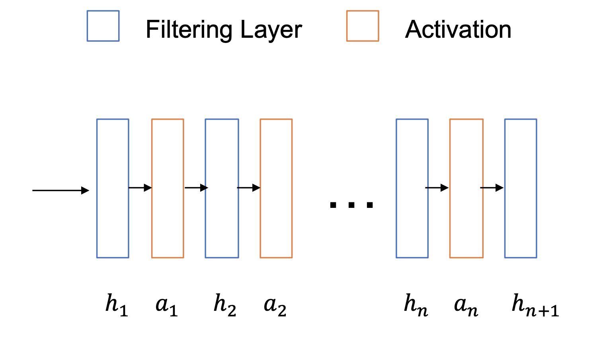
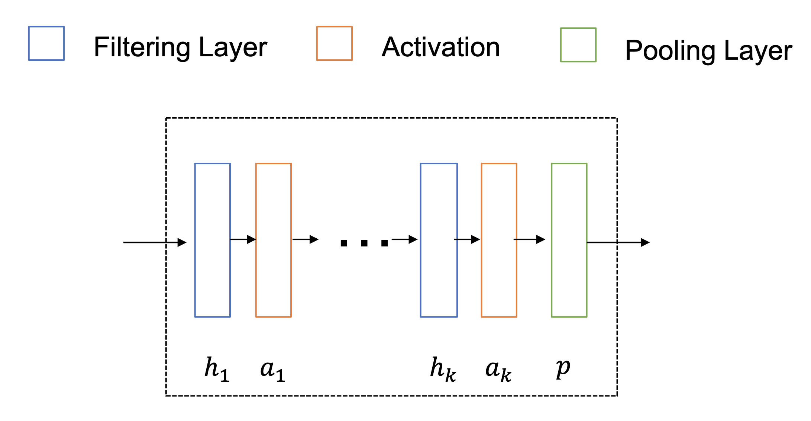
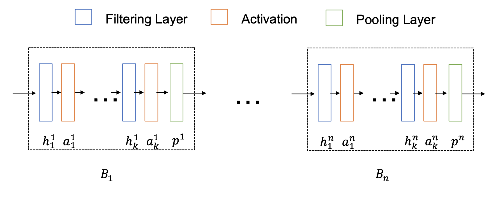

[メインページ](../../index.markdown)

[章目次](./chap5.md)
## 5.2. 一般的なGNNのフレームワーク

本節では，ノードに焦点を当てたタスク，グラフに焦点を当てたタスクのそれぞれについて， 一般的なGNNのフレームワークを紹介する． 事前に，本節以降で使う記法を導入する． グラフは $\symcal{G}=\{\symcal{V},\, \symcal{E}\}$ と表記する．  $N$ 個のノードから成るグラフの隣接行列は $\symbf{A}$ と表記する． また，グラフの特徴量は $\symbf{F} \in \mathbb{R}^{N \times d}$ と表記する． ここで， $\symbf{F}$ の各行はノードに対応し， $d$ は特徴量の次元を表す．

### ノードに焦点を当てたタスクのフレームワーク

ノードに焦点を当てたタスクのフレームワークは，グラフフィルタリングと非線形活性化関数によって構成されているとみなすことができる． 図5.3に $L$ 個のグラフフィルタリング層と $L-1$ 個の活性化層(3.2.2節参照) から成るGNNのフレームワークを示した． ここで， $h_i(\cdot)$ と $\alpha_i(\cdot)$ はそれぞれ $i$ 番目のグラフフィルタリングと活性化層を表す． また， $\symbf{F}^{(i)}$ を $i$ 番目のグラフフィルタリングの出力とし， $d_i$ を $\symbf{F}^{(i)}$ の次元を表すとする． グラフ構造は変化しないので， $\symbf{F}^{(i)} \in \mathbb{R}^{N \times d_i}$ となる． これらの表記を用いると， $i$ 番目のグラフフィルタリング層は次のように書くことができる：

 

$$
 \symbf{F}^{(i)}=h_i\left(\symbf{A}, \alpha_{i-1}\left(\symbf{F}^{(i-1)}\right)\right) \nonumber $$

 

ここで， $\alpha_{i-1}(\cdot)$ は $(i-1)$ 番目のグラフフィルタリング層の後に適用される，要素ごとの活性化関数である． ただし，入力の特徴量に対しては活性化関数を適用しないので，（表記を少しばかり雑に扱ってしまうが） $\alpha_0$ は恒等変換を表しているとする． 最終的な出力 $\symbf{F}^{(L)}$ は，下流で行うノードに焦点を当てたタスクに応じて，専用の層への入力として活用されることになる．

<figure>

<figcaption>図5.3 ノードに焦点をあてたタスクのフレームワーク</figcaption>

</figure>

### グラフに焦点を当てたタスクのフレームワーク

グラフに焦点を当てたタスクのためのGNNのフレームワークは， グラフフィルタリング層，活性化層，グラフプーリング層の3種類の層から構成されている． グラフフィルタリング層と活性化層は，ノードに焦点を当てたタスクの場合のフレームワークと同様の機能を持つ． これらの層はより良いノードの特徴量を生成するために使用される． 他方でグラフプーリング層は，ノードの特徴量を集約し，グラフ全体の情報を捉えることができるより高次の特徴量を生成するために利用される． 一般に，グラフプーリング層は，一連のグラフフィルタリング層と活性化層の後に続く． グラフプーリング層の後に，より抽象的で高次のノードの特徴量を持つ，粗化されたグラフが生成される． これらの層は図5.4に示すようなブロックとしてまとめることができる． ここで， $h_i,\, \alpha_i,\, p$ はそれぞれ，このブロック内の $i$ 番目のフィルタリング層， $i$ 番目の活性化層，およびプーリング層を表す． ブロックの入力はグラフ $\symcal{G}\_{\text{ib}}=\left\\{\symcal{V}\_{\text{ib}},\, \symcal{E}\_{\text{ib}}\right\\}$ の隣接行列 $\symbf{A}^{(\text{ib})}$ と特徴量 $\symbf{F}^{(\text{ib})}$ であり， ブロックの出力は新たに生成された，粗化されたグラフ $\symcal{G}\_{\text{ob}}=\left\\{V_{\text{ob}},\, \symcal{E}\_{\text{ob}}\right\\}$ の隣接行列 $\symbf{A}^{(\text{ob})}$ と特徴量 $\symbf{F}^{(\text{ob})}$ である． ブロックにおける計算手順は次のように定式化することができる．

  

$$

\begin{eqnarray}
    &&\symbf{F}^{(i)}=h_i\left(\symbf{A}^{(\text{ib})},\, \alpha_{i-1}\left(\symbf{F}^{(i-1)}\right)\right) \quad \text { for } \quad i=1, \ldots, k \nonumber \\
    &&\symbf{A}^{(\text{ob})},\, \symbf{F}^{(\text{ob})}=p\left(\symbf{A}^{(\text{ib})},\, \symbf{F}^{(k)}\right)
    
\end{eqnarray}
\tag{5.3}
$$

  

ここで， $\alpha_i\;(i\neq 0)$ は活性化関数， $\alpha_0$ は恒等変換である．よって $\symbf{F}^{(0)}=\symbf{F}^{(\text{ib})}$ が成り立つ． 以上の計算は次のようにまとめることができる：  

$$
 \symbf{A}^{(o b)},\, \symbf{F}^{(\text{ob})}=B\left(\symbf{A}^{(\text{ib})},\, \symbf{F}^{(\text{ib})}\right) $$

 

<figure>

<figcaption>図5.4 グラフに焦点を当てたタスクのためのGNNの構成ブロック</figcaption>

</figure>

図5.5に示すように，GNN全体はさらに一つ以上のブロックから構成される．  $L$ 個のブロックからなるGNNの計算過程は次のように定式化することができる：

 $$
 \symbf{A}^{(j)},\, \symbf{F}^{(j)}=B^{(j)}\left(\symbf{A}^{(j-1)}, \symbf{F}^{(j-1)}\right) \quad \text { for } \quad j=1, \ldots, L
    
\tag{5.4} $$
 

ここで， $\symbf{F}^{(0)}=\symbf{F}$ と $\symbf{A}^{(0)}=\symbf{A}$ はそれぞれ，元のグラフの初めの特徴量と隣接行列を表す． 式(5.4)に示したように，ブロックの出力がその後に続くブロックの入力となっている． ブロックが一つだけの場合(つまり $L=1$ のとき)，GNNは元のグラフから直接グラフ全体の特徴量を生成することになるため，この場合GNNのフレームワークは「フラットである」とされる． このことからプーリング層付きのGNNのフレームワークは， $L>1$ のときに階層的であるとみなすことができる． これらのブロックを通過する間，ノードの特徴量は次々に集約されていき，より多くの粗化されたグラフが生成されていくことで，グラフ全体の特徴量が形成されていくことになる．

<figure>

<figcaption>図5.5 グラフに焦点を当てたタスクのGNNの構成</figcaption>

</figure>

[メインページ](../../index.markdown)

[章目次](./chap5.md)

[前の節へ](./subsection_01.md) [次の節へ](./subsection_03.md)

