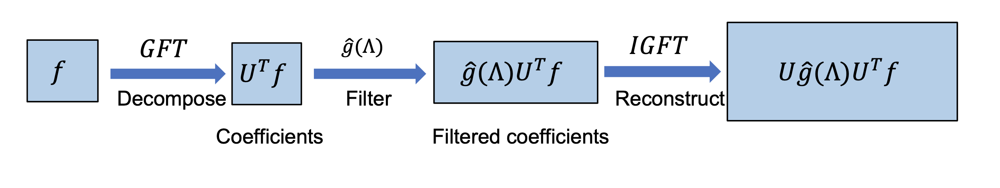

[メインページ](../../index.markdown)

[章目次](./chap5.md)
## 5.3. グラフフィルタ

グラフフィルタの設計には様々な視点があり，大まかには以下の2つに分類される：

1.  空間型グラフフィルタ

2.  スペクトル型グラフフィルタ

空間グラフフィルタは，グラフ構造（ノード同士のつながり）を積極的に利用し，空間(グラフ)領域における特徴量の洗練を実行する． これに対して，スペクトル型グラフフィルタは，スペクトル領域におけるフィルタリング演算を設計するために．スペクトルグラフ理論を利用する [^2]．

これら2つのグラフフィルタは密接に関連している． 特に，スペクトル型グラフフィルタのいくつかは，空間型グラフフィルタであるとみなすこともできる． 本節では，まずスペクトル型グラフフィルタを紹介し，いくつかの種類のスペクトル型グラフフィルタがどのように空間型グラフフィルタの観点で解釈できるかを説明する． その後，さらに多くの空間型グラフフィルタについて紹介していく．

### スペクトル型グラフフィルタ

スペクトル型グラフフィルタは，グラフ信号のスペクトル領域上で設計されている． そこでまずは，グラフの周波数フィルタリングについて説明し，その後，それをどのようにスペクトル型グラフフィルタの設計に適用するかを解説する．

#### グラフの周波数フィルタリング

図5.6に示すように，グラフの周波数フィルタリングは，グラフ信号の周波数を変調し，特定の周波数成分を保持・増幅し，他の周波数成分を除去・減少させる． したがって，グラフ信号 $\symbf{f} \in \mathbb{R}^{N}$ が与えられた場合，まずグラフフーリエ変換（Graph Fourier Transform, GFT）を適用して，信号のグラフフーリエ係数を取得する． 次に，これらの係数を変調した後，逆グラフフーリエ変換によって空間領域でグラフ信号を再構築する必要がある．

2章で導入したように，グラフ $\symcal{G}$ 上の信号 $\symbf{f} \in \mathbb{R}^{N}$ のGFTは次のように定義される：  

$$
 \hat{\symbf{f}}=\symbf{U}^{\top} \symbf{f} $$

  ここで， $\symbf{U}$ は $\symcal{G}$ のラプラシアン行列の固有ベクトルで構成され， $\hat{\symbf{f}}$ は信号 $\symbf{f}$ のグラフフーリエ係数を表す． これらのグラフフーリエ係数は，各グラフフーリエ成分（グラフの各固有ベクトル）がグラフ信号 $\symbf{f}$ にどのように寄与しているかを表している． 具体的には， $\hat{\symbf{f}}$ の $i$ 番目の要素は，周波数 $\lambda_i$ を持つ $i$ 番目のグラフフーリエ成分（固有ベクトル） $\symbf{u}\_i$ に対応する． ここで， $\lambda_i$ は $\symbf{u}\_i$ に対応する固有値である．

信号 $\symbf{f}$ の周波数を変調するために，グラフフーリエ係数を以下のようにフィルタリングする：  

$$
 \hat{\symbf{f}}^{\prime}[i]=\hat{\symbf{f}}[i] \cdot \gamma\left(\lambda_i\right) \quad (i=1, \ldots, N)%TODO: forをなくしているがこれでいいか確認する． $$

  ここで， $\gamma\left(\lambda_i\right)$ は周波数 $\lambda_i$ を入力として，対応する周波数成分をどの程度変調させるかを決める関数である． これを行列形式で書くと次のようになる：  

$$
 \hat{\symbf{f}}^{\prime}=\gamma(\boldsymbol{\Lambda}) \cdot \hat{\symbf{f}}=\gamma(\boldsymbol{\Lambda}) \cdot \symbf{U}^{\top} \symbf{f} $$

  ここで， $\boldsymbol{\Lambda}$ は周波数（ラプラシアン行列の固有値）を対角上においた対角行列で，  $\gamma(\boldsymbol{\Lambda})$ は $\boldsymbol{\Lambda}$ の対角成分の各要素に $\gamma(\cdot)$ が適用されていることを表す． つまり $\boldsymbol{\Lambda}$ と $\gamma(\boldsymbol{\Lambda})$ は次のように書くことができる：  

$$
 \boldsymbol{\Lambda}=\left(\begin{array}{ccc}\lambda_1 & & 0 \\ & \ddots & \\ 0 & & \lambda_N\end{array}\right);\quad \gamma(\boldsymbol{\Lambda})=\left(\begin{array}{ccc}\gamma\left(\lambda_1\right) & & 0 \\ & \ddots & \\ 0 & & \gamma\left(\lambda_N\right)\end{array}\right) $$

 

<figure>

<figcaption>図5.6 周波数フィルタリングの流れ</figcaption>

</figure>

フィルタリングされたフーリエ係数を用いて， 次のように逆グラフフーリエ変換（IGFT）を適用することで，信号を空間(グラフ)領域に再構成することができる：

 $$
 \symbf{f}^{\prime}=\symbf{U} \hat{\symbf{f}}^{\prime}=\symbf{U} \cdot \gamma(\boldsymbol{\Lambda}) \cdot \symbf{U}^{\top} \symbf{f}
    
\tag{5.5} $$
 

ここで， $\symbf{f}^{\prime}$ はフィルタリング施した後のグラフ信号である． フィルタリング処理は，入力されたグラフ信号に，演算子 $\symbf{U} \cdot \gamma(\boldsymbol{\Lambda}) \cdot \symbf{U}^{\top}$ を適用することと見なすことができる． 便宜上，関数 $\gamma(\boldsymbol{\Lambda})$ をフィルタと呼ぶこともある． というのは， $\gamma(\boldsymbol{\Lambda})$ がグラフ信号 $\symbf{f}$ の各周波数成分をどのようにフィルタリングするかを制御するからである． 例えば，極端な例では， $\gamma\left(\lambda_i\right)$ が0に等しい場合， $\hat{\symbf{f}}^{\prime}[i]=0$ となり，グラフ信号 $\symbf{f}$ から周波数成分 $\symbf{u}\_i$ が取り除かれることになる．

 
<strong>例 5.1 Shuman *et al*., 2013</strong>
 グラフ $\symcal{G}$ 上で定義されたノイズ(雑音)を含むグラフ信号 $\symbf{y}=\symbf{f}\_0+\eta$ を考える（ $\eta$ は独立同分布の正規分布である白色ガウス雑音）． このとき，元の信号 $\symbf{f}\_0$ を復元するという問題について検討することにしよう． ここで，元の信号 $\symbf{f}\_0$ は，元のグラフ $\symcal{G}$ に対して滑らかであると仮定する．

「雑音を持たない信号 $\symbf{f}\_0$ の滑らかさ」という事前情報を取り入れるため，以下のように $\symbf{f}^{\top} \symbf{L f}$ の形の正則化項を最適化問題に組み込む：

 $$
 \arg \min _{\symbf{f}}\|\symbf{f}-\symbf{y}\|^{2}+c \symbf{f}^{\top} \symbf{L} \symbf{f}
    
\tag{5.6} $$
 

ここで， $c>0$  は滑らかさを制御するための定数である． 今考えている最適化問題（目的関数）は凸関数であるので，その微分を0にすることで最適解 $\symbf{f}^{\prime}$ を得ることができる：

  

$$

\begin{eqnarray}
    && 2(\symbf{f}-\symbf{y})+2 c \symbf{L} \symbf{f}=0 \nonumber\\ 
    &\Rightarrow &(I+c \symbf{L}) \symbf{f}=\symbf{y} \nonumber\\ 
    &\Rightarrow &\left(\symbf{U U}^{\top}+c \symbf{U} \boldsymbol{\Lambda} \symbf{U}^{\top}\right) \symbf{f}=\symbf{y} \nonumber \\ 
    &\Rightarrow & \symbf{U}(\symbf{I}+c \boldsymbol{\Lambda}) \symbf{U}^{\top} \symbf{f}=\symbf{y} \nonumber \\ 
    &\Rightarrow & \symbf{f}^{\prime}=\symbf{U}(\symbf{I}+c \boldsymbol{\Lambda})^{-1} \symbf{U}^{\top} \symbf{y}
    
\end{eqnarray}
\tag{5.7}
$$

  

式(5.5)と式(5.7)を比較すると，ノイズを含む信号 $\symbf{y}$ をフィルタ $\gamma(\boldsymbol{\Lambda})=(\symbf{I}+c \boldsymbol{\Lambda})^{-1}$ を用いてフィルタリングすることで, きれいな信号が得られることがわかる． 特定の周波数 $\lambda_l$ に対して，このフィルタは次のように表すことができる．

 $$
 \gamma\left(\lambda_l\right)=\frac{1}{1+c \lambda_l}
    
\tag{5.8} $$
 

ここで，明らかに $\gamma\left(\lambda_l\right)$ は"ローパスフィルタ"の役割を果たしている [^3]． 実際に， $\lambda_l$ が小さいときに $\gamma\left(\lambda_l\right)$ の値は大きくなり，  $\lambda_l$ が大きいときに $\gamma\left(\lambda_l\right)$ の値は小さくなる． したがって，式(5.6)の最適化問題を解くことは，ノイズを含む信号 $\symbf{y}$ に対して式(5.8)のローパスフィルタを適用することと同じになる． 

#### スペクトル型グラフフィルタ

ここまで，グラフの周波数フィルタリング演算子を導入してきたが， この演算子は入力信号の特定の周波数をフィルタリングするために使うことができる． 例えば，フィルタリング後の信号を滑らかにしたい場合， $\lambda$ が小さいときに $\gamma(\lambda)$ を大きく， $\lambda$ が大きいときに $\gamma(\lambda)$ を小さくするようなローパスフィルタを設計すればよい（例5.1）． このようにして，フィルタリングされた信号は，入力信号の低周波部分を主に含んでいるため，滑らかな信号となる． つまり，入力信号の周波数をどのように変調したいかがわかっていれば，それに応じた関数（演算子） $\gamma(\lambda)$ を設計することができる．

しかしながら，グラフニューラルネットワークにおいて，スペクトル型フィルタをグラフフィルタとして利用する場合，どの周波数が重要であるかはわかっていないことが多い． そこで，従来のニューラルネットワークと同様に，グラフフィルタをデータドリブンで学習させることができる． 具体的には， $\gamma(\lambda)$ を特定の関数でモデル化し，そのパラメータをデータから学習させることができる．

 $\gamma(\cdot)$ を設計する際，(まずは)何も制約を入れないのが自然である． そのため $\gamma(\cdot)$ を次のように定義する(Bruna *et al*., 2013)：

 

$$
 \gamma\left(\lambda_l\right)=\theta_l \nonumber $$

 

ここで， $\theta\_l$ はデータから学習されるパラメータである． 行列形式で書くと次のようになる：

 

$$
 \gamma(\Lambda)=\left(\begin{array}{lll}\theta_1 & & 0 \\ & \ddots & \\ 0 & & \theta_N\end{array}\right) \nonumber $$

 

しかし，この種類のフィルタにはいくつかの限界が存在する． まず，学習すべきパラメータの数はノードの数 $N$ に等しく，現実のグラフでは非常に大きくなることがある． したがって，これらのパラメータを格納するための大量のメモリと，それを適合させるための豊富なデータが必要になる． また，フィルタ $\symbf{U} \cdot \gamma(\Lambda) \cdot \symbf{U}^{\top}$ は密な行列になる可能性が高い． そのため，出力信号 $\symbf{f}'$ の $i$ 番目の要素の計算に，グラフ内の全ノードが関わってくる可能性がある． 言い換えると，このフィルタは空間的に局在していない． さらに， $\symbf{U} \cdot \gamma(\Lambda) \cdot \symbf{U}^{\top}$ を計算する際には，ラプラシアン行列の固有値分解と密な行列同士の行列乗算が必要になり，計算コストがかなり高くなる．

以上の問題に対応するために，"多項式フィルタ"が提案された(Defferrard *et al*., 2016)． 関数 $\gamma(\cdot)$ は $K$ 次までの多項式で次のようにモデル化される：

 $$
 \gamma\left(\lambda_l\right)=\sum_{k=0}^{K} \theta_k \lambda_l^{k}
    
\tag{5.9} $$
 

行列形式では，式(5.9)は次のように書き換えることができる：

 $$
 \gamma(\Lambda)=\sum_{k=0}^{K} \theta_k \Lambda^{k}
    
\tag{5.10} $$
 

式(5.9)および式(5.10)のパラメータの数は $K + 1$ であることは明白であるから，多項式フィルタはグラフのノード数に依存しないことがわかる． さらに，（このあと確認するが） $\symbf{U} \cdot \gamma(\boldsymbol{\Lambda}) \cdot \symbf{U}^{\top}$ は"ラプラシアン行列の多項式"に簡略化できることを示せる [^4]．

これは以下の2つの意味を持つ：

1.  計算量の大きいラプラシアン行列 $\symbf{L}$ の固有値分解の計算をしなくて済む．

2.  多項式でパラメータ化されたフィルタリング演算子 $\gamma(\cdot)$ は空間的に局在している．すなわち，出力 $\symbf{f}^{\prime}$ の各要素の計算にはグラフ全体の少数のノードしか関与しない．

多項式フィルタ演算子がラプラシアン行列の多項式として定式化できることを示してから，それを空間的な観点から理解していくことにしよう．

まず， $\symbf{f}$ に多項式フィルタを作用させることで， 式(5.5)より，次のように出力 $\symbf{f}^{\prime}$ を得ることができる：

  

$$

\begin{eqnarray}
    \symbf{f}^{\prime} &=&\symbf{U} \cdot \gamma(\boldsymbol{\Lambda}) \cdot \symbf{U}^{\top} \symbf{f} \nonumber\\ 
    &=&\symbf{U} \cdot \sum_{k=0}^{K} \theta_k \boldsymbol{\Lambda}^{k} \cdot \symbf{U}^{\top} \symbf{f} \nonumber\\ 
    &=&\sum_{k=0}^{K} \theta_k \symbf{U} \cdot \boldsymbol{\Lambda}^{k} \cdot \symbf{U}^{\top} \symbf{f}
    
\end{eqnarray}
\tag{5.11}
$$

  

次に，式(5.11)を簡略化するため， $\symbf{U} \cdot \boldsymbol{\Lambda}^{k} \cdot \symbf{U}^{\top}=\symbf{L}^{k}$ が成り立つことを以下に示す：

  

$$

\begin{eqnarray}
    \symbf{U} \cdot \boldsymbol{\Lambda}^{k} \cdot \symbf{U}^{\top} &=&\symbf{U} \cdot\left(\boldsymbol{\Lambda} \symbf{U}^{\top} \symbf{U}\right)^{k} \symbf{U}^{\top} \nonumber\\ 
    &=&\underbrace{\left(\symbf{U} \cdot \boldsymbol{\Lambda} \cdot \symbf{U}^{\top}\right) \cdots\left(\symbf{U} \cdot \boldsymbol{\Lambda} \cdot \symbf{U}^{\top}\right)}_k \nonumber\\ &=&\symbf{L}^{k}
    
\end{eqnarray}
\tag{5.12}
$$

  

ここで得た式(5.12)を用いると，式(5.11)は次のように書くことができる：

  

$$

\begin{eqnarray}
    \symbf{f}^{\prime} &=&\sum_{k=0}^{K} \theta_k \symbf{U} \cdot \boldsymbol{\Lambda}^{k} \cdot \symbf{U}^{\top} \symbf{f} \nonumber\\ 
    &=&\sum_{k=0}^{K} \theta_k \symbf{L}^{k} \symbf{f} \nonumber
\end{eqnarray}
$$

  

グラフの接続関係は多くの場合局所的であるから，ラプラシアン行列の多項式は疎となることが多い．  $\symbf{L}^k$ の $(i,\,j)$ 要素は( $i \neq j$ )，次の補題で説明するように，ノード $v_i$ とノード $v_j$ の間の最短パスの長さが $k$ 以下の場合のみ非ゼロとなる．

 
<strong>補題 5.2</strong>
  $\symcal{G}$ をグラフとし， $\symbf{L}$ をラプラシアン行列とする． 最短パスの長さが $\operatorname{dis}\left(v_i, v_j\right)>k$ ならば， ラプラシアン行列の $k$ 乗の $(i,\,j)$ 要素である $\symbf{L}_{i, j}^{k}$ について，  $\symbf{L}_{i, j}^{k}=0$ が成り立つ．

<strong>証明: </strong>
 帰納法で示す．

 $\symbf{k=1}$ 

:   ラプラシアン行列 $\symbf{L}$ の定義より，  $\operatorname{dis}\left(v_i, v_j\right)>1$ ならば $\symbf{L}_{i, j}=0$ となるのは明らか．

 $\symbf{k=n}$ 

:    $k=n$ のとき， $\operatorname{dis}\left(v_i, v_j\right)>n$ ならば $\symbf{L}_{i, j}^{n}=0$ が成り立つと仮定する．

 $\symbf{k=n+1}$ 

:    $k=n+1$ のとき， $\operatorname{dis}\left(v_i, v_j\right)>n+1$ ならば $\symbf{L}_{i, j}^{n+1}=0$ が成り立つことを示す．  $\symbf{L}_{i, j}^{n+1}$ は $\symbf{L}^{n}$ と $\symbf{L}$ を用いて次のように書くことができる：

     

$$
 \symbf{L}_{i, j}^{n+1}=\sum_{h=1}^{N} \symbf{L}_{i, h}^{n} \symbf{L}_{h, j} \nonumber $$

 

    次に， $h=1, \ldots, N$ の全ての場合について $\symbf{L}_{i, h}^{n} \symbf{L}_{h, j}=0$ となることを示す． これは， $\symbf{L}_{i, j}^{n+1}=0$ であることを意味する．

    ・ $\symbf{L}_{h, j}\neq0$ のとき

    :    $k=1$ の結果から $\operatorname{dis}\left(v_h, v_j\right) \leq 1$ が成り立つ． これは $h=j$ であるか，またはノード $v_h$ とノード $v_j$ の間にエッジがあるということを意味する． 次に $\operatorname{dis}\left(v_i, v_h\right) \leq n$ とおくと， $\operatorname{dis}\left(v_h, v_j\right) \leq 1$ より， $\operatorname{dis}\left(v_i, v_j\right) \leq n+1$ となるが，これは仮定に反する． したがって， $\operatorname{dis}\left(v_i, v_h\right)>n$ を得る． すると $k=n$ での仮定から $\symbf{L}_{i, h}^{n}=0$ となるが，これは $\symbf{L}_{i, h}^{n} \symbf{L}_{h, j}=0$ が成り立つということである．

    ・ $\symbf{L}_{h, j}=0$ のとき

    :   このときも， $\symbf{L}_{i, h}^{n} \symbf{L}_{h, j}=0$ が成り立つことは明らか．

    したがって， $\operatorname{dis}\left(v_i, v_j\right)>n+1$ ならば $\symbf{L}_{i, j}^{n+1}=0$ が成り立つ．

以上で補題が示された．Q.E.D. 

 

ここで，出力信号 $\symbf{f}^{\prime}$ の1つの要素に着目し， その計算がグラフ内の他のノードとどのように関連しているかをみてみよう． 具体的には，ノード $v_i$ が持つ出力信号の値は，以下のように計算することができる:

 $$
 \symbf{f}^{\prime}[i]=\sum_{v_j \in \symcal{V}}\left(\sum_{k=0}^{K} \theta_k \symbf{L}_{i, j}^{k}\right) \symbf{f}[j]    
\tag{5.13} $$
 

これは全ノードの元の信号の，重み $\sum_{k=0}^{K} \theta\_k \symbf{L}\_{i, j}^{k}$ での線形結合とみなすことができる． 系5.2より， $\operatorname{dis}\left(v_i, v_j\right)>k$ ならば $\symbf{L}\_{i, j}^{k}=0$ である． したがって，この計算にはすべてのノードが関与するのではなく， ノード $v_i$ から $K$ 次近傍以内のノードのみが関与することになる． ノード $v_i$ から $K$ 次近傍以内のノードのみを使って式(5.13)を書き換えると，

 $$
 \symbf{f}^{\prime}[i]=b_{i, i} \symbf{f}[i]+\sum_{v_j \in \symcal{N}^{K}\left(v_i\right)} b_{i, j} \symbf{f}[j]    
\tag{5.14} $$
 

となる． ここで， $\symcal{N}^{K}\left(v_i\right)$ はノード $v_i$ の $K$ 次近傍以内のすべてのノードを表す．  $b_{i, j}$ は次のように定義される：

 

$$
 b_{i, j}=\sum_{k=\operatorname{dis}\left(v_i, v_j\right)}^{K} \theta_k \symbf{L}_{i, j}^{k} \nonumber $$

 

ここで， $\operatorname{dis}\left(v_i, v_j\right)$ はノード $v_i$ とノード $v_j$ 間の最短パスの長さを表す． 多項式フィルタは，特定のノードの出力を計算するときに，K次近傍だけを含むので，このフィルタは空間領域に局在していることがよくわかる． さらに，多項式フィルタは，式(5.14)に示したように， 空間グラフ構造に基づいてフィルタリング処理を記述することができるため， 空間型のグラフフィルタとみなすこともできる． 類似したグラフフィルタ演算は Atwood and Towsley (2016)で提案されている． この研究ではラプラシアン行列のべき乗を用いる代わりに， 対象ノードから数段離れた近傍ノードの情報を集約するため，隣接行列のべき乗の線形結合を用いたグラフフィルタ操作が提案されている．

多項式フィルタには様々な利点があるが，まだいくつかの限界がある． 多項式の基底（ $1,\, x,\, x^2, \dots$ ）が互いに直交していないという大きな問題がある． したがって，学習パラメータは互いに依存し，学習過程でのパラメータの微小変化に対して不安定になる． つまり，あるパラメータ(係数)を更新すると，他のパラメータ(係数)が変化する可能性がある． この問題に対処するため，直交基底集合を持つチェビシェフ多項式がフィルタのモデル化に利用される（Defferrard *et al*., 2016）． そこで次に，チェビシェフ多項式について簡単に説明し，チェビシェフ多項式に基づく「チェビシェフフィルタ」について詳しく説明する．

#### チェビシェフ多項式とチェビシェフフィルタ

チェビシェフ多項式 $T_k(y)$ は以下の漸化式に従う：

 $$
 T_k(y)=2 y T_{k-1}(y)-T_{k-2}(y)
    
\tag{5.15} $$
 

なお， $T_0(y)=1,\, T_1(y)=y$ である． またこれらのチェビシェフ多項式は， $y \in[-1,\, 1]$ に対して，次のような三角関数を使って表すことができる：

 

$$
 T_k(y)=\cos (k \arccos (y))\nonumber $$

 

これは，各 $T_k(y)$ が $[-1,1]$ の範囲内に収まることを意味する． さらに，チェビシェフ多項式は次の関係式を満たす：

 $$
 \int_{-1}^{1} \frac{T_l(y) T_m(y)}{\sqrt{1-y^{2}}} d y=\begin{cases}\delta_{l,m} \pi/2 & (m,\,l>0)\\\pi & (m=l=0)\end{cases}
    
\tag{5.16} $$
 

ここで， $l=m$ のときのみ $\delta_{l, m}=1$ が成り立ち，それ以外の場合には $\delta_{l, m}=0$ となる． 式(5.16)はチェビシェフ多項式が互いに直交していることを意味する [^5]．

したがって，チェビシェフ多項式は， $d y / \sqrt{1-y^{2}}$ を計量としたときの，自乗可積分関数のヒルベルト空間 $L^{2}\left([-1,1],\, dy/\sqrt{1-y^{2}}\right)$ における直交基底を構成する [^6]．

チェビシェフ多項式の定義域が $[-1,1]$ であるため， チェビシェフ多項式でフィルタを近似するには， 次のようにラプラシアン行列の固有値をスケール変換し，シフトさせる：

 

$$
 \tilde{\lambda}_l=\frac{2 \cdot \lambda_l}{\lambda_{\max }}-1 \nonumber $$

 

ここで， $\lambda_{\max}=\lambda_N$ はラプラシアン行列の最大固有値を表す． この操作により，すべての固有値が $[-1,1]$ の範囲に変換されることは明らかである． これに対応して，行列形式では，変換後の対角固有値行列は次のように示される：

 

$$
 \tilde{\boldsymbol{\Lambda}}=\frac{2 \boldsymbol{\Lambda}}{\lambda_{\max }}-\symbf{I} \nonumber $$

 

ここで， $\symbf{I}$ は単位行列である． チェビシェフフィルタは，チェビシェフ多項式を途中で打ち切った形でパラメータ化され，次のように定式化される：

 

$$
 \gamma(\boldsymbol{\Lambda})=\sum_{k=0}^{K} \theta_k T_k(\tilde{\boldsymbol{\Lambda}}) \nonumber $$

 

グラフ信号 $\symbf{f}$ にチェビシェフフィルタを作用させる操作は次のように定義される：

 

$$

\begin{aligned}
    \symbf{f}^{\prime} &=\symbf{U} \cdot \sum_{k=0}^{K} \theta_k T_k(\tilde{\boldsymbol{\Lambda}}) \symbf{U}^{\top} \symbf{f} \nonumber\\ 
    &=\sum_{k=0}^{K} \theta_k \symbf{U} T_k(\tilde{\boldsymbol{\Lambda}}) \symbf{U}^{\top} \symbf{f}
    
\end{aligned}
\tag{5.17}
$$

 

次に， $\tilde{\symbf{L}}=\frac{2 \symbf{L}}{\lambda_{\max }}-\symbf{I}$ について， $\symbf{U} T_k(\tilde{\boldsymbol{\Lambda}}) \symbf{U}^{\top}=T_k(\tilde{\symbf{L}})$ であることを次の定理より示す．

 
<strong>定理 5.3</strong>
  $\symcal{G}$ をグラフとし， $\symbf{L}$ をラプラシアン行列とする．  $k \geq 0$ について，以下が成り立つ．

 

$$
 \symbf{U} T_k(\tilde{\boldsymbol{\Lambda}}) \symbf{U}^{\top}=T_k(\tilde{\symbf{L}}) \nonumber $$

 

ここで，

 

$$
 \tilde{\symbf{L}}=\frac{2 \symbf{L}}{\lambda_{\max }}-\symbf{I}. \nonumber $$

 

<strong>証明: </strong>
  $k=0$ については $\symbf{U} T_0(\tilde{\boldsymbol{\Lambda}}) \symbf{U}^{\top}=\symbf{I}=T_0(\tilde{\symbf{L}})$ より成り立つ．

 $k=1$ については，

  

$$

\begin{eqnarray}
    \symbf{U} T_1(\tilde{\boldsymbol{\Lambda}}) \symbf{U}^{\top} &=&\symbf{U} \tilde{\boldsymbol{\Lambda}} \symbf{U}^{\top} \nonumber \\ 
    &=&\symbf{U}\left(\frac{2 \boldsymbol{\Lambda}}{\boldsymbol{\Lambda}_{\max }}-\symbf{I}\right) \symbf{U}^{\top} \nonumber \\ 
    &=&\frac{2 \symbf{L}}{\lambda_{\max }}-\symbf{I} \nonumber \\ 
    &=&T_1(\tilde{\symbf{L}}) \nonumber
\end{eqnarray}
$$

  

したがって， $k=1$ についても成り立つ．

この式が $k=n-2$ と $k=n-1$ で成り立つとする（ただし $n\geq2$ ）．  $k=n$ でも成り立つことが式(5.15)より帰納的に示すことができる:

  

$$

\begin{eqnarray}
    \symbf{U} T_n(\tilde{\boldsymbol{\Lambda}}) \symbf{U}^{\top} &=&\symbf{U}\left[2 \tilde{\boldsymbol{\Lambda}} T_{n-1}(\tilde{\boldsymbol{\Lambda}})-T_{n-2}(\tilde{\boldsymbol{\Lambda}})\right] \symbf{U}^{\top} \nonumber\\ 
    &=&2 \symbf{U} \tilde{\boldsymbol{\Lambda}} T_{n-1}(\tilde{\boldsymbol{\Lambda}}) \symbf{U}^{\top}-\symbf{U} T_{n-2}(\tilde{\boldsymbol{\Lambda}}) \symbf{U}^{\top} \nonumber\\ 
    &=&2 \symbf{U} \tilde{\boldsymbol{\Lambda}} \symbf{U} \symbf{U}^{\top} T_{n-1}(\tilde{\boldsymbol{\Lambda}}) \symbf{U}^{\top}-T_{n-2}(\tilde{\symbf{L}}) \nonumber\\ 
    &=&2 \tilde{\symbf{L}} T_{n-1}(\tilde{\symbf{L}})-T_{n-2}(\tilde{\symbf{L}}) \nonumber\\
    &=&T_n(\tilde{\symbf{L}}) \nonumber
\end{eqnarray}
$$

  

Q.E.D. 

 

 定理5.3より，式(5.17)はさらに以下のように簡単にかける：

  

$$

\begin{eqnarray}
    \symbf{f}^{\prime} &=&\sum_{k=0}^{K} \theta_k \symbf{U} T_k(\tilde{\boldsymbol{\Lambda}}) \symbf{U}^{\top} \symbf{f} \nonumber\\ 
    &=&\sum_{k=0}^{K} \theta_k T_k(\tilde{\symbf{L}}) \symbf{f} \nonumber
\end{eqnarray}
$$

  

したがって，チェビシェフフィルタは多項式フィルタの長所を活かしつつ，学習過程でのパラメータの微小変化に対してより安定になる．

#### GCNフィルタ：単純化された1次のチェビシェフフィルタ

チェビシェフフィルタは，ノードの特徴量を計算する際に，ノードのK次近傍の情報を使う． Kipf and Welling (2016a)では，GCNフィルタと名付けられた，チェビシェフフィルタの簡易版が提案されている． チェビシェフ多項式の次数を $K=1$ とし， $\lambda_{\max } \approx 2$ と近似することでチェビシェフフィルタを以下のように簡略化する：

  

$$

\begin{eqnarray}
    \gamma(\boldsymbol{\Lambda}) &=&\theta_0 T_0(\tilde{\boldsymbol{\Lambda}})+\theta_1 T_1(\tilde{\boldsymbol{\Lambda}}) \nonumber\\ 
    &=&\theta_0 \symbf{I}+\theta_1 \tilde{\boldsymbol{\Lambda}} \nonumber\\ 
    &=&\theta_0 \symbf{I}+\theta_1(\boldsymbol{\Lambda}-\symbf{I}) \nonumber
\end{eqnarray}
$$

  

これに対応して，グラフ信号 $\symbf{f}$ にGCNフィルタを適用することで，出力信号 $\symbf{f}^{\prime}$ を次のように得ることができる：

  

$$

\begin{eqnarray}
    \symbf{f}^{\prime} &=&\symbf{U} \gamma(\boldsymbol{\Lambda}) \symbf{U}^{\top} \symbf{f} \nonumber\\ 
    &=&\theta_0 \symbf{U I} \symbf{U}^{\top} \symbf{f}+\theta_1 \symbf{U}(\boldsymbol{\Lambda}-\symbf{I}) \symbf{U}^{\top} \symbf{f} \nonumber\\ 
    &=&\theta_0 \symbf{f}-\theta_1(\symbf{L}-\symbf{I}) \symbf{f} \nonumber\\ 
    &=&\theta_0 \symbf{f}-\theta_1\left(\symbf{D}^{-\frac{1}{2}} \symbf{A} \symbf{D}^{\frac{1}{2}}\right) \symbf{f}
    
\end{eqnarray}
\tag{5.18}
$$

  

なお，式(5.18)は，定義2.29の正規化ラプラシアン行列( $\symbf{L}=\symbf{I}-\symbf{D}^{-\frac{1}{2}} \symbf{A} \symbf{D}^{-\frac{1}{2}}$ )を用いることで成り立つ． さらに， $\theta=\theta\_0=-\theta\_1$ とすることで式(5.18)は次のように簡略化することができる：

  

$$

\begin{eqnarray}
    \symbf{f}^{\prime} &=&\theta_0 \symbf{f}-\theta_1\left(\symbf{D}^{-\frac{1}{2}} \symbf{A} \symbf{D}^{\frac{1}{2}}\right) \symbf{f} \nonumber\\ 
    &=&\theta\left(\symbf{I}+\symbf{D}^{-\frac{1}{2}} \symbf{A} \symbf{D}^{-\frac{1}{2}}\right) \symbf{f}
    
\end{eqnarray}
\tag{5.19}
$$

  

ここで，行列 $\symbf{I}+\symbf{D}^{-\frac{1}{2}} \symbf{A} \symbf{D}^{-\frac{1}{2}}$ の固有値の範囲は $[0,2]$ である [^7]．

そのため， 信号 $\symbf{f}$ に対してこの操作を繰り返し行った場合，数値的に不安定になったり勾配の爆発/消失が発生する可能性がある． この問題に対処するために，"renormalization trick"による変換が提案されている．これは， $\tilde{\symbf{A}}=\symbf{A}+\symbf{I}$ と $\tilde{\symbf{D}}\_{i i}=\sum_j \tilde{\symbf{A}}\_{i, j}$ を導入することで，式(5.19)の $\symbf{I}+\symbf{D}^{-\frac{1}{2}} \symbf{A} \symbf{D}^{-\frac{1}{2}}$ を $\tilde{\symbf{D}}^{-\frac{1}{2}} \tilde{\symbf{A}} \tilde{\symbf{D}}^{-\frac{1}{2}}$ に置き換える変換である．最終的に，GCNフィルタは次のように定義される：

 $$
 \symbf{f}^{\prime}=\theta \tilde{\symbf{D}}^{-\frac{1}{2}} \tilde{\symbf{A}} \tilde{\symbf{D}}^{-\frac{1}{2}} \symbf{f}
    
\tag{5.20} $$
 

 $\tilde{\symbf{D}}^{-\frac{1}{2}} \tilde{\symbf{A}} \tilde{\symbf{D}}^{-\frac{1}{2}}$ の $(i,j)$ 要素は，ノード $v_i,\, v_j$ が隣接している場合にのみ非ゼロとなる． このプロセスは，1つのノードに注目すると，「そのノード自身を1次近傍（自己ループ）である」とみなしたうえで，そのノードの1次近傍の情報を集約していると解釈できる． したがって，GCNフィルタは，ノードの特徴を更新する際に，直接つながった近傍ノードのみを含む，空間型グラフフィルタと見なすことができる．

#### 複数チャンネルのグラフ信号に対するグラフフィルタ

ここまでで, 1チャンネルのグラフ信号に対するグラフフィルタを導入した． そこでは各ノードには1つのスカラー値が割り当てられていた． しかし実際には，グラフ信号は多チャンネルを持つことが多い． つまり，各ノードがベクトル値を持つ． 次元 $d_{\text{in}}$ の多チャンネルのグラフ信号は $\symbf{F} \in \mathbb{R}^{N \times d_{i n}}$ と書くことができる． グラフフィルタを多チャンネル信号に拡張するため，以下のようにすべての入力チャンネルからの信号を利用して出力信号を生成する：

 

$$
 \symbf{f}_{o u t}=\sum_{d=1}^{d_{i n}} \symbf{U} \cdot \gamma_d(\boldsymbol{\Lambda}) \cdot \symbf{U}^{\top} \symbf{F}_{:, d}\nonumber $$

 

ここで， $\symbf{f}\_{\text{out}} \in \mathbb{R}^{N}$ は1チャンネルの出力信号で， $\symbf{F}\_{:, d} \in \mathbb{R}^{N}$ は入力信号の $d$ 番目のチャンネルである． したがって，この操作は，各入力信号にグラフフィルタを適用し，それらを合計したものとみなすことができる．

従来の畳み込みニューラルネットワークと同様に，多くの場合，多チャンネルのフィルタを入力チャンネルに適用し，出力も多チャンネルになる． そこで， $d_{\text{out}}$ フィルタを使うとすると， $d_{\text{out}}$ チャンネルの出力信号を生成する操作は次のように定義される：

 

$$
 \symbf{F}_{:, j}^{\prime}=\sum_{d=1}^{d_{i n}} \symbf{U} \cdot \gamma_{j, d}(\boldsymbol{\Lambda}) \cdot \symbf{U}^{\top} \symbf{F}_{:, d} \quad \text { for } j=1, \ldots, d_{\text{out}} \nonumber $$

 

特に，式(5.20)のGCNフィルタの場合，この多チャンネルの操作は次のように簡単に表現することができる：

 

$$
 \symbf{F}_{:, j}^{\prime}=\sum_{d=1}^{d_{i n}} \theta_{j, d} \tilde{\symbf{D}}^{-\frac{1}{2}} \tilde{\symbf{A}} \tilde{\symbf{D}}^{-\frac{1}{2}} \symbf{F}_{:, d} \quad \text { for } j=1, \ldots, d_{\text{out}} \nonumber $$

 

さらに行列形式で書くと，

 $$
 \symbf{F}^{\prime}=\tilde{\symbf{D}}^{-\frac{1}{2}} \tilde{\symbf{A}} \tilde{\symbf{D}}^{-\frac{1}{2}} \symbf{F} \Theta
    
\tag{5.21} $$
 

ここで， $\boldsymbol{\Theta} \in \mathbb{R}^{d_{\text{in}} \times d_{\text{out}}}$ である． また， $\boldsymbol{\Theta}\_{d, j}=\theta\_{j, d}$ は $j$ 番目の出力チャンネル， $d$ 番目の入力チャンネルに対応するパラメータである． 特に，1つのノード $v_i$ に対して，式(5.21)のフィルタ操作は次のように書くこともできる：

 $$
 \symbf{F}_i^{\prime}=\sum_{v_j \in \symcal{N}\left(v_i\right) \cup \left\{v_i\right\}}\left(\tilde{\symbf{D}}^{-\frac{1}{2}} \tilde{\symbf{A}} \tilde{\symbf{D}}^{-\frac{1}{2}}\right)_{i, j} \symbf{F}_j \boldsymbol{\Theta}=\sum_{v_j \in \symcal{N}\left(v_i\right) \cup\left\{v_i\right\}} \frac{1}{\sqrt{\tilde{d}_i \tilde{d}_j}} \symbf{F}_j \boldsymbol{\Theta}
    
\tag{5.22} $$
 

ここで， $\tilde{d}\_i=\tilde{\symbf{D}}\_{i, i}$ であり， $\symbf{F}\_i \in \mathbb{R}^{1 \times d_{\text{out}}}$ は $\symbf{F}$ の $i$ 行目（すなわちノード $v_i$ の特徴量）を表す． 式(5.22)の操作はノード $v_i$ の1次近傍の情報を集約しているとみなすことができる．

### 空間型グラフフィルタ

式(5.22)で示したように，ノード $v_i$ について，GCNフィルタは1次近傍の空間情報を集約する． そのフィルタのパラメータからなる行列 $\symbf{\Theta}$ は，入力ノードの特徴量に対する線形変換とみなすことができる． 実際，GNNにおける空間型フィルタは深層学習が普及する以前から提案されている(Scarselli *et al*., 2005)． 最近では，GNNのために様々な空間型フィルタが設計されている． そこで本節では，初期の頃に提案された空間型フィルタ(Scarselli *et al*., 2005, 2008)から，発展的な空間型フィルタまでを解説する．

#### 最初期のグラフニューラルネットワーク(GNN)のフィルタ

GNNの概念はScarselli *et al*. (2008)で初めて提案された． 本GNNモデルは，あるノードの特徴をその隣接ノードの特徴を利用して繰り返し更新するものだった． この初期のGNNモデルにおけるフィルタについて簡単に紹介する． 具体的には，このモデルは，各ノードに入力ラベルが関連づけられたグラフデータを扱うために提案された． ノード $v_i$ について，対応するラベルは $l_i$ と表すことができる． フィルタ操作において，入力の特徴量は $\symbf{F}$ と表される． ここで $\symbf{F}\_i$ は $\symbf{F}$ の $i$ 行目であり，ノード $v_i$ の特徴量に対応する． フィルタの出力は $\symbf{F}\prime$ で表される． ノード $v_i$ に対するフィルタ操作は次のように記述することができる：

 

$$
 \symbf{F}_i^{\prime}=\sum_{v_j \in \symcal{N}\left(v_i\right)} g\left(l_i, \,\symbf{F}_j,\, l_j\right)\nonumber $$

 

ここで， $g(\cdot)$ は「局所遷移関数」と呼ばれる，パラメータ付きの関数であり，空間的に局在化された関数である． ノード $v_i$ に対するフィルタ操作は1次近傍のみが関係する． 一般に $g(\cdot)$ は順伝搬型ニューラルネットワークでモデル化されることが多い． この関数 $g(\cdot)$ のパラメータは，フィルタ操作を実行する際にグラフ内の全ノードで共有される． ただし，ノードのラベル情報 $l_i$ は初期状態の情報とみなし，フィルタ操作の段階ではその値が変化しないものとして扱われる．

#### GraphSAGEフィルタ

GraphSAGEモデルはHamilton *et al*. (2017a)で提案された空間型フィルタで， このフィルタも近傍情報の集約に基づいている． ある一つのノード $v_i$ について，新しい特徴を生成する操作は次のように定式化することができる：

 $$
 \symcal{N}_S\left(v_i\right) =\operatorname{SAMPLE}\left(\symcal{N}\left(v_i\right), S\right) \\ 
\tag{5.23} $$
 

 $$
 \symbf{f}_{\symcal{N}_S\left(v_i\right)}^{\prime} =\operatorname{AGGREGATE}\left(\left\{\symbf{F}_j, \forall v_j \in \symcal{N}_S\left(v_i\right)\right\}\right) \\ 
\tag{5.24} $$
 

 $$
 \symbf{F}_i^{\prime} =\sigma\left(\left[\symbf{F}_i, \symbf{f}_{N_S\left(v_i\right)}^{\prime}\right] \Theta\right) 
\tag{5.25} $$
 

ここで， $\operatorname{SAMPLE}(\cdot)$ は集合を入力とし，その入力から $S$ 個の要素をランダムにサンプリングして出力する関数である． また， $\operatorname{AGGREGATE}(\cdot)$ は隣接ノードの情報を集約する関数であり，  $\symbf{f}\_{\symcal{N}\_S\left(v_i\right)}^{\prime}$ は $\operatorname{AGGREGATE}(\cdot)$ 関数の出力を表す． そして， $[\cdot,\, \cdot]$ は連結操作(concatenation operation)を表す． したがって，ある一つのノード $v_i$ に対して，GraphSAGEモデルのフィルタの処理の流れは次のようになる．

1.  近傍ノード $\symcal{N}\left(v_i\right)$ から $S$ 個のノードをランダムに抽出する(式(5.23))．

2.   $\operatorname{AGGREGATE}(\cdot)$ 関数で抽出されたノードの情報を集約し，特徴量 $\symbf{f}\_{\symcal{N}\_S\left(v_i\right)}^{\prime}$ を生成する（式(5.24)）．

3.  生成した近傍ノードの情報とノード $v_i$ の元の特徴量を組み合わせて，ノード $v_i$ の新しい特徴量を生成する（式(5.25)）．

Hamilton *et al*. (2017a)では，以下のように，様々な $\operatorname{AGGREGATE}(\cdot)$ 関数が紹介されている．

-   **平均関数.** 単純に集合 $\left\\{\symbf{F}\_j,\, \forall v_j \in \symcal{N}\_S\left(v_i\right)\right\\}$ 内のベクトルの要素ごとの平均をとる方法である． ここでの平均関数はGCNにおけるフィルタとよく似ている． ノード $v_i$ に対しては，両者とも隣接ノードの（加重）平均を新しいノード表現とする． 違いは，ノード $v_i$ の入力表現 $\symbf{F}\_i$ がどのように計算に関わってくるかである． GraphSAGEでは， $\symbf{F}\_i$ は近傍ノードの集約情報 $\symbf{f}\_{\symcal{N}\_S\left(v_i\right)}^{\prime}$ と連結する． 一方，GCNフィルタでは，ノード $v_i$ はその近傍ノードと等価に扱われ， $\symbf{F}\_i$ は加重平均の一部にすぎない．

-   **LSTM関数.** ノード $v_i$ から抽出した近傍ノード集合 $\symcal{N}\_S\left(v_i\right)$ を系列データとして扱い，そこにLSTM構造を適用する方法である． LSTMの最後のユニットからの出力が $\symbf{f}\_{\symcal{N}\_S\left(v_i\right)}^{\prime}$ となる． しかし，近傍ノードの自然な順番は存在しないため，Hamilton *et al*. (2017a)ではランダムな順番が採用されている．

-   **プーリング関数.** 近傍ノードの情報をまとめるのに最大プーリング処理を行う方法である． なお，結果を集約する前に，各ノードの入力特徴量はまずニューラルネットワーク層で変換される． この操作は次のようにまとめられる：

     

$$
 \symbf{f}_{N_S\left(v_i\right)}^{\prime}=\max \left(\left\{\alpha\left(\symbf{F}_j \boldsymbol{\Theta}_{\mathrm{pool}}\right), \forall v_j \in \symcal{N}_S\left(v_i\right)\right\}\right) \nonumber $$

  ここで， $\mathrm{max}(\cdot)$ は要素ごとに適用され， $\boldsymbol{\Theta}\_{\mathrm{pool}}$ は変換行列， $\alpha(\cdot)$ は非線形活性化関数である．

GraphSAGEフィルタは，どの集約関数を用いても1ホップ近傍のみが計算に関わってくるので，空間的に局在している． また，集約関数は全ノードで共通である．

#### GATフィルタ

グラフアテンションネットワーク(GAT) (Veličković *et al*., 2017)は，セルフアテンション機構(Vaswani *et al*., 2017)を空間型グラフフィルタに適用するために導入された手法である． 便宜上，GATにおけるグラフフィルタを"GATフィルタ"と呼ぶことにする． GATフィルタはGCNフィルタと似ている． というのも，各ノードの新しい特徴を生成する際に,近傍ノードからの情報の集約を行うからである． GCNフィルタではグラフ構造のみに基づいて集約を行うが， GATフィルタでは近傍ノードの重要度を区別して集約する． 具体的には，あるノード $v_i$ の新しい特徴を生成する際，すべての近傍ノードに注目し，各近傍ノードに対して重要度スコアを計算する． そしてこの重要度スコアはその後，集約段階で線形結合の係数として使われることになる．

GATフィルタの詳細を説明する． ノード $v_i$ に対して，ノード $v_j \in \symcal{N}\left(v_i\right) \cup\left\\{v_i\right\\}$ の重要度スコアは次のように計算される:

 $$
 e_{i j}=a\left(\symbf{F}_i \boldsymbol{\Theta},\, \symbf{F}_j \boldsymbol{\Theta}\right)
    
\tag{5.26} $$
 

ここで， $\boldsymbol{\Theta}$ は共通のパラメータ行列である．  $a(\cdot)$ は共通の"アテンション関数"であり，Veličković *et al*. (2017)では1層の順伝搬型ネットワークとしている：

 

$$
 a\left(\symbf{F}_i \boldsymbol{\Theta},\, \symbf{F}_j \boldsymbol{\Theta}\right)=\operatorname{LeakyReLU}\left(\symbf{a}^{\top}\left[\symbf{F}_i \boldsymbol{\Theta},\, \symbf{F}_j \boldsymbol{\Theta}\right]\right) \nonumber $$

 

ここで， $[\cdot,\,\cdot]$ は連結操作を表し， $\symbf{a}$ はパラメータ化されたベクトル， $\operatorname{LeakyReLU}$ は3.2.2節で導入した非線形活性化関数である． 式(5.26)で計算されるスコアは，出力をまともなスケールに保つために集計プロセスの前に規格化される．  $v_i$ のすべての近傍にわたる規格化は，以下のようにソフトマックス層を通して行われる：

 

$$
 \alpha_{i j}=\frac{\exp \left(e_{i j}\right)}{\sum_{v_k \in \symcal{N}\left(v_i\right) \cup\left\{v_i\right\}} \exp \left(e_{i k}\right)} \nonumber $$

 

ここで， $\alpha_{i j}$ は規格化された重要度スコアであり，ノード $v_i$ に対するノード $v_j$ の重要性を表す． この規格化された重要度スコアにより，ノード $v_i$ の新しい表現 $\symbf{F}\_i^{\prime}$ は次のように計算される：

 $$
 \symbf{F}_i^{\prime}=\sum_{v_j \in \symcal{N}\left(v_i\right) \cup\left\{v_i\right\}} \alpha_{i j} \symbf{F}_j \boldsymbol{\Theta}
    
\tag{5.27} $$
 

ここで， $\boldsymbol{\Theta}$ は式(5.26)と同じ変換行列である． セルフアテンション機構の学習過程を安定させるため，マルチヘッドアテンション機構(Vaswani *et al*., 2017)が採用されている． これは，式(5.27)の形の $M$ 個の独立なセルフアテンション機構（異なる $\boldsymbol{\Theta}^m$ と $\alpha_{i j}^m$ をもつ）が並列に実行される． そしてそれらの出力を連結することで，ノード $v_i$ の最終的な表現が生成される：

 $$
 \symbf{F}_i^{\prime}=\|_{m=1}^{M} \sum_{v_j \in \symcal{N}\left(v_i\right) \cup\left\{v_i\right\}} \alpha_{i j}^{m} \symbf{F}_j \Theta^{m}
    
\tag{5.28} $$
 

ここで，連結操作に対して $\|$ という表記を使っている． GATフィルタは空間的に局在化しており，各ノードの新しい特徴を生成するフィルタ操作において， 1次近傍のみが利用される． 本来のVeličković *et al*. (2017)のモデルでは，各セルフアテンション機構の出力に対して連結前に活性化関数が適用されていたが，便宜上の理由から，式(5.28)の定式化では活性化関数を含めなかった点に注意せよ．

#### ECCフィルタ

グラフ内のエッジに情報がある場合，それをグラフフィルタの設計に活用することができる． Simonovsky and Komodakis (2017)では，エッジが様々な（有限個の）種類を持つ場合に対して，エッジ条件付きグラフフィルタ（ECCフィルタ）が考案されている．  $v_i$ と $v_j$ 間のエッジに対して，エッジの種類を $t p\left(v_i,\, v_j\right)$ と表すとしよう． このときECCフィルタは次のように定義される：

 

$$
 \symbf{F}_i^{\prime}=\frac{1}{\left\|\symcal{N}\left(v_i\right)\right\|} \sum_{v_j \in \symcal{N}\left(v_i\right)} \symbf{F}_j \boldsymbol{\Theta}_{t p\left(v_i, v_j\right)} \nonumber $$

 

ここで， $\boldsymbol{\Theta}\_{t p\left(v_i, v_j\right)}$ は種類が $t p\left(v_i, v_j\right)$ となるエッジに共通のパラメータ行列である．

#### GGNNフィルタ

Li *et al*. (2015) で提案されたGGNNフィルタは，Scarselli *et al*. (2008)で提案された元々のGNNフィルタにGRU（Gated recurrent unit, GRUの詳細は3.4節参照）を適用したものである． GGNNフィルタは，有向エッジを持ち，かつ異なる種類のエッジを持つグラフに対して考案されたフィルタである． 具体的には，エッジ $\left(v_i, v_j\right) \in \symcal{E}$ について，エッジの種類を $t p\left(v_i, v_j\right)$ と表す． エッジには向きがあるので，エッジ $\left(v_i,\, v_j\right)$ と $\left(v_j,\, v_i\right)$ は異なる種類のエッジになりうる（ $t p\left(v_i,\, v_j\right) \neq t p\left(v_j,\, v_i\right)$ ）． ノード $v_i$ に対するGGNNフィルタのフィルタ操作は次のように定式化することができる．

 $$
 \symbf{m}_i =\sum_{\left(v_j, v_i\right) \in \symcal{E}} \symbf{F}_j \boldsymbol{\Theta}_{t p\left(v_j, v_i\right)}^{e} \\ 
\tag{5.29} $$
 

 $$
 \symbf{z}_i =\sigma\left(\symbf{m}_i \boldsymbol{\Theta}^{z}+\symbf{F}_i \symbf{U}^{z}\right) \\ 
\tag{5.30} $$
 

 $$
 \symbf{r}_i =\sigma\left(\symbf{m}_i \boldsymbol{\Theta}^{r}+\symbf{F}_i \symbf{U}^{r}\right) \\ 
\tag{5.31} $$
 

 $$
 \widetilde{\symbf{F}}_i =\tanh \left(\symbf{m}_i \boldsymbol{\Theta}+\left(\symbf{r}_i \odot \symbf{F}_i\right) \symbf{U}\right) \\ 
\tag{5.32} $$
 

 $$
 \symbf{F}_i^{\prime} =\left(1-\symbf{z}_i\right) \odot \symbf{F}_i+\symbf{z}_i \odot \widetilde{\symbf{F}}_i 
\tag{5.33} $$
 

ここで， $\boldsymbol{\Theta}\_{t p\left(v_j, v_i\right)}^{e}, \boldsymbol{\Theta}^{z}, \boldsymbol{\Theta}^{r}, \boldsymbol{\Theta}$ は学習対象のパラメータである．

最初のステップである式(5.29)では，ノート $v_i$ の近傍ノード（ノード $v_i$ に向かうエッジを持つノード，ノード $v_i$ から出るエッジを持つノード両方）の情報を集約する． この集約の際，変換行列 $\boldsymbol{\Theta}\_{t p\left(v_j, v_i\right)}^{e}$ は， $v_i$ にエッジの種類 $t p\left(v_i,\, v_j\right)$ でつながるすべてのノードで共通である．

残りのステップ（式(5.30)から式(5.33)）はGRUに対応しており，前で得た集約情報 $\symbf{m}\_i$ を用いて隠れ表現を更新する．  $\symbf{z}\_i,\, \symbf{r}\_i$ は更新ゲートとリセットゲートで，  $\sigma(\cdot)$ はシグモイド関数， $\odot$ はアダマール操作を表す． したがって，GNNフィルタは次のように書くこともできる：

  

$$

\begin{eqnarray}
    \symbf{m}_i &=&\sum_{\left(v_j, v_i\right) \in \symcal{E}} \symbf{F}_j \Theta_{t p\left(v_j, v_i\right)}^{e} \\ 
    \symbf{F}_i^{\prime} &=&\operatorname{GRU}\left(\symbf{m}_i, \symbf{F}_i\right)
\end{eqnarray}
\tag{5.35}
$$

  

ここで，式(5.35)は式(5.30)から式(5.33)までをまとめた形になっている．

#### Moフィルタ

Monti *et al*. (2017)では，グラフや多様体といった非ユークリッドなデータに対する畳み込み演算を行う一般的なフレームワークである混合モデルネットワーク(MoNet; mixture model networks)が紹介されている． ここではMoフィルタと呼ばれる，Monti *et al*. (2017)におけるグラフフィルタ操作について説明していく． そのプロセスを示すためにノード $v_i$ を例に取る． まず $v_i$ の各近傍ノード $v_j \in \symcal{N}\left(v_i\right)$ に対して，ノード $v_j$ と $v_i$ 間の関係性を記述する疑似座標(pseudo-coordinate)を導入する． 具体的には，中心ノード $v_i$ とその近傍ノード $v_j$ について，疑似座標は各ノードの次数を用いて次のように定義される：

 

$$
 c\left(v_i,\, v_j\right)=\left(\frac{1}{\sqrt{d_i}}, \frac{1}{\sqrt{d_j}}\right)^{\top} $$

 

ここで， $d_i$ と $d_j$ はそれぞれノード $v_i$ と $v_j$ の次数を表す． 次にこの疑似座標にガウスカーネルを適用することで, 2つのノード間の関係性を計算する：

 

$$
 \alpha_{i, j}=\exp \left(-\frac{1}{2}\left(c\left(v_i, v_j\right)-\mu\right)^{\top} \boldsymbol{\Sigma}^{-1}\left(c\left(v_i, v_j\right)-\mu\right)\right) $$

 

ここで， $\mu$ と $\Sigma$ は学習対象のガウスカーネルの平均ベクトルと共分散行列である （なお，元の疑似座標をそのまま用いる代わりに，まず順伝搬型ネットワークを使って $c\left(v_i, v_j\right)$ を変換しても良い）． 集約プロセスは次のようになる：

 $$
 \symbf{F}_i^{\prime}=\sum_{v_j \in \symcal{N}\left(v_i\right)} \alpha_{i, j} \symbf{F}_j
    
\tag{5.38} $$
 

式(5.38)においては，1つのガウスカーネルが使われているが，一般的には $K$ 個の異なるカーネルが使われる：

 

$$
 \symbf{F}_i^{\prime}=\sum_{k=1}^{K} \sum_{v_j \in \symcal{N}\left(v_i\right)} \alpha_{i, j}^{(k)} \symbf{F}_j\nonumber $$

 

ここで， $\alpha_{i, j}^{(k)}$ は $k$ 番目のガウスカーネルを表す．

#### MPNN（空間型グラフフィルタの一般的なフレームワーク）

Message Passing Neural Networks (MPNN)は一般的なGNNのフレームワークである． GCNフィルタ，GraphSAGEフィルタ，GATフィルタを含む多くの空間型グラフフィルタは，MPNNの特殊なケースに他ならない(Gilmer *et al*., 2017)． ノード $v_i$ に対してMPNNフィルタはノードの特徴を次のように更新する：

 $$
 \symbf{m}_i=\sum_{v_j \in \symcal{N}\left(v_i\right)} M\left(\symbf{F}_i, \symbf{F}_j, \symbf{e}_{\left(v_i, v_j\right)}\right)
\tag{5.39} $$
 

 $$
 \symbf{F}_i^{\prime}=U\left(\symbf{F}_i, \symbf{m}_i\right)
\tag{5.40} $$
 

ここで， $M(\cdot)$ はメッセージ関数， $U(\cdot)$ は更新関数，そして，もしエッジの特徴量が利用可能なら，それは $\symbf{e}\_{\left(v_i, v_j\right)}$ と表現される． メッセージ関数 $M(\cdot)$ は，近傍ノードからノード $v_i$ に伝搬させるメッセージを生成する． 更新関数 $U(\cdot)$ は，ノード $v_i$ が持つ特徴量と近傍ノードの特徴量の集約情報を組み合わせて，ノードの特徴量を更新する． 式(5.39)の集約操作を別の操作に置き換えることでフレームワークのさらなる一般化が可能となる．

[メインページ](../../index.markdown)

[章目次](./chap5.md)

[前の節へ](./subsection_02.md) [次の節へ](./subsection_04.md)

[^2]: 訳注：ノードに関連付けられた「特徴量」は2.5節で見てきた「グラフ信号」と同じ意味で使われている．2.5節では，グラフ信号の表現の仕方が「空間領域」および「スペクトル領域(周波数領域)」の2通りあることを見てきた．これらの領域に対応するように，グラフフィルタも「空間型」と「スペクトル型」の2つのアプローチが考えられる．
[^3]: 訳注：ローパスフィルタは，低周波数成分を通過させ，高周波数成分を除去する信号処理フィルタである．閾値以下の成分を保持し，それより高い周波数成分を減衰させることでノイズや不要な成分を取り除き，信号の本質的な部分が強調されることになるので，解析や処理が容易になる．
[^4]: 訳注：ラプラシアン行列の多項式とは，グラフのラプラシアン行列に多項式関数を適用したもので，多項式関数の各項がラプラシアン行列の異なるべき乗で構成される．
[^5]: 訳注： $A(x)$ という関数を，無限の成分を持つベクトル（無次元ベクトル）として捉えてみる．すると各成分の値は，ある区間 $(a,\,b)$ 内の特定の値 $x$ を代入することによって指定できる．この考え方の下で， $\int^{b}\_aA(x)B(x)\,dx = 0$ となった場合，「関数 $A(x)$ と $B(x)$ は $(a,\,b)$ において直交する」と定義するのが自然である．このようにして，無限次元ベクトルに対する直交性（内積）を定めることができる．
[^6]: 訳注：本議論を理解する上では，ヒルベルト空間は「内積が定義された無限次元ベクトルによって記述される空間」であると押さえておけばよい．
[^7]: 訳注： $\symbf{L}$ の固有ベクトルで構成される $\symbf{U}$ を用いて対角化を行う． $\symbf{U}\left(\symbf{I} + \symbf{D}^{-1/2}\symbf{A}\symbf{D}^{-1/2}\right)\symbf{U}^{\top} =\symbf{U}\left(2\symbf{I} - (\symbf{I} - \symbf{D}^{-1/2}\symbf{A}\symbf{D}^{-1/2})\right)\symbf{U}^{\top} = 2\symbf{I} - \symbf{\Lambda}$ .  $\symbf{L}$ の固有値は非負(定理2.30)であり，GCNにおいては $\lambda_{max}\approx 2$ としているので，行列 $\symbf{I} + \symbf{D}^{-1/2}\symbf{A}\symbf{D}^{-1/2}$ の固有値は $[0,\,2]$ に収まることがわかる．
