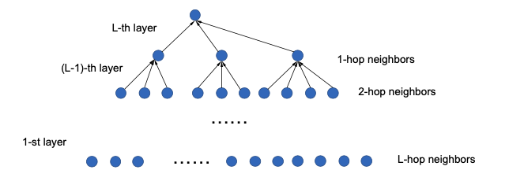

[メインページ](../../index.markdown)

[章目次](./chap7.md)
## 7.1. はじめに

グラフニューラルネットワークは，「大規模なグラフへの適用が難しい」という深刻な拡張性（スケーラビリティ）の問題を抱えている， 例として、ノード分類問題にGCNフィルタベースのモデルを用いることを考える． 次の損失関数を最小化するのに勾配ベースの方法を用いる（式(5.49)と同様）

 $$
 \symcal{L}_{\text {train }}=\sum_{v_i \in \symcal{V}_l} \ell\left(f_{G C N}(\mathbf{A}, \mathbf{F} ; \boldsymbol{\Theta})_i, y_i\right)
    
\tag{7.1} $$
 

ここで， $l()$ は損失関数である． 式(5.21)で述べたように， $f\_{G C N}(\mathbf{A}, \mathbf{F} ; \boldsymbol{\Theta})$ は $L$ 層のGCNフィルタ層からなる：

 $$
 \mathbf{F}^{(l)}=\hat{\mathbf{A}} \mathbf{F}^{(l-1)} \boldsymbol{\Theta}^{(l-1)}, \quad l=1, \ldots, L
    
\tag{7.2} $$
 

ここで， $\hat{\mathbf{A}}$ は $\tilde{\mathbf{D}}^{-\frac{1}{2}} \tilde{\mathbf{A}} \tilde{\mathbf{n}}^{-\frac{1}{2}}$ を表し， $\mathbf{F}^{(0)}=\mathbf{F}$ である． 簡単のため，ノード表現はすべての層で同じ次元 $d$ を持つとする． この定式化では，グラフフィルタ層の間に入れることもできる活性化関数を無視している． 式(7.1)のパラメータ $\boldsymbol{\Theta}$ は $\boldsymbol{\Theta}^{(l)}$ を含む( $l=1, \ldots, L$ )． パラメータ $\boldsymbol{\Theta}\_2$ は式(5.47)のように特徴量を分類クラスの次元に変換する． 損失関数を最小化する勾配降下法のパラメータ更新は次のように書くことができる:

 

$$
 \boldsymbol{\Theta} \leftarrow \boldsymbol{\Theta}-\eta \cdot \nabla_{\boldsymbol{\Theta}} \symcal{L}_{\text {train }}\nonumber $$

 

ここで， $\eta$ は学習率，勾配 $\nabla\_{\boldsymbol{\Theta}} \symcal{L}\_{\text {train }}$ は学習データ $\symcal{V}\_l$ 全体について評価する必要がある． さらに，式(7.2)のようにGCNフィルタを設計したため,  $\symcal{L}\_{\text {train }}$ をネットワーク上で順方向に評価するとき,  $\symcal{V}$ のすべてのノードが計算に含まれることになる． これは各層ですべてのノード表現が計算されることによる． したがって，各学習エポックにおける順方向のパスにおいて, すべてのノード表現と各グラフフィルタ層のパラメータをメモリーに保持しておく必要がある． グラフが大きくなると，必要なメモリーは膨大になる． 具体的には，必要なメモリーを次のように計算することができる． 順方向に評価しているとき，規格化した隣接行列 $\hat{\mathbf{A}}$ , すべての層のノード表現 $\mathbf{F}^{(l)}$ , すべての層のパラメータ $\boldsymbol{\Theta}^{(l)}$ はメモリー上に保持する必要がある． それぞれ， $O(\|\symcal{E}\|), O(L \cdot\|\symcal{V}\| \cdot d), O\left(L \cdot d^{2}\right)$ だけ必要となる． したがって，必要なメモリーは合計 $O\left(\|\symcal{E}\|+L \cdot\|\symcal{V}\| \cdot d+L \cdot d^{2}\right)$ である． グラフが大きいとき，すなわち $\|\symcal{V}\|$ や $\|\symcal{E}\|$ が大きいときにはメモリーに収まらなくなってしまう． さらに，式(7.2)のような計算は効率的ではない． というのも，式(7.1)では必要ないにも関わらず， $\symcal{V}\_u$ のラベル付けされていないノードの最終的な表現（もしくは $L$ 層目以降の表現）も計算されているからである． つまり，順方向のプロセスを全エポック行うのに $O\left(L \cdot\left(\|\symcal{E}\| \cdot d+\|\symcal{V}\| \cdot d^{2}\right)\right)=O\left(L \cdot\|\symcal{V}\| \cdot d^{2}\right)$ だけの計算が必要になる． これまでの深層学習では，学習時に必要なメモリーを減らす自然なアイデアに確率的勾配降下法（Stochastic Gradient Descent, SGD）があった． すべての学習データを使うのではなく，一部の学習データを用いることで勾配を評価する． しかし，グラフ構造のデータにSGDを用いるのは他の深層学習の場合ほど簡単ではない． 式(7.1)の学習データはグラフ内の他のグラフデータとつながっているからである． ノード $v_i$ についての損失 $\ell\left(f\_{G C N}(\mathbf{A}, \mathbf{F} ; \boldsymbol{\Theta})\_i, y_i\right)$ を計算するためには，式(7.2)のようなグラフーフィルタ操作によって，他のたくさんのノードの表現（あるいは隣接行列が示すグラフ全体）が関係することになる． この計算をよりはっきりと理解するために，ノード $v_i$ に注目して式(7.2)をみてみよう:

 $$
 \mathbf{F}_i^{(l)}=\sum_{v_j \in \tilde{\symcal{N}}\left(v_i\right)} \hat{\mathbf{A}}_{i, j} \mathbf{F}_j^{(l-1)} \Theta^{(l-1)}, \quad l=1, \ldots, L
    
\tag{7.3} $$
 

これは周辺ノードの情報を集約している形になっている． なお， $l$ 番目のグラフーフィルタ層後のノード $v_i$ ノード表現を $\mathbf{F}\_i^{(l)}$ と書く．  $\hat{\mathbf{A}}\_{i, j}$ は $\hat{\mathbf{A}}$ の $i,j$ 番目の要素である．  $\tilde{\symcal{N}}\left(v_i\right)=\symcal{N}\left(v_i\right) \cup\left\\{v_i\right\\}$ はノード $v_i$ 自身を含んだ近傍ノードの集合を表す．

<figure>

<figcaption>図7.1 集約の過程</figcaption>

</figure>

したがって，図7.1のようにトップダウンで（すわわちL層目から入力層にかけてみていくと,  $L$ 層目のグラフフィルタ層（出力層）のノード $v_i$ の表現を計算するためには,  $L-1$ 層目の近傍ノード（自身を含む）の表現が必要になる． ノード $v_j \in \tilde{\symcal{N}}\left(v_i\right)$ の $L-1$ 層の表現を計算するためには各近傍ノードの $L-2$ 層の表現が必要になる．  $\tilde{\symcal{N}}\left(v_i\right)$ のすべてのノードの近傍はノード $v_i$ の近傍の近傍、すなわちノード $v_i$ の2ホップ近傍になる． 一般的に，ノード $v_i$ の損失項を計算するためには， $L$ 層後のノード $v_i$ とその $l$ ホップ近傍が $L-l+1$ 層目のグラフフィルタ層で必要になる． 具体的には， $L$ ホップ近傍が入力層（1層目）で必要になる． したがって，計算全体では，ノート $v_i$ の $L$ ホップ近傍のすべてのノードが関係してくることになる． 以上の計算に基づけば，ノード $v_i$ の損失は次のように書き直すことができる．

 

$$
 \ell\left(f_{G C N}(\mathbf{A}, \mathbf{F} ; \boldsymbol{\Theta})_i, y_i\right)=\ell\left(f_{G C N}\left(\mathbf{A}\left\{\symcal{N}^{L}\left(v_i\right)\right\}, \mathbf{F}\left\{\symcal{N}^{L}\left(v_i\right)\right\} ; \boldsymbol{\Theta}\right), y_i\right) $$

 

ここで， $\symcal{N}^{L}\left(v_i\right)$ はノード $v_i$ からLホップ離れたノード集合を表す． すなわち，図のすべてのノードである．  $\mathbf{A}\left\\{\symcal{N}^{L}\left(v_i\right)\right\\}$ は $\symcal{N}^{L}\left(v_i\right)$ をもとに導いた行列（ $\symcal{N}^{L}\left(v_i\right)$ に含まれるノードに対応する，隣接行列の行と列を抜き出したもの）を表す．  $\mathbf{F}\left\\{\symcal{N}^{L}\left(v_i\right)\right\\}$ は $\symcal{N}^{L}\left(v_i\right)$ に含まれるノードの入力特徴量を表す． パラメータ更新にはミニバッチSGDアルゴリズム（勾配を推計するために $\symcal{V}\_l$ からトレーニングサンプルのミニバッチを抽出する）が使われることが多い． バッチごとの損失関数は次のように表すことができる:

 $$
 \symcal{L}_{\symcal{B}}=\sum_{v_i \in \symcal{B}} \ell\left(f_{G C N}\left(\mathbf{A}\left\{\symcal{N}^{L}\left(v_i\right)\right\}, \mathbf{F}\left\{\symcal{N}^{L}\left(v_i\right)\right\} ; \boldsymbol{\Theta}\right), y_i\right)
    
\tag{7.5} $$
 

ここで， $\symcal{B} \subset \symcal{V}\_l$ はサンプリングされたミニバッチである． しかし，最適化にSGDを使った場合でも必要なメモリーは以前として高い． 図7.1からわかるように，グラフフィルタ層 $L$ が増えるとノード集合 $\symcal{N}^{L}\left(v_i\right)$ は指数関数的に増えてしまうことが大きな問題となる． 具体的には， $\symcal{N}^{L}\left(v_i\right)$ のノード数のオーダーは $d e g^{L}$ である． ここで， $d e g^{L}$ はグラフの平均次数を表す． SGDを使った最適化を行うには，ノード表現を保持するために $O\left(d e g^{L} \cdot d\right)$ だけのメモリーが必要になる． さらに，実際には平均的に必要なメモリーではなく，最もメモリーが必要になる「最悪の」バッチに対応できるようなメモリーが必要になる． 次数が高いノードがバッチに含まれる場合には，かなりたくさんのメモリーが必要になる． というのも，この次数の高いノードが入ることでたくさんの他のノードが計算に関与することになるからである． この近傍ノードの数が指数関数的に増えていく問題は通常「近傍膨張」もしくは「近傍爆発」と呼ばれる(Chen et al., 2018a,b; Huang et al., 2018)．  $L$ がグラフの直径よりも大きいときには， $\symcal{N}^{L}\left(v_i\right)=\symcal{V}$ となる． これは全ノード集合が計算に必要になることを意味し，近傍爆発の極端な場合になる． さらに近傍爆発問題はSGDアルゴリズムの計算効率にも影響を与える． 具体的には，ノード $v_i$ についての最終的な表現 $\mathbf{F}\_i^{(L)}$ を計算するための時間計算量は $O\left(d e g^{L} \cdot\left(\operatorname{deg} \cdot d+d^{2}\right)\right)$ である．  $deg$ は通常 $f$ よりも十分小さいので，これは $O\left(d e g^{L} \cdot d^{2}\right)$ となる． 次に，学習データ $\symcal{V}\_l$ 全体を1エポック走らせるのにかかる時間計算量は $O\left(\left\|\symcal{V}\_l\right\| \cdot \mathrm{deg}^{L} \cdot d^{2}\right)$ である． ここで，各バッチについてトレーニングデータが1つだけ含まれていると仮定している． バッチサイズ $\|\symcal{B}\|$ について $\|\symcal{B}\|>1$ のとき，エポックごとの時間計算量は抑えられる． 各 $\symcal{B}$ において，バッチ内の複数のサンプルに含まれるノードが存在する場合があり，計算中にその表現をバッチ内で共有することができるためである． すべてのエポックを走らせるのに時間計算量 $O\left(L \cdot\|\symcal{V}\| \cdot d^{2}\right)$ だけかかる勾配降下法と比べて，ラベル付けされていないノードの最終的な表現を計算することがないにもかかわらず， $L$ が大きい場合にはSGDの時間計算量は依然として大きい．

GCNフィルタ付きのGNNモデルで「近傍爆発」の問題があると説明したが，この問題は式のように希望ノードの情報を集約するプロセスがある限り他のグラフフィルタでも起きる． この章では，一般姓を失わない形で，GCNフィルタに基づいて議論と解析を進める． 「近傍爆発」問題を解決し，それに応じてグラフニューラルネットワークモデルのスケーラビリティを改善するために, 近傍ノードをサンプリングする方法が様々に提案されてきた． サンプリングの本質は，式(7.5)の計算に関わるノード数を減らし，それに伴って計算に必要な時間とメモリーをへらすことである． サンプリングの方法には3つの主要な方法がある:

-   **ノードごとのサンプリング**

    式(7.3)でノード $v_i$ の表現を計算するため，各層で近傍ノードからノード集合をサンプリングする． そして，近傍のすべての情報を集約するのではなく，サンプリングされたノードにのみ基づいてノード表現を計算する．

-   **ネットワーク層ごとのサンプリング**

    注目している層全体のノード表現を計算するために，ノード集合をサンプリングする.つまり， $\mathbf{F}\_i^{(l)}$ と $\mathbf{F}\_j^{(l)}$ をノード $i,j$ について計算するのに同じノード集合を用いる．

-   **部分グラフごとのサンプリング**

    元のグラフから部分グラフをサンプリングし，その部分グラフを元にノード表現を学習する．

本章では，各サンプリングの方法について代表的なアルゴリズムを紹介する．

[メインページ](../../index.markdown)

[章目次](./chap7.md)

[次の節へ](./subsection_02.md)

