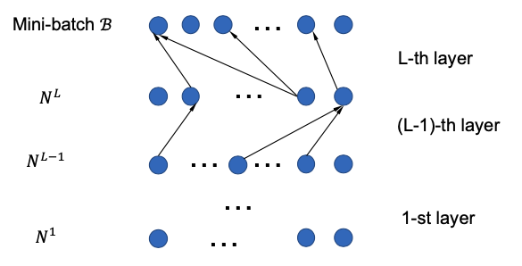

[メインページ](../../index.markdown)

[章目次](./chap7.md)
## 7.3. ネットワーク層ごとのサンプリング

ノードごとのサンプリングでは, ノード $v_i$ の最終的な表現 $\mathbf{F}\_i^{(L)}$ を計算するために,  $\tilde{\mathcal{N}}\left(v_i\right)$ からサンプル抽出されたノード集合 $n^{L}\left(v_i\right)$ と $v_j \in\tilde{\mathcal{N}}\left(v_i\right)$ についての表現 $\mathbf{F}\_i^{(L-1)}$ を使った. さらに, 各 $v_j \in\tilde{\mathcal{N}}\left(v_i\right)$ について,  $\mathbf{F}\_i^{(L-1)}$ を計算するために, ノード集合 $n^{L-1}\left(v_i\right)$ をサンプル抽出する必要がある. 具体的には,  $l$ 番目の層でこの計算のためにサンプル抽出されたすべてのノードを $N^l$ と書くことにすると,  $N^l$ は次のように再帰的に定義することができる:

 $$
 N^{l-1}=\cup_{v_j \in N^{l}} n^{l-1}\left(v_j\right), \quad \text { with } N^{L}=n^{L}\left(v_i\right) . \quad l=L, \ldots, 2,1
    
\tag{7.14} $$
 

ミニバッチSGDを適用し, ノードのバッチ $\mathcal{B}$ の最終的な表現を計算するとき,  $N^L$ は $N^{L}=\cup_{v_i \in \mathcal{B}} n^{L}\left(v_i\right)$ と定義される. 式(7.14)の再帰的な仮定によって $N^l$ は指数関数的に大きくなる. したがって, ノードごとのサンプリングでも依然として近傍爆発の問題は残る. これを解決する1つの方法は, 特定の層においてはすべてのノードの表現を計算するのにサンプル抽出された同じノード集合を使うということである. つまり,  $\forall v_j, v_k \in N^{l}$ について $n^{l-1}\left(v_j\right)=n^{l-1}\left(v_k\right)$ を許す. したがって,  $N^{(l-1)}$ のサイズは $L$ が大きくなっても一定に保たれる. 各層ごとに一度だけノードをサンプル抽出すればよい. この方法は「層ごとのサンプリング」と呼ばれる. しかし,  $n^{l-1}\left(v_j\right)=n^{l-1}\left(v_k\right)$ とするのは実用的ではない. というのも, これらのノードは式(7.9)のようなノードごとの異なる分布にしたがってサンプル抽出されているためである. ノード集合 $n^{l-1}\left(v_j\right)$ はノード $v_j$ の近傍からサンプル抽出される一方で,  $n^{l-1}\left(v_k\right)$ はノード $v_k$ の近傍からサンプル抽出される.

重要度サンプリングは, (Chen et al., 2018b; Huang et al., 2018)によって, レイヤーごとのサンプリング方法を設計するために採用されている.  $l$ 番目の層については, ノードをサンプル抽出するためにノード固有の分布を用いるのではなく, ノード集合 $\mathcal{V}$ 全体にわたって定義され, 共有された分布を用いることで, 共有されたノードの集合をサンプル抽出する. そして, この層のすべての出力ノード表現は, これらのサンプル抽出された共有ノードに基づいてのみ計算される. 次に, 2つの代表的なレイヤーごとのサンプリング手法（Chen et al., 2018b; Huang et al., 2018）の詳細を紹介する. これら2つの方法は似ているため, （Huang et al., 2018）の方法にしぼって紹介し, その後, （Chen et al., 2018b）の方法について簡単に説明する.

原著論文（Huang et al, 2018）との整合性のため, まず式(7.6)から式(7.9)までの過程を以下のように再定式化する. 式(7.3)のノードごとの集計処理は, 以下のように書き換えることができる:

 $$
 \mathbf{F}_i^{(l)}=D\left(v_i\right) \sum_{v_j \in \tilde{\mathcal{N}}\left(v_i\right)} \frac{\hat{\mathbf{A}}_{i, j}}{D\left(v_i\right)} \mathbf{F}_j^{(l-1)} \boldsymbol{\Theta}^{(l-1)}
    
\tag{7.15} $$
 

ここで,  $D\left(v_i\right)=\sum_{v_j \in \tilde{\mathcal{N}}\left(v_i\right)} \hat{\mathbf{A}}\_{i, j}$ である. 式(7.15)は次の期待値の形式とみなすことができる:

 $$
 \mathbf{F}_i^{(l)}=D\left(v_i\right) \cdot \mathbb{E}\left[\mathscr{F}_{v_i}\right]    
\tag{7.16} $$
 

ここで,  $\mathscr{F}\_{v_i}$ は以下で定義される離散確率変数である:

 $$
 p\left(\mathscr{F}_{v_i}=\mathbf{F}_j^{(l-1)} \Theta^{(l-1)}\right)=
    \begin{cases}
    \frac{\hat{\mathbf{A}}_{i, j}}{D(v_i)}, & \text { if } v_j \in \tilde{\mathcal{N}}(v_i) \\ 
    0, & \text { otherwise }.    
    \end{cases}
    \nonumber $$
 

 $q^{l}\left(v_j\right)$ をノード集合 $\mathcal{V}$ 全体で定義された既知の分布で,  $q^{l}\left(v_j\right)>0, \forall v_j \in \mathcal{V}$ とする.  $\mathbb{E}\left[\mathscr{F}\_{v_i}\right]$ を推定するのにモンテカルロ・サンプリングではなく,  $q^{l}\left(v_j\right)$ に基づく重要度サンプリングを行う:

 $$
 \mathbb{E}\left[\mathscr{F}_{v_i}\right] \approx \hat{\mathscr{F}}_{v_i}=\frac{1}{\left\|N^{l}\right\|} \sum_{v_j \in N^{l}} \frac{p\left(v_j \mid v_i\right)}{q^{l}\left(v_j\right)} \mathbf{F}_j^{(l-1)} \mathbf{\Theta}^{(l-1)}, v_j \sim q^{l}\left(v_j\right) \forall v_j \in N^{l}
    
\tag{7.17} $$
 

ここで,  $N^l$ は分布 $q^{l}\left(v_j\right)$ に基づいてサンプル抽出されたノード集合を表し,  $v_j \in \tilde{\mathcal{N}}\left(v_i\right)$ のときは $p\left(v_j \mid v_i\right)=\frac{\hat{\mathbf{A}}\_{i, j}}{D\left(v_i\right)}$ で, それ以外のときは $p\left(v_j \mid v_i\right)=0$ である.  $q^{l}\left(v_j\right)$ の上の添字は, この分布が $l$ 番目の層でノード集合 $N^l$ を抽出するために使われていることを表す. 層が異なれば, サンプリング分布も異なる場合がある. ノード集合 $N^l$ は $l$ 層目の表現（例えば $\mathbf{F}\_i^{(l)}$ ）を計算する必要があるすべてのノード（例えば $v_i$ ）で共有される. 式(7.17)のように,  $\mathbb{E}\left[\mathscr{F}\_{v_i}\right]$ についての重要度サンプリング推定により, 層ごとのサンプリング方法によるノードごとの集計処理（式(7.16)）は以下のように書くことができる:

  

$$

\begin{eqnarray}
\mathbf{F}_i^{(l)} & =D\left(v_i\right) \cdot \frac{1}{\left\|N^{l}\right\|} \sum_{v_j \in N^{l}} \frac{p\left(v_j \mid v_i\right)}{q\left(v_j\right)} \mathbf{F}_j^{(l-1)} \mathbf{\Theta}^{(l-1)} \nonumber \\
& =\frac{1}{\left\|N^{l}\right\|} \sum_{v_j \in N^{l}} \frac{\hat{\mathbf{A}}_{i, j}}{q^{l}\left(v_j\right)} \mathbf{F}_j^{(l-1)} \boldsymbol{\Theta}^{(l-1)}

\end{eqnarray}
\tag{7.18}
$$

  

ここで,  $N^l$ の中のノードは $q^{l}\left(v_j\right)$ からサンプル抽出されたものである. なお, 分布 $q^{l}\left(v_j\right)$ は中心ノード $v_j$ に依存せず, すべてのノードで共有されている. サンプリング分布 $q^{l}\left(v_j\right)$ を適切に設計する方法を説明する前にまず, サンプル抽出されたバッチ $\mathcal{B}$ の全ノードについて最終的な表現を計算するために, ノードをサンプル抽出して計算グラフを構築する処理について説明する.

<figure>

<figcaption>図7.2 層ごとのサンプリング</figcaption>

</figure>

図7.2でトップダウンで図示したように, すべてのノード $v_i \in \mathcal{B}$ について $\mathbf{F}\_i^{(L)}$ を計算するために,  $q^{l}\left(v_j\right)$ にしたがってノード集合 $N^L$ をサンプル抽出する. 式(7.18)によれば, 全ての $v_j \in N^{L}$ の表現 $\mathbf{F}\_i^{(L-1)}$ が $v_i \in \mathcal{B}$ の表現 $\mathbf{F}\_i^{(L)}$ を計算するのに使われる.  $v_j \in N^{L}$ の表現 $\mathbf{F}\_i^{(L-1)}$ を計算するのには,  $N^{L-1}$ をサンプル抽出しそこから情報を集計する必要がある. この過程は最下層まで続き,  $N^1$ がサンプル抽出され,  $v_j \in N^{1}$ についての入力特徴量 $\mathbf{F}\_i^{(0)}$ が計算に使われる. 式(7.18)によれば, すべての層について $\left\|N^{l}\right\|=m$ と仮定すると, 各ノード $v_j \in \mathcal{B}$ 最終的な表現 $\mathbf{F}\_i^{(L)}$ を計算するために必要なメモリは $O(L \cdot m \cdot d)$ である. これはノードごとのサンプリング手法よりもはるかに小さい. これに応じて, この過程で計算されるノード表現が少なくなるため, 各エポックの時間効率が改善される．

式(7.17)の重要度サンプリングに基づく推定量（IS-estimator）は不偏推定量である. また, 式(7.17)の分散が最小化できるような分布 $q^{l}\left(v_j\right)$ を求めたい. (Owen, 2013）の重要度サンプリングの導出によれば, 以下のように結論づけることができる:

 
<strong>命題 7.1 Huang et al., 2018</strong>
 式(7.17)の推定量 $\hat{\mathscr{F}}\_{v_i}$ の分散は次で与えられる:

 

$$
 \operatorname{Var}_q\left(\hat{\mathscr{F}}_{v_i}\right)=\frac{1}{\left\|N^{l}\right\|}\left[\frac{\left(p\left(v_j \mid v_i\right) \cdot\left\|\mathbf{F}_j^{(l-1)} \mathbf{\Theta}^{(l-1)}\right\|-\mathbb{E}\left[\mathscr{F}_{v_i}\right] \cdot q\left(u_j\right)\right)^{2}}{\left(q\left(v_j\right)\right)^{2}}\right] \nonumber $$

 

最適なサンプリング分布 $q(v_j)$ は, 上記分散を最小化することで次のように得られる:

 $$
 q\left(v_j\right)=\frac{p\left(v_j \mid v_i\right) \cdot\left\|\mathbf{F}_j^{(l-1)} \boldsymbol{\Theta}^{(l-1)}\right\|}{\sum_{v_k \in \mathcal{V}} p\left(v_k \mid v_i\right) \cdot\left\|\mathbf{F}_k^{(l-1)} \boldsymbol{\Theta}^{(l-1)}\right\|}
    
\tag{7.19} $$
 

しかし, 式(7.19)の最適なサンプリング分布を得るのは実現不可能である. というのも, この分布は(l-1)番目の層のすべてのノード表現 $\mathbf{F}^{(l-1)}$ に依存するが, どのノードを計算するかはサンプリング分布を用いて決めようとしているからである. なお, (Chen et al., 2018b)では, 命題7.1のように最小化すべき分散は, 単一ノード $v_i$ ではなく同じレイヤーの全ノードに基づいており, 最適な分布は若干異なる形をとるが,  $\mathbf{F}^{(l-1)}$ に依存することに変わりはない.

そこで, (Chen et al., 2018b) と(Huang et al., 2018)においてそれぞれ異なる方法が提案された. (Chen et al., 2018b)では,  $\mathbf{F}^{(l-1)}$ の依存性は直接排除され, 最適な確率分布に従って設計されたサンプリング分布を $q(v_j)$ として採用している:

 $$
 q\left(v_j\right)=\frac{\left\|\hat{\mathbf{A}}_{:, j}\right\|^{2}}{\sum_{v_k \in \mathcal{V}}\left\|\hat{\mathbf{A}}_{:, k}\right\|^{2}}
    
\tag{7.20} $$
 

ここで, 式(7.20)で表される同一の $q(v_j)$ がすべての層に使われる. したがって, 上付き添字の $l$ は $q^l(v_j)$ から取り除かれている. (Huang et al., 2018)では, 式(7.19)中の $\mathbf{F}\_j^{(l-1)} \boldsymbol{\Theta}^{(l-1)}$ を $\mathbf{F}\_j^{(0)} \boldsymbol{\Theta}\_{i n}$ で置き換えている. ここで,  $\mathbf{F}\_j^{(0)}$ はノード $v_j$ の入力特徴量であり,  $\boldsymbol{\Theta}\_{i n}$ は学習させる線形な射影である. さらに, 式(7.19)のサンプリング分布は特定のノード $v_i$ については最適であるが, 層ごとのサンプリングには適用できない. 層ごとのサンプリングに適用できるようにするため, (Huang et al., 2018)では $N^{l+1}$ 中のすべてのノードについての計算をまとめた, 次の分布が提案された:

 $$
 q^{l}\left(v_j\right)=\frac{\sum_{v_i \in N^{l+1}} p\left(v_j \mid v_i\right) \cdot\left\|\mathbf{F}_j^{(0)} \boldsymbol{\Theta}_{i n}\right\|}{\sum_{v_k \in \mathcal{V}} \sum_{v_i \in N^{l+1}} p\left(v_k \mid v_i\right) \cdot\left\|\mathbf{F}_k^{(0)} \boldsymbol{\Theta}_{i n}\right\|}
    
\tag{7.21} $$
 

ここで,  $N^{l+1}$ は $l$ 層目の上にある,  $(l+1)$ 層目の関係するノードを表す. したがって, 式(7.21)で定義される分布 $q^{l}\left(v_j\right)$ はその最上層のノードに依存する. さらに, パラメータ $\boldsymbol{\Theta}\_{i n}$ は常に更新され続けるので, 分布は学習に応じて変化する. 式(7.19)の最適分布にこれらの修正を加えた場合, 式(7.21)の分布は分散を最小化するとは限らない. したがって, 分散項も損失関数に直接組み込まれ, 学習中に明示的に最小化される(Huang et al., 2018).

[メインページ](../../index.markdown)

[章目次](./chap7.md)

[前の節へ](./subsection_02.md) [次の節へ](./subsection_04.md)

