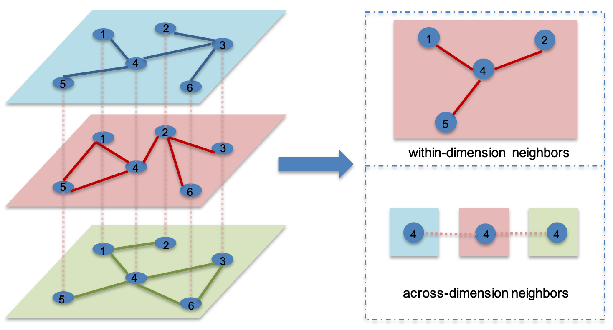

[メインページ](../../index.markdown)

[章目次](./chap8.md)
## 8.4. 多次元グラフのニューラルネットワーク

現実世界，ノード間に複数の関係性が同時に存在する特性を有するグラフが多く存在している． これら複数の関係性を持つグラフは，2.6.3節で紹介したように，多次元グラフとしてモデル化することができる． 多次元グラフでは，全ての次元で同じノード集合を共有しているが，各次元は独自の構造（隣接行列）を持っている． そのため，多次元グラフのグラフフィルタを設計する際には，**次元内の相互作用**と**次元間の相互作用**を両方考慮する必要がある． 次元内の相互作用は，同じ次元内のノード間の接続を通じて発生しており，一方，次元間の相互作用は，異なる次元に存在する同一ノードの間で発生する．

Ma *et al*.(2019c)では，これら次元内と次元間の情報を両方捉えるグラフフィルタを提案している． ここで提案されているグラフフィルタリング処理では，各ノード $v_i$ について，まず全ての次元におけるノード $v_i$ の表現を学習してから，それらを組み合わせてノード $v_i$ の全体的な表現を生成している． 次元 $d$ でのノード $v_i$ の表現を更新するためには，同じ次元内の近傍ノードからの情報と異なる次元における $v_i$ に関する情報を集約する必要がある． そのため，多次元グラフにおいては，**次元内近傍**と**次元間近傍**という二つの種類の近傍を定義する必要がある．

・次元内近傍：

:   次元 $d$ のノード $v_i$ の次元内近傍は，ノード $v_i$ に次元 $d$ において直接接続しているノード集合を指す．

・次元間近傍：

:   次元 $d$ のノード $v_i$ の次元間近傍は，他の次元に存在するノード $v_i$ 自身の事を指す．

次元 $d$ でのノード $v_i$ の次元内近傍ノードの集合は $\symscr{N}\_d(v_i)$ と表記される．

図8.1で示した多次元グラフを例にこれらの近傍を考えてみよう． この図において，「赤」次元にあるノード $4$ の次元内近傍はノード1，ノード2，ノード5である． 一方，全ての次元で同じノード $4$ が共有されており，これらは異なる次元での同じノードの「コピー」とみなすことができる． そして，ノード $4$ のこれらのコピーは暗黙的に互いに接続しており，これらのノードをノード $4$ の次元間近傍と呼ぶ． 図8.1で示されているように，「赤」次元でのノード $4$ の次元間近傍ノードは，「青」と「緑」の次元におけるノード $4$ 自身である． これら二つの近傍ノードを用いて，Ma *et al*.(2019c)で提案された多次元グラフ用の( $l$ 層目におけるノード $v_i$ に対する)グラフフィルタリング操作は，次のように説明される：

<figure>

<figcaption>図8.1 多次元グラフにおける2種類の近傍関係の例示</figcaption>

</figure>

  

$$

\begin{eqnarray}
    \symbf{F}^{(l-1)}_{d,j} &=& \sigma\left(\symbf{F}^{(l-1)}_j\symbf{\Theta}^{(l-1)}_d\right) \quad \text{for} \;\;v_j\in\symscr{N}_d(v_i)
\tag{8.1}\\
    \symbf{F}^{(l-1)}_{g,i} &=& \sigma\left(\symbf{F}^{(l-1)}_i\symbf{\Theta}^{(l-1)}_g\right)\quad \text{for} \;\; g = 1,\dots,D
\tag{8.2}\\
    \symbf{F}^{(l)}_{w,d,i} &=& \sum_{v_j\in\symscr{N}_d(v_i)}\symbf{F}^{(l-1)}_{d,j}
\tag{8.3}\\
    \symbf{F}^{(l)}_{a,d,i} &=& \sum^{D}_{g=1}\beta^{(l-1)}_{g,d}\symbf{F}^{(l-1)}_{g,i}
\tag{8.4}\\
    \symbf{F}^{(l)}_i &=& \eta\symbf{F}^{(l)}_{w,d,i} + (1-\eta)\symbf{F}^{(l)}_{a,d,i}
\tag{8.5}\\ \nonumber
\end{eqnarray}
$$

  

次に，式(8.1)から式(8.5)までのグラフフィルタの手順を説明する． 式(8.1)では，前層 $(l-1)$ でのノード $v_i$ の次元内近傍 $\symscr{N}\_d(v_i)$ の表現が， $\symbf{\Theta}^{(l-1)}\_d$ によって次元 $d$ に変換されることを表している． ここで， $\sigma(\cdot)$ は非線形活性化関数である． 同じように，式(8.2)では，前層のノード $v_i$ 自体のノード表現が異なる次元に射影されることを表している． ここで， $D$ は多次元グラフの次元数である． 次元内の集約は式(8.3)で行われ，これにより $l$ 層でのノード $v_i$ の次元内表現が生成される． 次元間の情報の集約は式(8.4)で行われる． ここで， $\beta^{(l-1)}\_{g,d}$ は，次元 $g$ が次元 $d$ に与える影響をモデル化するアテンションスコアで，次のように計算される：  

$$
 \beta^{(l-1)}_{g,d} = \dfrac{\mathrm{tr}(\symbf{\Theta}^{(l-1)^{T}}_g\symbf{W}^{(l-1)}\symbf{\Theta}^{(l-1)}_d)}{\displaystyle\sum^{D}_{g=1}\mathrm{tr}(\symbf{\Theta}^{(l-1)^{T}}_g\symbf{W}^{(l-1)}\symbf{\Theta}^{(l-1)}_d)} $$

   $\symbf{W}^{(l-1)}$ は学習対象のパラメータ行列である． 最後に，式(8.5)でノード $v_i$ の次元内表現と次元間表現が組み合わされ， $l$ 層の更新された $v_i$ の表現 $\symbf{F}^{(l)}\_i$ が生成される．  $\eta$ はこれら二つの部分のバランスを取るハイパーパラメータである．

[メインページ](../../index.markdown)

[章目次](./chap8.md)

[前の節へ](./subsection_03.md) [次の節へ](./subsection_05.md)

