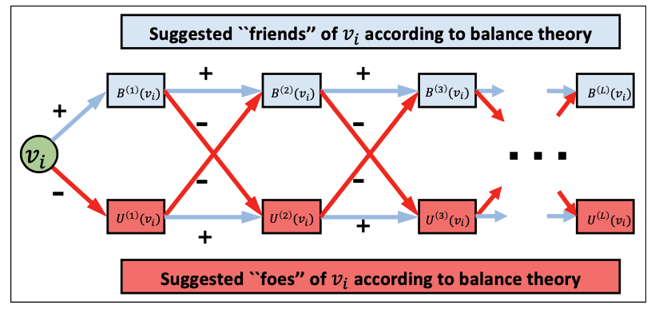

[メインページ](../../index.markdown)

[章目次](./chap8.md)
## 8.5. 符号付きグラフ上のグラフニューラルネットワーク

現実世界では，正(ポジティブ)の関係性と負(ネガティブ)の関係性の両方を持つシステムに遭遇する場面がある． 例えば，SNSのユーザは，友だち（例：FacebookやSlashdot
[^1]
），フォロワー（例：Twitter），信頼(例:Epinions [^2]
)などのポジティブなエッジを持つだけでなく，敵・反対者(例：Slashdot)，不信(例：Epinions)，ブロック・友だち解除(例：FacebookやTwitter)などのネガティブなエッジを作ることもできる．

これらの関係は正と負の両方のエッジを持つグラフとして表現することができる． SNSの人気が高まるにつれて，符号付きグラフはますます一般的になってきた． 符号付きグラフの正式な定義は2.6.4節で確認することができる．

第5章で紹介した単純グラフ用のグラフフィルタは，負エッジの存在のために，符号付きグラフに直接適用することはできない． 負エッジは，正エッジと比べて非常に異なる，または正反対の関係を持っている． そのため，符号付きグラフのグラフフィルタを設計するためには，負エッジを適切に扱うための負エッジ専用の設計が求められる． 負エッジを扱うための簡単な方法は，符号付きグラフを2つの別々の符号なしグラフ二分割し，それぞれが正エッジのみもしくは負エッジのみで構成されるようにすることである． そして，5.3節で述べたグラフフィルタをこれら2つのグラフに個別に適用し，これら2つのグラフからの表現を組み合わせることで最終的なノードの表現を得ることができる．

しかしながら，このような単純な方法では，バランス理論(Heider, 1946; Cartwright and Harary, 1956; Leskovec *et al*., 2010b)によって示唆される正エッジと負エッジとの間の複雑な相互作用が無視することになってしまう． このような相互作用は，適切に抽出すれば実りある結果をもたらすことができる(Kunegis *et al*., 2009; Leskovec *et al*., 2010a; Tang *et al*., 2016b)． Derr *et al*.(2018)では，バランス理論を用いて正エッジと負エッジの関係をモデル化し，それに基づいて符号付きグラフ用のグラフフィルタを設計している． 具体的には，バランス理論に基づいて提案された**バランスパス**と**アンバランスパス**が，符号付きグラフ用のグラフフィルタを設計する際の情報集約プロセスにおいて重要な役割を果たす． 各ノードに対して，バランスパスから集約される情報を捉える表現と，アンバランスパスから集約される情報を捉える表現の2つが保持されることになる．

次に，まずバランスパスとアンバランスパスを導入し，その後，符号付きグラフ用のグラフフィルタの設計を説明する． 一般的に，バランス理論(Heider, 1946; Cartwright and Harary, 1956)は，「自分の味方の味方は，自分の味方でもあるべき」，「自分の味方の敵は，自分の敵であるべき」という基本原則を提唱している． したがって，グラフ内の閉路
[^3]
は「バランスが取れているか(**バランス状態**)」もしくは「バランスが取れていないか(**アンバランス状態**)」の2つの状態に分類されることになる．

． 多くの実証研究で明らかになったところによると，現実世界の符号付きグラフ内の大多数の閉路はバランス状態であるという(Tang *et al*., 2016b)． このようなバランス状態にある閉路から得られる洞察に基づき，負エッジの数が偶数個のパスを**バランスパス**と定義する． それに対して，負のエッジの数が奇数個のパスで構成されているパスを**アンバランスパス**と定義する． バランスパスの定義によれば，そのパスが形成する閉路は，バランス理論や実証研究からバランス状態であることが期待される．したがって，ノード $v_i$ とノード $v_j$ の間にバランスパスが存在する場合，これは2つノード間に正の関係(正エッジ)が存在することを意味する． 同様に，ノード $v_i$ とノード $v_j$ の間にアンバランスパスが存在する場合，2つのノード間に負の関係があることを意味する．

次に，バランスパスとアンバランスパスの定義に基づいて，**バランス近傍**と**アンバランス近傍**を定義しよう． ノード $v_i$ から長さ $(l-1)$ のバランスパスで到達できるノードは，ノード $v_i$ の $\symbf{(l-1)}$ **次バランス近傍**と定義され， $B^{(l-1)}(v_i)$ と表される． また， $\symbf{(l-1)}$ **次アンバランス近傍**についても同じように定義し， $U^{(l-1)}(v_i)$ と表記することにする．  $(l-1)$ 次バランス近傍と $(l-1)$ 次アンバランス近傍の2つが与えられると，これらを用いて $l$ 次バランス近傍や $l$ 次アンバランス近傍を導出することができる．

<figure>

<figcaption>図8.2 バランス近傍とアンバランス近傍の例示</figcaption>

</figure>

例として図8.2に示すように，長さ $l$ のバランスパスは，長さ $(l-1)$ のバランスパスに正エッジを追加したり，長さ $l$ のアンバランスパスに負エッジを追加することで生成される． 他方，長さ $l$ のアンバランスパスについても同様に定義することができる． 形式的に， $l$ 次バランス近傍と $l$ 次アンバランス近傍は，以下のように再帰的に定義することができる：  

$$

\begin{aligned}
%TODO: 「and」→「, 」としているが問題ないか？問題ないとは思うけど，これでわかりやすいか？andを置いたほうがいいのか？の確認
    B^{l}(v_i) &= \left\{v_j\|v_k\in B^{(l-1)}(v_i), v_j\in\symscr{N}^{+}(v_k)\right\}\\
    &\;\;\cup \left\{v_j\|v_k \in U^{(l-1)}(v_i), v_j\in\symscr{N}^{-}(v_k)\right\}\\
    U^{l}(v_i) &= \left\{v_j\|v_k\in U^{(l-1)}(v_i), v_j\in\symscr{N}^{+}(v_k)\right\}\\
    &\;\;\cup \left\{v_j\|v_k \in B^{(l-1)}(v_i), v_j\in\symscr{N}^{-}(v_k)\right\}
\end{aligned}
$$

  ここで， $\symscr{N}^{+}(v_i)$ と $\symscr{N}^{-}(v_i)$ は，ノード $v_i$ の $1$ 次正エッジ近傍と $1$ 次負エッジ近傍を表しており，それぞれ $B^{1}(v_i) = \symscr{N}^{+}(v_i)$ と $U^{1}(v_i) = \symscr{N}^{-}(v_i)$ となる．

符号付きグラフのグラフフィルタを設計する際には，バランス近傍とアンバランス近傍からの情報を別々に管理する必要がある． これらは非常に異なる情報を伝える可能性が高いためである． 例えば，バランス近傍は潜在的に「味方関係」とみなし，アンバランス近傍は潜在的に「敵対関係」とみなすことができる． そのため，バランス近傍とアンバランス近傍から集約した情報を保持するために，2種類の表現を保持することになる． ノード $v_i$ に対して $\symbf{F}^{(B,l)}\_i$ と $\symbf{F}^{(U,l)}\_i$ は，それぞれ $l$ 層を経たグラフフィルタリングの**バランス表現**と**アンバランス表現**を示すために用いられる． 具体的には， $l$ 層目のグラフフィルタの実行プロセスは以下のように説明することができる：

  

$$

\begin{eqnarray}
    \symbf{F}^{(B,l)}_i &=& \sigma\left(\left[\sum_{v_j\in\symscr{N}^{+}(v_i)}\dfrac{\symbf{F}^{(B,l-1)}_j}{\|\symscr{N}^{+}(v_i)\|},\sum_{v_k\in\symscr{N}^{-}(v_i)}\dfrac{\symbf{F}^{(U,l-1)}_k}{\|\symscr{N}^{-}(v_i)\|},\symbf{F}^{(B,l-1)}_i\right]\symbf{\Theta}^{(B,l)}\right)
\tag{8.6}\\
    \symbf{F}^{(U,l)}_i &=& \sigma\left(\left[\sum_{v_j\in\symscr{N}^{+}(v_i)}\dfrac{\symbf{F}^{(U,l-1)}_j}{\|\symscr{N}^{+}(v_i)\|},\sum_{v_k\in\symscr{N}^{-}(v_i)}\dfrac{\symbf{F}^{(B,l-1)}_k}{\|\symscr{N}^{-}(v_i)\|},\symbf{F}^{(U,l-1)}_i\right]\symbf{\Theta}^{(U,l)}\right)
\tag{8.7}\\ \nonumber
\end{eqnarray}
$$

  

ここで， $\symbf{\Theta}^{B,l}$ と $\symbf{\Theta}^{U,l}$ は学習対象のパラメータである． 式(8.6)での $\symbf{F}^{(B, l)}\_i$ は以下の3種類の情報を結合(concatenate)したものである．

1.  ノード $v_i$ の $1$ 次正エッジ近傍に由来する( $(l-1)$ 層)バランス表現の集約，すなわち， $\sum_{v_j\in\symscr{N}^{+}(v_i)}\frac{\symbf{F}^{(B,l-1)}\_j}{\symscr{N}^{+}(v_i)}$ ．

2.  ノード $v_i$ の $1$ 次負エッジ近傍に由来する( $(l-1)$ 層)アンバランス表現の集約，すなわち， $\sum_{v_j\in\symscr{N}^{-}(v_i)}\frac{\symbf{F}^{(U,l-1)}\_j}{\symscr{N}^{-}(v_i)}$ ．

3.   $(l-1)$ 層における $v_i$ 自身のバランス表現，すなわち $\symbf{F}^{(B,l-1)}\_i$ ．

同様に， $\symbf{F}^{(U,l)}\_i$ は式(8.7)のアンバランスパス由来の3つの情報を集約することで生成される．  $L$ 層のグラフフィルタリング後，ノード $v_i$ のバランス表現とアンバランス表現は，次のように結合されて最終的な表現を形成する：  

$$
 \symbf{z}_i = \left[\symbf{F}^{(B,L)}_i,\symbf{F}^{(U,L)}_i\right] $$

  ここで， $\symbf{z}\_i$ は最終的に生成されたノード $v_i$ の状態を表している． Li *et al*.(2020b)では，式(8.6)と式(8.7)における集約を行う際，ノードの重要性を識別するためにアテンション機構が導入されている． そこでは，式(8.6)および式(8.7)において，GATフィルタを用いてバランス近傍またはアンバランス近傍からの集約を行っている．

[メインページ](../../index.markdown)

[章目次](./chap8.md)

[前の節へ](./subsection_04.md) [次の節へ](./subsection_06.md)

[^1]: 訳注：Slashdotは，科学や技術に関連するニュースや情報を共有し，ユーザーがその情報についてディスカッションを行うことができるウェブサイトである．
[^2]: 訳注：Epinionsは，かつて存在した消費者レビューサイトで，ユーザーが商品やサービスについての意見や評価を共有できるプラットフォームであった．
[^3]: 訳注：グラフの閉路とは，グラフ内の特定の開始ノードから出発し，エッジを通じて一連の他のノードを通過し，最終的に同じ開始ノードに戻る経路である．
