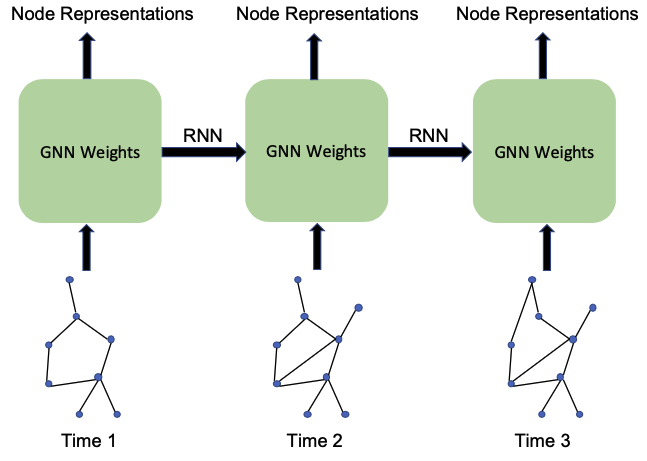

[メインページ](../../index.markdown)

[章目次](./chap8.md)
## 8.7. ダイナミックグラフのニューラルネットワーク

ダイナミックグラフは常に変化しているグラフである． それゆえ，既存のグラフニューラルネットワークモデルでは，時間的な情報を捉えることができず，適用することができない． Pareja *et al*.(2019)では，離散型ダイナミックグラフ（2.6.6節の定義を参照）を扱うために，(各時点で観測される)グラフのスナップショット間のモデルパラメータの重みが時間方向に調整されるようなグラフニューラルネットワークモデル(EvolveGCN)を提案している．

 $T$ 個のスナップショットから成る離散型ダイナミックグラフに対して，同じ数や設計のGNNフィルタを積み重ねた $T$ 個のグラフニューラルネットワークモデルを学習する． そして， $t$ 番目のGNNモデルのモデルパラメータは， $(t-1)$ 番目のモデルのパラメータから調整されたものを使うようにする． 図8.3に示すように，モデルパラメータの更新にはRNN機構が採用されている． 具体的には，3.4.2節で説明したRNNのLSTMとGRUの両方のバリエーションが，モデルパラメータの更新に使用される． 例えばGRUの場合， $t$ 番目のグラフスナップショットに対する $l$ 番目のグラフフィルタリング層は次のように表される：

  

$$

\begin{eqnarray}
\symbf{\Theta}^{(l-1,t)} &=& \operatorname{GRU}(\symbf{F}^{(l-1,t)},\symbf{\Theta}^{(l-1,t-1)})
\tag{8.9}\\
\symbf{F}^{(l,t)} &=& \operatorname{GNN-Filter}(\symbf{A}^{(t)},\symbf{F}^{(l-1,t)},\symbf{\Theta}^{(l-1,t)})
\tag{8.10}\\ \nonumber
\end{eqnarray}
$$

  

ここで， $\symbf{\Theta}^{(l-1,t)}$ と $\symbf{F}^{(l,t)}$ はそれぞれ $t$ 番目のGNNモデルの $l$ 番目のグラフフィルタリング層のパラメータとそのパラメータを使った出力を表している． また行列 $\symbf{A}^{(t)}$ は $t$ 番目のグラフスナップショットの隣接行列である． 式(8.10)での $t$ 番目のGNNモデルの $l$ 層でのパラメータ $\symbf{\Theta}^{(l-1,t)}$ は，式(8.9)で示されているように，GRUを使って $\symbf{\Theta}^{(l-1,t-1)}$ から調整したものである． GRUの詳細なアーキテクチャについては3.4.3節を参照してほしい． 式(8.10)には一般的なGNNフィルタを使うことができるが，Pareja *et al*.(2019)ではGCNフィルタを採用している．

<figure>

<figcaption>図8.3 EvolveGCNの説明図</figcaption>

</figure>

[メインページ](../../index.markdown)

[章目次](./chap8.md)

[前の節へ](./subsection_06.md) [次の節へ](./subsection_08.md)

