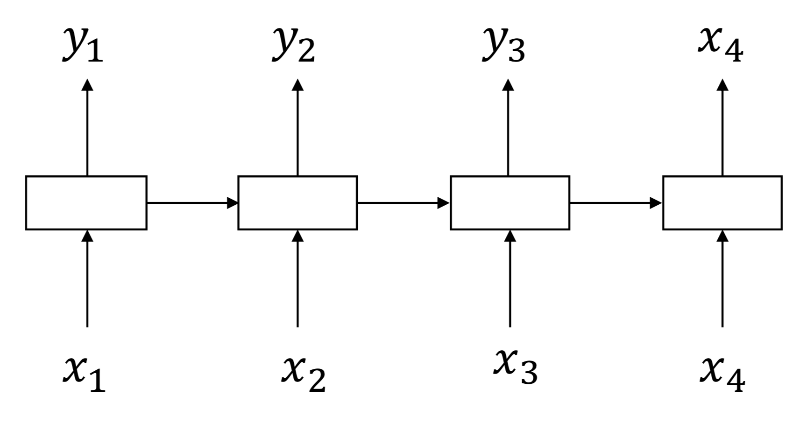
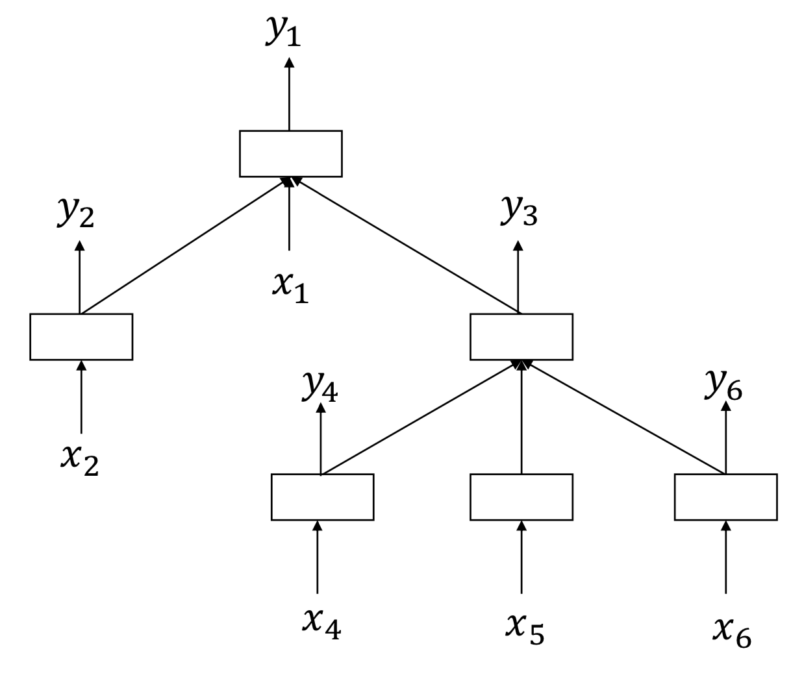

[メインページ](../../index.markdown)

[章目次](./chap9.md)
## 9.3. グラフ上のRNN

3.4節のリカレントニューラルネットワークは，もともと系列データを扱うために設計されたものであり，近年ではグラフ構造データの表現学習に一般化されている． (Tai et al., 2015) では，LSTMモデルを木構造データに一般化するために Tree-LSTM が導入されている． 木はループを持たない特殊なグラフと見なすことができる． (Liang et al., 2016) では，Tree-LSTM を一般的なグラフにさらに拡張するために Graph-LSTMが提案されている． 本節ではまず, Tree-LSTM を紹介し，次にGraph-LSTM について説明する．

<figure>

<figcaption>図9.1 系列データのイメージ</figcaption>

</figure>

図9.1に示したように，系列データは各ノード（最初のノードを除く）が1つの子ノード，すなわちその前のノードを持つある種の木構造とみなすことができる． 情報は，系列データの最初のノードから最後のノードへと流れる． したがって, 3.4.2節で紹介し図3.13で示したように，LSTMモデルでは系列データ中のあるノードの隠れ状態は, 当該ノードの入力とその前のノードの隠れ状態から構成される．

<figure>

<figcaption>図9.2 木のイメージ</figcaption>

</figure>

一方，木では図9.2に示したように, 1つのノードが任意の数の子ノードを持つことができる． 木では，情報は常に子ノードから親ノードに流れると仮定する． したがって，あるノードの隠れ状態を構成する際には，そのノードの入力と（すべての）子ノードの隠れ状態を利用する必要がある． こうした直感に基づいて木構造データを扱うためのTree-LSTMモデルが提案された． Tree-LSTMモデルを紹介するため, 3.4.2節同じ表記を用いる． 具体的には，木のノード $v_k$ について，入力を $\mathbf{x}^{(k)}$ , 隠れ状態を $\mathbf{h}^{(k)}$ ,  $\mathbf{C}^{(k)}$ を記憶セル， $\symcal{N}\_c\left(v_k\right)$ を子ノードの集合とする． 与えられた木について，Tree-LSTMモデルではノード $v_k$ の隠れ状態を次のように構成する:

  

$$

\begin{eqnarray}
        &&\tilde{\mathbf{h}}^{(k)}=\sum_{v_j \in \symcal{N}_c\left(v_k\right)} \mathbf{h}^{(j)} 
\tag{9.2}\\
        &&\mathbf{f}_{k j}=\sigma\left(\mathbf{W}_f \cdot \mathbf{x}^{(k)}+\mathbf{U}_f \cdot \mathbf{h}^{(j)}+\mathbf{b}_f\right) \quad \text { for } v_j \in \symcal{N}_c\left(v_k\right) 
\tag{9.3}\\
        &&\mathbf{i}_k=\sigma\left(\mathbf{W}_i \cdot \mathbf{x}^{(k)}+\mathbf{U}_i \cdot \tilde{\mathbf{h}}^{(k)}+\mathbf{b}_i\right) 
\tag{9.4}\\
        &&\mathbf{o}_k=\sigma\left(\mathbf{W}_o \cdot \mathbf{x}^{(k)}+\mathbf{U}_o \cdot \tilde{\mathbf{h}}^{(k)}+\mathbf{b}_o\right) 
\tag{9.5}\\
        &&\tilde{\mathbf{C}}^{(k)}=\tanh \left(\mathbf{W}_c \cdot \mathbf{x}^{(k)}+\mathbf{U}_c \cdot \tilde{\mathbf{h}}^{(k)}+\mathbf{b}_c\right) 
\tag{9.6}\\
        &&\mathbf{C}^{(k)}=\mathbf{i}_t \odot \tilde{\mathbf{C}}^{(k)}+\sum_{v_j \in \symcal{N}_c\left(v_k\right)} \mathbf{f}_{k j} \odot \mathbf{C}^{(j)} 
\tag{9.7}\\
        &&\mathbf{h}^{(k)}=\mathbf{o}_t \odot \tanh \left(\mathbf{C}^{(k)}\right)
\tag{9.8} \\ \nonumber
\end{eqnarray}
$$

  

次に，Tree-LSTMモデルの演算の流れを簡単に説明する． 式(9.2)に示した通り， $v_k$ の子ノードの隠れ状態が集約されて， $\tilde{\mathbf{h}}^{(k)}$ が生成される．  $\tilde{\mathbf{h}}^{(k)}$ を用いて，入力ゲート，出力ゲート，記憶セルの候補がそれぞれ生成される(式(9.4), 式(9.5), 式(9.6))． 式(9.3)では，各子ノード $v_j \in \symcal{N}\_c\left(v_k\right)$ について，対応する忘却ゲートが生成され，式(9.8)で $v_k$ の記憶セルを更新するときに子ノードからの情報の流れを制御する． 最後に，式(9.8)でノード $v_k$ の隠れ状態が更新される．

木と違い，一般的なグラフにはループがあることが多い． したがって，一般的なグラフでは木のように自然なノードの順序が存在しない． (Liang et al., 2016) では，幅優先探索(Breadth-First Search, BFS) と 深さ優先探索(Depth-First Search, DFS)がノードの順序を定義する方法の候補として提案されている． さらに，ノードの順序は、手元の応用例にあわせて定義することも可能である． その後，ノードの順序に応じて 式(9.2)から式(9.8)に示したのと同様の操作により，これらのノードの隠れ状態とセルを更新することができる． 大きな違いは，無向グラフの場合，式(9.2)はノード $v_k$  のすべての隣接ノード $\symcal{N}(v_k)$ の隠れ状態を集約するのに対し，Tree-LSTMでは式(9.2)において $v_k$ の子ノードからの情報のみを集約する点である． さらに，隣接ノード $\symcal{N}(v_k)$ の一部のノードの隠れ状態が更新されない場合がある． この場合，更新前の隠れ状態が集約処理に利用される．

[メインページ](../../index.markdown)

[章目次](./chap9.md)

[前の節へ](./subsection_02.md) [次の節へ](./subsection_04.md)

